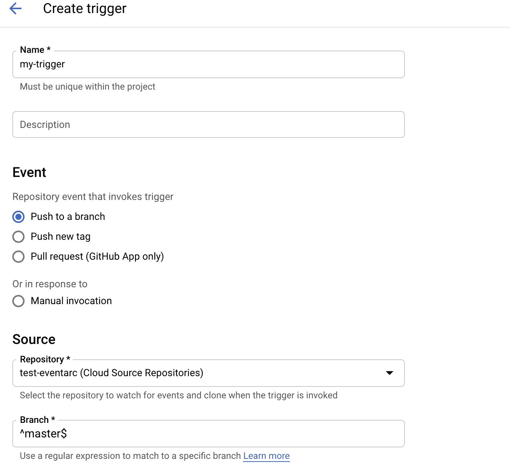
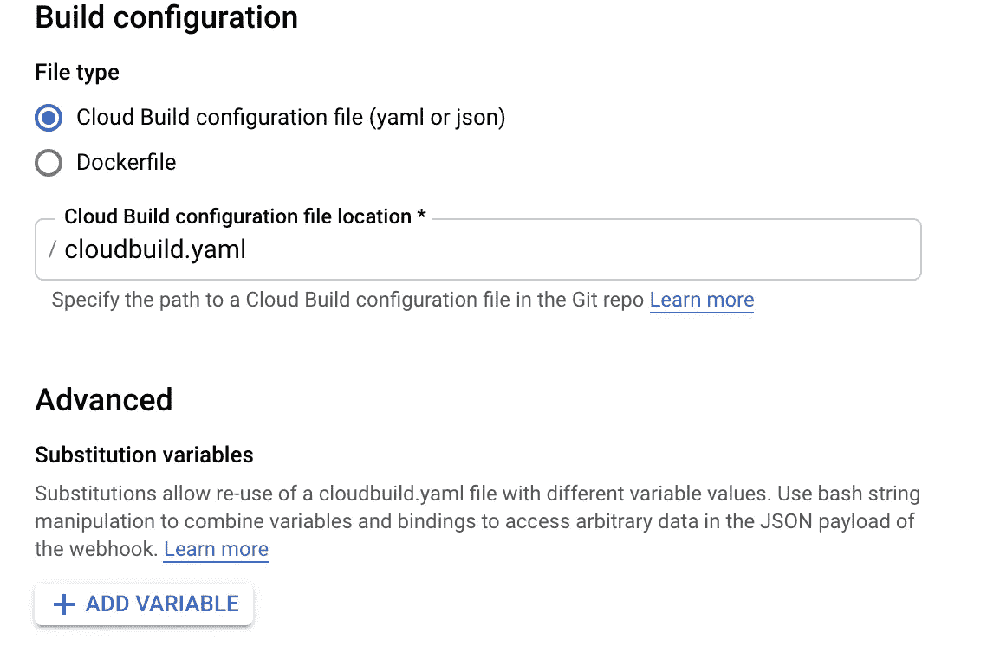

# 云构建无处不在

> 原文：<https://medium.com/google-cloud/cloud-build-is-everywhere-f516e96cd268?source=collection_archive---------0----------------------->

我们最喜欢云提供商的一点是，你只需给出几行代码，而故事的其余部分不是由你完成的。

Google Cloud 的**无服务器 CI/CD 产品【Cloud Build 令人惊叹，因为它简单、智能、高效。**

# 今天我要告诉你们:

*   如何使用 CloudBuild
*   如何保护您的云构建
*   使用 CloudBuild 部署云功能
*   从 CloudBuild 调用 cURL
*   在 CloudBuild 中使用 Terraform
*   从任何地方触发云构建
*   从另一个 CloudBuild 触发 CloudBuild
*   GCP IAM 从 CloudBuild“添加权限”操作

# **云构建的触发功能易于配置。**

在这里，我有一个托管我的代码的云存储库，我想让我的 Cloudbuild 代码(无论它在做什么)在每次我推送新版本的代码时运行:



每当我在主分支中修改我的代码时，触发器就会自动执行我的代码。



我的配置是一个 YAML 文件，我可以添加替代变量，这在你有一些变量要导入时非常有用(不要放入关键信息，请优先使用秘密管理器来保存秘密……)

最近，Google 推出了一项新功能来保护您的 CloudBuild 管道。就像他们在其他无服务器产品(云运行或云功能)中已经做的那样，您现在可以指定用于您的云构建的 ServiceAccount。

这意味着您可以根据最小特权原则，用自己的身份来分隔所有管道。

接下来是:

[](https://cloud.google.com/cloud-build/docs/securing-builds/configure-user-specified-service-accounts) [## 配置用户指定的服务帐户

### " type": "thumb-down "，" id": "hardToUnderstand "，" label ":"难以理解" }，{ "type": "thumb-down "，" id"…

cloud.google.com](https://cloud.google.com/cloud-build/docs/securing-builds/configure-user-specified-service-accounts) 

不要忘了在你的 YAML 的结尾加上这句台词

```
serviceAccount: 'projects/PROJECT_NAME/serviceAccounts/SERVICE_ACCOUNT'
```

现在我们来谈谈配置的 YAML，如果我说

**我可以使用云构建，通过 gcloud 从云资源回购托管代码部署我的云功能**

```
steps:
  - name: "gcr.io/cloud-builders/gcloud"
    args:
      [
        "functions",
        "deploy",
        "$_GCF",
        "--region",
        "europe-west2",
        "--trigger-http",
        "--runtime",
        "python38",
        "--entry-point",
        "manager",
        "--timeout",
        "540s",
        "--service-account",
        "$_SA",
        "--env-vars-file",
        "./.env.yaml",
        "--update-labels",
        "name=$_GCF",
      ]
```

在这里，您可以看到代码将使用 gcloud 和替换变量($_xxx)等参数部署我的 GCF

**我也可以使用云构建来使用 cURL**

根据这个

[](https://github.com/GoogleCloudPlatform/cloud-builders/tree/master/curl) [## 谷歌云平台/云构建者

### gcr.io/cloud-builders/curl 映像由云构建团队维护，但它可能不支持最新的…

github.com](https://github.com/GoogleCloudPlatform/cloud-builders/tree/master/curl) 

这很容易做到

```
steps:
  - name: "launcher.gcr.io/google/ubuntu1604"
    entrypoint: "curl"
    args:
      ["-d", '"{\"id\":\"$BUILD_ID\"}"', "-X", "POST", "[http://www.example.com](http://www.example.com)"]
```

**现在，下一步是使用 CloudBuild 运行一些 Terraform 脚本**

想法是将你的 **main.tf** 文件放在 Google Cloud repo 上，如下所示:

```
resource "google_project" "project" {
provider        = google-beta
name            = var.PROJECT_NAME
project_id      = var.PROJECT_ID
folder_id       = var.FOLDER_ID
billing_account = var.BILLING_ACCOUNT
labels = var.LABELS
}
```

要运行这段代码，您的 YAML 必须如下所示:

```
{
    "steps": [
        {
            "name": "hashicorp/terraform",
            "args": [
                "init",
                "-backend=true",
                "-lock=false",
                "-backend-config=prefix=" "project",
            ],
        },
        {
            "name": "hashicorp/terraform",
            "args": [
                "apply",
                "-var=PROJECT_ID=xxx",
                "-var=PROJECT_NAME=xxx",
                "-var=FOLDER_ID=xxx",
                "-var=BILLING_ACCOUNT=xxx",
                "-auto-approve",
                "-lock=false",
            ],
        },
    ]
}
```

如果我想从工具外部触发一个构建呢？

```
curl --request POST \
  '[https://cloudbuild.googleapis.com/v1/projects/xxxx/triggers/a809f71a:run?key=[YOUR_API_KEY]'](https://cloudbuild.googleapis.com/v1/projects/btdp-sbx-d-deslandes2/triggers/a809f71a-877f-4180-b0fd-a2e0bacd05a5:run?key=[YOUR_API_KEY]') \
  --header 'Authorization: Bearer [YOUR_ACCESS_TOKEN]' \
  --header 'Accept: application/json' \
  --header 'Content-Type: application/json' \
  --data '{}' \
  --compressed
```

如果您想从云构建步骤中触发构建，您只需这样做(令牌生成和 curl 必须在同一个命令中) :

```
(* indentation have been modified because of the article)steps:
- name: 'gcr.io/cloud-builders/gcloud'
  entrypoint: 'bash'
  args:
  - '-c'
  - |-
    apt update && apt install jq -y 
    TOKEN=$$(curl -H Metadata-Flavor: Google  http://metadata.google.internal/computeMetadata/v1/instance/service-accounts/default/token | 
    jq -r .access_token) 
    echo $${TOKEN} 
    curl --request 
    POST           '[https://cloudbuild.googleapis.com/v1/projects/xxxx/triggers/a809f71a:run](https://cloudbuild.googleapis.com/v1/projects/btdp-sbx-d-deslandes2/triggers/a809f71a-877f-4180-b0fd-a2e0bacd05a5:run?key=[YOUR_API_KEY]')'
  - '--header'
  - 'Authorization: Bearer ${TOKEN}'
  - '--header'
  - 'Accept: application/json'
  - '--header'
  - 'Content-Type: application/json'
  - '--compressed'
```

这将很快改变，查看文章的结论，了解调用 CloudBuild 很快会有什么可能。

最后，我可以使用 CloudBuild 调用几乎所有的东西…好消息是，Cloud Build 是 GCP 上的无服务器产品，提供了最大的超时:24 小时！

这意味着您可能会将它用于超出其最初设计的用途…

这是一个用法的例子，当我不得不在 GCP 项目中给某人添加多个角色时，我很累。当然我有可能使用 gcloud add-iam-bindings，但是…每个角色一个命令！

那么，为什么不在 CloudBuild CI 中生成并运行它呢？耶！

假设我们要添加的权限列表是

```
permissions = [
    "roles/servicemanagement.admin",
    "roles/iap.admin",
    "roles/iap.settingsAdmin",
    "roles/iam.serviceAccountCreator",
    "roles/compute.instanceAdmin.v1",
    "roles/compute.loadBalancerAdmin",
]
```

我们可以在这个数组上循环，为每个角色生成一个 YAML 文件

```
for role in permissions: data["steps"].append(
        [
            {
                "name": "gcr.io/cloud-builders/gcloud",
                "entrypoint": "bash",
                "args": [
                    "-c",
                    'gcloud projects add-iam-policy-binding projectA - member="[my_user@domain.com](mailto:my_user@domain.com)" -role='+role,
                ],
            }
        ]
    )
```

**结论**

今天，构建可以通过提交回购来触发，最近也可以手动启动，明天我希望可以通过 Pub/Sub 来触发，这是 GCP 在平台上部署的所有架构中使用的最重要的服务…保持简单，享受乐趣！