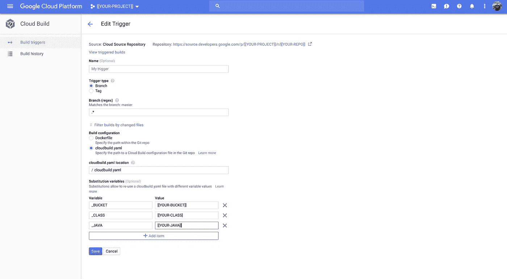
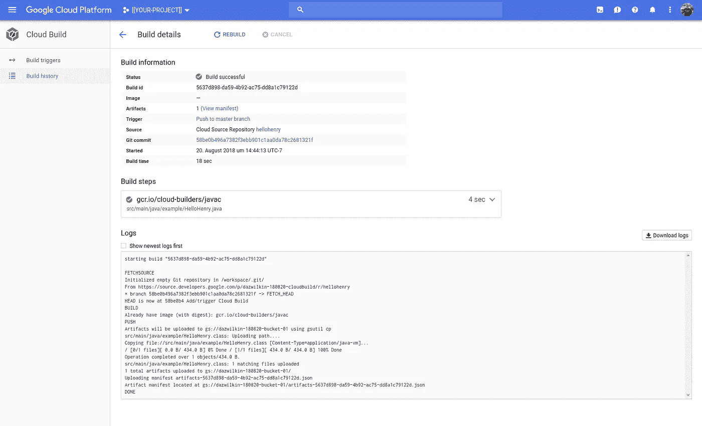
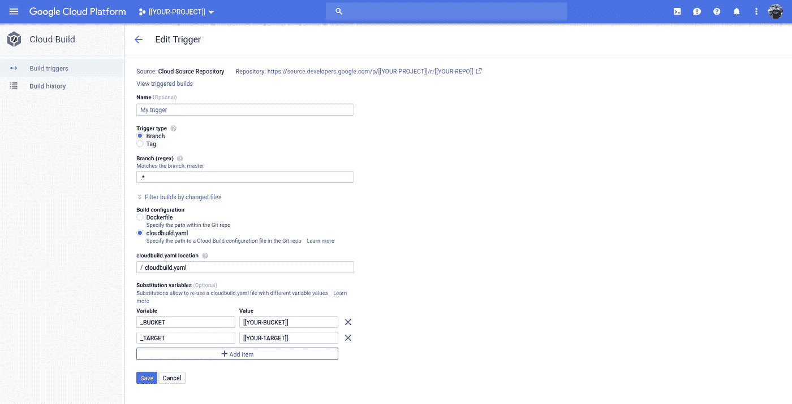
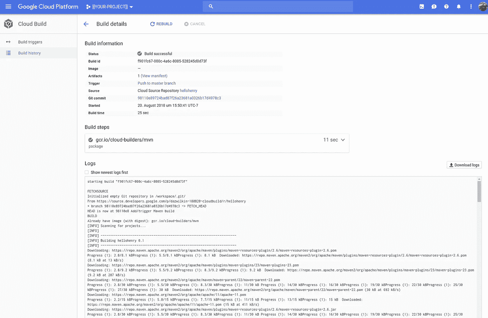
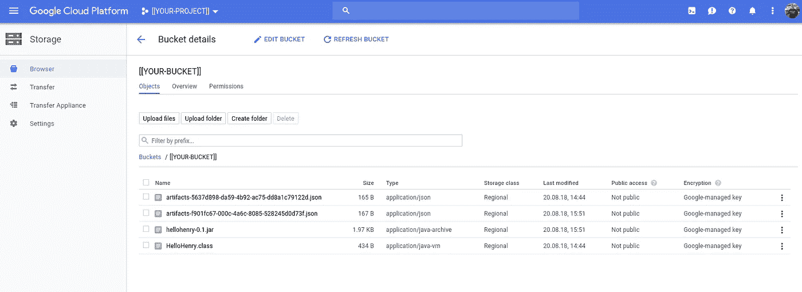

# 云构建不仅仅针对容器

> 原文：<https://medium.com/google-cloud/cloud-build-is-not-just-for-containers-bc1ecc075b5?source=collection_archive---------1----------------------->

## Stackoverflow 离题

Stackoverflow 上有一个[问题](https://stackoverflow.com/questions/51901930)是关于 Cloud Build 是否可以用来编译 Java，而不将结果发布为容器映像。

这个问题吸引了我，因为…云构建不仅仅是针对容器的。这里如何…

两种方式；-)先用 javac 再用 Maven (mvn)。

## 设置

我用的是谷歌云资源仓库，但是如果你愿意，你也可以用 GitHub 或者 Bitbucket。这是在本地构建了类和 jar 之后的回购树。这是为了向您提供一个可视化的帮助，让您了解云构建容器上正在发生的事情:

```
.
├── cloudbuild.yaml
├── pom.xml
├── src
│   └── main
│       └── java
│           └── example
│               └── HelloHenry.java
└── target
    ├── classes
    │   └── example
    │       └── HelloHenry.class
    ├── generated-sources
    │   └── annotations
    ├── hellohenry-0.1.jar
    ├── maven-archiver
    │   └── pom.properties
    └── maven-status
        └── maven-compiler-plugin
            └── compile
                └── default-compile
                    ├── createdFiles.lst
                    └── inputFiles.lst
```

> **NB** 琐碎的`HelloHenry.java`出处在帖子最后，供参考。创建它只是为了有东西可以编译。

您需要创建您在上面的触发器中引用的 Google 云存储桶，并将托管工件:

```
PROJECT=[[YOUR-PROJECT]]
REGION=[[YOUR-REGION]]
BUCKET=[[YOUR-BUCKET]]gsutil mb \
-c regional \
-l ${REGION} \
-p ${PROJECT} \
gs://${BUCKET}
```

## javac

cloudbuild.yaml:

这是云构建触发器:



> **NB** 这个触发器定义了三个自定义变量替换:`${_JAVA}`指的是源文件(Java)；`${_BUCKET}`指的是`[[YOUR-BUCKET]]`的值，也是`${_CLASS}`文件将要上传的地方。

以下是构建细节:



云存储桶的浏览见末尾。

## 专家

cloudbuild.yaml:

这是构建触发器。它由 Google Cloud Source Repository 触发并使用其中的资源。它寻找一个`cloudbuild.yaml`文件来控制构建。



> **NB** 这个触发器定义了两个用户定义的替换变量:`_BUCKET` 你应该用`[[YOUR-BUCKET]]`和`_TARGET`的值来替换它们，比如说，这是你的 Maven 包进程将要创建的 jar 的名字，你想要把它复制到云存储中。

下面是构建输出:



## 成功！

这是在我运行了`javac`和`mvn`构建之后的 bucket 内容列表:



正如您所看到的，每个构建都创建了一个工件-*。json 文件。对于`javac`构建，HelloHenry.class 被上传。对于`mvn`版本，`hellohenry-0.1jar`已上传。

## 结论

这是一个可以理解的假设，但是云构建不限于构建 docker 映像。它甚至不限于构建 docker 映像或在云存储上存储文件。实际上，它是一个通用的管道工具。它只是使用 docker 容器来定义它的处理步骤。这是一个很好的工具！

下面是 Java 源代码:

仅此而已！