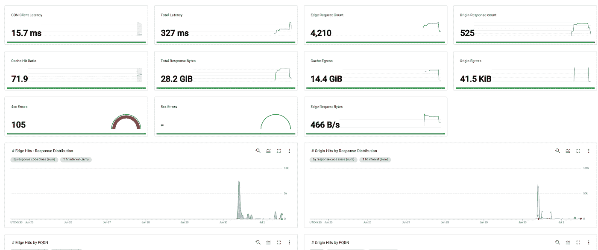

# 谷歌云 CDN 定制仪表板

> 原文：<https://medium.com/google-cloud/cloud-cdn-custom-dashboard-487faac9f6e?source=collection_archive---------0----------------------->

谷歌云 CDN 利用谷歌的全球优质网络主干，避免公共交通，并确保数据在谷歌网络上尽可能靠近最终用户 ISP(互联网服务提供商)。

谷歌云 CDN 被全球成千上万的客户使用。虽然使用云 CDN(一键式部署)很容易，但在这篇博客中，我们将看到设置自定义云 CDN 仪表板来轻松监控性能矩阵是多么容易。

这个预配置的云 CDN json 文件提供了以下矩阵:

*   CDN 客户端延迟
*   总等待时间
*   边缘请求计数
*   原始响应计数
*   缓存命中率
*   总响应字节数
*   缓存和源出口
*   4xx 和 5xx 错误
*   边缘请求字节
*   边缘和原点上的响应分布
*   边缘和起源 FQDN
*   边缘和原点上的响应代码
*   边缘的可缓存性度量
*   按计数统计的缓存命中率

**先决条件:**

1.  必须有一个谷歌云项目
2.  使用云 CDN 和全局 HTTP(s)负载平衡器在 google cloud 上运行的应用程序
3.  从[https://github . com/wasimbloch/GCP/blob/main/CDN % 20 dash board . json](https://github.com/wasimbloch/GCP/blob/main/CDN%20Dashboard.json)下载 JSON 文件

**创建 CDN 自定义仪表盘的步骤:**

1.  去谷歌云平台([https://console.cloud.google.com](https://console.cloud.google.com))选择你的项目。

2.从“Operations”部分下的“Monitoring”菜单导航至“Dashboards”

3.点击仪表板概览屏幕上的“创建仪表板”

4.点击新仪表板屏幕上的“JSON 编辑器”

5.点击“上传 json”上传 JSON 文件。文件上传后，单击“应用更改”。

6.您应该能够看到 cloud CDN 仪表盘，上面有多个小部件，如下所示。

就是这样！如果您正在寻找任何其他矩阵，请随时向本文添加评论。