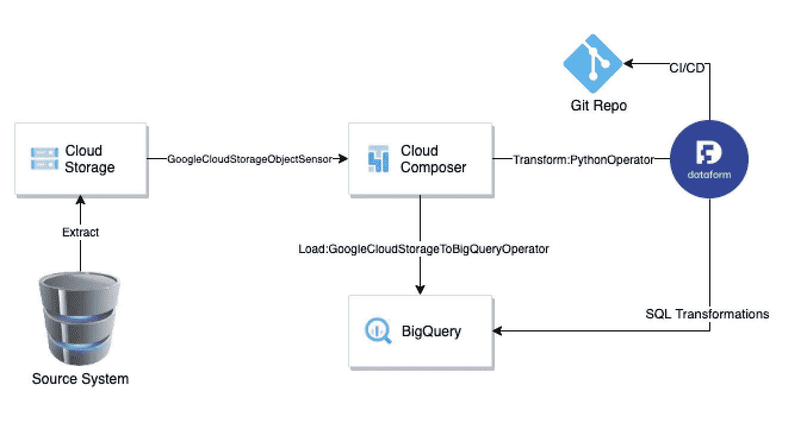
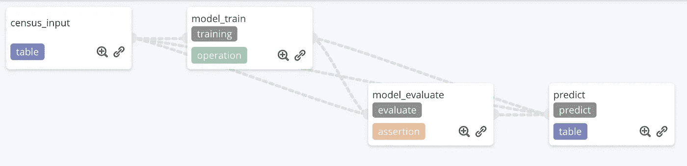
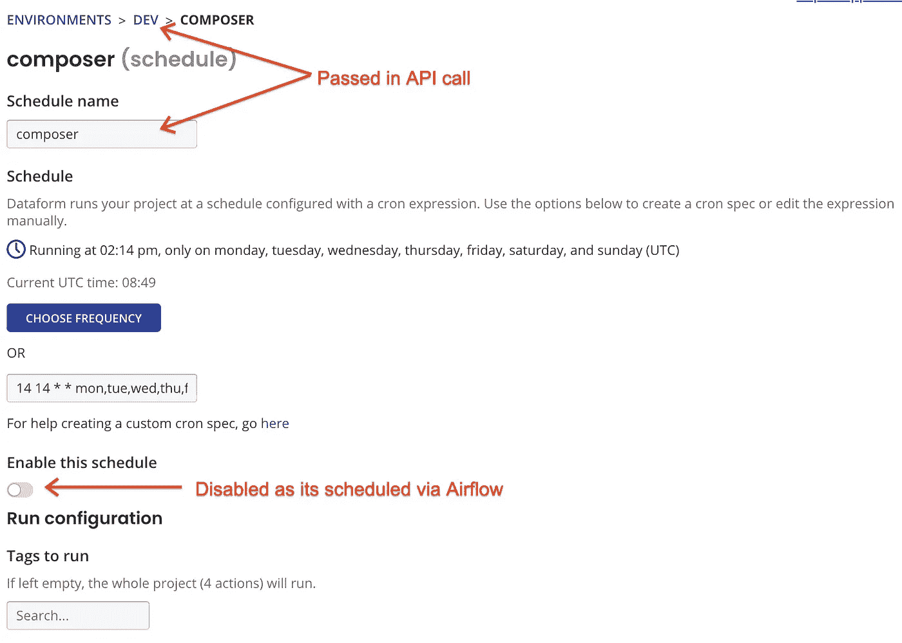
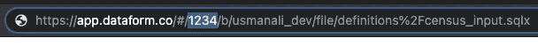
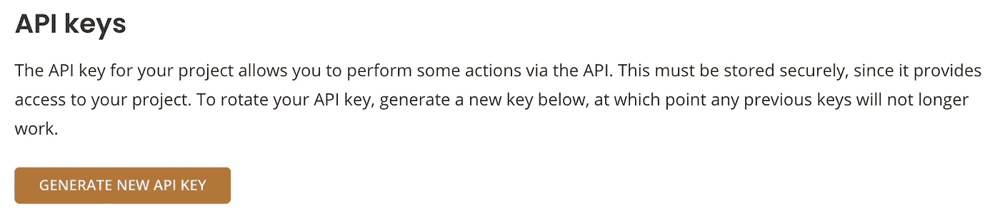
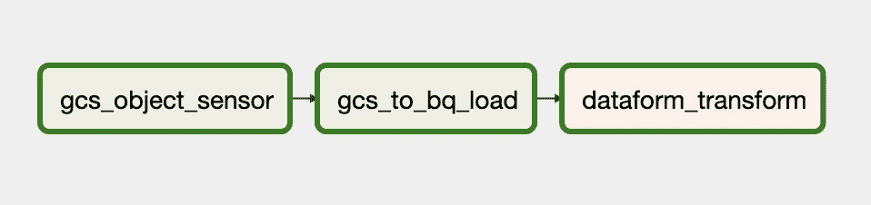

# Cloud Composer/Apache Airflow、数据表单和 BigQuery

> 原文：<https://medium.com/google-cloud/cloud-composer-apache-airflow-dataform-bigquery-de6e3eaabeb3?source=collection_archive---------0----------------------->

*如何一起使用 Cloud Composer 和 data form*

> *免责声明:观点是我自己的，不是我雇主的观点*

[Cloud Composer](https://cloud.google.com/composer) 是谷歌的完全管理版本 [Apache Airflow](https://airflow.apache.org/) ，非常适合编写、调度和监控工作流。Google 最近收购了 [Dataform](https://dataform.co/) ，这是 ELT 中关于 Transform(提取加载转换)的所有内容。这对 [BigQuery](https://cloud.google.com/bigquery) 爱好者来说是一个好消息，因为 Dataform 可以帮助管理脚本、创建依赖关系、添加数据质量检查(也称为断言)、记录、维护版本，并通过[本机 git 集成](https://docs.dataform.co/dataform-web/version-control)将更改推送到不同的环境中。它提供了 UI、CLI 和 API 来完成这一切，简而言之，太棒了！

因此，如果您正在使用或计划使用 BigQuery 作为您的 DWH，Cloud Composer 作为您的主要编排工具，并且喜欢 ELT，那么您来对地方了。我将基于以下典型用例展示这些产品如何相互通信:



如上所示，Composer 是所有这些+使用 gcs_to_bq 操作符简单加载到 BigQuery(也可以由任何其他 EL(T)解决方案替换)的主要编排者。转换以数据形式保存在 SQLX 中。Dataform 上已经有很多好文章了，所以我使用 Lak 创建的其中一篇[，它正在使用 Dataform 解决 BigQuery ML 用例，如下所示:](/google-cloud/building-sql-pipelines-in-bigquery-with-dataform-part-1-9e96f14ec664)



Dataform 也有自己的调度程序，但通常情况下，您会希望在加载完成后运行转换，对于跨不同应用程序的依赖链，Composer 再次提供了帮助。

因此，让我们停止追逐，直接进入代码:

**等待 GCS 中的文件**

我们的转换需要将输入数据加载到 BigQuery 中。假设这些数据将通过外部作业到达 GCS，我们需要等待。为此，我们可以使用 GoogleCloudStorageObjectSensor 运算符，如下所示:

```
from airflow.contrib.sensors.gcs_sensor import GoogleCloudStorageObjectSensorgcs_sensor_task = GoogleCloudStorageObjectSensor(
 task_id=”gcs_object_sensor”,
 bucket=’gcs-bucket’,
 object=’test-files/census_adult_income.csv’,
 dag=dag
)
```

**从 GCS 加载到 BigQuery**

一旦数据到达 GCS，我们可以使用下面的代码使用 GoogleCloudStorageToBigQueryOperator 操作符加载到 BigQuery。您也可以在 JSON 中指定 schema，更多细节[在这里](https://airflow.apache.org/docs/apache-airflow/1.10.12/_api/airflow/contrib/operators/gcs_to_bq/index.html)。

```
from airflow.contrib.operators import gcs_to_bqload_gcs_csv = gcs_to_bq.GoogleCloudStorageToBigQueryOperator(
 task_id=’gcs_to_bq_load’,
 bucket=’gcs-bucket’,
 source_objects=[‘test-files/census_adult_income.csv’],
 destination_project_dataset_table=’gcs-bucket.ds.census_adult_income’,
 schema_fields=[
 {‘name’: ‘age’, ‘type’: ‘INTEGER’, ‘mode’: ‘NULLABLE’},
 {‘name’: ‘workclass’, ‘type’: ‘STRING’, ‘mode’: ‘NULLABLE’},
 {‘name’: ‘functional_weight’, ‘type’: ‘INTEGER’, ‘mode’: ‘NULLABLE’},
 {‘name’: ‘education’, ‘type’: ‘STRING’, ‘mode’: ‘NULLABLE’},
 {‘name’: ‘education_num’, ‘type’: ‘INTEGER’, ‘mode’: ‘NULLABLE’},
 {‘name’: ‘marital_status’, ‘type’: ‘STRING’, ‘mode’: ‘NULLABLE’},
 {‘name’: ‘occupation’, ‘type’: ‘STRING’, ‘mode’: ‘NULLABLE’},
 {‘name’: ‘relationship’, ‘type’: ‘STRING’, ‘mode’: ‘NULLABLE’},
 {‘name’: ‘race’, ‘type’: ‘STRING’, ‘mode’: ‘NULLABLE’},
 {‘name’: ‘sex’, ‘type’: ‘STRING’, ‘mode’: ‘NULLABLE’},
 {‘name’: ‘capital_gain’, ‘type’: ‘INTEGER’, ‘mode’: ‘NULLABLE’},
 {‘name’: ‘capital_loss’, ‘type’: ‘INTEGER’, ‘mode’: ‘NULLABLE’},
 {‘name’: ‘hours_per_week’, ‘type’: ‘INTEGER’, ‘mode’: ‘NULLABLE’},
 {‘name’: ‘native_country’, ‘type’: ‘STRING’, ‘mode’: ‘NULLABLE’},
 {‘name’: ‘income_bracket’, ‘type’: ‘STRING’, ‘mode’: ‘NULLABLE’},
 ],
 skip_leading_rows=1,
 write_disposition=’WRITE_TRUNCATE’,
 dag=dag)
```

**调用数据表单进行转换**

上面的代码加载到 BigQuery 表“census_adult_income”中的数据是数据表单转换的输入，所以是时候运行数据表单作业了。到目前为止，Composer 中没有任何 Dataform 操作符，但是我们可以通过 PythonOperator 使用 REST API 调用来调用和轮询作业以迭代完成。更多关于数据表单 API[的细节请点击这里](https://docs.dataform.co/dataform-web/api)。

尽管您将使用 Composer 进行编排，但仍需要以数据形式为 REST API 调用创建一个调度。您可以禁用它，如下所示:



Rest API 也需要一个项目 Id(不要与 GCP 项目 Id 混淆)，我在 Dataform UI 中找不到明确提到它的地方，但是它在 URL 中是可见的，如下所示，所以从那里复制它(如果我找到更好的方法，我会在这里更新！).



您可以创建数据表单 API 键，如下所示:



打电话:

```
from airflow.operators.python_operator import PythonOperator
import requests
import json
import timedef dataform_def():
 base_url=’[https://api.dataform.co/v1/project/**<Project Id here>**/run'](https://api.dataform.co/v1/project/5685548636176384/run')
 headers={‘Authorization’: ‘Bearer <**Dataform Key>**’}
 run_create_request={“environmentName”: “<**environment name here>**”, “scheduleName”: “<**schedule name from dataform here>**”}response = requests.post(base_url, data=json.dumps(run_create_request), headers=headers)run_url = base_url + ‘/’ + response.json()[‘id’]
 response = requests.get(run_url, headers=headers)while response.json()[‘status’] == ‘RUNNING’:
 time.sleep(10)
 print(‘Dataform job running’)
 response = requests.get(run_url, headers=headers)
 print(response.json())return ‘Dataform job finished’run_dataform = PythonOperator(
 task_id=’dataform_transform’,
 python_callable=dataform_def,
 dag=dag,
)
```

**缝合在一起**

最后一部分是将它们链接到一个 Composer DAG 中:

```
gcs_sensor_task >> load_gcs_csv >> run_dataform
```

在 Composer 存储桶中移动 DAG:

```
gsutil cp census_elt_dag.py gs://composer-bucket
```

Composer 将自动选取这个新的 DAG:



您可以直接从 Composer 计划和监控它。

就是这样！如有任何问题或改进建议，请联系我。