# 云连接| GCP 和 Azure

> 原文：<https://medium.com/google-cloud/cloud-connectivity-gcp-and-azure-9b9727847fb3?source=collection_archive---------0----------------------->

在这篇博客文章中，让我们通过 VPN 配置谷歌云平台(GCP)和 Azure 之间的连接的详细步骤，以便您可以将您的工作负载从 Azure 迁移到 GCP，或者跨两个平台运行多云工作负载。

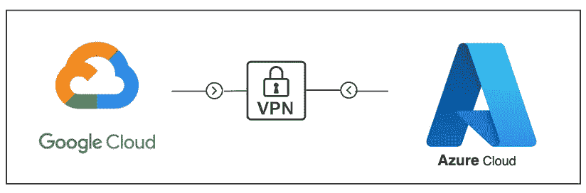

GCP 和 Azure 之间的站点到站点连接

# 开始之前

1.  一个 Azure 帐户，有一个活跃的订阅和一个关于 GCP 的项目。
2.  请确保您拥有必要的管理员角色，以按照这些链接执行以下活动: [GCP](https://cloud.google.com/iam/docs/job-functions/networking) 和 [Azure](https://learn.microsoft.com/en-us/azure/role-based-access-control/overview) 。
3.  VPC 网络(Azure 上的虚拟网络)和子网已经在 GCP 和 Azure 中创建。
4.  在 GCP 上，必须为 Azure 和 GCP 之间的流量(入站和出站)添加防火墙规则。
5.  在 Azure 上，应该为流量和子网传播配置安全组。
6.  VPN 设备的面向外部的公共 IPv4 地址。

# 拓扑学

这里有一个图表，展示了 GCP 和 Azure 之间的连接，以及使其工作的各种组件。

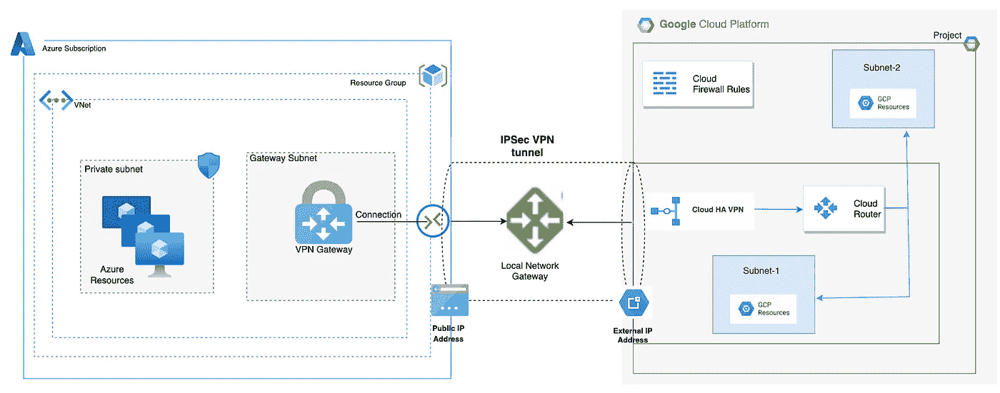

**GCP 和 Azure 之间的 IPSec VPN 隧道**

*   **谷歌云 VPC 网络:**单个谷歌云项目中的单个虚拟网络。
*   **外部 IP 地址或 Google Cloud 对等地址:**对等 VPN 设备使用的外部 IP 地址，用于与 Google Cloud 建立 HA VPN。外部 IP 地址是自动分配的，Google Cloud 项目中的每个网关接口一个。
*   **动态路由:**使用[边界网关协议(BGP)](https://wikipedia.org/wiki/Border_Gateway_Protocol) 的谷歌云 VPN 动态路由。注意 HA VPN 只支持动态路由。
*   **HA VPN:** 这是一个高可用性云 VPN，让我们能够通过 IPsec VPN 连接将内部网络安全地连接到我们在 GCP 的私有网络。
*   **虚拟网络网关:** Azure VPN 网关提供客户场所和 Azure 之间的跨场所连接。我们部署我们的[虚拟网络网关](https://docs.microsoft.com/en-us/azure/vpn-gateway/vpn-gateway-about-vpngateways)，它将用于创建到我们的 Google 环境的 VPN 隧道。这将被部署到“网关子网”
*   **站点到站点(IPsec):** 由“VPN 网关”、“本地网关”和“连接”组成，允许通过公共互联网在 Azure 的 VNet 和内部位置之间发送加密流量。

## 把手放在某物或者某人身上

现在让我们在两端实现 VPN 隧道。

1.  登录到 [Azure 门户](https://portal.azure.com/)
2.  创建虚拟网络网关

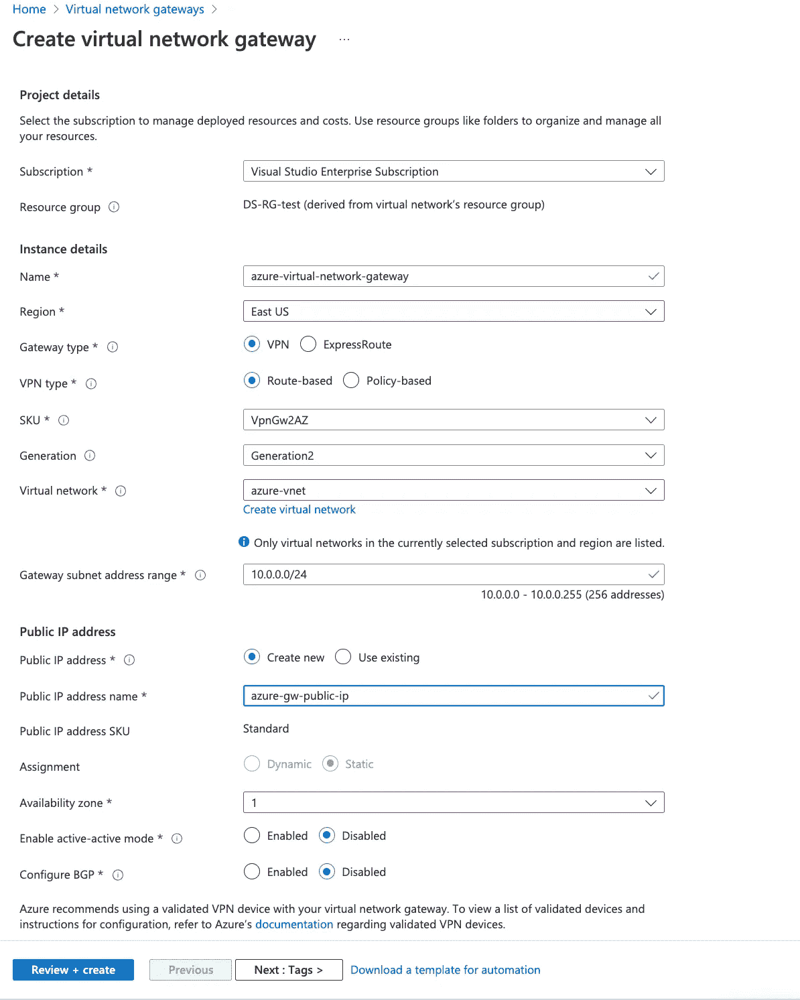

2.接下来，我在 GCP 上创建一个 VPN 连接。首先，我选择 VPN 连接的类型为高可用性(HA)，

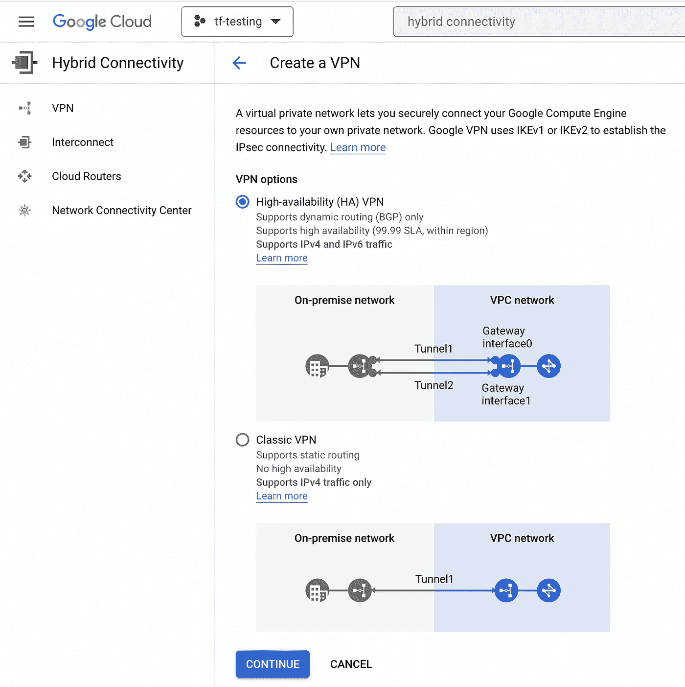

然后我创建一个云 HA VPN 网关。我提供了一个名称(gcp-vpn-gateway)、一个 VPC (vpc-1)和一个地区(us-east1)。

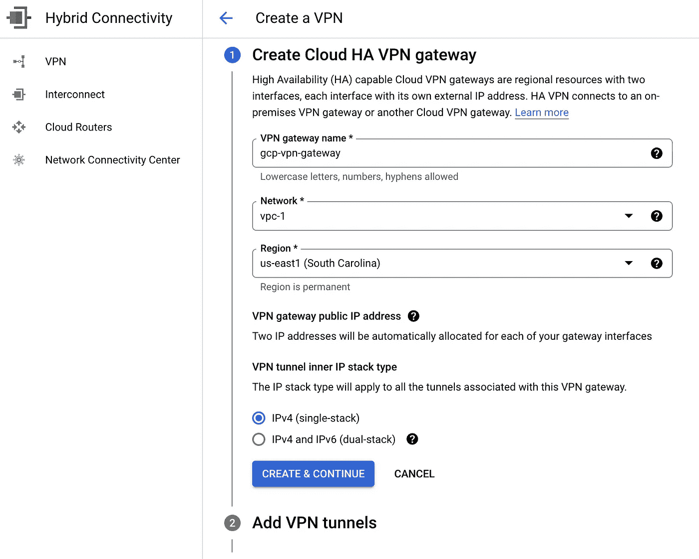

3.创建 VPN 网关后，会为其分配两个公共 IP 地址。请记下 IP，因为我们稍后会用到它们。

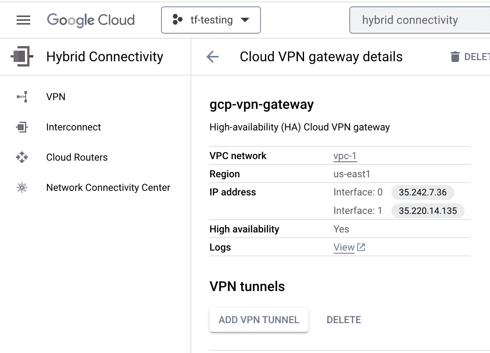

4.现在让我们创建对等配置。我选择**添加对等 VPN 网关**并选择一个接口。在对等 VPN 网关接口下，对于接口 0 的 IP 地址，我添加了之前创建的外部虚拟专用网关的 IP 地址。

*您可以按照相同的步骤添加额外的隧道以实现高可用性或增加容量。*

**创建对等 VPN 网关:**

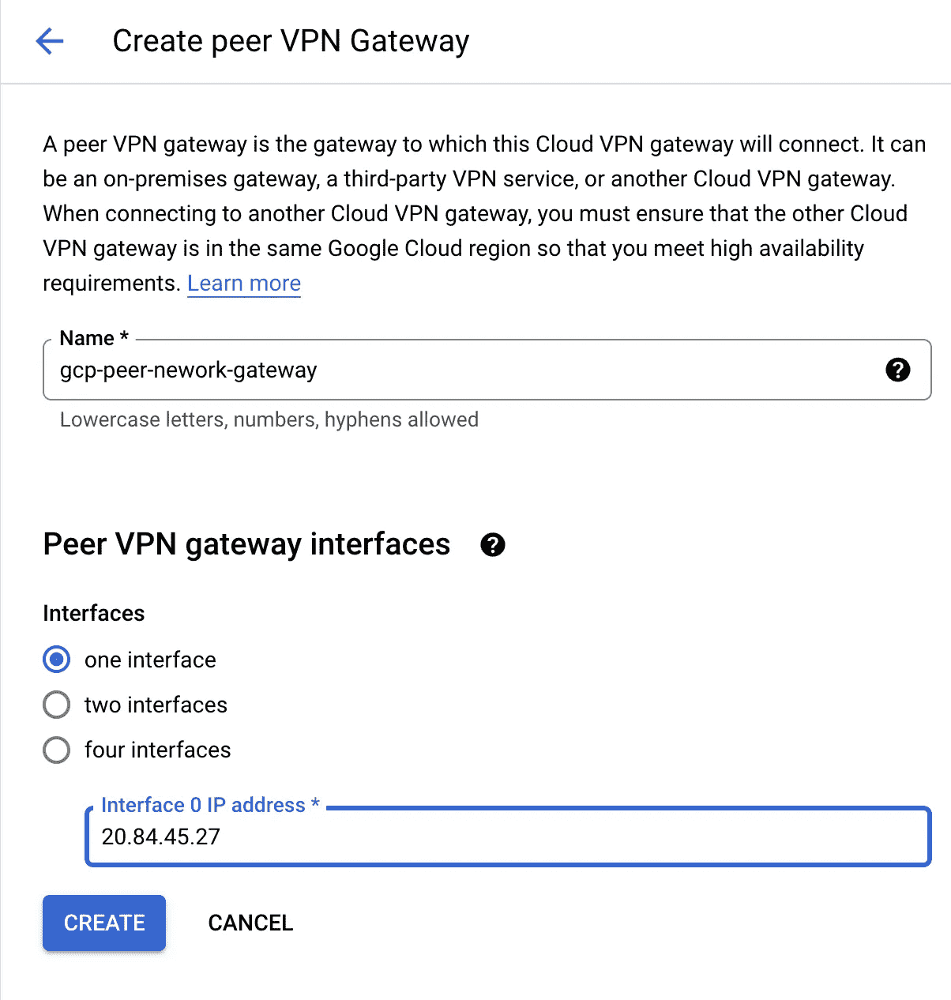

4.接下来，我选择添加 VPN 隧道并配置 BGP 会话。

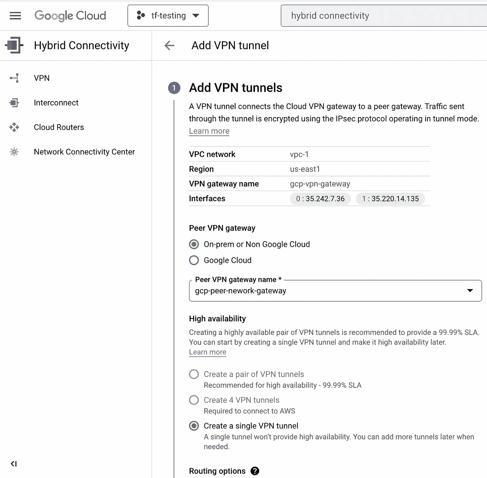

4.在 GCP 创建 BGP 会话

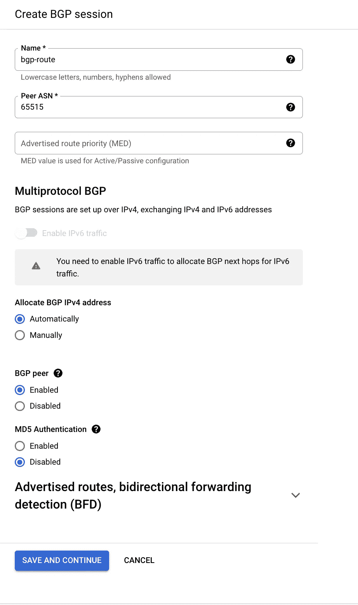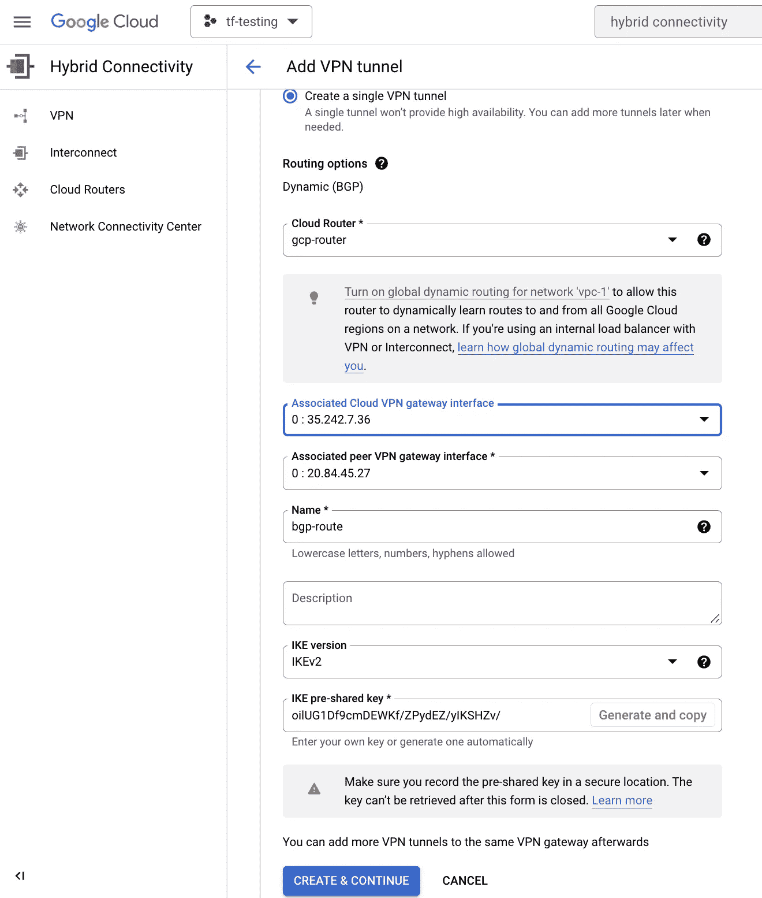

5.用 GCP 信息创建本地网关网络

我使用 gcp 信息创建了一个本地网络网关，我们可以为第二个本地网络网关重复相同的步骤，为第二个 IP 地址提供高可用性或额外的容量。

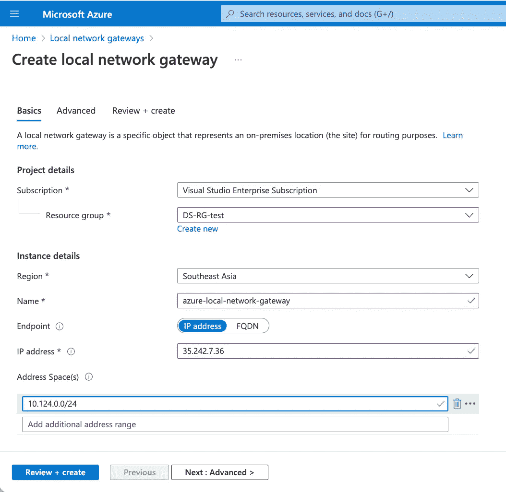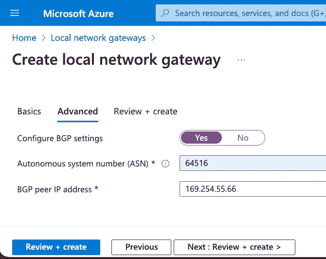

6.使用虚拟网络网关和本地网络网关创建连接

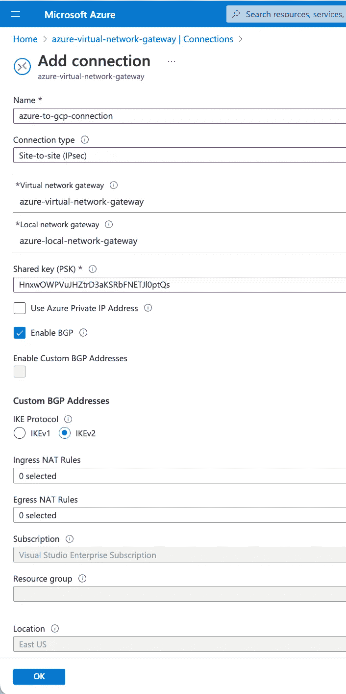

7.验证连通性

此时，您的 VPN 连接应该显示一个状态为“已建立”的隧道，

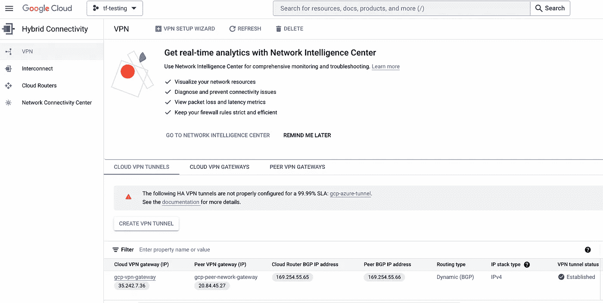

返回 Azure 并验证连接状态是否显示为已连接。

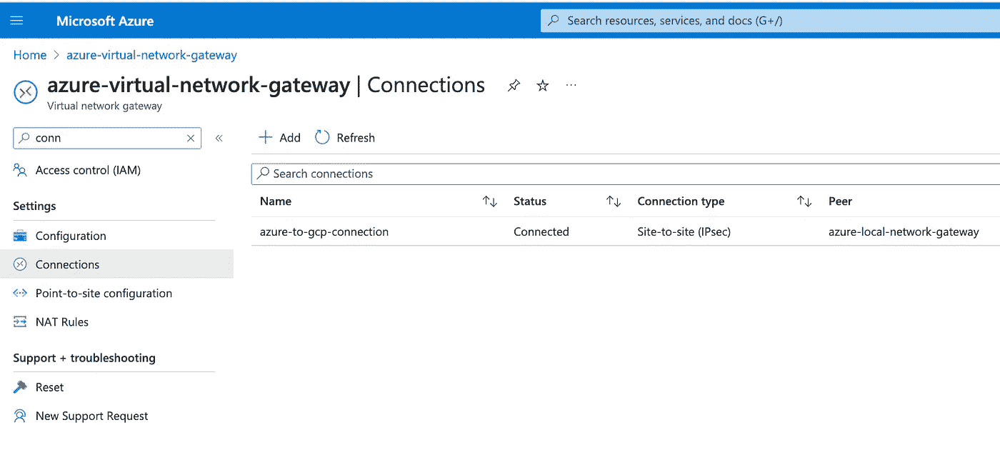

## **结论**

在这篇博客中，我们了解了在 Azure 和 GCP 之间创建站点到站点 VPN 的先决条件。此外，我们还讨论了在 Azure 和 GCP 之间创建 IPSec VPN 隧道的详细步骤

## 最佳实践

 [## VPC 设计的最佳实践和参考架构|云架构中心|谷歌…

### 本指南介绍了虚拟私有云设计的最佳实践和典型企业架构…

cloud.google.com](https://cloud.google.com/architecture/best-practices-vpc-design) 

## 限制

 [## 配额和限制|云 VPN |谷歌云

### 警告:某些经典 VPN 功能已被否决。有关更多信息，请参见经典 VPN 部分弃用…

cloud.google.com](https://cloud.google.com/network-connectivity/docs/vpn/quotas) 

## 参考

 [## 云 VPN 概述|谷歌云

### 本页描述与 Google Cloud VPN 相关的概念。有关云 VPN 文档中使用的术语的定义，请参阅…

cloud.google.com](https://cloud.google.com/network-connectivity/docs/vpn/concepts/overview)  [## 配置对等 VPN 网关|谷歌云

### 本页描述了完成 VPN 配置的步骤。要完成您的配置，请配置…

cloud.google.com](https://cloud.google.com/network-connectivity/docs/vpn/how-to/configuring-peer-gateway)  [## 关于 Azure VPN 网关

### VPN 网关通过公共网络在 Azure 虚拟网络和本地位置之间发送加密流量…

learn.microsoft.com](https://learn.microsoft.com/en-us/azure/vpn-gateway/vpn-gateway-about-vpngateways)