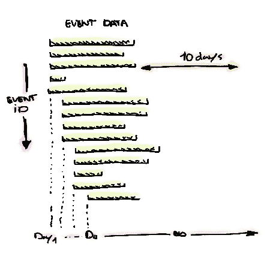

# 云数据流和大波束窗口

> 原文：<https://medium.com/google-cloud/cloud-dataflow-and-large-beam-windows-1acda1e8fb7b?source=collection_archive---------2----------------------->

跟踪非常大的窗口(几天到超过一周)

我们使用云数据流及其强大的窗口语义已经有几年了。但是直到现在我们的窗户都很小。跟踪一个用户会话通常不会超过一个小时。

借助我们的下一代数据架构，我们希望比以往走得更远，在更大的窗口上实时进行更多计算。通过一系列实验，我们计划证明[云数据流](https://cloud.google.com/dataflow/)及其新改进的 [Apache Beam](https://beam.apache.org/) 模型是正确的选择。[更新实验](/google-cloud/restarting-cloud-dataflow-in-flight-9c688c49adfd)已经证明了我们在更新管道时不会丢失任何数据。现在，当使用非常大的重叠窗口(跨越几天到一周以上)时，内存和磁盘使用会发生什么情况？

如果你看插图，我们想知道一个活动的几个特征，例如访问者的独特数量。活动通常持续一周。我们首先想到的是创建自定义窗口，但如果缩小，您会发现窗口策略与会话窗口完全相同。但是我们不是用分钟来表示，而是用天来表示。

在我们的实验中，我们将会话间隙定义为 10 天，这比我们最长的活动还要长。我们首先预测内存和磁盘使用量会稳步上升，然后几天后会稳定下来。实验开始了，我们密切关注 [Stackdriver 数据流监控](https://cloud.google.com/dataflow/pipelines/stackdriver-monitoring)。在数据流监控中，我们只看到了线性大小，所以我们有点气馁，直到深入到我们正在查看的指标。事实是，显示的数据流指标是累积的，当然它们只会上升。幸运的是，在查看实例指标时，这些数字要好得多。

几周的磁盘使用数据

磁盘使用情况与我们预测的完全一致，先是使用量上升，然后稳定下来。内存使用实际上比预期的更稳定，但是因为是 Java 实现，内存使用很难预测。

几周的内存使用

这些数字让我很高兴，这当然是一个很好的结果，可以带着它进入周末。但这让我想知道默认数据流监控特征有什么好处，也许我应该在周末看一下[下一个‘17 监控和改进您的大数据应用会议](https://www.youtube.com/watch?v=hEteVlEHa60)。

感谢我们最新的团队成员 [Wout Scheepers](https://medium.com/u/401022bc8aca?source=post_page-----1acda1e8fb7b--------------------------------) 将他的想法带到桌面上，让这个实验得以实现。