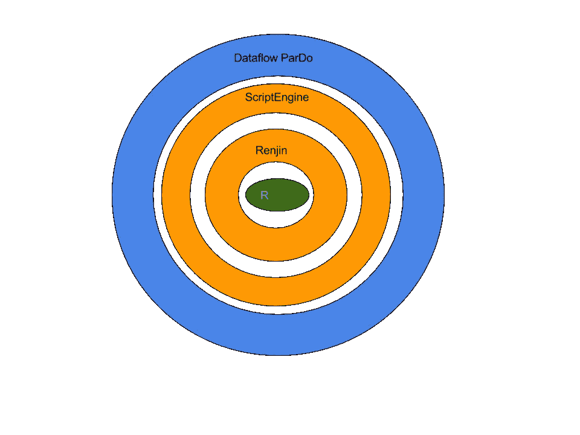

# 云数据流可以自动缩放程序以进行大规模并行数据处理

> 原文：<https://medium.com/google-cloud/cloud-dataflow-can-autoscale-r-programs-for-massively-parallel-data-processing-492b57bd732d?source=collection_archive---------0----------------------->

[云数据流](https://cloud.google.com/dataflow/)是一个完全托管的服务，用于执行数据处理作业。你不需要配置或管理任何虚拟机——相反，你只需要编写你的数据处理管道，然后把它放到谷歌云平台上。这种处理是自动扩展的(在许多机器上),并在 GCP 计算基础设施上以分布式方式执行。

如果您有一个令人尴尬的并行问题，这将非常有用，因为您只为使用这些机器的时间付费——运行一个由 10 台机器组成的小型集群 1 小时的成本与运行一个由 100 台机器组成的大型集群 6 分钟的成本相同，当您可以在 6 分钟内得到结果时，谁愿意等 60 分钟呢？

Cloud Dataflow 目前支持两种语言的管道编程——Java 和 Python(API 本身是开源的，以 Apache Beam 的形式)。这很好，但是如果您倾向于在 R 中进行分析呢？



使用 Java 的 ScriptEngine 功能从数据流中调用 R 程序

你能使用数据流大规模并行处理 R 脚本吗？是的，你可以，使用 [Renjin](http://www.renjin.org/) 和 Java 的 [ScriptEngine](https://docs.oracle.com/javase/7/docs/api/javax/script/ScriptEngine.html) 框架从 Java 调用 R 程序——使用这种方法而不是 Rjava 或其他你可能熟悉的 R-to-Java 解决方案，因为你不能在数据流机器上安装 R(记住数据流是一个自动伸缩框架，你不能配置虚拟机。)

如何做到这一点的详细步骤(你可以在 github 上看到我的[数据流项目演示了这些步骤):](https://github.com/GoogleCloudPlatform/training-data-analyst/tree/master/blogs/dataflow_r)

在 Java Dataflow 项目中，向 pom.xml 添加 Renjin 的存储库以及 R 和 Cran 的依赖项(以获得 R 库):

```
<repositories>
  <repository>
    <id>bedatadriven</id>
    <name>bedatadriven public repo</name>
    <url>[https://nexus.bedatadriven.com/content/groups/public/</url](https://nexus.bedatadriven.com/content/groups/public/</url)>
  </repository>
</repositories><dependencies>
  <dependency>
    <groupId>org.renjin</groupId>
    <artifactId>renjin-script-engine</artifactId>
    <version>RELEASE</version>
  </dependency>
  <dependency>
    <groupId>org.renjin.cran</groupId>
    <artifactId>exptest</artifactId>
    <version>1.2-b214</version>
  </dependency>
```

像平常一样写你的 R 程序。Java 的 ScriptEngine 框架会让你给 R 输入值，得到 R 变量的值和结果。我的例子利用 R 库来测试给定的一组数字是否来自指数概率分布:

```
library(exptest)co.exp.test(x, simulate.p.value=FALSE, nrepl=2000)
```

在您的 Java 管道中，实例化一个 ScriptEngine 并执行 R 程序。R 程序将与您的 Java 代码打包在一起，这样就可以从类路径中找到它(同样，绝对路径不会起作用，因为这是一个自动缩放框架，您无法访问数据流机器上的本地驱动器):

```
ScriptEngineManager manager = new ScriptEngineManager();
ScriptEngine engine = manager.getEngineByName("Renjin");
InputStream rprog = CallingRFromJava.class.getResourceAsStream("myprog.r");
```

推入你的 R 程序需要的变量(我的需要 x，是一个 doubles 的数组)，运行 R 程序，从 R 返回结果，拉出你需要的数据。在我的例子中，指数测试返回一个 p 值是第二个数字的列表。所以，我有:

```
double[] inputx = c.element(); // from input
engine.put("x", inputx);// run R program, get output from R, send to Dataflow
ListVector result = (ListVector) engine.eval(new InputStreamReader(rprog));double pvalue = result.getElementAsDouble(1);
```

无论是在本地还是在云上，照常执行数据流管道。

参见 [github repo](https://github.com/GoogleCloudPlatform/training-data-analyst/tree/master/blogs/dataflow_r) 获取创建 Maven 项目的脚本、数据流管道的完整代码以及如何在云上运行它。

编码快乐！

**P.S.** 一位同事提出，在 Dataflow 中运行 R 程序还有另一种可能的方法，因为 Dataflow 的 Python 版本允许用户[安装非 Python 依赖项](https://cloud.google.com/dataflow/pipelines/dependencies-python#non-python-dependencies)。您可以添加类似这样的内容:

```
apt-get install -y r-base
pip install rpy2
```

并将其包含在 Python 作业的启动脚本中。但是我没有尝试过，我也不清楚如何用这种方法安装 R 库。如果你真的尝试了第二种方法，并且成功了，请在评论中告诉我们！