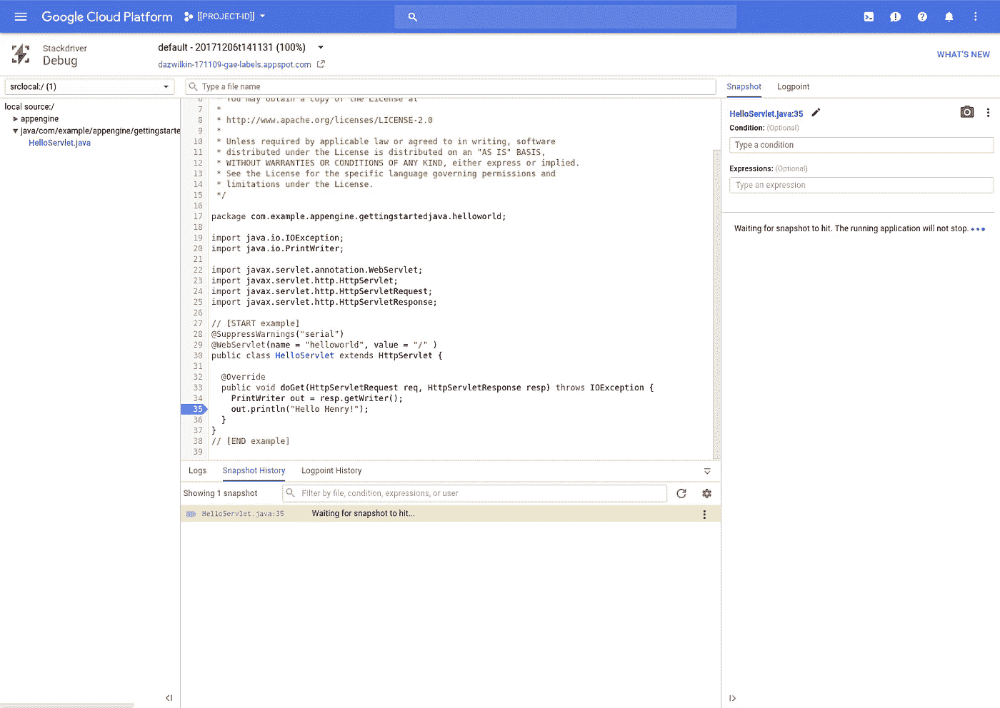
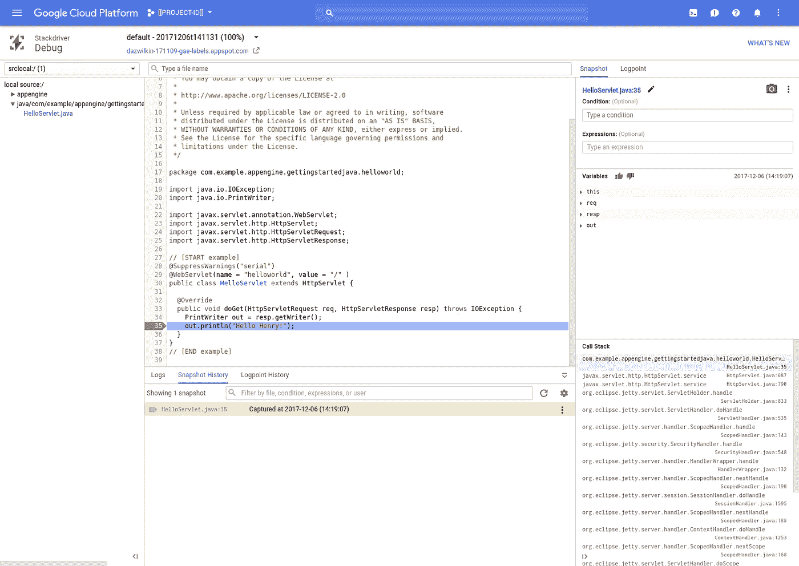
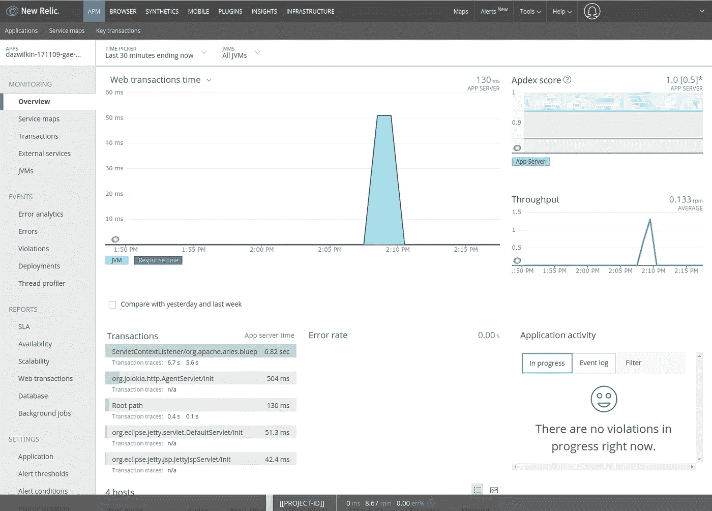

# Stackdriver 调试器和新遗物

> 原文：<https://medium.com/google-cloud/cloud-debugger-working-with-new-relic-75f8b3eb6c6?source=collection_archive---------1----------------------->

你可以拥有美好的事物！

我的一个客户在尝试使用 [App Engine Flex](https://cloud.google.com/appengine/docs/flexible/) 和 New Relic 的 [APM 代理](https://newrelic.com/application-monitoring)配置[定制运行时](https://cloud.google.com/appengine/docs/flexible/custom-runtimes/build)时发现了冲突。出现这个问题是因为新的 Relic 配置正在取代 [Stackdriver 调试器](https://cloud.google.com/debugger/)配置。解决方案是找到一种为两者配置 JVM 的方法。

以下是工作文档:

我使用了新的遗留文档([链接](https://docs.newrelic.com/docs/accounts-partnerships/partnerships/google-cloud-platform-gcp/google-app-engine-environment))作为起点，但这并不说明 Stackdriver 调试器。事实上，一个反复试验的过程解决了上面“JAVA_OPTS”混合版本中出现的问题。然后，我向工程部门确认了解决方案。

你需要一个新的遗迹[账号](https://newrelic.com/signup)来完成这个任务。我假设你已经配置好了，并愉快地使用谷歌云平台(GCP)。对于上面定义的 Dockerfile，为了简单起见，我将所有内容都放在一个目录中。如果您重新定位项目，例如“newrelic”目录，请确保在 ADD 语句中反映这一点。

确保新的 Relic (newrelic.yml)配置文件是正确的。您需要反映“许可证密钥”和“应用程序名称”的值。为了调试(暂时)，我按照 New Relic 文档指导，设置了“log_file_name: STDOUT”。

对于 app.yaml，新的 Relic 文档建议禁用应用引擎健康检查，但这在 Flex 中目前是不可能的。不过，您应该添加环境变量建议，它将类似于:

从包含 app.yaml 和 Dockerfile 文件的目录中，您可以运行:

```
gcloud app deploy --project=$PROJECT --quiet
```

部署完成后，卷曲端点会产生:


那是我的兄弟！

你的 app 可能比这个更复杂；-)

在 Stackdriver 调试器中，我在第 35 行放了一个快照，生成了输出“Hello Henry ”:



Stackdriver 调试器:正在等待

然后我对着端点发出一个旋度来触发它:



Stackdriver 调试器:已捕获！

与此同时，衡量标准也被输入到 New Relic 中:



App Engine Flex 上的新遗留 APM 报告

## 结论

这种方法应该适用于您希望与 Stackdriver Debugger 结合使用的其他代理。诀窍是确保 Java 运行时的 Stackdriver 调试器配置得到保留。