# 云部署经理和 Kubernetes

> 原文：<https://medium.com/google-cloud/cloud-deployment-manager-kubernetes-2dd9b8124223?source=collection_archive---------0----------------------->

是的，你可以:-)

我一直在熟悉[头盔](http://helm.sh)。赫尔姆比我想象的要正派和直率。然而，我对 Helm 最大的不满是它只适用于 Kubernetes。我知道赫尔姆不想成为其他人。但这意味着在我可以使用 Helm 之前，我必须提供一个 Kubernetes 集群和可能的相关服务(例如，Cloud Spanner，一些服务帐户)。

我想要一个工具来统治一切。近来，人们对 Hashicorp 的 Terraform 非常感兴趣，因为它是一个超级配置器，但即使是 Terraform，在部署 Kubernetes 应用程序时，其适用性也是有限的。

原来，谷歌自己的[云部署管理器](https://cloud.google.com/deployment-manager) (DM)有一个强大的(相对较新，相对较模糊的)功能，称为“[类型提供者](https://cloud.google.com/deployment-manager/docs/configuration/type-providers/process-adding-api)”，使 DM 能够被配置为部署几乎任何东西，包括我们心爱的 Kubernetes。Howzat！？

归功于 David Schweikert 和他的文章“GCP 基础设施作为部署管理器的代码”,你可能想先读这篇文章，而不是我的文章。这也要归功于部署管理团队，他们为 Kubernetes 提供了一个样本，即使它隐藏在 GitHub 的内部( [link](https://github.com/GoogleCloudPlatform/deploymentmanager-samples/tree/master/examples/v2/gke) )。

在完全公开的情况下，我为 DM 团队提交了一份 [PR](https://github.com/GoogleCloudPlatform/deploymentmanager-samples/pull/175) 来更新它的 Kubernetes(称为“GKE”)样本，但是我(还)不完全理解它是如何工作的。虽然它确实有效，但这是 99%的问题:使用它，我可以将部署和服务应用到 Kubernetes 集群。

## 设置

有一个谷歌云平台项目。如果尚未启用，请启用部署管理器(DM):

```
PROJECT=[[YOUR-PROJECT]]gcloud services enable deploymentmanager.googleapis.com \
--project=$PROJECT
```

我要假设(！)DM 将为我们启用 Kubernetes 引擎等服务。[确实如此]

我假设你对 DM 有所了解。很简单(！)是一个接受谷歌云平台 API 调用集合的服务。这些 API 调用是 Google 为其每项服务发布的(权威的)API。

本质上(！)如果有 Google Cloud Platform API，那么你可以使用 Deployment Manager 将其自动化。当然，Kubernetes 引擎是这套 GCP API**的一部分，但是**提供 Kubernetes 引擎的 GCP API 和 Kubernetes(引擎)用来提供自身资源的 Kubernetes API 是有区别的。

扩展部署管理器以支持 Kubernetes API 是由部署管理器的类型提供者实现的。

## 库伯内特发动机

这里有一个简单的脚本，它将把一个 Kubernetes 集群部署到您最喜欢的区域。我将为自己设定一个扩展目标，添加这个部署脚本的变体，以提供一个区域集群[参见本文末尾的'**区域集群**]:

您可以运行这个程序，并提供它所期望的参数(`CLUSTER_NAME`、`CLUSTER_ZONE`、`NUM_NODES`):

```
NAME=a
ZONE=us-west1-agcloud deployment-manager deployments create ${NAME} \
--template=kubernetes_engine.py \
--properties=CLUSTER_NAME:${NAME},CLUSTER_ZONE:${ZONE},NUM_NODES:1 \
--project=$PROJECT
```

您应该会收到:

```
The fingerprint of the deployment is 8I1cswAm1ptrCkgKmwvVKA==
Waiting for update [operation-1528751969941-...]...done.                                                                                                                                                                 
Update operation operation-1528751969941-... completed successfully.
NAME  TYPE                  STATE      ERRORS  INTENT
a     container.v1.cluster  COMPLETED  []
```

而且，对于一些图片漂亮:

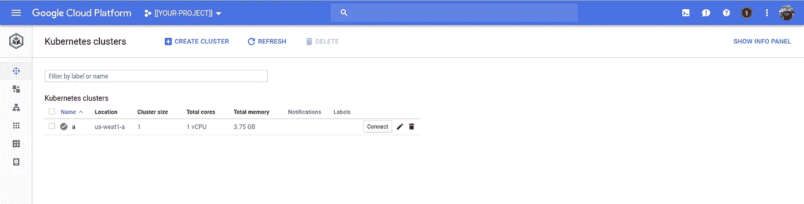

Kubernetes 发动机组“a”

以及部署管理器报告的内容:

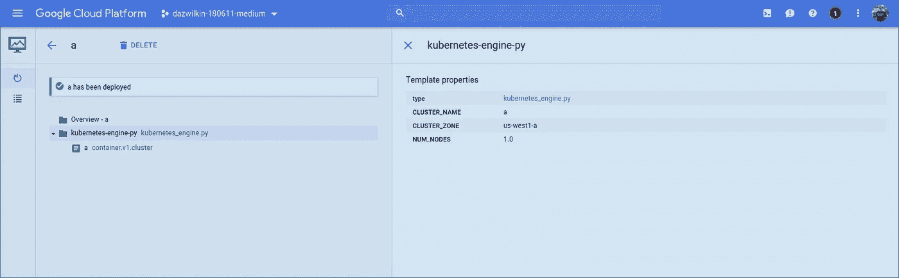

部署管理器创建了“container.v1.cluster”

魔法？不完全是。第 11 行中的`type: container.v1.cluster`是指部署管理器的支持资源类型下列出的 GCP API 调用:

[https://cloud . Google . com/deployment-manager/docs/configuration/supported-resource-types](https://cloud.google.com/deployment-manager/docs/configuration/supported-resource-types)

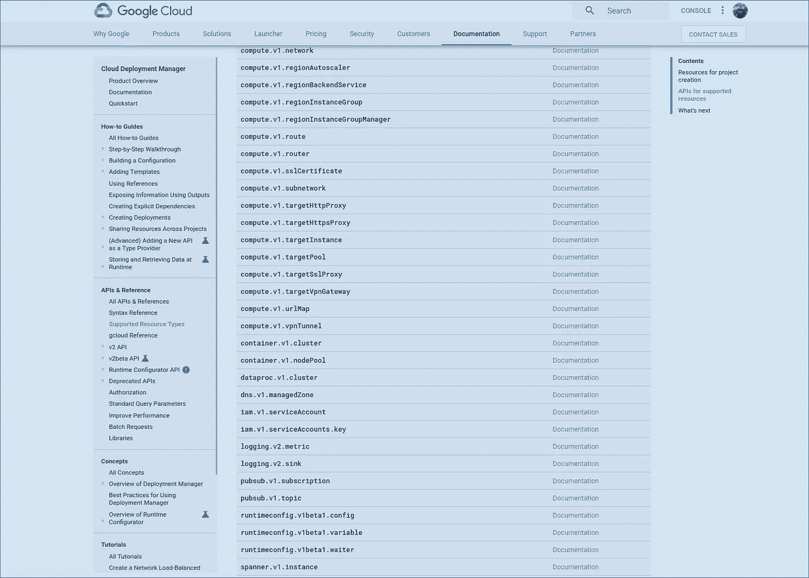

支持的资源类型“container.v1.cluster”

其中链接到 Kubernetes 引擎的 v1(！)REST API 文档:

[https://cloud . Google . com/kubernetes-engine/reference/rest/v1/projects . zones . clusters](https://cloud.google.com/kubernetes-engine/reference/rest/v1/projects.zones.clusters)

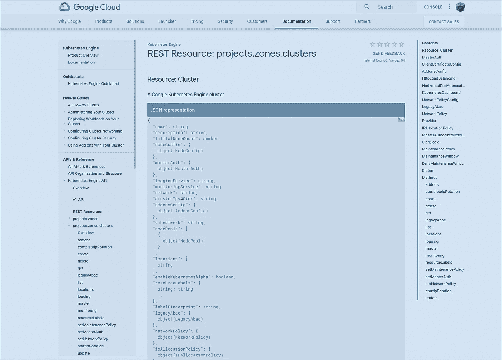

项目.区域.集群

这个对象为我们提供了我们在部署脚本的第 12–29 行中列举的属性。

> **注意**在第 31–34 行我们定义了`outputs`。具体来说，我们创建一个名为 endpoint 的输出，它引用该集群主服务器的 IP 地址。当我们试图创建 Kubernetes API 时，我们将需要使用这个集群来为我们获取这些 API，然后我们将使用这个值。

题外话已经说够了。

可以说，部署管理器在 Google 云平台中有一个默认的类型提供者。我们不需要定义谷歌云平台 API。然而，我们确实需要定义其他人。

请删除部署(这会删除群集),因为我们将在下一部分创建类型时重新创建群集:

```
gcloud deployment-manager deployments delete ${NAME} \
--project=${PROJECT}
```

## 类型提供程序

好了，我将让 Google 的文档来解释类型提供者是如何工作的以及它们是如何定义的。我不完全清楚。

与上面的部署脚本一样，我们需要生成类型提供者资源，供部署管理器使用。因此，让我们创建另一个脚本，它在结构上应该类似于 Kubernetes 引擎集群脚本(这几乎完全是 Google 脚本的副本):

脚本的核心是第 4-8 行。该脚本遍历本节中列出的每一项，并为它们创建类型提供程序(第 13–49 行)。我将把样板文件留给谷歌来解释。可以说，它从 API 中推断出使用 APIs Swagger 文档支持的方法。但是，这些 API 是什么呢？

首先，让我们部署我们的脚本。我们将需要组合这些，因为我们想要访问在第一个脚本中创建的 Kubernetes 集群，以便在第二个脚本中枚举它的类型(针对它的 API)。创建配置文件:

配置文件导入我们的两个脚本(第 1–3 行)并应用它们(第 6–11、12–16 行):

```
gcloud deployment-manager deployments create ${NAME} \
--config=generate_apis.yaml \
--project=$PROJECT
```

对于集群(第 6–11 行)，我们有效地将命令行转换为配置。请将`[[YOUR-CLUSTER-NAME]]`替换为您希望为集群命名的名称，将`[[YOUR-CLUSTER-ZONE]]`替换为您希望创建集群的区域。

对于这些类型，我称它们为`types`，因为我不是原创的(第 12-16 行)，属性`endpoint`是我们集群创建的输出。它被赋予集群的主节点 IP 地址的值。脚本使用它来自省 Kubernetes 集群的 API 列表，并为它们构建类型。

完成后，我们将拥有一个集群和一组类型:

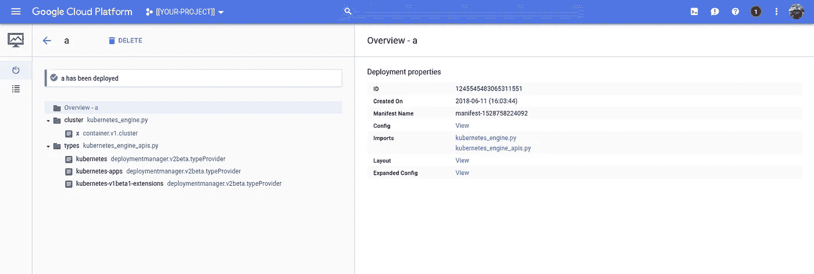

类型:kubernetes、kubernetes-应用程序、kubernetes-v1-beta 1-扩展

让我们访问我们的群集，以便我们可以查看以下内容:

```
gcloud container clusters get-credentials [[YOUR-CLUSTER-NAME]] \
--project=${PROJECT}
```

然后，您可以:

```
kubectl cluster-infoKubernetes master is running at [https://[](https://35.233.144.128)[YOUR-MASTER-IP]]
```

> **NB** 获取 Kubernetes 主 IP 地址

## 第 10 行:api/v1/

这是 Kubernetes 的基础 API。Kubernetes(1.10 版)文档中列出的所有类型都可以从这个 API 获得:

[https://kubernetes . io/docs/reference/generated/kubernetes-API/v 1.10/](https://kubernetes.io/docs/reference/generated/kubernetes-api/v1.10/)

获取`[[YOUR-MASTER-IP]]`地址，用`/api/v1`后缀浏览或滚动端点，您将收到所有 Kubernetes v1 类型的枚举:

```
curl \
--insecure \
--silent \
[https://[[YOUR-MASTER-IP]]/api/v1](https://[[YOUR-MASTER-IP]]/api/v1)/ \
| jq --raw-output .resources[].name
```

> **NB** 需要那个最后的`v1/`。

目前，该列表包括(子集)一些家庭收藏:

```
configmaps
namespaces
nodes
pods
secrets
serviceaccounts
services
```

## 第 11 行:API/apps/v1beta 1

取`[[YOUR-MASTER-IP]]`地址和后缀/API/apps/v1 beta 1:

```
curl \
--insecure \
--silent \
[https://[[YOUR-MASTER-IP]]/apis/apps/v1](https://[[YOUR-MASTER-IP]]/api/v1)beta1 \
| jq --raw-output .resources[].name
```

> **NB** 又是`/apis`这次没有`/api`。

目前这返回:

```
controllerrevisions
deployments
deployments/rollback
deployments/scale
deployments/status
statefulsets
statefulsets/scale
statefulsets/status
```

## 其他人

您的集群支持的 API 集记录在此:

```
curl \
--insecure \
--silent \
[https://[[YOUR-MASTER-IP]]/apis/](https://35.233.172.79/apis/) \
| jq --raw-output .groups[].name
apiregistration.k8s.io
extensions
apps
authentication.k8s.io
authorization.k8s.io
autoscaling
batch
certificates.k8s.io
networking.k8s.io
policy
rbac.authorization.k8s.io
storage.k8s.io
apiextensions.k8s.io
```

您可以将所有这些添加到部署管理器脚本中，以便可以通过部署管理器访问它们。

从部署管理器脚本中，您会记得我们使用了`/swaggerapi`作为我们的端点，所以也来看看它:

```
curl \
--insecure \
--silent \
https://[[YOUR-MASTER-IP]/swaggerapi
```

> **NB** 以前可以通过 Kubernetes 托管的 Swagger UI 浏览器浏览 Kubernetes 的 Swagger 文档，但这似乎对我不起作用:-(

好的，我们可以部署 Kubernetes 集群并使用类型提供者来定义 Kubernetes 类型，所以…！？

## 部署 Kubernetes 资源

[参见'**在帖子末尾添加入口**

敦敦敦……让我们切入正题:

使用以下方式部署它:

```
gcloud deployment-manager deployments update k \
--template=deployment.py \
--project=$PROJECT \
--properties=name:henry,port:80,image:nginxThe fingerprint of the deployment is Q_zFbcIkVc3UTACp-5Gw1g==
Waiting for update [operation-1528761005721-...]...done.                                                                                                                                                                 
Update operation operation-1528761005721-... completed successfully.
NAME              TYPE                                                                                           STATE      ERRORS
henry-deployment  kubernetes-apps:/apis/.../deployments  COMPLETED
henry-service     kubernetes:/api/.../services           COMPLETED
```

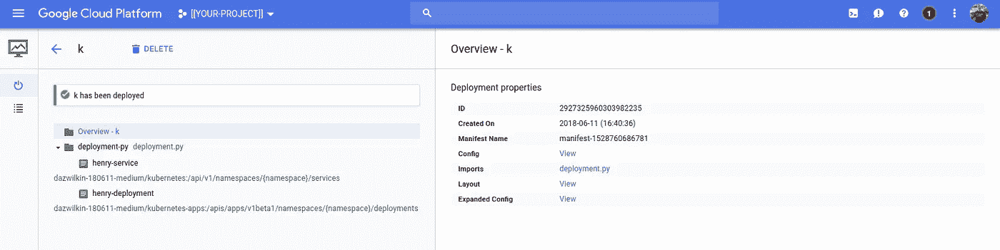

最令人兴奋的是

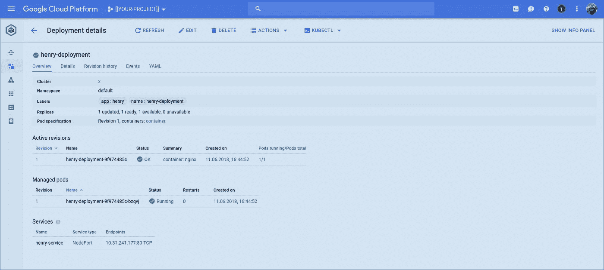

Kubernetes 引擎控制台:部署

展示了 Nginx 在端口 80 上的部署，并通过 Kubernetes 上的节点端口通过服务公开。

所有这些都是仅使用部署管理器实现的！！

关于这个 Kubernetes 部署脚本，有两件事需要了解。

首先，我们必须反向引用我们使用类型提供程序创建的类型。这些在表格中被唯一引用:

```
[[PROJECT]]/[[TYPE]]:[[TYPE-API]]
```

因此，让我们为部署更完整地解释这一点。您可能还记得，Kubernetes 部署是在这里定义的:

[https://kubernetes . io/docs/reference/generated/kubernetes-API/v 1.10/# deployment-v1-apps](https://kubernetes.io/docs/reference/generated/kubernetes-api/v1.10/#deployment-v1-apps)

它们需要我们在`kubernetes_engine_apis.py`的第 6 行定义的`apps/v1beta1`:

```
'-apps': 'apis/apps/v1beta1',
```

我们使用`kubernetes`作为这个项目中所有类型的根名称。因此，当我们在部署管理器中调用这些时，我们必须引用类型`[[PROJECT]]/kubernetes-app`。这里，它在部署管理器控制台中被突出显示:

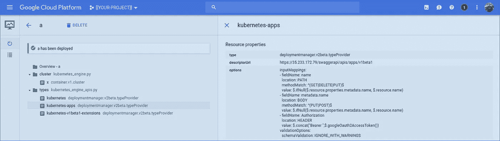

部署管理器类型:“kubernetes-apps”

然后，我们必须告诉部署管理器对该类型进行什么 API 调用。在这种情况下，如果您搜索部署的端点，您会发现它是:`/apis/apps/v1beta1/namespaces/{namespace}/deployment`，这就是我们在`deployment.py`的第 41 行中所调用的。

其次，我们需要确定向方法提供什么属性(主体)。这是在 Kubernetes API 中定义的。如果您查看上面提供的链接，您会看到`deployment.py`第 42–68 行反映了这个结构。

## 警告

当您删除创建 Kubernetes 资源的部署管理器部署时，并非所有的 Kubernetes 资源都会被删除。在上面的例子中，Kubernetes 服务将(！)被删除，但部署不会(！idspnonenote)被删除。)被删除。我觉得很奇怪。

如果您删除了创建 Kubernetes 集群的部署管理器部署，那么您当然会破坏所有东西(包括服务和部署)。

## 结论

部署经理可以供应 GCP 资源**和** Kubernetes 资源。而且，如果您想亲自尝试，也可以让它为您的 API 提供资源！

是的，你可能想坚持使用 Helm 或 Jsonnet 或 Terraform。但是，如果您想使用部署管理器，希望这个故事向您展示了它的用途可能比您想象的更多。

随时欢迎反馈。
就这些！

## 更新 180611:区域集群

感谢我的同事 Adam 帮助我完成这项工作，这里有一个简单的部署管理器模板来创建一个 Kubernetes 引擎区域集群:

> **NB** 诀窍是使用 v1beta1 类型，如第 12 行所示。

如果您更喜欢使用前面示例中的区域集群，只需在`generate_apis.yaml`中将`kubernetes_engine.py`替换为`kubernetes_engine_regional_cluster.py`(出现了两次)并更新您的部署。

## 更新 180611:添加入口

在`kubernetes_engine_apis.py`脚本中，有一个以前没有使用过的对`apis/extensions/v1beta`的引用。这个 API 包括入口资源，允许我们通过 GCP HTTP/S 负载均衡器公开服务。让我们将该配置添加到我们的 Kubernetes 部署中:

在第 8 行，我们为`Ingress`添加了对`apis/extensions/v1beta`的引用。第 71–88 行定义了入口。在第 82–85 行，我们引用了之前创建的服务，因为它为入口提供了后端。

当我们部署这个脚本时，我们会看到创建了一个入口:

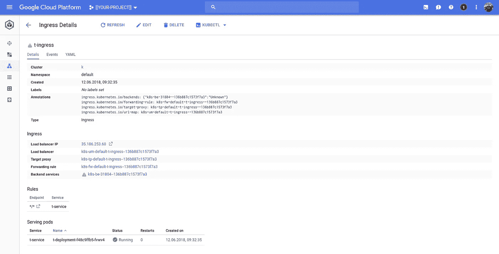

Kubernetes 引擎:入口细节

> 不清楚为什么它会在后端服务上报告警告，因为它看起来一切正常。或许有一些延迟？

下面是部署管理器部署的入口资源:

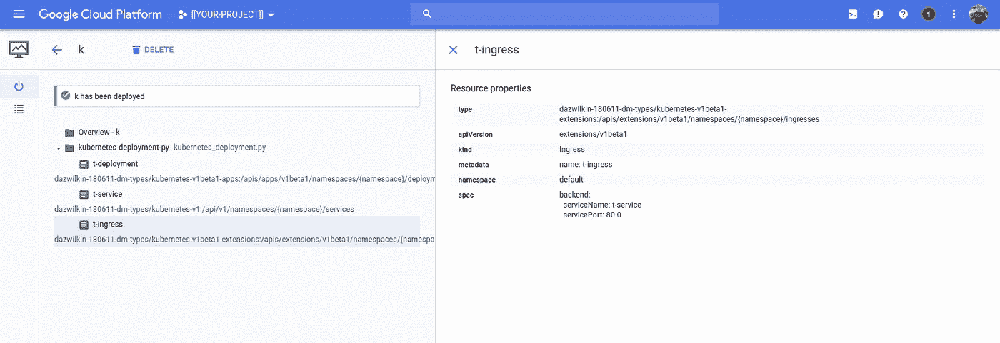

部署经理:Kubernetes 部署，带入口

这是云控制台网络服务负载平衡器，显示了 Kubernetes (Ingress)为我们提供的 HTTP/S 负载平衡器:

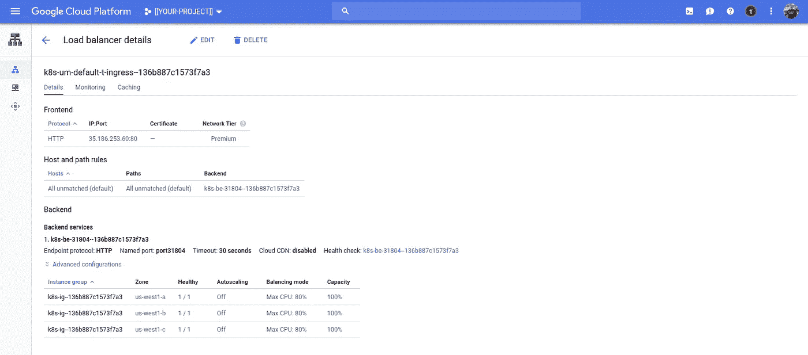

由入口提供的 HTTP/S 负载平衡器

获取 IP 地址后，我们可以浏览到它的端点并查看我们的 Nginx 部署:

