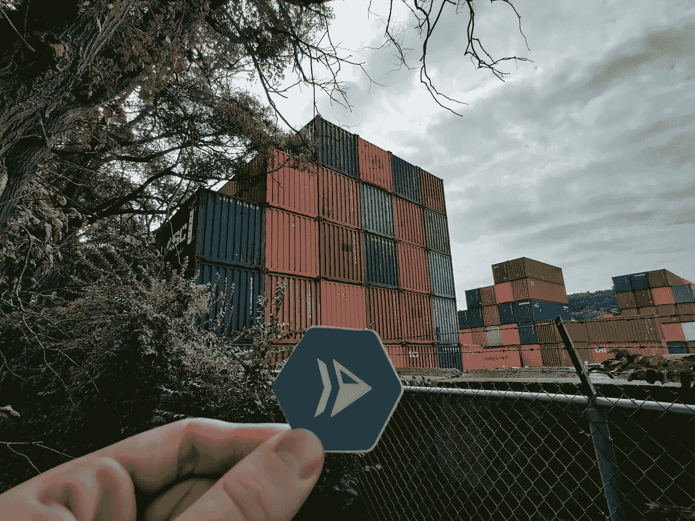

# 云函数 Buildpacks！

> 原文：<https://medium.com/google-cloud/cloud-function-buildpacks-ebba8e5e382?source=collection_archive---------2----------------------->



格兰特在一个**集装箱**堆场前拿着一张云运行贴纸

Google Cloud 的 Buildpacks 是一种创建安全的、生产就绪的容器映像**而无需 Dockerfile** 的简单方法。

它们是开源的，在生产中使用云功能和应用引擎。

在本文中，我将介绍如何使用**函数框架**在容器中构建一个**云函数**，这样您就可以在本地测试您的函数，或者在其他容器环境中托管您的代码(比如 Cloud Run)。

> 注意:云函数 CLI/API 在后台以这种方式[构建容器。](https://cloud.google.com/functions/docs/building)

## 1.下载 pack CLI

安装`pack` CLI [🔗](https://buildpacks.io/docs/tools/pack/#install):

```
brew install buildpacks/tap/pack
```

## 2.构建您的容器

用`pack build`构建当前目录:

> 这假设你的当前目录有云函数的源代码。如果你没有函数，这里有一个节点的[例子。](https://github.com/GoogleCloudPlatform/functions-framework-nodejs#quickstart-set-up-a-new-project)

```
pack build \
--builder gcr.io/buildpacks/builder:v1 \
--env GOOGLE_FUNCTION_SIGNATURE_TYPE=http \
--env GOOGLE_FUNCTION_TARGET=helloWorld \
 my-func
```

该命令将基于您的源代码(通过语言切换)检测必要的构建器，并使用 Ubuntu、公共系统库、您的应用程序依赖项和您的源代码构建您的容器。

函数使用以下配置构建环境变量:

*   `GOOGLE_FUNCTION_SIGNATURE_TYPE` : `http`、`event`或`cloudevent`
*   `GOOGLE_FUNCTION_TARGET`:函数名，如`helloWorld`

更多构建配置选项在 GitHub [这里](https://github.com/GoogleCloudPlatform/buildpacks#functions-framework-buildpacks)。

## 3.运行您的容器

构建完容器后(`my-func`，运行容器:

`docker run --rm -p 8080:8080 my-func`

Docker 将运行用函数框架和 Buildpacks 构建的容器。测试暴露端口 8080 上的容器:`localhost:8080`

> 这里的`--rm`标志在退出后清理容器。

# 感谢阅读！

如果你喜欢这篇文章，我强烈推荐你观看马特·索尔多的视频:

Google Cloud 上的构建包

并查看 GCP 构建包的源代码:

> [https://github.com/GoogleCloudPlatform/buildpacks](https://github.com/GoogleCloudPlatform/buildpacks)