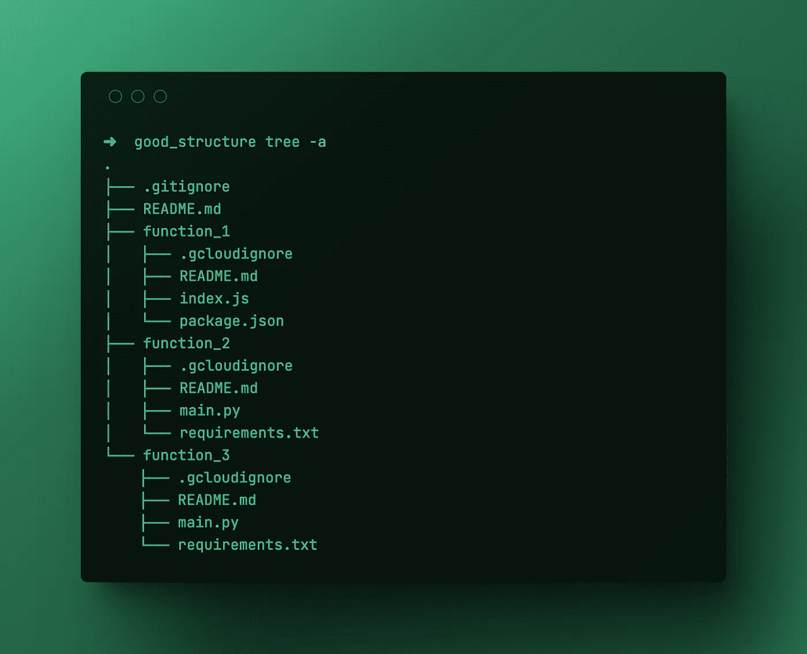
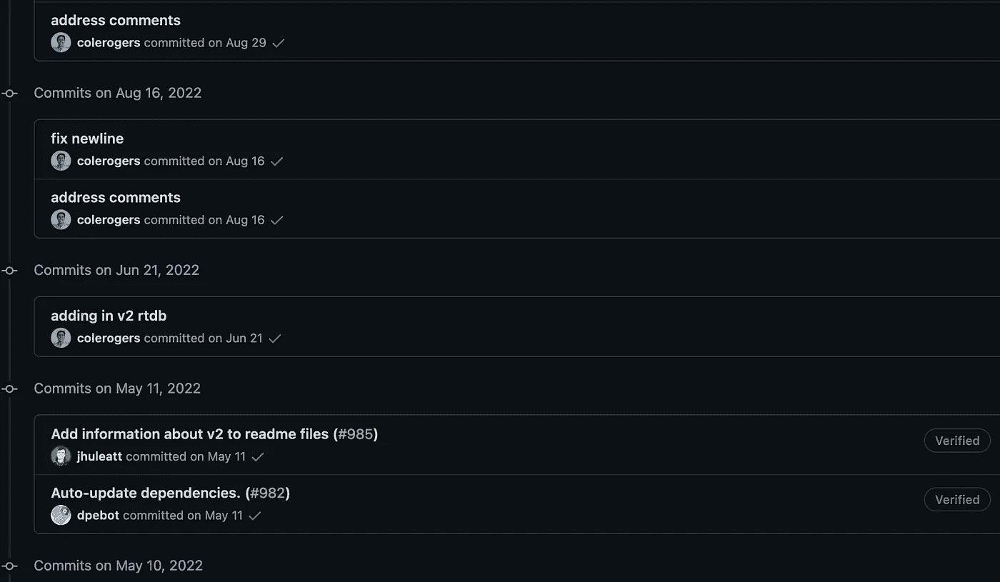
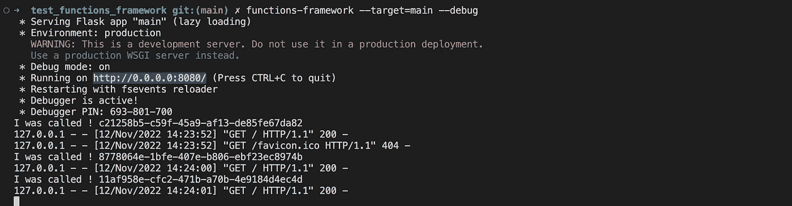

# 云功能最佳实践(1/4):准备好环境

> 原文：<https://medium.com/google-cloud/cloud-functions-best-practices-1-4-get-the-environment-ready-af666af89f62?source=collection_archive---------0----------------------->

高效构建、测试、重新测试和部署谷歌云功能

这篇文章是 4 篇文章系列的一部分，其中我给出了关于 Google 云功能开发的各种建议。这项工作是两年日常实践、部署和监测的结果。其中一些最佳实践直接来自官方文档，另一些来自我的经验，被证明是最有效的。对于任何不同的观点，请随意评论这篇(免费)文章。谢谢！

[云功能最佳实践(2/4):优化云功能](/google-cloud/cloud-functions-best-practices-2-4-optimize-the-cloud-functions-5874f9d8c8b5) > > >

[云功能最佳实践(3/4):保护云功能](https://beranger.medium.com/cloud-functions-best-practice-3-4-secure-the-cloud-functions-1c9642c4706) > > >

[云功能最佳实践(4/4):监控和记录执行](https://beranger.medium.com/cloud-functions-best-practice-4-4-monitor-and-log-the-executions-22222aa25f1b) > > >

# 准备好谷歌云功能环境


在线教程很酷，我的甚至超级酷！；)通过一堆文章，任何人都可以学习[如何在 Google Cloud Functions 中使用 Secret Manager](https://beranger.medium.com/native-implementation-of-google-secret-manager-in-cloud-functions-93a1732dd175)，[如何保护一个 Google Cloud Function](https://beranger.medium.com/secure-google-cloud-functions-with-api-gateway-848f687963ae) s，[如何对它们进行速率限制](https://beranger.medium.com/rate-limit-google-cloud-functions-with-api-gateway-19b54bb9d9e9)，如何使用云存储、Cloud Pub/Sub 以及每一个可能的工具。

但是，

它有一个很大的缺点教程是为一个单一的、简短的、特定的主题而制作的。

商业项目绝不是简短和具体的。

业务项目结合了多种云功能，使用各种需要尝试、测试和调试的工具，希望是高效的。

如何做到这一点在单功能教程中没有解释。

这就是我在第一篇文章中介绍的内容**准备好 Google Cloud Functions 环境**以支持多种云功能管理和高效测试&调试。

# 1 功能<> 1 文件夹& 1 功能<> 1 文件

在使用谷歌云功能几个月后，很容易陷入爱河并部署一打。

这些 GCF 将需要被部署，被推送到 Git，被记录并被其他用户使用。

拥有清晰高效的结构至关重要。

**结构不良**

我见过几次初学者的错误，就是把所有的 Google Cloud 函数放在同一个文件夹里，创建一个大的 README，然后把所有的东西都推给 Git。

其结构如下所示(python):


这个管用！这里没有什么不好，它适用于用相同语言编码的 1-2-3 云函数。

由于三个原因，这是有问题的，但是对于三个功能来说是可以接受的:

*   requirements.txt 将包含所有函数使用的包。如果 function_2 需要一个特定的包，function_1 和 function_3 也需要导入它。
*   `README.md`是 3 个功能的文档
*   在同一个文件夹中不可能有 nodejs、python 和 Go 函数

**良好的结构**

相反，我建议采用这种结构，它没有以前的缺点:

*   每个谷歌云功能使用一个文件夹
*   向每个文件夹添加 1 个`README.md`
*   每个谷歌云功能增加 1 个`requirements.txt`或任意一个`package.json`

不要忘记函数本身；)

**代码拆分**

我几次看到一个函数被分成几个文件，utils 文件，config 文件…显然是为了清楚。为什么不呢？但谷歌云功能是为特定任务和简短功能设计的。如果一段代码太长，需要分成多个文件，可能谷歌云功能不是合适的产品。

**gcloud 忽略**

如果我们采用前面的结构(我们应该这样做！)并使用命令行部署一个功能，我们会在 Google Cloud Functions 中看到一个`README.md`文件。我们不想那样。这是一个不需要部署的无用文件。

我们可以简单地在每个文件夹中添加一个`.gcloudignore`文件，这个文件包括文件本身和自述文件。

```
README.md
.gcloudignore
```

最终的结构看起来像这样:



通过这个简单的结构改变，我可以:

*   在同一个 Github 存储库中创建一个 js GCF 和一个 py GCF
*   为特定的功能提供不同的包
*   每个功能都有不同的自述文件

这个结构是 Google Cloud 在他们的 Google Cloud 函数样本 [Github 知识库](https://github.com/firebase/functions-samples)中提出的。他们甚至创建一个子文件夹来添加函数文件。老实说，我不知道他们为什么走了这么远😀

**最后但并非最不重要的→ Github**

一旦建立了这种结构，很容易就会像“更新图片链接”、“更新自述文件”那样简单地将更新推送到 github

这就是他们在 GCF 示例 Github repo 中所做的:



不

先前提议的结构混合了许多功能和许多项目，以这种方式提交并不能帮助团队了解当前的项目是什么。

我建议在每次 Github 提交中包含函数名，比如:“function_1:添加属性名”、“function_2:代码重构”…

这样，就更容易看到最近开发了什么，当前的项目…

—

希望看到你提交的改变，谷歌开发者；)

# 首先，不要使用谷歌云功能

在学习了关于 GCF 的教程之后，通常的反应是继续使用云函数环境本身进行开发，在每次更新之后进行部署。

这不是个好主意。

教程是共享一个干净的代码，经过多次测试。但是当普通的开发人员在编码时，他们期望在第一次迭代中有一个干净的代码能正常运行…老实说，从来没有过这种情况。

为每个代码变更部署一个 GCF 并不是一个好的实践，因为部署一个 GCF 需要时间，最多 2 分钟。加上测试时间，加上等待日志出现的时间，从更新到结果只需 5 分钟，这是巨大的！

一个好的开发人员总是会忘记一个[或一个”或一张支票。没有什么比等待几分钟后出现“键值错误”更令人沮丧的了。

部署必须只在 GCF 准备部署的最后使用。当所有东西都在本地测试过之后。

当我开始一个云功能的新项目时，我总是打开一个 Jupyter 笔记本，编写所有代码，构建我的代码，进行所有必要的测试和检查。

一旦 a 可以在单个笔记本单元格中执行我的全部代码…

现在还不是部署的时候…

是时候…

# 其次，使用功能框架

代码很干净，是时候运行函数了。但在部署之前，谷歌提供了一个模拟器，用于在本地运行该功能。

Functions-framework 是一个启动本地开发服务器进行快速测试的框架。

与本地代码的区别在于，它模拟云功能服务器并响应事件。

当 functions-framework 命令运行时，它模拟服务器并给出一个本地地址来调用函数。

让我解释一下 python GCF 的过程:

*   首先，在 GCF 存储库中，安装 functions_framework:

```
pip install functions-framework
```

*   其次，创建一个文件夹`test_functions_framework`并包含我们之前讨论过的所有文件，该文件夹现在的结构如下:

```
.
├── .gcloudignore
├── README.md
├── main.py
└── requirements.txt
```

*   在`requirements.txt`中，添加这一行:

```
flask
```

*   在`main.py`中添加这个简单的代码:

```
from flask import Response
import uuid

def main(request):

    try:

        print("I was called !", uuid.uuid4())

        return Response(response = 'ok', status = 200)

    except Exception as e:
        print("ERROR ", e)
        return Response(response = 'AN ERROR OCCURED', status = 400)
```

*   在`test_functions_framework`文件夹中，我们可以用这个命令运行 functions-framework:

```
functions-framework --target=main --debug
```

*   它给了我们一个本地主机地址，我们只需 ping，它直接给出所有日志和结果，就好像它是在线部署的一样。



一切都准备好部署了！

# 崩溃的最后一个原因

该功能是干净的，经过测试，工作几乎完成，但仍有可能在部署后崩溃。

因为认证。

您的功能有可能与 Google Cloud 的实体(Secret Manager、Pub/Sub、big query……)进行交互

在开发过程中，您可能使用服务帐户或您自己的凭证来访问这些服务。

但是一旦部署，云功能就不一样了。

有两种可能性:

在部署期间，您可以指定函数必须使用的服务帐户

否则，云功能将使用默认服务帐户作为其执行功能的身份:

*   云功能(第一代)使用 App Engine 默认服务账号`PROJECT_ID@appspot.gserviceaccount.com`。
*   云功能(第二代)使用默认计算服务帐户`PROJECT_NUMBERcompute@developer.gserviceaccount.com`。

请确保这些服务帐户能够访问该功能所需的资源。

现在，函数没有崩溃的理由。如果它崩溃了，留下评论，告诉我原因。

你已经准备好了，学徒！

# 最后，部署！使用命令行！

我会说+80%的关于谷歌云功能的教程都解释了如何使用 UI 部署一个实例。

它工作了。

但如果你做到了这一点，你现在正在掌握谷歌云功能，你没有时间点击 3-4 个按钮，等待 UI 加载和功能部署。

此外，如果您仔细阅读了第一部分，那么您的代码结构良好，并且您已经准备好使用命令行进行部署。

> *“学习德语和手动部署功能的时间太短了。”曾经说过一个* [*的伟人*](https://www.linkedin.com/in/beranger-natanelic/)

花 5 分钟时间安装 [gcloud SDK](https://cloud.google.com/sdk/docs/install) 并从终端运行部署命令。

这将需要 2 分钟部署，同时你可以拍 50 次这篇文章；)

不要忘记在运行 deploy 命令之前保存您的代码！；)

**为 http 函数部署触发函数(python)**

```
gcloud functions deploy your-function  --region=us-central1  --entry-point main --runtime python310 --trigger-http --no-allow-unauthenticated
```

**部署发布/订阅触发的功能(超时较长的节点)**

```
gcloud functions deploy your-function  --runtime nodejs14 --memory=128MB --timeout=200s --region=europe-west2 --trigger-topic=your-function
```

要了解更多信息，请查看[部署文档](https://cloud.google.com/sdk/gcloud/reference/functions/deploy)

另一个很好的技巧是从源代码库自动化部署，每次你推送到 GitHub，功能就部署在云功能上。

Bon…我不太喜欢它，因为它意味着将一个未经现场测试的代码推送到 Github。

下一部分:

[云功能最佳实践(2/4):优化云功能](/google-cloud/cloud-functions-best-practices-2-4-optimize-the-cloud-functions-5874f9d8c8b5) > > >

[云功能最佳实践(3/4):保护云功能](https://beranger.medium.com/cloud-functions-best-practice-3-4-secure-the-cloud-functions-1c9642c4706) > > >

[云功能最佳实践(4/4):监控和记录执行情况](https://beranger.medium.com/cloud-functions-best-practice-4-4-monitor-and-log-the-executions-22222aa25f1b) > > >

谢谢你的阅读，谢谢你为我鼓掌，谢谢你关注我！

别忘了要牛逼。