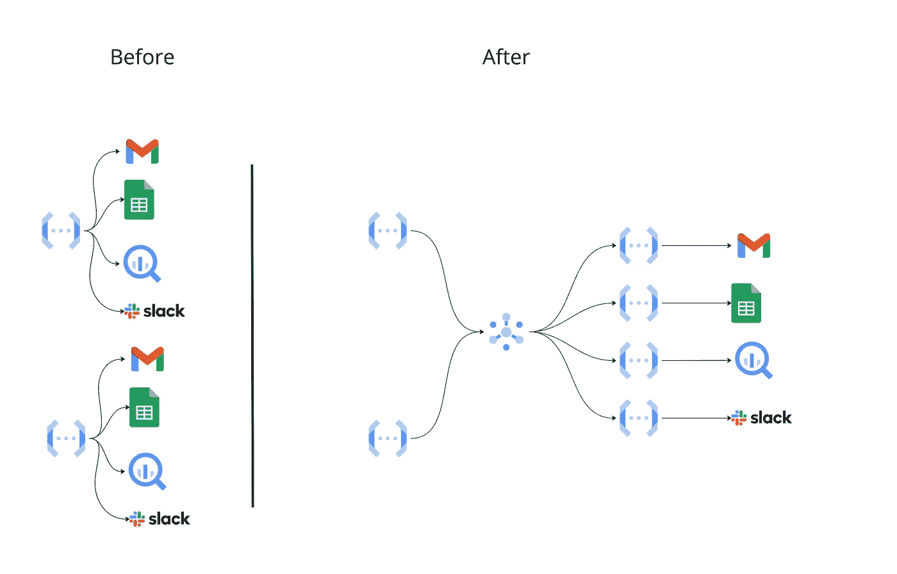
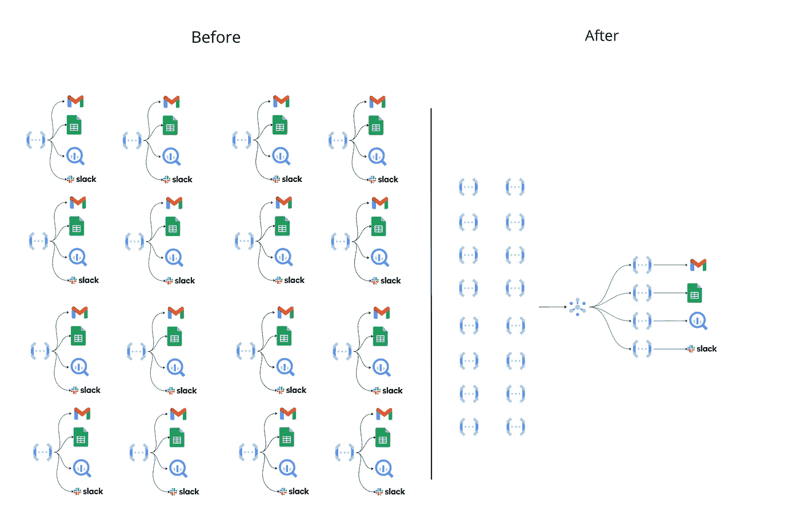

# 云功能最佳实践(2/4):优化云功能

> 原文：<https://medium.com/google-cloud/cloud-functions-best-practices-2-4-optimize-the-cloud-functions-5874f9d8c8b5?source=collection_archive---------0----------------------->

编码，调用，完美地构造你的函数代码

这篇文章是 4 篇文章系列的一部分，其中我给出了关于 Google 云功能开发的各种建议。这项工作是两年日常实践、部署和监测的结果。其中一些最佳实践直接来自官方文档，另一些来自我的经验，被证明是最有效的。对于任何不同的观点，请随意评论这篇(免费)文章。谢谢！

<<< [云功能最佳实践(1/4):准备好环境](https://beranger.medium.com/cloud-functions-best-practices-1-4-get-the-environment-ready-af666af89f62)

[云功能最佳实践(3/4):保护云功能](https://beranger.medium.com/cloud-functions-best-practice-3-4-secure-the-cloud-functions-1c9642c4706) > > >

[云功能最佳实践(4/4):监控和记录执行](https://beranger.medium.com/cloud-functions-best-practice-4-4-monitor-and-log-the-executions-22222aa25f1b) > > >

# 优化云功能


罕见的野生云函数图像

在线教程很酷，我的甚至超级酷！；)通过一堆文章，任何人都可以学习[如何在 Google Cloud Functions 中使用 Secret Manager](https://beranger.medium.com/native-implementation-of-google-secret-manager-in-cloud-functions-93a1732dd175)，[如何保护一个 Google Cloud Function](https://beranger.medium.com/secure-google-cloud-functions-with-api-gateway-848f687963ae) s，[如何对它们进行速率限制](https://beranger.medium.com/rate-limit-google-cloud-functions-with-api-gateway-19b54bb9d9e9)，如何使用云存储、Cloud Pub/Sub 以及每一个可能的工具。

但是，

它有一个很大的缺点教程是为一个单一的、简短的、特定的主题而制作的。

商业项目绝不是简短和具体的。

业务项目结合了多种云功能，使用各种需要尝试、测试和调试的工具，希望是高效的。

如何做到这一点在单功能教程中没有解释。

这就是我在第二篇文章中讨论的优化函数代码，以支持多云函数管理、快速调用、安全部署和高效测试与调试。

# 分割和委派

在谷歌云功能使用几个月后，功能之间可能会有一些复制粘贴:向 Slack 发送消息，[使用 Gmail 发送电子邮件，](https://www.google.com/url?sa=t&rct=j&q=&esrc=s&source=web&cd=&cad=rja&uact=8&ved=2ahUKEwjD1tSUvKv7AhXZSfEDHRELA8QQFnoECCEQAQ&url=https%3A%2F%2Fpython.plainenglish.io%2Fhow-to-read-write-label-mails-from-gmail-with-python-9695f288f685&usg=AOvVaw3d7ADldB1wEKfPWLalSj1B)[使用谷歌表单，](https://www.google.com/url?sa=t&rct=j&q=&esrc=s&source=web&cd=&cad=rja&uact=8&ved=2ahUKEwjoo5iMvKv7AhWMQvEDHUfpBQ0QFnoECA4QAQ&url=https%3A%2F%2Fpython.plainenglish.io%2Fmaster-google-sheets-api-in-python-cheat-sheet-3535e86fbe17&usg=AOvVaw1ILJzWO7_TNqX9f9DpucUi)，登录 BigQuery 以及更多的用例。

如果 Slack 更新了他们的 API 会怎么样？如果一个新的参数被用于一堆 Google 云函数的 API 所要求，那该怎么办？

这将是地狱，以更新他们所有人，重新部署和重新测试他们。

我强烈推荐为特定任务创建通用函数。

架构变化如下:



我同意…从这个角度来看，创建、部署和监控云功能会更加复杂。

但是这里的要点是为每个使用的 API 创建一个特定的通用函数，如果这个 API 在将来可能被重用的话。

那条路怎么样？>>>



想象一下…你要改变左边配置的一个 API 的 1 个小参数…祝你好运！:D

右边的建筑有**很多优点**:

*   代码不会重复，便于任何更新、维护和测试(有点枯燥)
*   函数执行更少的任务，更少的崩溃原因，便于调试，1 个函数，1 个任务
*   不再需要将 slack、gmail 和多个包导入一个功能中
*   因为不需要导入，[冷启动时间和执行时间更快了](https://beranger.medium.com/reduce-cold-start-and-execution-time-of-google-cloud-functions-9830280962ff)，CPU 使用率也降低了
*   通过发布/订阅将一个通用云功能链接到另一个云功能是小菜一碟(3 行)，如果您想添加一个 Slack 通知程序或 Gmail 发送程序，几乎不需要测试…

> *但是，我该怎么做呢？*

首先，创建一个通用的云函数(在这个例子中是一个 Slack publisher):

```
from slack import WebClient
import base64
import json
# ...

def slack_connection():
    try:
        client = WebClient(token=SLACK_TOKEN)

    except Exception as e:
        print('End-Slack Error', e)
        return

    return client

def main(event, context):

  event_data = base64.b64decode(event['data']).decode('utf-8')
  req = json.loads(event_data)

  text, channel = req.get('text', ''), req.get('channel', '')

  #
  # Send message to slack...
  #

  return 1
```

并将其部署为后台功能:

```
gcloud functions deploy generic_slack --region=europe-west2 --entry-point mail --runtime python310 --trigger-topic='generic_slack'
```

现在，我们有一个云函数，带一个文本和一个频道属性，发布到 Slack。

将它作为后台功能可以保护它不被任何人访问。

然后，在**任何**云函数中，我们只需要添加这些行:

```
from google.cloud import pubsub_v1
import json

TOPIC_SLACK = 'projects/YOUR-PROJECT/topics/generic_slack'

publisher = pubsub_v1.PublisherClient()

def publish_slack(text):

    body = {
        "text": text,
        "channel": "#random"
    }

    publisher.publish(TOPIC_SLACK, json.dumps(body).encode('utf-8'))

#
# ... inside the main function
#
publish_slack("Hello, I'm generic, light, efficient and easy to send!")
```

在这个代码片段的开始，我们导入 PubSub，创建一个通用函数(通用云函数的),然后用我们的自定义文本调用这个函数。

你想添加用户名或自定义表情符号吗？

没有比这更简单的了，我们只需要回到我们的 Slack Cloud 函数，更新代码和输入，我们就可以开始了！:)

# 智能缓存

云函数是无状态的，这也是我们喜欢它的原因！

这意味着在两次调用之间，没有共享任何东西:全局变量、内存、文件系统或其他状态。

…

什么都没有？

…

嗯，启动一个新函数会加载很多东西:运行时、包、你的代码。

这被称为功能实例。

这种加载需要几秒钟的时间，称为“冷启动”，这是预热功能所需的时间。

这个函数实例不会在函数完成后马上消失。它将在云中“保持温暖”一会儿(如果幸运的话，在 5-15 分钟之间)，供将来的调用重用。

这种魔力允许两件事:

*   减少冷启动，因为功能已经设置好了(见我以前的文章[减少谷歌云功能的冷启动和执行时间](https://beranger.medium.com/reduce-cold-start-and-execution-time-of-google-cloud-functions-9830280962ff)
*   重用全局变量。全局变量可以在全局范围内实例化在任何函数之外，在文件的最开始。它的值可以在后续调用中重用，而不必重新计算。

使用全局作用域将缓存来自繁重计算过程和导入的值，这对于数据库连接特别有用，因此函数不必在每次调用时都进行连接。

具体来说，最好将缓存用于以下目的:

*   访问 Google APIs(比如 Pub/Sub、Secret Manager、big query……)

```
from google.cloud import pubsub_v1

publisher = pubsub_v1.PublisherClient() # Publisher client is outside the main function to be reusable

def main(request):
	# ... Your function code
	publisher.publish(TOPIC, json.dumps(payload).encode('utf-8'))
	# ...
```

*   数据库连接
*   包导入

缓存的好与不好之间可能有几秒钟的差别。

# 做一个懒惰的进口商

成为一个懒惰的进口商将减少冷启动时间。

一般概念是只导入将在云功能执行期间使用的包。

意思是…在主函数中导入包*。*

这不是一个常见的模式，坦率地说，它是丑陋的。一个好的技术领导者会拒绝这种进口的公关，但出于性能原因，这很酷！

Lazy import 回答了这个问题:为什么要导入可能用不到的包？

软件包和依赖项是 GCF 冷启动性能的[头号贡献者](/@duhroach/improving-cloud-function-cold-start-time-2eb6f5700f6)。

我们应该最大限度地避免它们，更重要的是，如果不经常使用，在全局范围内避免它们。

首先，只有被使用的依赖项必须被导入= >如果有一个依赖项使用的特定函数，导入这个非常特定的函数。

其次，如果依赖项被用于一些特定的路径，它们应该被导入到这些路径的**中。这不是标准做法，但它可以节省谷歌云功能冷启动的宝贵时间。**

我想说，如果一个包在不到 75%的情况下被使用，那么惰性导入是有意义的。

例如，如果一家银行希望在取款超过 1000 欧元后通知客户，这并不常见，云函数可能不需要在每次调用时都通知客户，可能有 10%的情况，下面的代码很有意义:

# 不要创建或删除文件

我们之前看到了函数实例可以被回收。全局变量，包可以在调用之间保持。

文件也是如此！

创建到 Google Cloud 函数中的文件会消耗该函数可用的内存。这种记忆不是无限的(像星球的资源呵呵)。

在云函数中创建许多文件可能会导致内存不足错误和后续的冷启动链接。

实际上，创建一个文件到一个云函数中并没有太多的理由…除了一个 API 提供者强加的*离奇*案例。

在创建之后或函数结束之前删除文件。

谷歌云存储是为了文件相关的情况，可以处理文件创建，文件传输，文件转换。请参见下面的示例:

```
from google.cloud import storage
import pandas as pd

# Create storage client
client = storage.Client()

bucket = client.get_bucket("any_bucket_name")

final_df = # any pandas df

blob = storage.Blob("file_name.csv", bucket)

blob.upload_from_string(final_df.to_csv(header=False), 'text/csv')
```

这样，csv 文件将直接在云存储空间中创建！

# 使用最小和最大实例

我将在 2021 年中期引入一个特性，继续这篇最佳实践文章。

最小实例和最大实例。

## 最小实例

我想这个特性很简单，即使暂时没有请求，它也能让 X 实例保持温暖。

这样，如果 min-instances 设置为> 0，就不再有冷启动！

然而，我要补充几点说明:

*   最小实例保持 X 个实例预热，X 是在 UI 中填充或使用`-min-instances` gcloud 标志的实例数，这意味着，如果同时调用超过 X 个函数，额外的 n 个函数将需要预热，仍然会有一些冷启动。
*   这种行为没有硬性的保证。在官方文件中，他们声明:`Cloud Functions **attempts** to keep function instances idle for an unspecified amount of time after handling a request.`
*   在部署和崩溃之后，仍然会有冷启动

这个特性是有代价的。这几乎就像支付一个 24/7 运行的云功能的价格(100%的 GB 秒价格)。[见定价](https://cloud.google.com/functions/pricing)。对于低内存的云函数，它很便宜，但是如果函数需要大量内存，可能存在更便宜的解决方案。

我强烈建议为面向用户的函数设置一个最小实例值。

## 最大实例数

Max instances 不同于它的兄弟，它与冷启动无关。

Max instances 用于控制谷歌云功能的缩放行为。

尽管这个概念听起来很简单，我还是要补充一些见解:

*   Max instances 的目标是保护云功能。通过设置这一限制，开发人员可以确保运行的云功能不会超过该限制(在流量峰值的情况下，可能会稍微超过该限制)。
*   每个云功能必备… **每个云功能必备**！在没有限制的情况下，一个云函数可以在几秒钟内扩展到 1 000 个实例，如果这个函数运行几个小时，就要花掉一大笔钱。**设定一个值**，即使很大。
*   更重要的是，通过 HTTPs(防止 DDoS 攻击)可以从任何地方访问云功能
*   对于访问 API 的云函数来说,**甚至比**更重要。原因有二:首先，云函数使用的外部 API 键如果超出了自身的限制，就会被阻塞。第二，如果这个功能是访问一个昂贵的服务，像 Twilio 这样的短信发送器…妈妈咪呀你**搞砸了**这个工作！还要考虑[速率限制你的谷歌云功能](https://www.google.com/url?sa=t&rct=j&q=&esrc=s&source=web&cd=&cad=rja&uact=8&ved=2ahUKEwiGzLGtvb_7AhXiQeUKHfrIATgQFnoECCQQAQ&url=https%3A%2F%2Fberanger.medium.com%2Frate-limit-google-cloud-functions-with-api-gateway-19b54bb9d9e9&usg=AOvVaw3x3Htly_GVArlQLFLnZUQ2)。

设置 max-instances 后，将出现错误“ ***POST 429 […]请求被中止，因为没有可用的实例*** ”。

这个问题是因为云函数收到的请求比可用实例多。

一个实例一次只能处理一个请求，同时请求的数量不应超过 max-instances 值。

如果有，哼，请求将在一个舒适的鞋盒中保温 30 秒，等待一个可用的实例。

如果没有可用的实例，请求将会失败。

哈！

那又怎样？

错误 ***POST 429 […]请求被中止，因为没有可用的实例*** 有 3 个紧急解决方案(灵感来自 Guillaume Blaquiere 在 [Stackoverflow](https://stackoverflow.com/questions/69495018/the-request-was-aborted-because-there-was-no-available-instance-google-cloud) 上的回答):

*   增加最大实例值
*   启用云函数[重试](https://cloud.google.com/functions/docs/bestpractices/retries#enabling_and_disabling_retries)，也可以使用发布/订阅订阅，这提供了进行指数级重试的能力，并提供了很好的调优
*   使用接受并行处理的产品，如云运行

请记住，缩放可能需要时间，此错误可能会在放大时出现。

要了解有关该器件的更多信息:

[https://cloud . Google . com/functions/docs/configuring/min-instances](https://cloud.google.com/functions/docs/configuring/min-instances)

[https://cloud . Google . com/functions/docs/configuring/max-instances](https://cloud.google.com/functions/docs/configuring/max-instances)

# 使用本机机密管理器实现

如果我们有多个函数共享的变量呢？

如果这些变量像凭证一样敏感呢？

如果我们必须更改一个在许多云函数中使用的变量/API 键/ID，该怎么办？

如果你使用环境变量来存储秘密:这是一个非常糟糕的做法，请继续阅读

Google Cloud 提出了一项名为 Secret Manager 的服务。

Google Secret Manager 是一个全面管理的、集中的、安全的、方便的存储系统，用于存储秘密和任何种类的密钥。

在 Secret Manager 中更改一个秘密将会在任何地方更改它。更重要的是，可以控制访问，并且可以独立管理访问权限。

出于许多原因，使用 Secret Manager 的本机实现应该是首选，但出于许多原因，我不想在这里重复自己，因此出于许多原因，我将您重定向到以前的一篇文章，从可用性、性能和安全性方面进行比较:

[](https://beranger.medium.com/native-implementation-of-google-secret-manager-in-cloud-functions-93a1732dd175) [## Google Secret Manager 在云函数中的原生实现

### 你应该使用全新的实现吗？比较了 3 种方法:可用性、安全性、性能…

beranger.medium.com](https://beranger.medium.com/native-implementation-of-google-secret-manager-in-cloud-functions-93a1732dd175) 

# 再见

我希望这篇文章能让您的云功能开发更上一层楼。

前一部分:

<<< [云功能最佳实践(1/4):准备好环境](https://beranger.medium.com/cloud-functions-best-practices-1-4-get-the-environment-ready-af666af89f62)

下一部分:

[云功能最佳实践(3/4):保护云功能](https://beranger.medium.com/cloud-functions-best-practice-3-4-secure-the-cloud-functions-1c9642c4706) > > >

[云功能最佳实践(4/4):监控和记录执行](https://beranger.medium.com/cloud-functions-best-practice-4-4-monitor-and-log-the-executions-22222aa25f1b) > > >

谢谢你的 15 次鼓掌！