# 云函数普罗米修斯出口商

> 原文：<https://medium.com/google-cloud/cloud-functions-prometheus-exporter-545111b8a8a5?source=collection_archive---------0----------------------->

周末，我启动了我的[光子](https://www.particle.io/products/hardware/photon-wifi-dev-kit)，并回忆起一篇旧的[帖子](/@DazWilkin/publishing-photon-events-to-telegraf-and-monitoring-them-with-grafana-b6fc45610a77)，其中我使用 [Telegraf](https://www.influxdata.com/time-series-platform/telegraf/) Webhook 端点记录光子，以捕捉使用 [Grafana](https://grafana.com/) 显示的数据。

这一次，我认为使用 [Google Cloud Functions](https://cloud.google.com/functions/) 作为 [Prometheus](https://prometheus.io/) Exporter 会很有趣(尽管我不完全确定这是一个有效的|好的用例),它会定期询问光子并使用它们的变量作为度量。

我现在要用一些赏心悦目的东西来逗弄这篇文章的其余部分，明天再充实它。随着 Promises 代码变得粗糙，我会重视某人对 JavaScript 的评论，并且我能感觉到有更好的方法来重构它。

## 带传感器的照片

这是一张带有 [Adfruit Si7021](https://www.adafruit.com/product/3251) 温湿度传感器的光子照片:

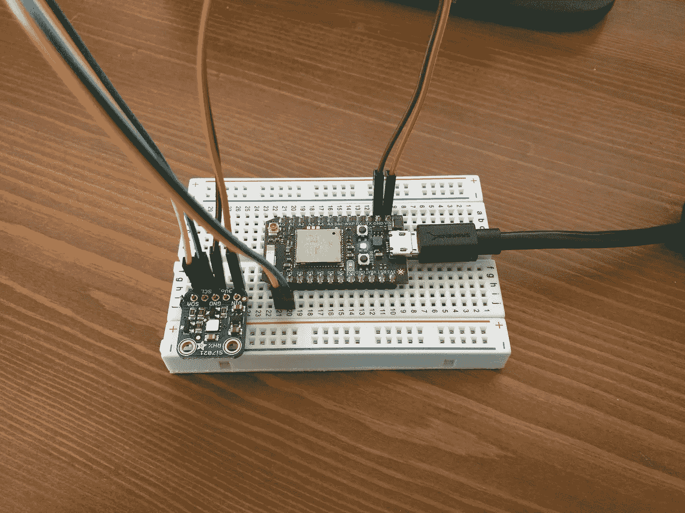

这是光子的代码:

## 格拉夫纳

运行在一个容器中，自动神奇地查询普罗米修斯目标。上面的图表示温度，下面的图表示湿度。我有 3 个光子，每个光子都有一个温度-湿度传感器，并分别以“t”和“h”报告读数。

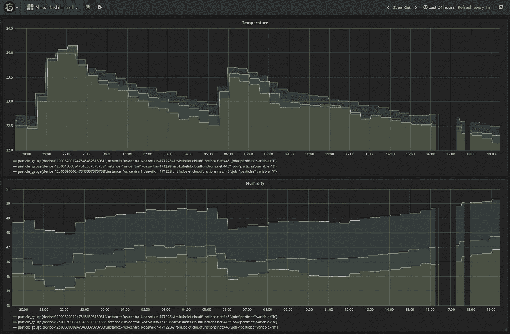

运行 Grafana 时使用:

```
docker run \
--detach \
--publish=3000:3000 \
grafana/grafana
```

然后通过 [http://localhost:3000](http://localhost:3000) 访问。默认用户名/密码是 admin/admin。曾经(！)Prometheus 正在运行，点击“添加数据源”并完成如下表格:

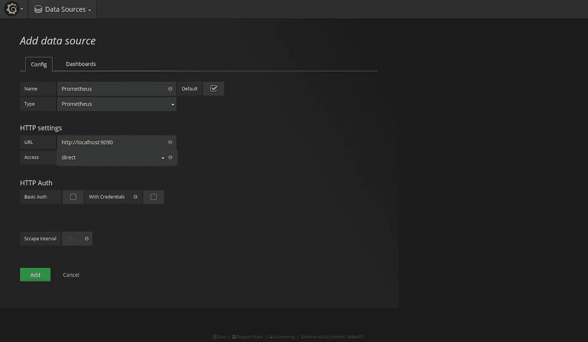

为普罗米修斯配置的 Grafana

当您单击“添加”时，您应该会看到:

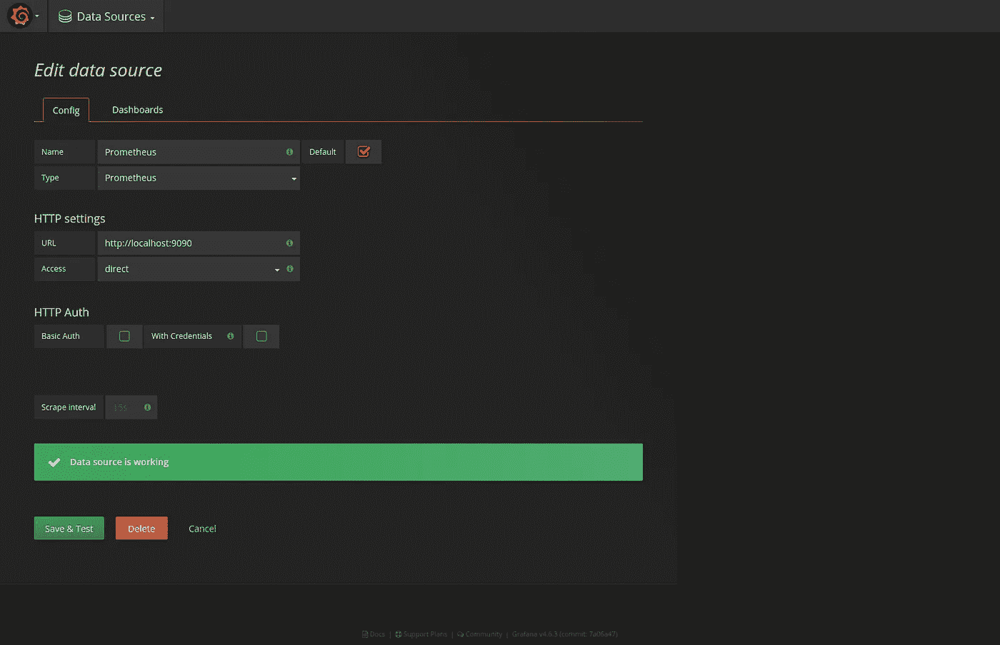

成功！

点击“仪表板”，然后点击“普罗米修斯状态”旁边的“导入”

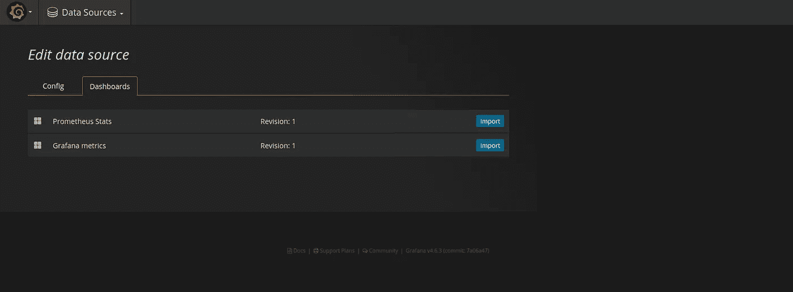

然后返回“主页”并选择“普罗米修斯统计”

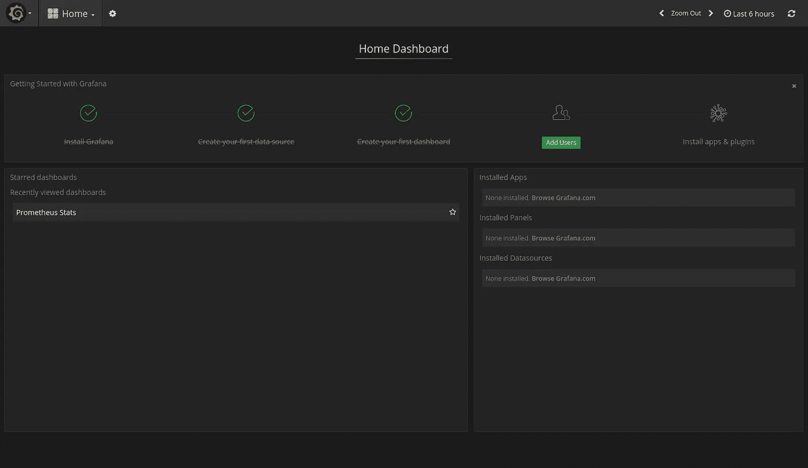

您应该会看到:

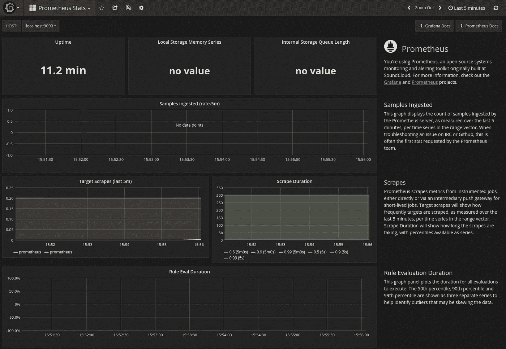

Grafana w/“普罗米修斯统计”仪表板

我们稍后将返回到 Grafana 来显示粒子(光子)度量。

## 普罗米修斯

运行在一个容器中，并配置为监控自身和云功能。在这里，这些指标由 particle_gauge 过滤，并且只报告“t”(= =温度)值。

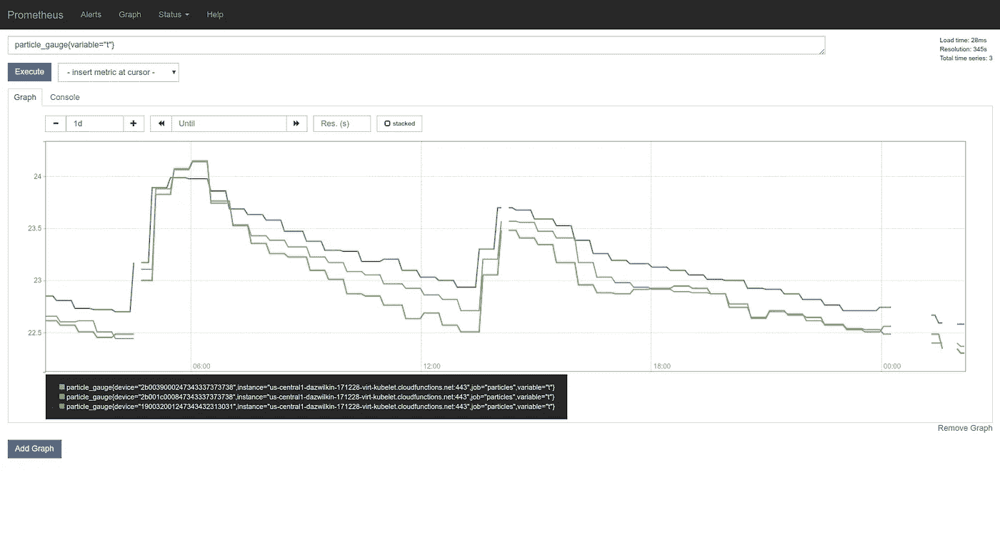

普罗米修斯:图表

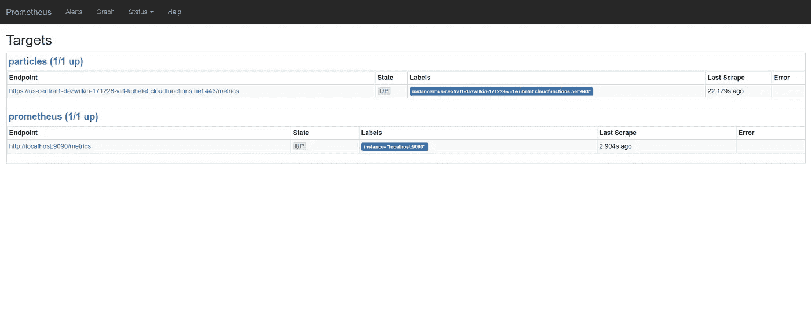

普罗米修斯:目标

这是普罗米修斯的配置。它在本地主机上监控自身，并通过通用端点(无“/指标”)监控云功能，正如其假设的那样(惯例):

运行 Prometheus，假设 prometheus.yml 在当前的($PWD)目录中，使用:

```
docker run \
--net=host \
--publish=9090:9090 \
--volume=$PWD/prometheus.yml:/etc/prometheus/prometheus.yml prom/prometheus
```

“net=host”允许 Prometheus 运行时将自己称为主机的本地主机。容器的端口似乎在主机的网络上。这允许您在运行 Prometheus 容器后从主机执行以下操作，以便访问 Prometheus 自己的指标:

```
curl --silent --request GET http://localhost:9090/metrics
```

## 云函数

下面是令人难以置信的 JavaScript 代码，它将[谷歌运行时配置](https://cloud.google.com/deployment-manager/runtime-configurator/)、[粒子的 JavaScript API](https://www.npmjs.com/package/particle-api-js) 和[普罗米修斯的 Node.js SDK](https://www.npmjs.com/package/prom-client) 结合成一个云函数:

package.json:

index.js:

[Google Runtime Configurator](https://cloud.google.com/deployment-manager/runtime-configurator/)是[Google Deployment Manager](https://cloud.google.com/deployment-manager/)的一个特性，但它对云功能非常有用，因为它提供了一种提取配置数据的方法。在此示例中，运行时配置器“config”用于保存 particle.io 的用户名和密码凭证:

```
PROJECT=[[YOUR-PROJECT-ID]]
USERNAME=[[YOUR-PARTICLE-USERNAME]]
PASSWORD=[[YOUR-PARTICLE-PASSWORD]]CONFIG=particlegcloud services enable runtimeconfig.googleapis.com \
--project=${PROJECT}gcloud beta runtime-config configs create ${CONFIG} \
--project=${PROJECT}gcloud beta runtime-config configs variables \
set username ${USERNAME} \
--is-text \
--config-name=${CONFIG} \
--project=${PROJECT}gcloud beta runtime-config configs variables \
set password ${PASSWORD} \
--is-text \
--config-name=${CONFIG} \
--project=${PROJECT}
```

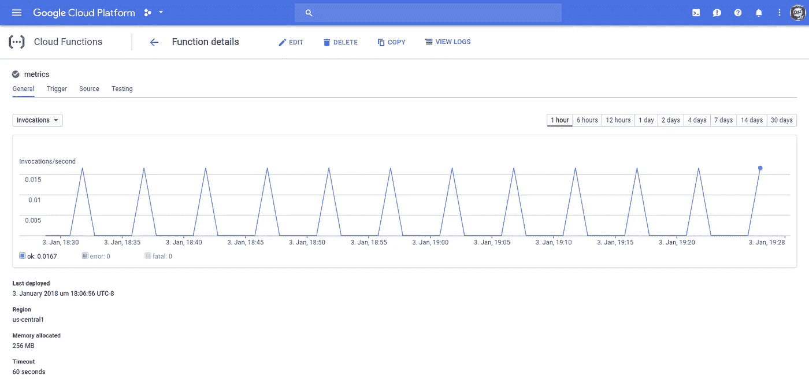

云功能:“指标”

云函数(s 函数！？)可与以下设备一起部署:

```
gcloud beta functions deploy metrics \
--local-path=. \
--trigger-http \
--entry-point=metrics \
--project=${PROJECT}
```

> **NB** 有一个(未|新)记录在案的特性，它允许直接从本地文件系统进行部署，而不像我在这里所做的那样通过一个暂存桶。

一旦部署了代码，如果您的粒子设备在线且可访问，您应该能够获得您的云函数(/metrics)端点:

```
curl --silent --request GET [https://us-central1-${PROJECT}.cloudfunctions.net/metrics](https://us-central1-dazwilkin-171228-virt-kubelet.cloudfunctions.net/metrics)
```

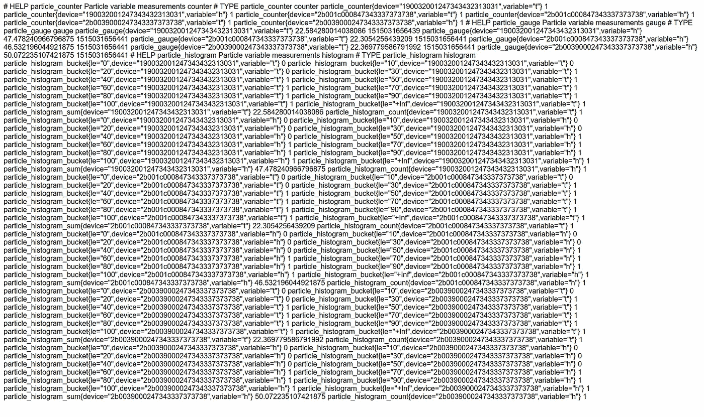

/指标

## 集装箱建造商

正如最近[所展示的](/google-cloud/triggering-cloud-functions-deployments-97691f9b5416)，使用 [Google Container Builder](https://cloud.google.com/container-builder/) 部署云功能是微不足道的。这最好与您的首选源代码库(我主要使用[Google Cloud Source Repositories](https://cloud.google.com/source-repositories/)【CSR】，因为我是一个优秀的谷歌人，因为 CSR 工作得非常好，因为我的代码最接近运行时托管)结合起来，并使用[构建触发器](https://cloud.google.com/container-builder/docs/running-builds/automate-builds)来自动化部署流程。

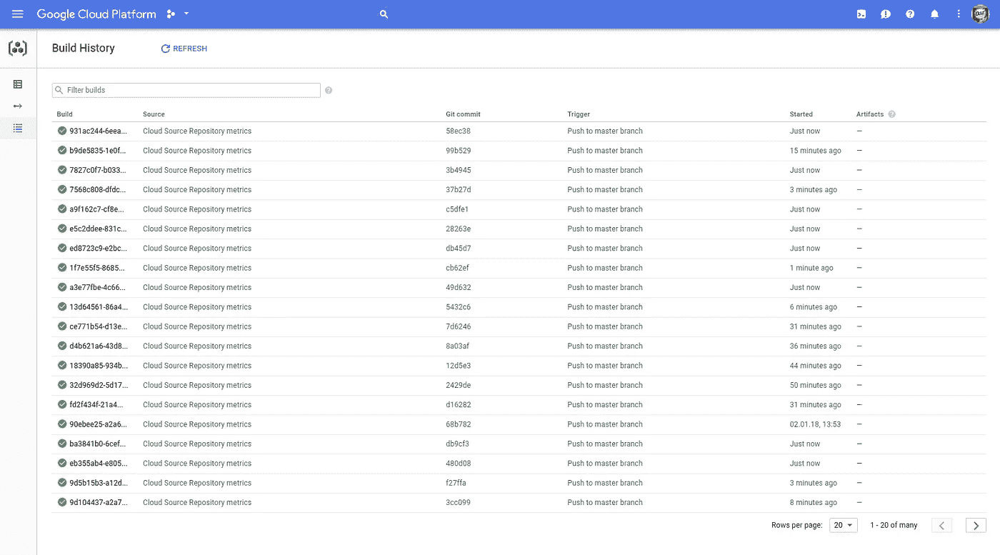

承诺是曲折的！

如果你希望使用这种方法，请查看我的另一篇[帖子](/google-cloud/triggering-cloud-functions-deployments-97691f9b5416)了解详情。下面是 cloudbuild.yaml 的一个模板:

```
steps:
- name: gcr.io/cloud-builders/gcloud
  args: [
      'beta',
      'functions',
      'deploy','metrics',
      '--source=[https://source.developers.google.com/projects/${PROJECT_ID}/repos/{REPO}/moveable-aliases/master/paths/'](https://source.developers.google.com/projects/${PROJECT_ID}/repos/metrics/moveable-aliases/master/paths/'),
      '--trigger-http',
      '--entry-point=metrics',
      '--project=${PROJECT_ID}'
  ]
```

## 粒子控制台

Particle 公司的人对他们的解决方案做得非常好。在探索了各种设备和解决方案之后，Particle 是最容易理解/使用且功能强大的设备之一。[如果他们中的任何人正在阅读这篇文章，那将很高兴看到一些直接指向[谷歌云物联网](https://cloud.google.com/solutions/iot/)的东西；-)]

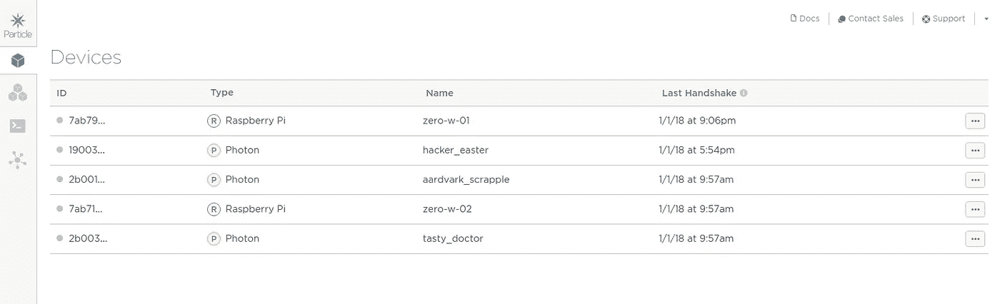

## 格拉夫纳重访

一旦云函数向 Prometheus 提供数据，并且 Grafana 配置了 Prometheus 数据源，您将能够动态地(这非常酷)构建针对粒子度量的查询。

创建新仪表板:

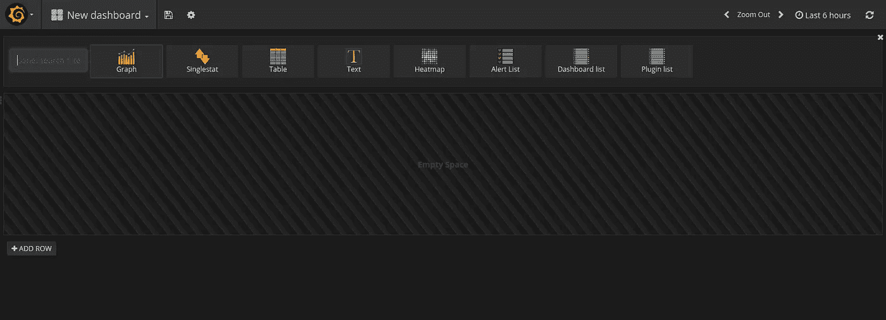

新仪表板

选择“图形”。点击“面板标题”,然后点击“编辑”

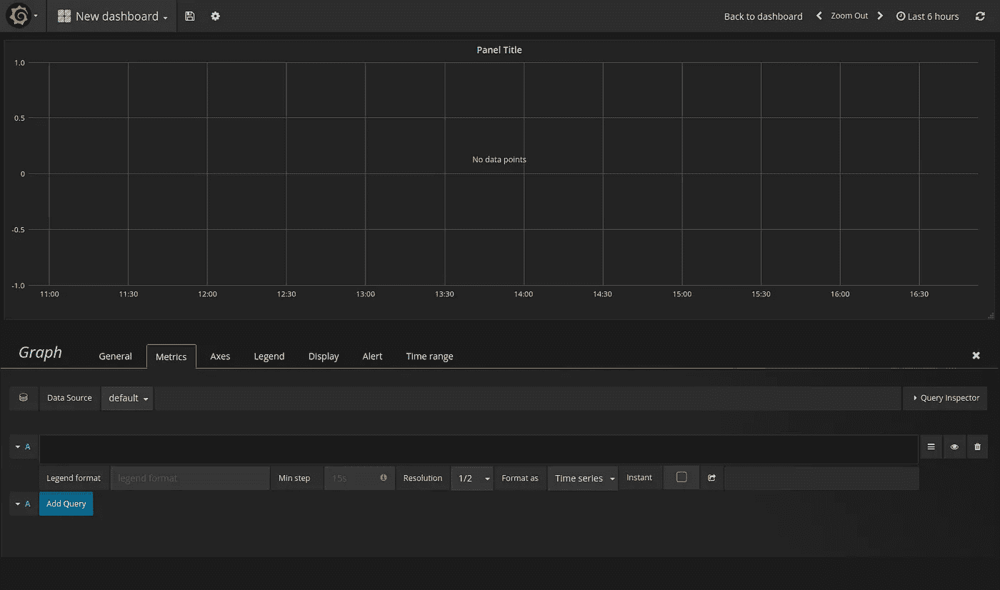

Grafana:编辑图表

将“数据源”从“默认”更改为“普罗米修斯”(或任何您命名的数据源)。然后开始输入“particle ”,您应该会看到由云函数创建的指标(计数器、计量器和直方图)列表

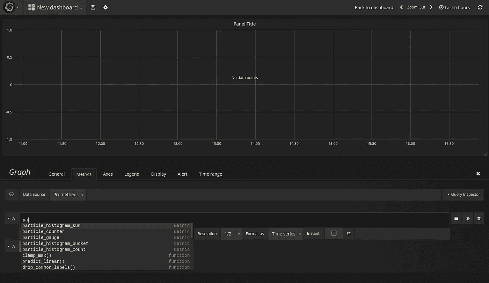

格拉夫纳-普罗米修斯公司的整合非常出色

让我们选择“particle_gauge”，然后优化查询，只选择那些标记为 Temperature(“t”)的元素。该查询应该类似于:

```
particle_gauge{variable="t"}
```

单击查询右侧的眼睛图标，然后单击“返回仪表板”:

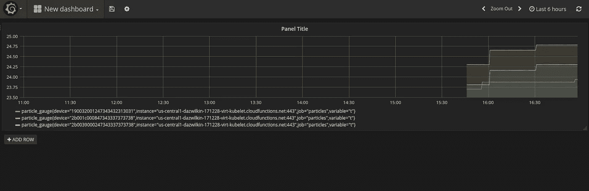

格拉夫纳报道粒子变量

如果你想“添加行”和重复的湿度“h”的过程。

## 结论

斜眼……是的，我仍然不确定这是否是一个有效的用例，但不可否认这是一个有趣的解决方案，它清楚地阐明了粒子云、谷歌云功能、普罗米修斯和 Grafana 等工具的强大功能，可以用很少的工作构建引人注目的集成。

我将非常感谢对 JavaScript 代码的反馈。这些承诺是曲折的，并且获取凭证→登录→获取设备→获取变量→解析和协调的链条有点“深”,但我觉得代码可以简化。

## Google 闭包编译器

所以，我想知道使用[谷歌闭包编译器](https://developers.google.com/closure/compiler/)来“优化”我的云函数代码是否有用。您可以使用 App Engine 托管的编译器([这里是](https://closure-compiler.appspot.com))亲自尝试一下，粘贴任何 JavaScript(甚至是上面的 my index.js)，然后查看“简单”和“高级”的结果。

这就引出了一个问题，为什么不在云函数部署之前添加一个容器构建器来运行 Closure 编译器呢？

我已经[快](https://github.com/google/closure-compiler-js/issues/89)使用 JavaScript 实现了，如果我提交 FR，我会更新这篇文章。同时，我可能会使用 Java 实现创建一个构建器。

## 整理

您可以通过删除其部分来轻松删除该集成。

删除 Prometheus 和|或 Grafana 容器:

```
docker container ls --format="{{.ID}}\t\t{{ .Image}}"f95b959a4adc  grafana/grafana
6c353c1a70ab  prom/prometheusdocker container stop ...
docker container rm ...
```

您可以删除单个云功能:

```
gcloud beta functions delete metrics --project=$PROJECT
```

您可以删除运行时配置(及其变量)或只删除变量

```
gcloud beta runtime-configs delete ${CONFIG} \
--project=${PROJECT}gcloud beta runtime-configs unset username \
--config-name=${CONFIG} \
--project=${PROJECT}
```

你可以删除整个谷歌云平台项目，但要像往常一样小心，因为这是不可撤销的，你将删除项目中的所有内容:

```
gcloud projects delete ${PROJECT} --quiet
```

仅此而已！