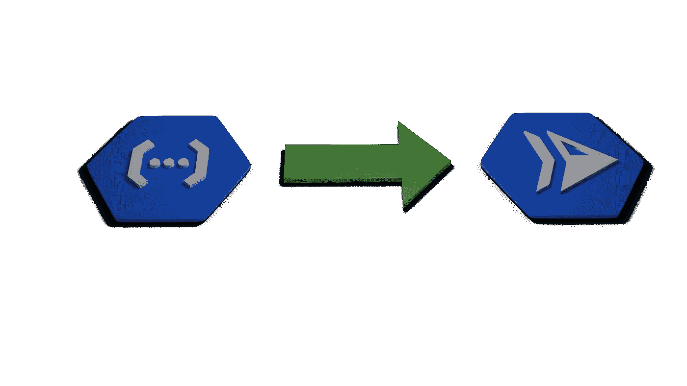
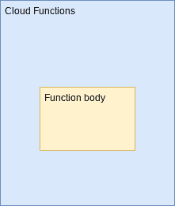
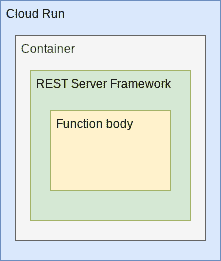

# 云功能到云运行

> 原文：<https://medium.com/google-cloud/cloud-functions-to-cloud-run-e297aac28eb8?source=collection_archive---------1----------------------->



当我们使用名为云函数的 GCP 产品时，我们提供的是包含我们希望执行的代码逻辑的函数体。通过这样做，我们将自己与如何调用功能的*的任何关注或实现分离开来。当传入的请求到达时，是云函数导致我们的代码执行。我们不必发展任何形式的服务脚手架。云功能还负责根据负载启动我们需要的尽可能多的实例，并在没有呼叫时缩减到零。*

云功能的一个替代方案是被称为云运行的服务。云运行与云功能有相似之处，它可以扩展到零，并负责实例的启动/关闭。然而，发展模式发生了很大变化。有了 Cloud Run，开发人员就有责任构建一个 Docker 映像，它将作为一个由 Cloud Run 启动的容器来运行。容器将负责成为一个完整的 REST 服务器，接收传入的请求，然后将控制权传递给业务逻辑代码。

如果我们试图在图表中对比这些故事，我们会得到如下结果:

第一张图显示了提供给云函数的函数体(我们希望执行的代码)。我们只关注函数体，并把它交给云函数来执行。



对于 Cloud Run，我们希望执行的函数体是 REST 服务器框架的一部分，我们也负责构建该框架。然后，我们必须将所有这些打包到 Docker 映像中，最后我们将 Docker 映像交给 Cloud Run 执行。正如我们所看到的，还有额外的步骤。



如果我们以前构建了一个基于云功能的解决方案，现在希望在云上运行该解决方案，该怎么办？在这方面我们有什么故事？

在这里，我们将看看 GCP 的一个功能，称为建立包。在最高级别，构建包可以被认为是一种技术，其目的是将源代码作为输入，并生成 Docker 容器作为输出。传统上，如果想要创建一个 Docker 容器，必须手动创建一个`Dockerfile`，然后将它和源代码传递给 Docker，结果就是一个容器。虽然不麻烦，但它确实增加了额外的步骤，因此带来了麻烦和出错的机会。Build Packs 故事自动检测容器中托管的应用程序的编程语言，并消除了编写 docker 文件和选择配方以在容器中构建代码的负担。

让我们看一个使用构建包的例子。如果我们有一个用 Node 编写的应用程序，我们可能有一个源文件(`index.js`)和一个包文件(`package.json`)。如果我们希望构建一个包含我们的应用程序的容器，我们可以运行:

```
gcloud builds submit --pack image=us-central1-docker.pkg.dev/[PROJECT]/[REPO]/[IMAGE],env=GOOGLE_FUNCTION_TARGET=functionName
```

这个命令有很多内容，所以让我们把它拆开。该命令是利用 GCP 云构建服务的请求。云构建能够在 GCP 而不是在您的本地环境中执行 Docker 容器构建。运行`gcloud builds submit`获取当前目录下的源文件，上传到 GCP，然后执行容器构造。通常情况下，Cloud Build 还会被提供一个 Dockerfile，其中包含构建容器的方法。通过添加`--pack`标志，我们利用了云构建与构建包故事的集成。通过提供这个标志，我们告诉云构建到*而不是*期望 Dockerfile 作为输入，而是使用构建包技术来确定如何将源转换为容器。我们还指定结果图像将被放入的存储库。在这个例子中，我们使用 GCP 的工件注册表。由`GOOGLE_FUNCTION_TARGET`参数指定的最后一个标志是一些专门的谷歌魔术。如果提供了该标志，它会通知云构建，源代码是 *only* a function body，并且将调用该函数的 REST 框架还没有提供*。然后，Cloud Build 会将云函数框架注入到结果容器中，这样当请求到达时，它将调用代码提供的函数。*

*这是一个冗长的描述。更简单地说，如果我们给这个命令输入两个文件:*

*   *索引. js*
*   *package.json*

*其中`index.js`只包含我们可能提供给云函数环境的函数体，那么结果将是存储在 GCP 工件注册中心的 Docker 映像。从这个映像中，我们可以创建一个云运行实例，当它被调用时，将以与云功能部署完全相同的方式调用在`index.js`中找到的功能代码。*

*为了进一步说明这个故事，这里有一个视频展示了云功能到云运行的完整端到端迁移。*

*另请参见:*

*   *[gcloud 构建提交](https://cloud.google.com/sdk/gcloud/reference/builds/submit)*
*   *[宣布 Google Cloud build pack——容器映像变得简单](https://cloud.google.com/blog/products/containers-kubernetes/google-cloud-now-supports-buildpacks)*
*   *[buildpacks.io](https://buildpacks.io/)*
*   *[Github:Google cloud platform/build packs](https://github.com/GoogleCloudPlatform/buildpacks)*