# 云运行时的云 IAP

> 原文：<https://medium.com/google-cloud/cloud-iap-on-cloud-run-2b97ee9cd47a?source=collection_archive---------0----------------------->

你好。我希望你一切都好。在这篇文章中，我将教你如何使用 Google Cloud 上的 Cloud IAP 来保护对你的应用程序的访问。

> 订阅我的 YouTube 频道，[云飞行员](https://www.youtube.com/c/TheCloudPilot)

# 方案

您有一个容器化的应用程序，并且希望将该应用程序限制在特定的人群中。例如，一个内部应用程序只需要被公司的员工访问。您使用 Cloud Run 来托管应用程序，因为它很容易容器化。您现在想要开放对公司内部成员的访问。

在深入探讨实现之前，我们先简单说一下云运行和云 IAP。

# 云运行

> 一个完全托管的无服务器平台，让您运行容器化的应用程序。

如果可以从任何编程语言构建一个容器映像，就可以部署用这种语言编写的应用程序。或者，如果您使用 Node.js、Python、Java 或 Go 等语言，您甚至不需要构建图像。相反，您可以使用一个名为基于源代码的部署的特性，该特性为您构建容器映像，然后部署它。这是一项服务，主要服务于那些想花时间开发代码而不担心基础设施的开发人员。

在云运行中，应用程序作为服务运行。云运行的一些功能包括:

> 每项服务的唯一 HTTPS 端点
> 
> 基于传入的请求自动快速扩展
> 
> 内置流量管理
> 
> 缩减到零/最少实例以降低成本
> 
> 运行私有或公共服务—允许或限制访问互联网

在这里，如果您不希望流量对互联网开放，您可以用三种不同的方式来限制流量:

> 一种使用云 IAM 的访问策略
> 
> 允许来自 VPC 和其他内部服务的内部流量的入口设置。
> 
> 仅允许通过身份验证的用户使用 IAP

# 云 IAP

> 集中的身份验证层，将访问权限仅限于特定的用户组

云 IAP 支持应用程序级别的访问控制模型，而不是网络级别的防火墙。当您想要对应用程序或资源实施访问控制时，最好使用它。

## 从事云 IAP

当您启用 IAP 时，用户只能通过代理访问应用程序。当用户被授予访问权限时，即使不需要 VPN，他们也可以进行细粒度的访问。然后，Cloud IAP 将在允许用户访问应用程序之前执行身份验证和授权检查。

使用 Cloud IAP，当您访问应用程序的 URL 时，您将被重定向到一个登录页面，您必须使用您的凭据登录。然后，将使用云 IAM 策略检查这些凭证，以查看这些凭证的所有者是否有权访问应用程序。为此，用户需要分配一个 **IAP 安全的 Web 应用用户**角色。在为资源打开 IAP 的**时，它会自动生成 OAuth 2.0 客户端 ID 和密码。**

> 云 IAP 可以与**应用引擎、HTTPS 负载平衡器或内部 HTTP 负载平衡器**一起使用。

现在，让我们看看如何在 Cloud Run 上使用 Cloud IAP 来实现这个安全特性。

# 步骤 1:创建无服务器 VPC 访问

1.  在菜单上，转到 **VPC 网络>无服务器 VPC 访问**。
2.  点击**创建连接器**。

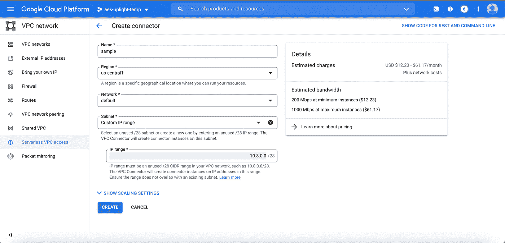

1.  在“名称”列中，输入无服务器 VPC 的名称**。**
2.  选择 VPC 的**区域**和**选择您想要连接的网络**。
3.  在子网部分，**选择自定义 IP 范围**并**输入您的子网的 IP 范围**。
4.  点击**创建**。

# 步骤 2:创建云运行服务

1.  从侧边栏菜单进入**云运行**。
2.  点击**创建服务**。
3.  根据您的要求填写配置。

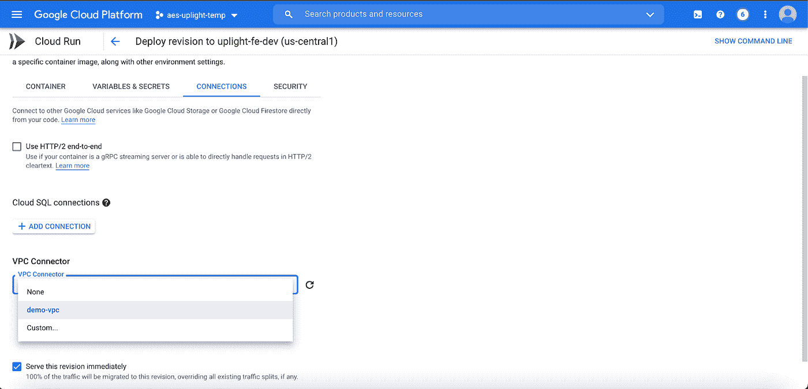

1.  点击**连接**选项卡。转到 **VPC 连接器**和**选择您在步骤 1 中创建的无服务器 VPC** 。
2.  点击**展开**。

Cloud Run 服务现在已经准备好，并开始托管应用程序。

> *注意:要使用云 IAP 向云运行进行认证，云运行服务需要连接到云负载平衡器，因为 IAP 只能应用于 App Engine 应用、计算引擎实例或 HTTPS 负载平衡器。*

# 步骤 3:为负载平衡器保留外部 IP 地址

1.  转到 **VPC 网络>外部 IP 地址**。
2.  点击**保留静态地址**。

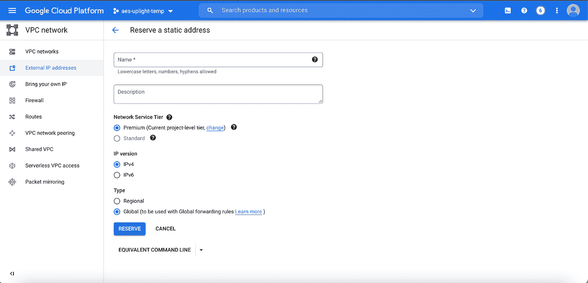

1.  输入 IP 地址的**名称。选择网络服务等级为**高级**。**
2.  保持 **IP 版本为 IPv4** ，类型为**全局**。
3.  点击**储备**。

# 步骤 4:创建 HTTPS 负载平衡器

1.  在菜单上，转到**网络服务>负载平衡**。
2.  点击**创建负载平衡器**。选择 **HTTP(S)负载均衡**。
3.  保持负载均衡器**面向互联网**并在高级流量管理上选择**经典。**
4.  为负载平衡器输入一个**名称**。点击**后端服务**下拉菜单。
5.  如果没有创建现有服务，单击**创建后端服务**。
6.  为后端服务输入一个**名称**。*选择性地提供一些描述。*
7.  选择后端类型为**无服务器网络端点组**。
8.  点击**创建无服务器网络端点组**。

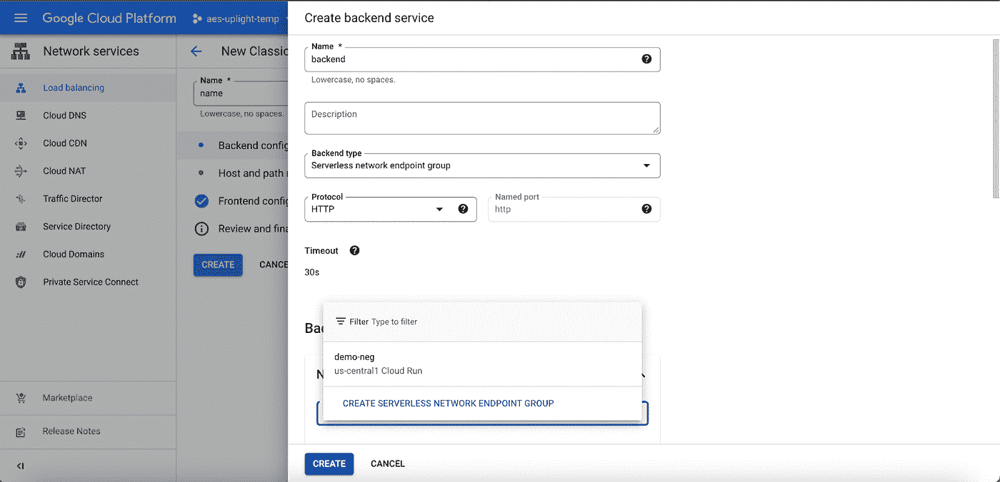

1.  输入无服务器 NEG 的**名称**。
2.  适当选择**地区**。
3.  在无服务器 NEG 类型中，选择**云运行**和**选择服务**作为您想要使用的云运行服务。
4.  点击**创建**。

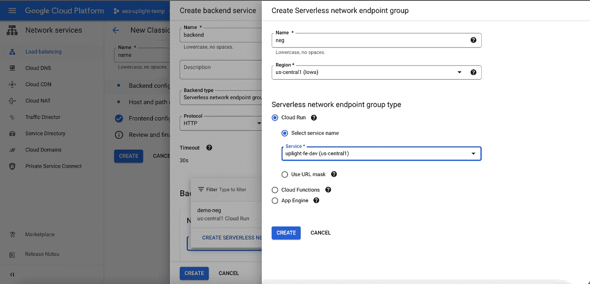

1.  点击**前端配置**。*可选地，为配置提供一个名称。*
2.  选择**协议为 HTTPS** ，保留**网络服务层**为**高级**。
3.  保持 **IP 版本为 IPv4** 并且**选择 IP 地址**为您之前在**步骤 3** 中保留的 IP 地址。
4.  选择 **SSL 证书** *(参见 4.1 创建新证书)*，并将 SSL 策略保留为 GCP 默认设置。检查**启用 HTTP 到 HTTPS 重定向**。

# 4.1.创建 SSL 证书

1.  点击**证书**。
2.  点击**创建新证书**。
3.  为证书输入一个**名称**。*选择性地提供描述。*
4.  选择**模式**进行创作。

> 如果你有域名，你可以使用自己的证书，或者让谷歌为你创建一个证书。

a)如果您选择上传证书，请上传中的文件。pem 格式。或者，您可以从文件中复制内容，并将它们粘贴到证书和私钥中。

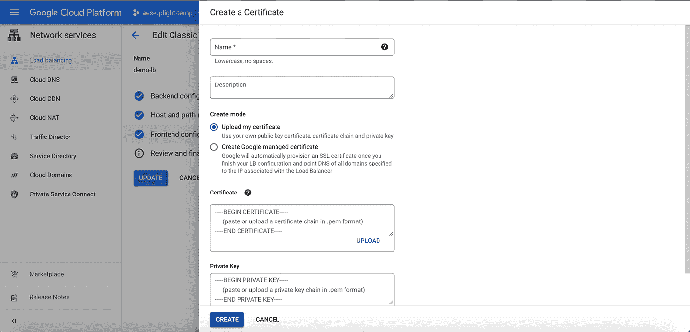

b)如果您希望 Google 为您创建一个证书，请输入您拥有的域名。

1.  点击**创建**。
2.  查看配置后，点击**创建**。
3.  一旦创建了负载平衡器，您可以在**细节**选项卡上找到 **IP 地址**。

> 记下该 IP 地址，以便进行下一步。

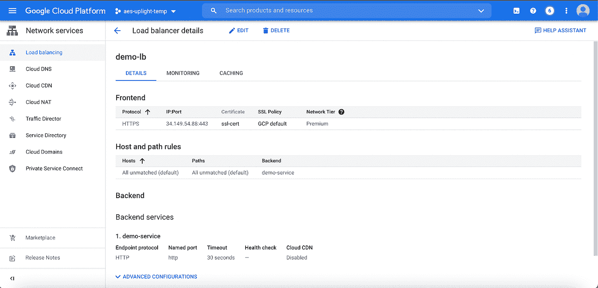

一旦创建了负载平衡器，下一步就是将域名路由到 IP 地址。

# 步骤 5:创建 DNS 区域

1.  点击**创建区域**。
2.  输入区域的**名称**。
3.  保持**区域类型为公共**。
4.  输入 **DNS 名称**。
5.  点击**创建**。

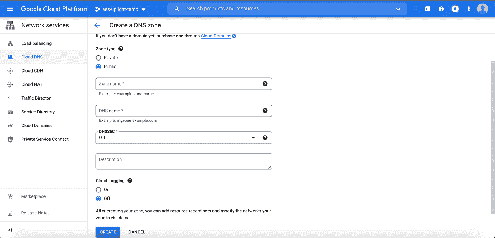

创建 DNS 区域后，单击**添加记录集**。

1.  选择**一条记录。**
2.  输入您的 **DNS 名称**和负载平衡器的 **IP 地址**。

# 步骤 6:对负载均衡器启用云 IAP

1.  从菜单侧边栏，转到**安全>身份识别代理**。*在 HTTPS 资源选项卡下，您可以看到您创建的负载平衡器。*
2.  **打开**IAP 按钮。

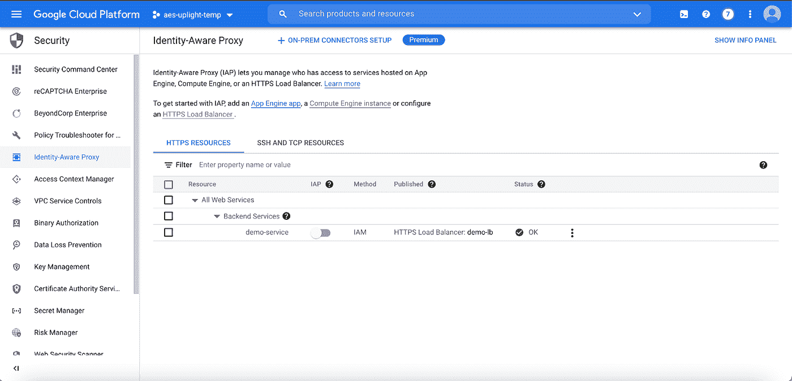

1.  检查配置要求，点击**打开**。

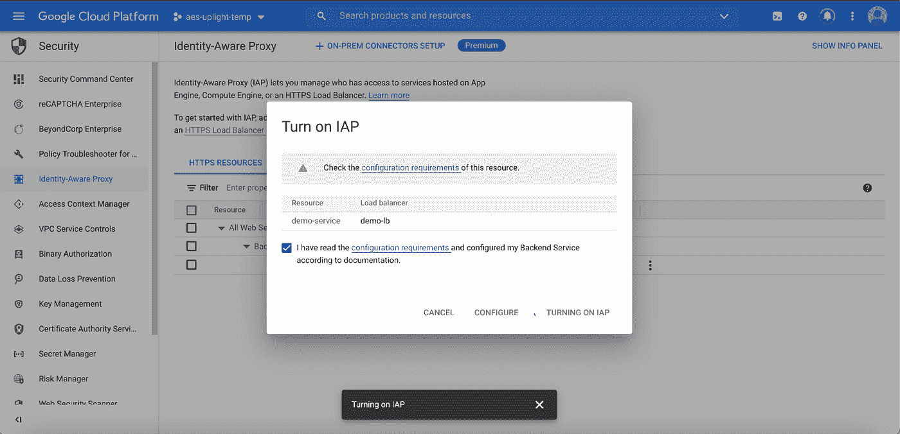

> 一旦 IAP 被创建，包含客户端 ID 和客户端秘密的凭证将被命名为 IAP- <name of="" the="" load="" balancer="">。</name>

# 步骤 7:向网站添加用户

您可以选择谁可以访问云运行服务。使用 IAM 方法，您可以将人员添加到 IAP。

> 最佳实践是将人员添加到 Google 群组并分配权限。

1.  选中与负载平衡器名称对应的框。右侧会弹出一个信息面板。
2.  点击**添加委托人**。
3.  输入您想要添加的人的电子邮件地址。允许多个条目*(但遵循使用 Google 群组的最佳实践)*或者，如果您希望任何拥有 Google 帐户的人都可以访问该应用程序，请选择 **allAuthenticatedUsers** 。
4.  点击选择一个角色，选择**云 IAP > IAP 安全 Web App 用户**作为权限。
5.  点击**保存**。

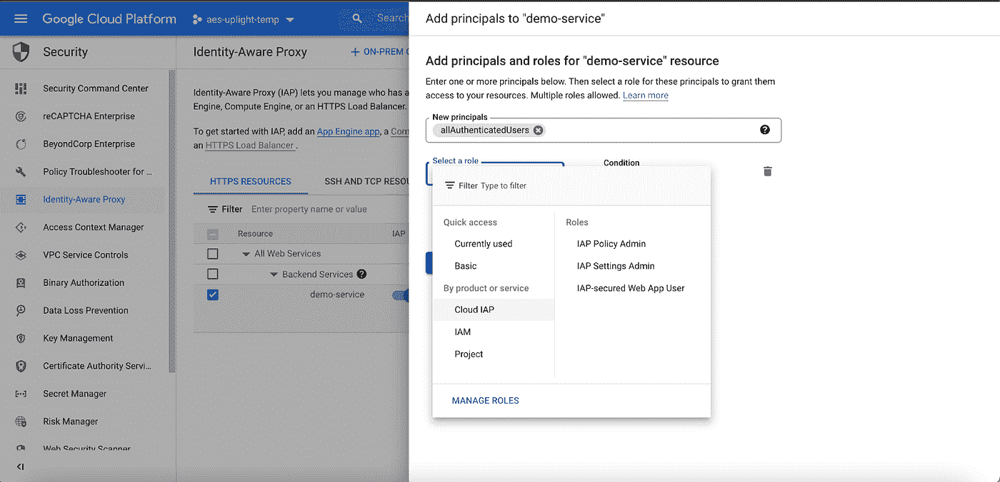

一旦完成以上所有步骤，搜索您在 DNS 中添加的网站地址，它会将您直接带到 OAuth 页面。成功完成认证后，您将登陆网站。

> 在我的 [LinkedIn](https://www.linkedin.com/in/udesh-udayakumar/) 上关注我

感谢阅读！我希望这有所帮助。回头见！