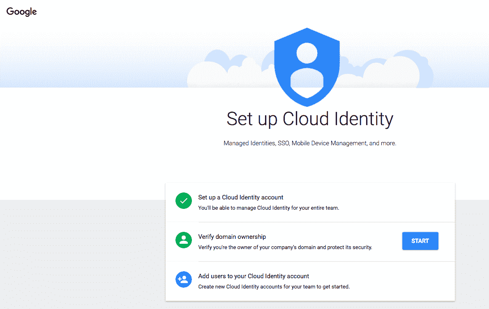
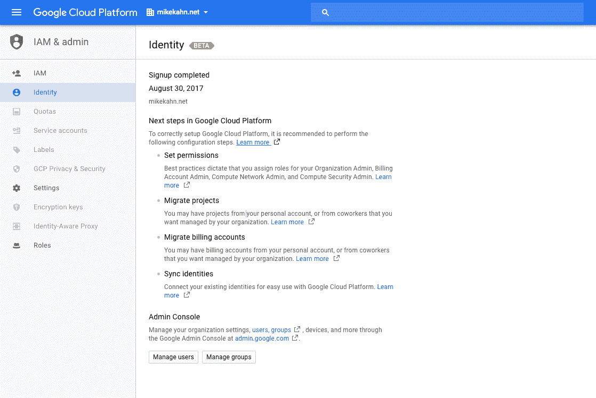
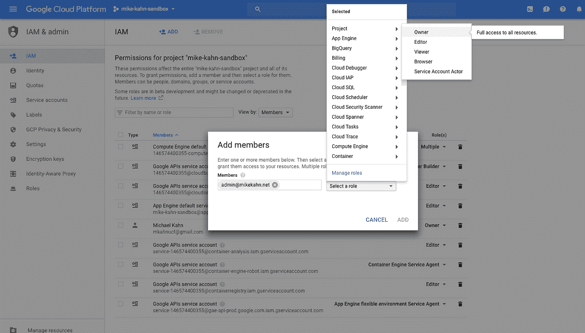
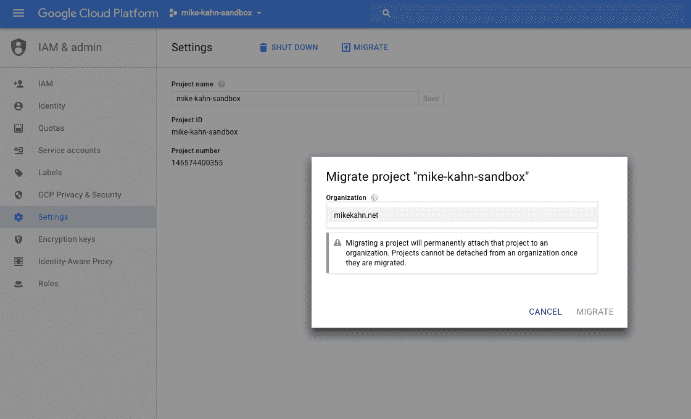
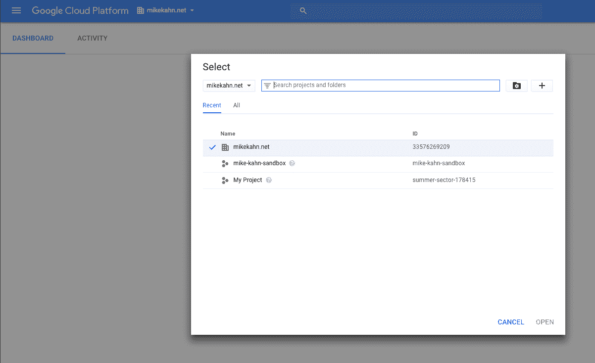
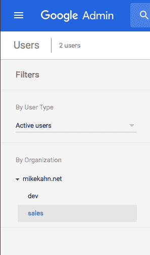
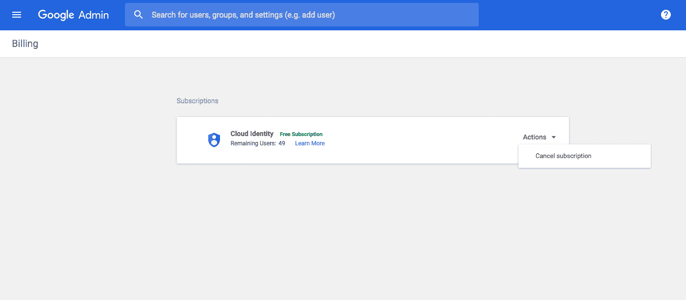

# 云身份测试版概述

> 原文：<https://medium.com/google-cloud/cloud-identity-beta-overview-bdd5e410b527?source=collection_archive---------1----------------------->

云身份是 Google 云平台的身份即服务(IDaaS)。如果您已经熟悉 GCP IAM，云身份可为使用 GCP 资源的组织提供扩展的组织用户管理功能。想想 active directory 或 G Suite，没有 Gmail、Drive 或应用程序，只有用户服务和管理控制，不增加 GCP 项目的成本。最让我感兴趣的是，云身份允许组织将由个人或团队建立的离群 GCP 计费帐户和项目迁移到自己的组织域中，以满足公司安全或合规性要求。

## 入门指南

使用您有效的 GCP 帐户，在 [IAM 和 admin - > Identity](https://console.cloud.google.com/iam-admin/cloudidentity/consumer?authuser=1) 中注册云身份后，您必须验证您的域所有权。如果你已经设置了 analytics 或 adwords，这是同样的过程。将 html 文件上传到域 web 服务器上的根服务器，或者在索引页面中添加 meta 标记。

## 迁移单个帐户项目

正如我提到的，我最喜欢云身份的一点是，它允许您将个人 GCP 项目和计费帐户迁移到组织中。假设您的组织中有几个团队在 GCP 项目中使用他们自己的信用卡和电子邮件帐户。现在，您可以将这些帐户集中并组织在一个域下。

为了从非域 GCP 帐户(个人)移动项目，您需要将主管理帐户(目标)作为所有者添加到源 GCP 帐户中。在我的情况下，我的管理账户是 admin@mikekahn.net 的 T2，我的来源是我在迈克-卡恩沙箱项目中的个人 gmail GCP 账户。

将组织管理员帐户添加到单个项目中

将主管理员帐户添加到个人帐户中的源项目后，主管理员可以查看该项目。下一步是将项目迁移到域中。转到项目视图，选择项目并单击迁移。

现在，在我新创建的组织中，您可以看到我的个人 GCP 沙盒项目。

个人 GCP 项目迁移到新创建的组织

注意这仅仅改变了项目的所有权和层次结构。在上述情况下，帐单不会被转移到我的域帐户只有该项目。下一步是[将现有的计费账户](https://cloud.google.com/resource-manager/docs/migrating-projects-billing?hl=en_US&_ga=2.264861448.-643080646.1504106712#migrating_existing_billing_accounts)迁移到域名。

❗️To 完成迁移，不要忘记从迁移帐户的 IAM 中删除源项目用户 ID，可能是个人的个人电子邮件帐户。这将确保项目被完全转移到新的组织中。

对于将项目迁移到组织，您有几个选择。如果您愿意，您可以保留个人帐户中的账单，只迁移项目并接管它的所有权。如果个人用公司卡支付其团队的资源费用，但公司安全仍然需要云项目的所有权，则可以应用这种场景。

阅读更多内容:[将现有项目迁移到组织中](https://cloud.google.com/resource-manager/docs/migrating-projects-billing?hl=en_US&_ga=2.26630714.-643080646.1504106712)

## **另一层用户管理**

如果您的组织正在使用另一个主要的身份管理平台服务，如 LDAP 或 AD，您现在仍然可以使用云身份来帮助组织您公司的多个 GCP 项目或与您的团队一起试用 G Suite。您还可以使用谷歌云目录同步(GCDS)来保持您的广告或 LDAP 服务器之间的一致性。更多关于 GCDS [的信息请点击这里](https://support.google.com/a/answer/106368?hl=en)。

带有云身份的 Google Admin 就像没有应用程序的 G Suite。如果你决定开始使用 Docs、Drive 和其他 G Suite 服务，你可以很容易地在 Google Admin 中添加你刚刚创建的公司和域名。G Suite basic 的起价约为每个用户帐户 6 美元。

在撰写本文时，云身份是一个可以随时取消的免费订阅。

云身份是 GCP 的一项出色的新功能，可帮助组织您组织中的多个个人或团队 GCP 项目和云平台用户。云身份可以帮助您的组织遵守针对云用户和资源的企业安全或合规性政策。如果您的组织中有现有的身份管理系统，如 AD 或 LDAP 设置，您仍然可以利用云身份，并根据需要同步这两种服务。

更多详情:
[Google 云平台身份与访问管理](https://cloud.google.com/iam)  [什么是云身份](https://support.google.com/a/answer/7319251) [对比云身份特性](https://support.google.com/a/answer/7431902)