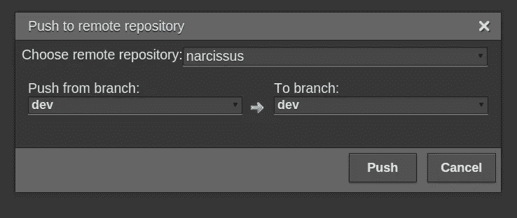

# 您的云中的云

> 原文：<https://medium.com/google-cloud/cloud-in-your-cloud-afb4260cef61?source=collection_archive---------5----------------------->

# 使用 Codenvy 的基于 Web 的 AppEngine 开发环境

在我的上一篇文章中，我谈到了建立一个由 T2 app engine 和 T4 谷歌云平台驱动的个人数据记录系统。

我们开始吧！

对于任何项目，首先要做的是建立一个开发环境。这可能是一个大皮塔饼。在你的机器上安装开发工具不可避免地意味着下载各种二进制文件和配置神秘的东西。

但是我将尝试一些不同寻常的东西，并使用云中的开发环境。

# 你们这些孩子滚出我的云！

现在，我有点花白胡子了，所以你可能会认为我会选择 vim 或 emacs 或类似的东西。

不过，我从来不喜欢纯文本编辑器。其他类型的用户得到 GUI 和聪明的 UX 和可爱的现代东西，为什么开发者要停留在 80 年代？我一直很喜欢 IDEs。

此外，在有点无聊的“云”术语出现之前，我就喜欢在线存储和访问一切的想法。

被困在本地软件开发环境中有些可怕。开发环境是如此脆弱和专业，你最终只能停留在一台机器上。

通过我的电子邮件，或者社交网络，甚至我的代码回复，我可以通过网络访问一切。为什么不是我的开发环境？毕竟，我正在构建存在于云和网络中的软件。

长话短说，我将我的代码放在 [Github](https://github.com/) 中，我的目标是 [AppEngine](https://appengine.google.com/) ，我使用 [Codenvy](https://codenvy.com/) 作为我的开发环境。

但废话够多了。让我们把一些云放在云里，让一条狗跑起来。

# 我嫉妒你的鱼

## 第一步:在 Codenvy 中建立一个项目

[去 Codenvy，这里。](https://codenvy.com)

无论你喜欢什么方式，都可以报名参加 SaaS 项目。

创建新项目

然后你会看到这样的东西:

我可能没有提到我正在使用 Python…

我用的是 Python。

我这样做是因为我觉得，在现有的四种语言中，Python 是对平台承诺最多的一种。Java 得到了很好的支持(如果不算 ndb 的话)，但是 Java 开发者似乎使用了很多框架来假装他们在另一个平台上或者保留跨平台的功能。PHP 可以让你运行 Wordpress。围棋是实验性的。

我认为使用 PaaS 的好处是平台尽可能为你做更多的事情。作为一名孤独的开发人员，您应该接受这一点，否则就选择另一种方法。

拥抱 AppEngine 意味着使用平台的原生服务而不将其抽象掉。我认为 Python 提供了对这些服务最全面和最自然的访问。

所以，我选择了“Python 应用引擎项目”，并选择了“水仙”这个名字。我选择了一个公共项目，所以如果你愿意，你可以复制我的开发环境，它在这里:

[https://codenvy.com/ws/emlyn/narcissus](https://codenvy.com/ws/emlyn/narcissus)

## 第二步:在 GitHub 上建立回购协议

我在这里的 [GitHub](https://github.com/) 上设置了一个回购:

【https://github.com/emlynoregan/narcissus 

我从一个完全空的回购开始。一切都将来自 Codenvy。

## 第三步:将 Codenvy 连接到 Github

在 Codenvy 项目中，我选择 Git|Initialize Repository(即:进入“Git”菜单，选择“Initialize Repository…”)。当询问我是否要初始化本地存储库时，我单击 ok。

然后，我去 Git|Remotes…|Remotes…加一个 github 遥控器；即:如上填写第二步中的 github 回购详细信息:

现在我需要添加一个新的分支。当我做到这一步时，我将离开主分支进行生产代码，但现在我正在设置一个开发环境。所以我需要创建一个 dev 分支。

我选择 Git |分支。在这个对话框中，我创建了一个“dev”分支，然后签出这个分支。

然后，我把它推给 github。我选择 Git|Remotes|Push。

代码要去 github！很好。

## 第四步:创建 AppEngine 项目

我需要 AppEngine 的开发应用程序。现在只需要是免费的。

我去 https://cloud.google.com/，用我的谷歌账户登录，创建一个名为“水仙-开发”的新项目。

云控制台项目页面有一些 AppEngine 相关信息，但我还需要使用 AppEngine 控制台，这里:[https://appengine.google.com/](https://appengine.google.com/)

后一种控制台正在慢慢退役，但目前它仍然是一个必不可少的工具。

通常使用 AppEngine，您现在需要[下载 sdk](https://cloud.google.com/appengine/downloads) ，在您的本地机器上创建一个项目，并推送到 AppEngine 应用程序。但我不会那样做。相反，我将依靠 Codenvy。

## 第五步:用代码配置应用程序

回到 Codenvy，我需要配置应用程序。

Codenvy 给了我一个全功能的应用，最小的 appengine 应用。

它由两个文件(和一些空文件夹)组成。

包含一个简单的 web 处理程序，它将向 GET 请求返回“Hello World”。但是你好世界已经结束了。让我们把它改成“哟狗”。

*app.yaml* 包含项目的配置。我将应用程序名设置为 narcissus-dev。

这将代码与 AppEngine 项目联系起来。

我再次向 github 推送。我选择 Git |添加到索引…，Git |提交…，然后选择 Git |远程…|推送…

## 步骤 6:部署到 AppEngine

现在，我可以部署到 AppEngine。我只需选择部署|谷歌应用引擎。

Codenvy 向我抛出了一些授权屏幕(谷歌云的 OAuth 内容)。

然后它会询问我是否确定要部署。

是的，我点击更新！

它嗡嗡作响。然后就完事了。

它到了吗？我进入 AppEngine 应用程序的页面:

【http://narcissus-dev.appspot.com 

我看到了这个:

就是这样！

现在，要更改代码，我在 Codenvy 中编辑它，按 github 备份它，并部署到 AppEngine，如上所述。

## 成就解锁！

我有一个工作开发环境！

它有一个干净，快速的网页编辑器界面，语法突出。

通常我使用 [Eclipse](https://eclipse.org/downloads/) + [PyDev](http://www.pydev.org/) ，如果配置得当，它也能给我微软所说的智能感知。我可以看到下拉菜单，告诉我可以选择什么变量，方法名等等。希望没有它我也能活下去。

此外，我没有能力运行单元测试，这是有问题的。为此，我真的需要一台装有 Appengine sdk 的机器，它为各种 Appengine 服务提供了模拟。

一个很好的替代品将是运行 [Jenkins](https://jenkins-ci.org/) 的构建服务器。如果我有时间做这件事，我会写一篇关于它的文章。

然而，在 AppEngine 上进行单元测试变得越来越难，因为趋势似乎是让 AppEngine 上的本地服务退役，并让它们成为 AppEngine 外部可用的云服务；ie:打破 PaaS 花园的东西。不幸的是，这些新服务很大程度上是不可跟踪的，尤其是像 [BigQuery](https://cloud.google.com/bigquery/what-is-bigquery) 这样的服务。

这双重适用于本地 AppEngine 开发服务器。我将无法运行它，但它变得越来越不相关，因为我想使用的大多数服务往往都在 it 之外，it 无法对它们进行认证，这大大限制了它的实用性。

但是现在，成功了。我认为在云中开发，对于云来说，将会是一种非常干净的体验。我期待的不仅仅是你，伙计！直到下一次…