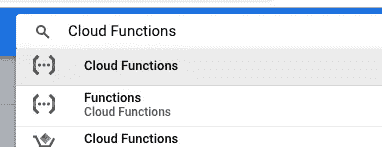

# 云物联网循序渐进:云到设备的通信

> 原文：<https://medium.com/google-cloud/cloud-iot-step-by-step-cloud-to-device-communication-655a92d548ca?source=collection_archive---------1----------------------->

嗨，朋友们！

本教程建立在[上一篇](/@GabeWeiss/cloud-iot-step-by-step-connecting-raspberry-pi-python-2f27a2893ab5)的基础上，并假设您已经习惯将您的设备连接到谷歌云项目。如果你不是，没关系！跟着那个链接走，做另一个，然后回来做这个。

所以现在你有一个设备把它的数据发送到云端，但是如果你想把信息发送回你的设备呢？像所有物联网的事情一样，有许多不同的方法可以做到这一点。如果你真的想的话，你甚至可以在你的 Pi 上安装 [Apache](https://www.raspberrypi.org/documentation/remote-access/web-server/apache.md) 或 [NGINX](https://www.raspberrypi.org/documentation/remote-access/web-server/nginx.md) 并在上面运行你自己的网络服务器！对于大多数情况，这可能有点过头了，所以今天我想介绍如何将简单的消息发送回您的设备，并基于该消息做一些事情。

在这篇文章的最后，你将会看到云把信息发送到你的设备上。

# 目录:

*   [来自云端的消息类型](#6c93)
*   [设备设置和代码](#ce60)
*   [从云控制台发送消息](#8c59)
*   [从谷歌云功能发送消息](#5123)
*   [创建服务账户](#b9d7)
*   [完成功能](#084c)
*   [带设备运行](#5b1a)

## 来自云的消息类型

有两种类型的消息(目前)可以通过[物联网核心管理 SDK](https://cloud.google.com/iot/docs/reference/cloudiot/rest/) (也称为 cloudiot REST API)从谷歌云发送回你的设备。

1.  配置消息。它们在云中被版本化，因此您可以发送/检索消息的特定版本。当设备连接到云时，最新的配置消息将被发送到设备。因此，即使您的设备当前没有连接，这也是在设备上设置某种状态的一种方式。它有一些限制。最大的问题是每台设备每秒只能发送一条配置信息。
2.  命令消息。这些是火和遗忘。它们没有版本控制，因此，如果在您发送其中一个时，您的设备当前没有连接到云，它就消失了。因此，它们速度更快，可以更频繁地发送。每个设备注册表每秒 1000 条消息(但可以根据具体情况增加)。

我的看法是，如果你想在设备上保存的话？配置。如果您的设备处于“活动”状态，您希望对哪些瞬时信息做出响应？命令。

## 设备设置和代码

在与上一篇帖子相同的 GitHub repo 中，发现[在这里](https://github.com/GabeWeiss/IoT_Core_Quick_Starts)。这篇文章的代码是 02_basics.py。我们仍然使用 Sense HAT，我将带您浏览上次新增的代码片段。

正如我提到的，这篇文章建立在我之前的文章之上，所以你需要确保你已经完成了 [Pi 设置基础](/h2/2f27a2893ab5#c01b)、[库依赖设置](/h2/2f27a2893ab5#50cb)和[准备谷歌云平台](/h2/2f27a2893ab5#7f07)的步骤。

做完了吗？太好了！

和上次一样，确保您已经编辑了变量代码块，以匹配您的特定项目和证书位置。

您可以看到在`respondToMsg(msg)`方法中支持哪些值。如果你想添加更多的东西，那就从这里开始吧。

抱歉闪烁，LED 矩阵的频率与相机匹配。你看到的是我通过物联网核心将`“red”`和`“rainbow”`发送到我的 Pi。抖动是因为我在输入“彩虹”的时候拿着相机。

有一点要注意，如果感觉头几次需要一段时间才能把信息传到设备上，不要大惊小怪。有个东西叫“冷启动”。一旦你用一个云函数做了几次，它就会被缓存并留在内存中，所以在随后的启动中会更快。

那么，我们如何将这些信息发送到我们的设备上呢？

## 从云控制台发送消息

这是做这件事的简单方法。伟大的测试，以确保一切都连接正确和工作。还有，IMO，最没用的实用方法。因为它是从控制台手动进行的，所以对于一次性更新来说是不错的，但是就真实的用例而言呢？相当小众。

从搜索栏或汉堡菜单导航到[控制台](https://console.cloud.google.com)上的物联网核心页面。

深入查看您在物联网核心中创建的设备，在设备详细信息页面上，您将看到以下选项:

`update config`和`send command`都打开一个非常相似的对话框，允许你发送一个文本，或者一个 base64 编码的消息回你的设备。确保在该对话框中选择了`text`。现在，不要担心命令对话框中的子文件夹添加选项。我们不会用它。

请记住，要接收命令，设备必须运行代码(主动连接)。对于配置，如果您的设备已连接，它将实时接收它们，此外，在连接时，设备将接收最新的配置消息。因此，例如，如果您发送了“红色”配置消息，并以另一种方式清除了 LED 矩阵，在连接时，您的设备将从云中获得“红色”，并将 LED 矩阵变为红色。

## 从谷歌云功能发送消息

通过物联网核心 API 向设备发送消息的方式和调用 REST API 的方式一样多。我想强调的一个方法是使用云函数。它们是无服务器方法，既可以通过调用端点(HTTPS)来触发，也可以响应一些云事件(当我们创建一个时，您可以在下拉列表中看到是哪一个)。它们很好，易于设置和部署。还有一些更快的选项，我将在以后的帖子中介绍，但就设置的方便性而言，这是我的最爱(个人观点，其他人可能不同意我的观点)。

我为这个帖子写的函数在同一个 repo 中，可以在这里找到[。](https://github.com/GabeWeiss/IoT_Core_Quick_Starts/tree/master/02_basics_gcf)

部署云功能主要有两种方式:命令行和控制台。我今天将讨论控制台，我将在以后的帖子中讨论命令行的所有内容。

在你的 [GCP 控制台](https://console.cloud.google.com)中，搜索云功能，或者使用菜单导航到云功能。在导航汉堡中，它靠近顶部，在计算机下面。

如果您从未使用过云函数，它会要求您启用 API，继续操作。

点击页面最上方的`Create Function`链接。给你的函数起个名字，不要管内存分配，也不要管触发器。我们将使用一个 HTTP 端点来触发我们的函数。您可以在此页面上看到触发此功能的 URL。

这不是一个真正的函数，它不会做任何事情。

将我的 GitHub 中的代码剪切/粘贴到 index.js 的内联编辑器中，并将我的 GitHub 中的 package.json 内容复制到内联编辑器的 package.json 选项卡中。将代码中的变量`registryId`和`deviceId`更新到我们在上一节中创建的设备。我从环境中提取了`projectId`，但是你也可以显式地编辑它。对于 msg 变量，将`“clear”`替换为`“red”`。现在还不用担心`serviceAccount`或`which`。

对于要执行的功能框，输入`updateDevice`。

下一步，在要执行的功能框下面，有一个“更多”的小链接。点击它。

这将扩展出一些我们需要调整的选项。该区域应该与您的项目相同，并且没有问题。超时没问题。

不过，我们需要谈谈服务客户。代码中有一段要求你`<paste contents of the service account json blob here>`。服务账户有很多内容，超出了这篇博文的范围。如果你想深入研究，医生们就在这里。TL；DR 是这些是不记名令牌，授权你的代码访问谷歌云平台的不同部分，包括 API、数据库访问等。默认情况下，当您创建项目时，您已经有了一些这样的权限，但是它们具有广泛的权限，我们不想到处都使用它们，所以我们将专门为此创建一个。您不需要更改云功能中列出的那个，我只是想提出来，因为这将是我们的下一步。继续点击最底部的`Create`按钮，将云功能导入系统，在我们创建服务帐户之前，不要丢失任何进度。

部署这个函数需要一点时间，注意，当我们稍后调整这个函数的时候，当你的函数名旁边的旋转图标变成绿色的时候，这是一个谎言。该函数已经部署，但可能还没有完全传播它的版本。再过一分钟绿色复选框，你就可以开始了。虽然这个特殊的还没有准备好成功运行，因为我们还没有处理授权。让我们把那部分做完。

## 创建服务帐户

在控制台中，搜索`Service accounts`，它将是带有 IAM &管理子标题的选项(在我的图片中，它是列表中的最后一个)

或者使用汉堡菜单进入 IAM & admin ->服务帐户。点击页面顶部的`Create service account`链接。给它起个名字，点击`Create`。在`Select a role`下拉菜单中，向下滚动直到找到`Cloud IoT`，并选择`Cloud IoT Admin`选项。

点击`Continue`。在下一页中，单击`Create key`按钮，保持 JSON 单选按钮处于选中状态，然后单击`Create`按钮。这会将一个 JSON 文件下载到您的计算机上。我们需要它，所以跟踪它的位置，然后点击`Done`按钮完成服务帐户的创建。

在有那个`<paste contents of the service account json blob here>`注释的`index.js`文件中，那是你想要粘贴你刚刚下载的文件内容的地方。它最终会看起来像这样:

我已经修改了值，这些都不是真的，别想黑我了

## 最终确定功能

在控制台中导航回您的云功能，并在它的详细信息页面上，单击`Edit`。将 index.js 中的代码粘贴到内联编辑器中，覆盖那里的所有内容，滚动到底部并单击`Save`。等待额外的一分钟进行部署，您应该能够点击到`Testing`选项卡(靠近顶部，在版本下拉菜单下)。因为我们有逻辑默认值，所以此时您应该能够点击`Test the function`。如果一切正常，`Test the function`按钮将很快重新启用，因为它实际运行起来根本不需要很长时间，但我们所等待的是，在下面的日志部分，它会显示“获取日志”。这可能需要一点时间来完成，但是理论上，我们不应该在这里看到任何错误。如果这样做了，请仔细检查注册表和设备 ID 的所有变量，并确保服务 JSON 周围没有任何多余的引号。当我这样做的时候，这两个人咬了我一口，错误信息通常不像它们应该的那样清晰。

## 使用设备运行

好了，现在打开你的设备，运行脚本。您将看到脚本的遥测发布输出。目前它被设置为向云输出四到五个有效载荷(尽管如果您没有取消对`client.publish`调用的注释，那么它实际上并没有向云发送任何东西，只是将有效载荷输出到控制台)，然后脚本将等待。由于我们已经运行了云功能，当设备运行脚本时，它应该会变成红色，因为这是我们设置的配置，请记住，您的设备将在连接到物联网核心时收到最新的配置消息。

所以现在在你的函数中(在内联编辑器中)，返回并用`“clear”`替换`msg`变量的`“red”`,因为这是我们的默认值，我们希望能够在清除矩阵时使用默认值。为了测试以确保它仍然是好的，一旦它被部署(一分钟后出现绿色图标)，当脚本仍然在您的设备上运行时，从功能控制台的测试选项卡再次测试它，您应该会看到灯熄灭(不要忘记由于冷启动，在游戏的这个阶段可能需要一点静止)。

现在，我们已经从测试中确认了它的工作…现在是真正的交易！之前的 HTTP 触发器，现在我们需要它，这样我们可以真正测试它。如果您没有在云功能的详细信息页面上的某个地方复制它，您可以再次找到它，请查看`Trigger`选项卡获取 URL。

你可以点击那个链接，它会打开另一个网页到你的触发器，它会火。因为所有的默认设置都是清除，所以 led 不会亮起，但是您会在设备上看到来自脚本的调试消息，如下所示:

`TESTING: clear
matching message text: clear
RESPONDING`

现在是真正的测试。在触发器 URL 的末尾添加一个 GET 变量。以我上面的示例 URL 为起点，它可能看起来像:

`https://us-central1-gweiss-project.cloudfunctions.net/test-functin/index.js?message=red`

消息变量是解析代码的直接通道。所以我上面提到的所有变量都是可行的，例如`temp`、`rainbow`等等。如果您向脚本添加任何处理，那么这些也将是要传递的可行变量。

最后一个变量是`which`变量。这是脚本是否发出配置消息和命令消息的开关。两个可能的值是`which=config`或`which=command`。需要记住的是，云功能本身会给这个管道增加延迟。所以从控制台发出配置/命令总是比通过函数更快。正如我提到的，你第一次启动一个新部署的函数也会比较慢。

如果 Node.js 不是你选择的语言，我现在写了一个新的帖子，增加了与我们这里相同的云函数，但使用了 Python 和 Go。那个帖子可以在这里[找到。](/@GabeWeiss/cloud-iot-step-by-step-functions-words-words-words-30e62edbe73c)

这一次到此为止！在接下来的博客中，我将谈论使用谷歌云命令行工具，以及使用它可以围绕物联网工具做什么，还可以围绕解决不同问题的设备进行通信。

如果你有任何反馈，或者你渴望看到我写的东西，请在评论中告诉我。您也可以通过 [Twitter](https://twitter.com/GabeWeiss_) 联系我，我的 DMs 是开放的。

[下一步:通过使用命令行进行设置和测试来提高效率](/@GabeWeiss/cloud-iot-step-by-step-quality-of-life-tip-the-command-line-ce23046867d4)。