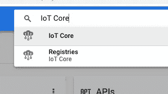

# 云物联网循序渐进:连接树莓 PI + Python

> 原文：<https://medium.com/google-cloud/cloud-iot-step-by-step-connecting-raspberry-pi-python-2f27a2893ab5?source=collection_archive---------0----------------------->


嗨，朋友们！

所以你有了一个很棒的主意，把一个树莓派连接到你后院的气象站，这样你就可以在下雨的时候自动开关窗户。哦，当你这样做的时候，你要连接一个像 ESP32 这样的微控制器，当外面太热的时候，它可以打开和关闭你的洒水器。永远不要忘记关掉你的烤箱怎么样！

那现在怎么办？有很多关于建立气象站的教程[。很好的组件列表，其中一些在物理连接方面非常好，另一些稍微有点掩盖，你必须四处搜索才能将所有东西拼凑在一起。有些人更进一步，告诉你如何连接到云！找到了。现在我们在谈话。但是很多这样的书都很长，没有目录，所以你必须在所有的书中寻找你需要的东西。它们很少能填补特定用例的所有空白。](https://weather.com/news/news/how-make-weather-station-pro-20130731/)

这个博客的目标是从小处着手，集中精力(尽管感觉还是有点长)。我希望你，在这结束的时候，有一个一步一步的指南，把你的树莓 Pi 连接到谷歌的云平台。除此之外还有很多事情要做，但是就像我说的，从小处着手。我不打算深入探讨我们的物联网平台必须提供的全部功能。甚至关于与设备的通信。我只介绍一种方式，即设备到云的通信。但是我想让你能够把你的项目带到云上。迈出第一步就是要能够看到你的设备与云对话。

在我完成这些之后，我将开始构建类似的教程。你可以用设备做更多的事情，比如双向通信。如何在云平台内部移动数据，如何以及在哪里存储不同用例的数据。如何运行基本分析？如何用你的数据在云端训练一个机器学习模型。

在本教程中，请注意，对于一些人来说，我所讲述的细节将远远超出你的需要。例如，在 Pi setup basics 中，我讲述了很多细节，比如改变终端的字体以使其更容易阅读。我已经设置了逻辑标题，所以很容易跳到你需要启动和运行的教程部分。

我在教程中使用了 Pi 3+,但从库依赖设置部分开始，这也可以用于 Raspberry Pi Zero W。如果你想为此设置 Pi Zero，但以前没有设置过，我强烈推荐本指南[。然后跳到本文的依赖部分。](https://learn.adafruit.com/raspberry-pi-zero-creation/overview)

# 目录:

*   [Pi 设置基础知识](#c01b)
*   [库依赖设置](#50cb)
*   [准备谷歌云平台](#7f07)
*   [代码](#ed16)

## Pi 设置基础

其中一些步骤对你来说可能略有不同，我喜欢对我的 Pi 做一些事情，只是为了生活质量。如果你已经知道如何设置 WiFi，并根据自己的喜好调整 Pi，那么你可以安全地跳过这一步，直接进入库依赖设置。

直接连接到您的 Pi，并钩 HDMI。

根据你使用的显示器，或者你的年龄，我将终端中的字体改为等宽 14。使它更容易阅读。我还在首选项中将我的键盘布局更改为美国->英语。默认为 UK->English，在我意想不到的地方有符号。

如果你使用 WiFi，有一件事你一定要做，那就是确保在 Pi 上的设置中，你的 WiFi 国家设置为你所在的任何地方。如果设置为德国，而你在美国，很可能就不行了。有时不同的国家组合也能工作，但这是相当随机的，最好直接设置。

下一步是确保您的 Pi 可以连接到互联网。插入以太网电缆，或者如果您使用 WiFi，扫描您的 Pi 可以看到的网络。从 Pi 上的终端运行以下命令:

```
sudo iwlist wlan0 scan
```

选择你想用的，记住 SSID。

请注意，这将覆盖您现有的任何 WiFi 设置，因此如果您想要保留当前设置，请将该文件移动为备份。这可以通过以下方式实现:

```
mv /etc/wpa_supplicant/wpa_supplicant.conf /etc/wpa_supplicant/wpa_supplicant.conf.bak
```

然后运行:

```
sudo vi /etc/wpa_supplicant/wpa_supplicant.conf
```

如果文件中有任何内容，您可以用以下两种方法之一替换它。如果您的 WiFi 有密码，请使用:

```
ctrl_interface=/var/run/wpa_supplicant
network={
    ssid=”<ssid>”
    psk=”<password for network>”
}
```

如果没有密码:

```
ctrl_interface=/var/run/wpa_supplicant
network={
    ssid=”<ssid>”
    key_mgmt=NONE
}
```

现在您已经有了 WiFi 的配置，您需要重新启动该服务来使用 WiFi:

```
sudo wpa_cli reconfigure
```

现在，您应该能够通过运行以下命令来验证您是否拥有 WiFi:

```
ifconfig wlan0 | grep inet
```

你应该有一个 IP 地址。根据您的 WiFi 配置，它可能是以 168.1 或 127.1 开头的东西(只要不是 127.1.1.1，这不是正确的)。

如果失败了，而你又没有 IP 地址。你可以试试:

```
wpa_supplicant -iwlan0 -c /etc/wpa_supplicant.conf & dhcpcd wlan0
```

这个硬重置 WiFi。如果仍然不起作用，请尝试使用以下命令完全重启 Pi:

```
sudo reboot
```

既然您是 Pi，就可以与互联网交流了，让我们来设置一下，让它拥有我们需要的所有 Python 依赖项。

## 库相关性设置

如果您是 Linux、Pi 和所有 apt-get 的新手，这些步骤中的每一步都会产生一些变化，抛出一串关于您所要求的内容以及它所依赖的依赖项的文本，告诉您它将在您的 Pi 上安装什么。如果你想知道这一切意味着什么，每个图书馆的网页都很好地解释了图书馆是怎么回事。我会 TL；每一个都只是为了介绍特定库的用途。

首先，确保我们是最新的:

```
sudo apt-get update
```

这确保了您的 Pi 将从其中获取库的位置列表是最新的。有时这些库会移动，被废弃，等等，所以在开始一个项目时运行它总是好的。请注意，如果您使用的是 Raspbian，他们也会不断更新它，所以其中一些依赖项可能会说它们已经存在了。完全没问题，这只是，为了完整起见，你需要的所有东西。

接下来是获取我们处理与物联网核心的安全连接所需的部件。认证是通过 [JWT](https://jwt.io/) 完成的，而不是用户/密码，因为这样更安全。为了解决这个问题，库是 pyjwt，它依赖于一个叫做 cryptography 的 Python 库。我为什么要告诉你这些？因为要安装这些组件，你需要特定的基础库。要获取它们，请运行以下命令:

```
sudo apt-get install build-essential
sudo apt-get install libssl-dev
sudo apt-get install python-dev
sudo apt-get install libffi-dev
```

请注意，根据您的 Python 版本，能够安装其中一个库`cryptography`，可能需要 3.x。继续尝试使用您拥有的任何版本的 Python 来完成所有工作，但是如果您在到达`sudo pip install cryptography`时遇到编译错误，那么您将需要使用`pip3`运行所有这些 pip 安装，而不仅仅是`pip`，所以您使用的是 Python 3.x。我最近使用 Python 2.7.13 运行了它，看起来它们已经清理了一堆，所以您将会得到一个为了完整起见，我只是包括了所有手动添加的库。

对于这个演示，我们使用 MQTT，所以我们需要允许我们使用那个协议的库， [paho-mqtt](http://www.steves-internet-guide.com/into-mqtt-python-client/) 。运行:

```
sudo pip install paho-mqtt
```

对于我们的加密，我们使用 pyjwt。运行:

```
sudo pip install [pyjwt](https://pyjwt.readthedocs.io/en/latest/)
```

对于 crypto 来说， [cryptography](https://cryptography.io/en/latest/) 库是我们的 JWT 库的依赖。运行:

```
sudo pip install cryptography
```

最后，我用一个[传感帽](https://www.adafruit.com/product/2738)来接收我的遥测数据。因为它提供了遥测传感器，有一个很好的 API，并且该库预装在 Pi model 3 上，所以它变得很好很容易。如果您没有使用安装了它的 Pi，只需运行:

```
sudo apt-get install sense-hat
```

现在你的设备应该都设置好了(负代码，后面来)。

## 准备谷歌云平台

如果你以前从未这样做过，那么去谷歌的云平台[登陆页面](https://cloud.google.com)，点击“立即尝试”按钮。如果你有一个 gmail 地址，这是最无缝的，但如果你没有，你仍然可以这样做。你可以点击[这里](https://accounts.google.com/signup/v2/webcreateaccount?flowName=GlifWebSignIn&flowEntry=SignUp&nogm=true)使用任何电子邮件地址创建一个谷歌账户。

一旦账户设置完毕，前往[控制台](https://console.cloud.google.com)。第一步是设置[计费](https://console.cloud.google.com/billing)。请记住，如果你是第一次做云项目，建立云项目会给你 300 美元的云积分，并且有一个慷慨的免费层，所以当你尝试时，你不太可能遇到任何付费墙。

第一步是实现云物联网。到达目的地的方法有:



搜索栏

1)将`IoT Core`放入控制台中的搜索栏
2)从左上角的汉堡菜单中选择它。物联网核心已接近底部。
3)点击[该](https://console.cloud.google.com/iot)链接。

单击启用按钮将授予默认安全规则的适当权限，以允许您的用户使用物联网核心。如果您想要手动完成，请确保您将用于物联网工作的用户拥有发布到发布/订阅的权限。物联网核心为您将设备消息桥接到发布/订阅，这意味着您需要拥有写权限。这些权限在控制台的 IAM 部分处理。有龙。如果你真的对谷歌云平台感到舒服，我只会建议你这么做。

接下来，我们将创建您希望物联网设备驻留的注册表。注册表是设备的逻辑分组。因此，如果你正在做智能建筑基础设施，每个注册表可能代表一个建筑物的设备价值。


最简单的方法是从物联网核心控制台页面创建一个设备注册表，作为该过程的一部分，在它要求`Default telemetry topic`的下拉列表中，您可以选择内联创建一个发布/订阅主题。选择离你最近的地区，默认情况下它启用 MQTT 和 HTTP 协议。最简单的方法就是不去管它，除非你知道你只会使用其中一个。这篇博客中的示例代码使用了 MQTT。

现在，我们需要在物联网核心中创建设备表示。在创建注册表时打开的页面中，单击`Create Device`按钮。

给它一个 id，把所有选项都留下。对于 SSL 证书，我们将在这里用 x509 包装器创建一个 RSA，但是如果您想查看其他选项，您可以在这里[看到如何创建它们](https://cloud.google.com/iot/docs/how-tos/credentials/keys)。确保为您创建的证书类型选择适当的单选按钮。默认情况下，选择 RS256 单选按钮，因此如果您只是使用下面的代码片段创建证书，请为`Public key format`选择 RS256_X509 单选按钮。

Raspbian 的默认安装已经安装了 openssl。如果您在 Pi 上运行一个定制的操作系统，而它没有安装 openssl，那么您应该能够在 Pi 上运行这个操作系统，并在以后将私钥放在它上面。要创建密钥，请运行以下命令:

```
openssl req -x509 -newkey rsa:2048 -keyout demo_private.pem -nodes -out demo.pub -subj “/CN=unused”
```

您可以直接上传密钥，也可以复制/粘贴密钥的内容。设备页面上有两个单选按钮，可以选择您想要的方式。

如果您想上传，点击`Upload`的创建设备页面上的单选按钮。浏览并选择`demo.pub`键。向下滚动并点击`Create`按钮。然后，您应该会在注册表详细信息页面的列表中看到新创建的设备。

如果您在无法运行网页的设备上运行了 openssl 命令，请将单选按钮保持为手动，并在您的设备上运行:

```
cat demo.pub
```

并复制以下内容之间的所有内容(包括标签):

```
-----BEGIN PUBLIC KEY----------END PUBLIC KEY-----
```

并将其粘贴到公钥值的文本框中。

这将处理来自谷歌方面的认证，确认你的设备可以与谷歌对话。最后一项安全措施是获取 Google roots.pem 文件，这样你的设备就知道它正在与 Google 对话。同样，如果可能，在 Pi 上，关闭 Pi 并将其转移过来，否则，运行:

```
wget [https://pki.google.com/roots.pem](https://pki.google.com/roots.pem)
```

最后一件要设置的事情。Pub/Sub 是有效的，因为如果没有任何东西在监听 Pub/Sub 主题，任何发送到该主题的消息都不会被存储。由于订阅不会回到过去去获取信息，如果没有人在听，就没有理由存储它们。所以在云平台控制台的搜索栏中输入`Pub/Sub`，或者从汉堡菜单中选择 Pub/Sub 打开 Pub/Sub 页面。您应该至少会看到您在上面创建的主题列在这里。


点击右边的 3 点菜单，并选择`New subscription`。给它一个 id。

现在，您已经完成了让您的设备与谷歌云平台对话的所有步骤。代码本身的最后几个比特。我们快到了！

## 密码

代码可以在我的 [GitHub](https://github.com/GabeWeiss/IoT_Core_Quick_Starts) 上找到。01_guide.html 是这篇博文的缩略版。如果你以后需要找东西，不需要在这里详细讨论，直接访问指南并挑选你需要的东西可能会更快。01_basics.py 是您想要获取并运行的基本代码。正如我上面提到的，它使用 Sense HAT 来收集遥测数据。因此，如果你有一个，你应该能够修改代码中的变量块，指向你已经设置好的各个部分，然后运行它。


`ssl_private_key_filepath`是我们创建的密钥私有部分的完整路径:`demo_private.pem`。`root_cert_filepath`是我们使用上面的`wget`抓取的`roots.pem`的完整路径。`project_id`是您的设备注册到的 Google 云平台项目 id。`gcp_location`是您在创建注册表时选择的区域。`registry_id`和`device_id`是你在创建这些作品时给出的 id。

如果你想使用 Sense HAT 之外的东西，那么注释掉任何对`sense`的引用，用你想用的替换。

最后一点，我已经注释掉了实际的发布代码行，所以在你开始向云中发送垃圾消息之前，你可以进行测试以确保其他一切都正常。这大约是第 100 行(截至发表这篇博客时)。我建议先运行，然后取消注释该行。

现在，您应该可以运行了:

```
python3 01_basics.py
```

如果工作正常，您应该会在控制台上看到如下消息:

```
on_connect: no error
```

然后:

```
on_publish
<a json blob with temperature, pressure and humidity if using the Sense HAT>
```

如果一切正常，那么继续并取消代码中的 publish 行的注释，重新运行它，然后过一会儿(在 Pub/Sub 使用命令行 SDK 返回值之前有一段延迟，但实际的发布时间比这要快)您可以通过在安装了 gcloud SDK 的任何地方运行该命令来验证(如果没有，请转到[此处](https://cloud.google.com/sdk/install)获取安装它的说明):

```
gcloud beta pubsub subscriptions pull --auto-ack <subscription id from Preparing the Google Cloud Platform section>
```

如果一切顺利，您应该会看到您的消息出现在那里！

感谢您的阅读，现在将您的设备连接到云吧！想到一个项目，告诉我你的想法。

如果你有任何问题，关于一个项目想法，云或物联网，或任何事情，请不要犹豫，在下面的评论中提出，或在 [Twitter](https://twitter.com/GabeWeiss_) 上联系我！

[下一步:将通信从云端发送回你的设备](/@GabeWeiss/cloud-iot-step-by-step-cloud-to-device-communication-655a92d548ca)。