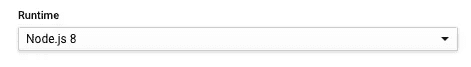

# 云物联网循序渐进:功能、词、词、词

> 原文：<https://medium.com/google-cloud/cloud-iot-step-by-step-functions-words-words-words-30e62edbe73c?source=collection_archive---------0----------------------->

嗨，朋友们！

所以，云函数。它们非常棒，我在[这篇](/@GabeWeiss/cloud-iot-step-by-step-cloud-to-device-communication-655a92d548ca)文章中已经介绍了如何用它们和你的树莓 Pi 对话。虽然 Node.js 是一种很棒的语言，但在物联网世界中，它不是首选语言。根据[Eclipse 基金会在 2016 年进行的这个](https://ianskerrett.wordpress.com/2016/04/14/profile-of-an-iot-developer-results-of-the-iot-developer-survey/)调查(我意识到它已经过时了，事情正在发生变化，但它至少是一个基线)Node.js 在 C/C++、Python 和 Java 之后排名第四，因为 Eclipse 有点偏向 Java。

Node.js 首先发布了云函数，所以我首先介绍了它，但为了确保我介绍了我们的基础，我已经为我们之前在 Node.js 中运行的相同云函数编写了代码，但现在是在 [Python](https://github.com/GabeWeiss/IoT_Core_Quick_Starts/tree/master/03_basics_gcf/python) 和 [Go](https://github.com/GabeWeiss/IoT_Core_Quick_Starts/tree/master/03_basics_gcf/go) 中。

整个过程与之前相同，但是在创建您的云函数时，将`Runtime`下拉列表更改为适当的语言。

一切都是一样的。使用前一篇文章中的脚本启动您的 Raspberry Pi，然后点击云函数细节的`Trigger`选项卡中的端点。对于这个函数，如果你只是去触发器中的 URL，它会发送一个`clear`的`config`类型的消息。就像在之前的教程中一样，在打开的页面上，你可以添加，例如:`?which=command&message=red`，这将向设备发送一条命令消息，该设备应该(假设从上一个[教程](/@GabeWeiss/cloud-iot-step-by-step-cloud-to-device-communication-655a92d548ca)中已经设置好了一切)将 sense HAT 上的所有 led 都变成红色。

我说过一切都是一样的，但是我对代码逻辑做了一个重大的改动，这个改动*可能*已经导致我们的函数不再工作了！我在新函数中依赖的东西叫做`default credentials`。当您创建云函数时，有一个字段用于指定服务帐户。默认情况下，如果你不像我们在使用云功能的第一个版本中那样指定任何服务帐户，那么它将使用该服务帐户来尝试验证该功能正在做的任何事情。因此，根据您使用用户的默认服务帐户对 GCP 项目的访问级别，您可能无法访问物联网核心管理 API。如果您拥有项目的所有者或编辑权限，这可能会神奇地工作，因为您的默认帐户拥有运行该 API 的权限。

此外，和以前一样，您可能会注意到，第一次调用部署的云函数时，运行时间比您想象的要长。那是因为还有冷启动成本。第一次运行任何云功能时，当它启动后端来运行它时，会有一个明显的延迟。可能从一秒到几秒不等。对该函数的后续调用在一段时间内会很快，但超时后，冷启动又会回来。我本来打算写一篇关于优化冷启动的方法以及避免冷启动的策略的博客，但是你瞧！我的同事柯尔特·麦克安利斯去年已经写了一篇《T4 》!那里的技术仍然适用。看看这个。

这个帖子到此为止！我的下一篇文章将会是关于为 Google 创建一个展示我们的 ML/AI 能力的演示，以及 Firestore 和 Android。

我已经[为此开源了](https://github.com/GabeWeiss/google-sorting-demo)代码，我将在接下来的文章中详细介绍！