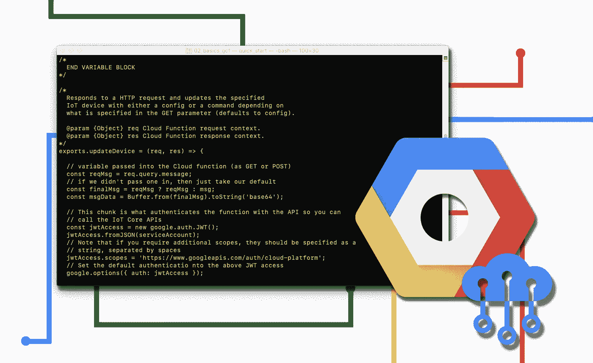

# 云物联网循序渐进:生活质量提示-命令行

> 原文：<https://medium.com/google-cloud/cloud-iot-step-by-step-quality-of-life-tip-the-command-line-ce23046867d4?source=collection_archive---------0----------------------->

嗨，朋友们！

在这篇文章中，我想讨论一个关于使用谷歌云平台的生活质量的话题。我在我的[之前的](/@GabeWeiss/cloud-iot-step-by-step-connecting-raspberry-pi-python-2f27a2893ab5) [帖子](/@GabeWeiss/cloud-iot-step-by-step-cloud-to-device-communication-655a92d548ca)中提到过，在命令行上使用[谷歌云 SDK](https://cloud.google.com/sdk/install) 作为一种快速检查你的消息是否正确地从你的设备向 Pub/Sub 发送遥测数据的方式。对于其中的一些工作(实际上是大部分)，使用命令行比使用 UI/控制台更快。

对于这个快速演示，我只想带您在命令行上完成我们在前两个教程中完成的任务:连接设备并发送遥测数据，将消息发送回您的设备，以及部署云功能。

如果你对 UI 完全满意，那也没问题，这就是为什么我们两个都有。但是使用命令行通常会更快，并且您在命令行上所做的所有工作都可以编写脚本，所以如果您是一个喜欢自动化的人，了解这些东西是很有好处的。希望通过学习我之前的教程，您会对我们将要使用命令行做的事情有一个熟悉的了解。

# 目录:

*   [安装和配置 GCloud SDK](#016c)
*   [在 GCP 创建发布/订阅和物联网核心对象](#cd26)
*   [向您的设备发送消息并部署云功能](#8958)

## 安装和配置 GCloud SDK

第一步，安装 gcloud SDK。它需要 Python，所以如果你还没有 Python，先安装它。它还需要一个谷歌云项目，所以如果你还没有，就[建立一个](/h2/2f27a2893ab5#7f07)。除了创建项目之外，不需要做任何事情。然后按照此处的说明[进行安装。最后一步是让你运行`gcloud init`，让你来处理。很快，它会问你:](https://cloud.google.com/sdk/install)

1.  `Pick a configuration to use`。如果您以前从未这样做过，这可能不会出现，它可能会让您创建一个新的配置。
2.  `Choose account to perform operations`。选择与您创建的 Google 云平台帐户/项目相关的电子邮件。如果您最近没有登录，此步骤可能会弹出一个浏览器窗口，要求您登录该帐户。否则，您应该会看到一条显示`You are logged in as: [email]`的消息。
3.  下一条信息取决于你使用 GCP 的程度。可能是`This account has lots of projects! Listing them all can take a while`。其中的选项包括输入项目 ID(可以从[控制台](https://console.cloud.google.com)获得)、创建新项目或全部列出。否则，您应该只看到您拥有的项目列表。选择您创建的一个。正如您所注意到的，您也可以从这里创建一个项目，但是我发现无论如何在控制台中打开项目还是很有用的。
4.  `Do you want to configure a default Compute Region and Zone?`我这样做是因为我通常不在我的项目中使用多区域，这样可以减少运行所需的标志。点击`Y`弹出所有区域。选一个离你最近的。一般哪个分区域都无所谓。因此，例如`us-central1-a`实际上与`us-central1-b`相同。对于产品来说，您可能希望在使用默认区域时更加小心一些，但是对于这一点来说，这是很好的。注意:并非所有地区都支持所有云产品，因此您可能会发现您选择的地区不适用于物联网产品。例如，物联网核心(当前)的唯一有效区域是`asia-east1`、`europe-west1`、`us-central1`。

在选择(或不选择)您的默认区域后，您应该会看到一串以`Some things to try next`结尾的输出和一些尝试。为了确认安装正确，运行`gcloud --version`，你会看到输出`Google Cloud SDK nnn.n.n`中包含了一些其他的东西。如果你看不到，说明某些东西没有正确安装，请确保你有权限在你的机器上安装这些东西。

现在我们准备好出发了！在任何时候，如果您想探索一点，您总是可以通过`--help`标志来查看哪些组或命令是可用的。

## 在 GCP 创建发布/订阅和物联网核心对象

从我的第一个物联网教程开始，我们得到了一个从一无所有到与互联网对话的设备。查看设置和测试所需的命令行命令:

1.  为我们的遥测数据创建一个发布/订阅主题。
    `gcloud pubsub topics create telemetry-topic`
2.  创建一个发布/订阅订阅，这样我们就可以确认遥测技术已写入我们的主题。
    `gcloud pubsub subscriptions create telemetry-subscription —-topic=telemetry-topic`
3.  创建一个物联网核心注册表来保存您的设备
    `gcloud iot registries create device-registry —-region=us-central1 —-event-notification-config=topic=telemetry-topic`
4.  创建自己的物联网设备(需要安装[openSSL](https://www.openssl.org/source/))
    `openssl req -x509 -newkey rsa:2048 -keyout demo_private.pem -nodes -out demo.pub -subj “/CN=unused”

    gcloud iot devices create device-first --region=us-central1 --registry=device-registry --public-key=path=./demo.pub,type=rsa-x509-pem`
5.  将测试消息发布到发布/订阅主题
    `gcloud pubsub topics publish telemetry-topic --message=red`
6.  阅读发布到发布/订阅订阅的消息
    `gcloud pubsub subscriptions pull --auto-ack telemetry-subscription`

一切都准备好了！前四个部分取代了我的第一个教程[中的所有云项目设置部分。我添加了最后两个用于发布/订阅交互，因为它们对于测试任何下游的东西非常有用，而不需要打开和关闭设备。](/@GabeWeiss/cloud-iot-step-by-step-connecting-raspberry-pi-python-2f27a2893ab5)

别忘了，你仍然需要从谷歌放入`demo_private.pem`和获取`roots.pem`，并把这两个放在设备上，让设备上的任何东西真正工作。

## 向您的设备发送消息并部署云功能

在第二篇教程中，我们从控制台做了一些事情，这些事情我们可以像从命令行一样(或者更容易)做。

1.  向特定设备发送配置消息
    `gcloud iot devices configs update --config-data=”red” --device=device-first --region=us-central1 --registry=device-registry`
2.  向特定设备发送命令
    `gcloud iot devices commands send — command-data=”red” --device=device-first --region=us-central1 --registry=device-registry`
    **注意这个**，如果设备离线，或者如果在线但没有订阅命令 MQTT 主题(`/devices/device-first/commands/#`)那么你会得到一个错误消息(不会伤害任何东西，只是让你知道它没有到达设备)。您不会收到配置消息错误，因为配置会被存储，并在设备连接到物联网核心时发送到设备。
3.  部署一个[谷歌云功能](https://cloud.google.com/functions/getting-started/)。在你已经创建了 package.json 和 index.js 的目录中:
    `gcloud functions deploy test-function --region=us-central1 --entry-point=updateDevice --trigger-http`
    现在这里有很多东西要解包。另一篇博文的主题。这只是在控制台中执行我们在教程中所做的事情，但是从命令行执行。
4.  调用一个云函数
    从技术上来说我们没有这样做，因为我们使用了一个 HTTP 函数，你可以打开它的目标 URL。但是如果你想的话，你可以…
    `gcloud functions call test-function --region=us-central1`
    注意，根据你的函数所做的事情，它可能会崩溃或者做一些意想不到的事情，因为它期望的是输入。从命令行调用函数假设您在请求体中发送数据。例如，我们在第二篇博客中写的代码使用 GET 变量，这是不能从命令行完成的。

## 包扎

所以我们有它！熟悉命令行尤其会加快开发速度。能够弹出一个新设备来测试一些干净的东西，或者推出一个新版本的云功能(特别是让你的本地磁盘版本与你在控制台 UI 中的任何东西保持同步)是非常有价值的。

显然，正如我之前提到的，还有很多，我只是列出了我们在之前的教程中使用命令行所做的事情。在未来的教程中，我将尝试在有简单的命令行时调用我正在谈论的任何部署或调用。

最后一点，如果你开始习惯命令行，但是讨厌一遍又一遍的初始化，你也可以使用云 Shell。在控制台的右上角，寻找云壳图标(它是左边的图标)。它在控制台中打开一个 shell，这个 shell 是针对您的项目环境预先配置的。非常方便。关于这一点也有一整篇文章的内容，幸运的是，你可以在这里找到我的队友写的。

让我知道你对这些教程的看法，以及你接下来想看到什么，或者在下面的评论中，或者在[推特](https://twitter.com/GabeWeiss_)上关注我。我的 DMs 打开了！