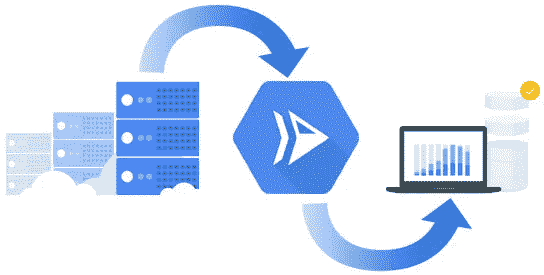
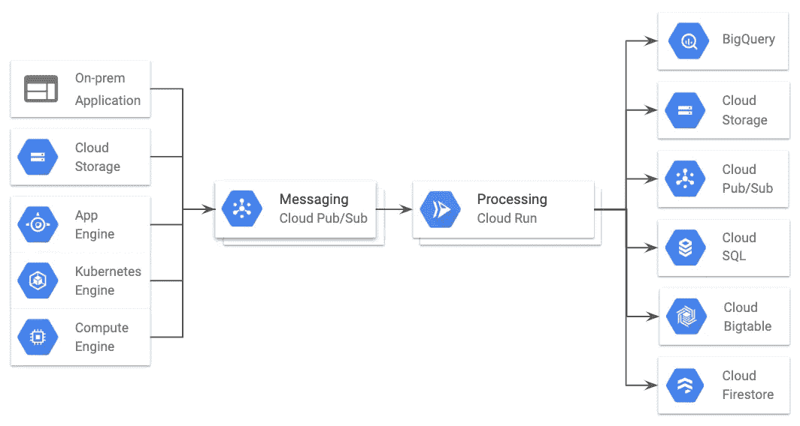
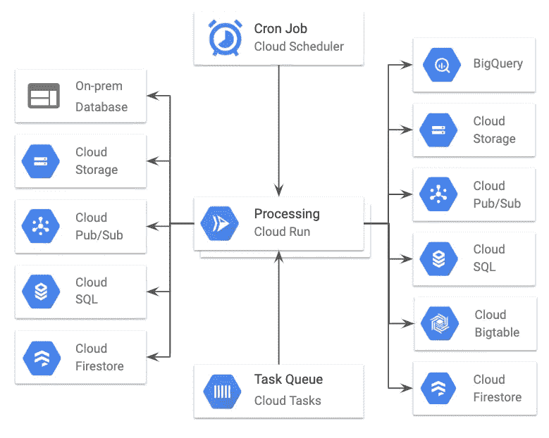

# 将您的 ETL 流程迁移到云运行的云固有优势

> 原文：<https://medium.com/google-cloud/cloud-native-advantages-of-moving-your-etl-process-to-cloud-run-39bf0e6cdee3?source=collection_archive---------1----------------------->

提取、转换和加载(ETL)描述了移动和处理数据以供将来分析的工作流。ETL 过程对于企业做出更好的决策是至关重要的，因为有多种原因—审计/监控、业务分析，甚至是机器学习管道。这些过程包括从简单的脚本到收集流经系统的数据流。

谷歌云平台(GCP)有一些非常强大的数据处理产品，如[云数据流](https://cloud.google.com/dataflow/)和[云合成器](https://cloud.google.com/composer/)(管理气流)。但是，如果您的系统不太复杂或者您的数据量不够大，您可能无法证明迁移到这些技术或专用虚拟机是合理的。通过在[云运行](https://cloud.google.com/run/)的简单的完全管理的容器环境中执行，您可以将复杂性保持在您的控制之内——保持您的 SQL、shell 或 python 脚本。通过这种方式，您仍然可以获得云原生流程的好处，并为您的系统未来做好准备。

# 云的固有优势

将您的 ETL 流程部分转移到云上运行，可以让您获得云的优势，而没有管理基础设施的麻烦。

*   **灵活接收新的数据源**:企业以各种系统和格式存储数据。每种类型的数据可能需要不同类型的转换过程，例如批处理或流数据。云允许您 1)使用一致的消息传递或事件格式，2)快速启动新的微服务以实现更精细的转换。
*   **按使用付费:** Cloud Run 仅在您实际处理数据时向您收费，四舍五入到最接近的 100 毫秒。
*   **可扩展**:你的业务在增长吗？您是否希望扩展到新的地区？你的团队想分析应用内事件吗？您的数据量将会增加。您可以在可扩展的基础设施上构建您的系统。
*   **完全托管**:使用 GCP 的托管服务，您可以专注于业务逻辑，而不是基础设施。
*   **安全**:创建具有内置安全性的管道，这样您就不必担心暴露您的数据或处理服务。
*   **可审计**:整合您的日志，以便快速识别您的管道何时何地出现故障。
*   **低延迟**:实时处理数据，让 Google 处理网络和负载平衡。
*   **数据转换**:集成云 API 或者自带库。
*   **容错**:内置重试功能的云服务允许超时或无法自动重启的作业，或者用于识别所需的补丁。

# 云原生服务

## 云运行

您可以通过[云运行](https://cloud.google.com/run/)来利用这些现成的优势。单个服务可以彼此独立地部署和扩展，这允许您将特定的业务逻辑一点一点地迁移到云中。借助云运行，您可以随时进行扩展，但无需为等待数据的虚拟机付费。当您的 ETL 负载增加时，您的服务会动态地伸缩以匹配数据量，包括当没有东西要处理时减少到零。有了云运行，不需要学习新的技术或语言。您可以用自己选择的语言编写每个处理步骤，并带来自己的运行时和库。您所要做的就是关注您的数据转换。

## 云发布/订阅

[Cloud Pub/Sub](https://cloud.google.com/pubsub/) 是一个全球持久的消息传输服务，支持与其他云平台服务的本地连接，使其成为应用程序和下游处理之间的粘合剂。通过云发布/订阅连接您的服务，以标准化您的事件/数据源，并通过[高吞吐量](https://cloud.google.com/pubsub/quotas)提供扇入、扇出和多对多通信。发布/订阅消息可以由托管在云平台或内部的应用程序生成。发布/订阅消息是容错的—重试传递，直到消息被处理或在保留期(最多 7 天)后过期。

## 云任务

[云任务](https://cloud.google.com/tasks/)是另一种类型的分布式消息队列。如果在 ETL 设计中需要速率限制、任务重复数据删除、可配置重试和任务调度等功能，可以通过扇出和多对多通信用云任务代替发布/订阅。将您的数据细分为云任务可以提高这种架构的容错能力。如果数据处理失败，云任务将处理重试，并允许您确定哪些数据可能丢失。使用云任务触发数据处理允许云运行扩展更多实例或更多并发请求，以便并行处理数据。

## 附加件

*   [**云调度器**](https://cloud.google.com/scheduler/docs/) 是一个云原生 cron 即服务，是一种按计划运行批处理的简单方法。
*   [**Cloud IAM**](https://cloud.google.com/iam/) 通过服务帐户和策略绑定，允许对您的云运行服务进行粒度访问控制。
*   **Stackdriver Logging** 自动与 Stackdriver 集成，整合您在 GCP 服务中的日志。

# 结构

本节描述云运行上的流和批处理风格架构。

## 流式输入

不断将数据推送到端点是 ETL 架构的常用方法，ETL 架构需要以低延迟提供结果。点击流和交易等用户生成的数据是通常推送到端点或产生事件通知的数据的示例。但是，在 Cloud Run 上还不支持流协议。如果您的数据量增长，云运行可以根据需要扩展到任意多个实例。每个实例可以处理多达 80 个并发请求，这样当 ETL 逻辑涉及 I/O 时，您就可以更高效地使用计算资源。

云上托管的流式架构产品示例

[处理云存储教程中的图像](https://cloud.google.com/run/docs/tutorials/image-processing)演示了使用 Cloud Run 以发布/订阅消息的形式接收来自 GCS 的上传通知，使用 Vision API 分析图像，并模糊令人不快的图像。转换逻辑和依赖项被打包在一个容器中，并作为私有服务部署到云上。然后使用 [Cloud IAM](https://cloud.google.com/iam/) ，创建一个服务帐户来授权 Cloud Run 服务的发布/订阅请求。

流式输入的其他使用案例:

*   从多个服务收集数据和日志。
*   通过将事件流式传输到大查询中来跟踪网站活动。

## 批量输入

批处理在具有大量历史数据或需求的场景中很常见，以避免以意外的方式复制或更改数据。批处理架构可能是从只读源或备份中提取数据的唯一方式。要处理的数据源可以位于内部或云平台上，例如[云存储](https://cloud.google.com/storage/)、[云发布/订阅](https://cloud.google.com/pubsub/)、[云 SQL](https://cloud.google.com/sql) 或[云数据存储](https://cloud.google.com/datastore/)。

云运行上托管的批处理架构的示例产品

超时可能是云原生服务的一个限制。云运行的最大超时时间为 15 分钟，默认值为 5 分钟。因此，您必须了解您的转换的处理时间，并添加您自己的实现来正确地设置批处理大小或添加检查点。通过使用云任务来表示单独的数据块，可以实现跨云运行实例的类似地图的分布(类似于 MapReduce)。然后，任务将被分派并行处理。还可以使用云发布/订阅或云任务将转换链接在一起，云任务还提供了重试逻辑。

夜间批处理流程可以使用云调度程序来触发云运行服务，以从云存储中提取数据(例如文件)并创建单独的任务。然后可以使用另一个云运行服务来处理任务数据，并将转换后的数据添加到数据库中。通过云 IAM 服务帐户，可以将 [OIDC 授权令牌](https://developers.google.com/identity/protocols/OpenIDConnect)添加到云任务和云调度程序请求中，以便调用这些私有服务。

其他批量输入用例:

*   将本地数据库迁移到云中。
*   抓取营销源或 API 以创建过期快照。
*   在大文件上运行映射转换。
*   集成来自第三方应用程序的数据。

# **下一步**

*   浏览整个[处理来自云存储教程](https://cloud.google.com/run/docs/tutorials/image-processing)的图像。
*   查看本文提到的产品:[云运行](https://cloud.google.com/run/)、[云发布/订阅](https://cloud.google.com/pubsub/)、[云任务](https://cloud.google.com/tasks/)、[云调度器](https://cloud.google.com/scheduler/docs/)。
*   想在云跑上跑 R？使用 Go 服务器查看示例 [Hello World R，使用水管工](https://github.com/knative/docs/tree/master/community/samples/serving/helloworld-r)查看 [Hello World R。](https://github.com/knative/docs/tree/master/community/samples/serving/helloworld-rserver)