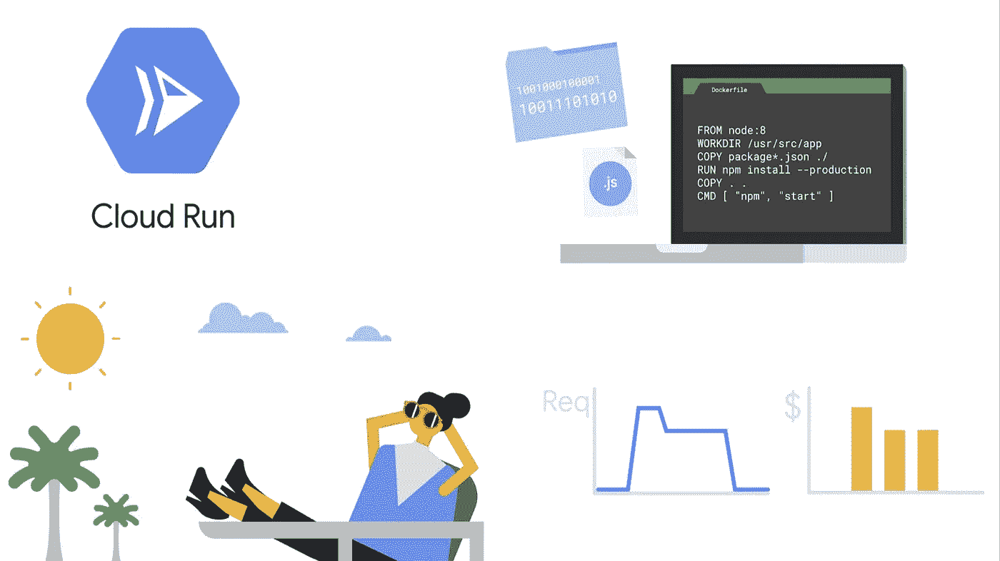
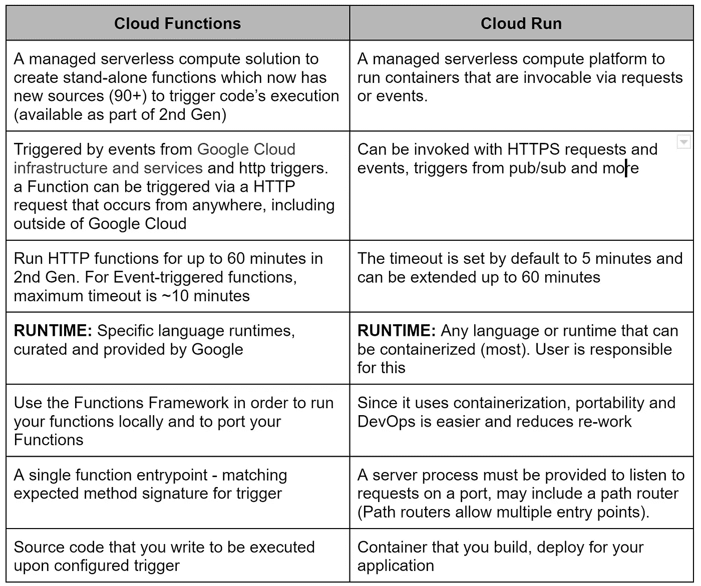
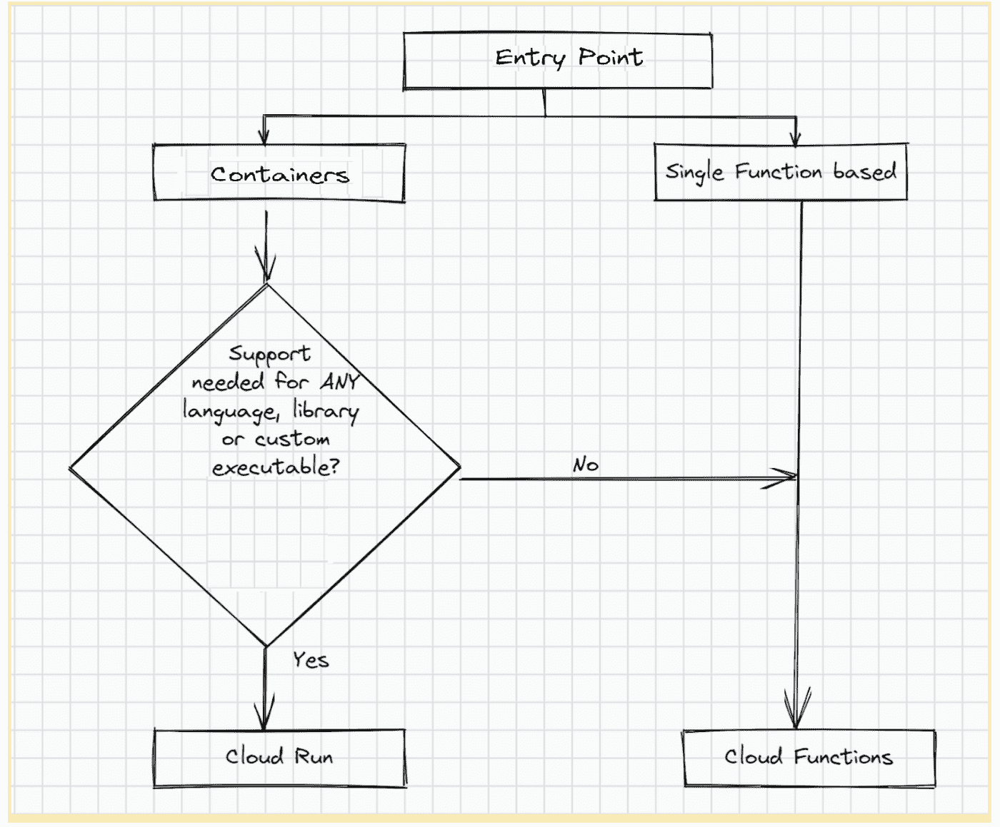

# 满足您无服务器需求的云运行和决策树！

> 原文：<https://medium.com/google-cloud/cloud-run-and-a-decision-tree-for-your-serverless-needs-3d6988f12f9d?source=collection_archive---------3----------------------->

> 在我开始之前:博客中的观点是我自己的，来自我的兴趣和经验，不代表我的雇主、其他公司或任何人。

无服务器允许开发人员专注于他们最喜欢做的事情——开发，而将包括基础设施和维护在内的其余属性留给平台产品。但是，对于选择哪种无服务器选项，总会有一些顾虑和问题。所有无服务器平台产品都因其功能而令人兴奋，例如:

*   无基础设施维护
*   基于使用的定价
*   自动扩展能力

**Cloud Run** 脱颖而出，使我们能够:

*   将代码打包到多个无状态容器中，这些容器能够感知请求，并通过 HTTP 请求调用它，或者作为[非请求驱动的作业](https://codelabs.developers.google.com/codelabs/cloud-starting-cloudrun-jobs-io#0)
*   仅对您使用的确切资源收费
*   支持您选择的任何编程语言或任何操作系统库，或者任何二进制文件，只要您将其容器化

点击此链接了解更多完整的[背景](https://cloud.google.com/run/?utm_source=google&utm_medium=cpc&utm_campaign=japac-IN-all-en-dr-skws-all-pkws-trial-b-dr-1009882&utm_content=text-ad-none-none-DEV_c-CRE_529584319423-ADGP_Hybrid%20%7C%20SKWS%20-%20PHR%20%7C%20Txt%20~%20Compute%20~%20Cloud%20Run_Global%20gap%20analysis-KWID_43700065767178853-aud-970366092687%3Akwd-677335471899&userloc_1007768-network_g&utm_term=KW_cloud%20run&gclid=Cj0KCQjw1tGUBhDXARIsAIJx01lcrrpCE3MLqe4k3MiQdd8ibvGmXduL9kLXELPjodjSu7Gipc5ODYwaAlBkEALw_wcB&gclsrc=aw.ds)下的云运行特性。

我们意识到，在选择最适用的无服务器选项的过程中，可以提供一些提示来帮助您，这将在下面的部分中介绍。

# 关于选择无服务器的常见问题

当没有选择时，我们就有问题；当有太多选择时，我们就有问题。让我们打破这个泡沫。云功能和云运行都是谷歌云的无服务器产品，但具有不同的特点、方法和开发范围。

**云函数**是事件驱动的无服务器函数，允许您编写单独的云函数代码(在“F”函数代码中有多个助手“F”函数),并在特定事件触发时调用这些函数。云功能支持在自己的运行时环境中运行的单个服务，并且数据不会在服务之间共享，除非您在云存储中涉及到数据库或可写文件。虽然云功能通常用于我们有明确定义的输入的用例中，以提供合理的短输出，并将您的工作负载划分为独立的工作单元，但这些天客户使用云功能的程度已经扩大，请参考下面这篇文章中题为“在您离开之前”的最后一节。更多详情，请参考[文档](https://cloud.google.com/functions#section-5)，此处为[，此处](https://cloud.google.com/functions/docs/concepts/exec#stateless_functions)为[。](https://cloud.google.com/blog/topics/developers-practitioners/avoiding-gcf-anti-patterns-part-2-how-reuse-cloud-function-instances-future-invocations)

**Cloud Run** 是一个完全托管的无服务器平台，它将您的代码/应用打包并运行在无状态的单个容器中，并根据需要自动扩展，从 0 到您使用的数量，与云代码、云构建、云监控和云日志完全集成。它非常适合大规模的 web 应用程序和服务。查看此链接了解更多云运行特性，以及完整的[上下文](https://cloud.google.com/run/?utm_source=google&utm_medium=cpc&utm_campaign=japac-IN-all-en-dr-skws-all-pkws-trial-b-dr-1009882&utm_content=text-ad-none-none-DEV_c-CRE_529584319423-ADGP_Hybrid%20%7C%20SKWS%20-%20PHR%20%7C%20Txt%20~%20Compute%20~%20Cloud%20Run_Global%20gap%20analysis-KWID_43700065767178853-aud-970366092687%3Akwd-677335471899&userloc_1007768-network_g&utm_term=KW_cloud%20run&gclid=Cj0KCQjw1tGUBhDXARIsAIJx01lcrrpCE3MLqe4k3MiQdd8ibvGmXduL9kLXELPjodjSu7Gipc5ODYwaAlBkEALw_wcB&gclsrc=aw.ds)。

> **那你问 App Engine 呢？** App Engine 是谷歌于 2008 年推出的首款完全托管的无服务器产品。Cloud Run 是作为下一代应用引擎构建的，它利用了容器的可移植性和 k-native 规范。
> 
> Cloud Run 具有与 App Engine Standard 完全相同的功能，并允许从源进行[部署——不需要容器知识。鼓励新用户考虑在云上运行工作负载，以受益于更多的 CPU 和内存(32 GB 和 8 个 vCPU)、更快的功能速度以及在每个地区部署多个项目的能力(App Engine 限制每个地区只能部署一个 GCP 项目)。](https://cloud.google.com/run/docs/deploying-source-code)
> 
> 没有计划弃用 App Engine。它将继续支持其用户和未来的路线图。

# 一些关键特性的并列列表(非比较):

# 决策图有助于高层次的理解

值得注意的是，云功能第二代支持并发和更多有用的功能，几乎缩小了差异。你可以在这里找到第二代[云功能的高级特性和差异列表](https://cloud.google.com/functions/docs/2nd-gen/2nd-gen-differences)。

# 在你走之前…

话虽如此，我知道没错(唉)，总有例外:)我们有云功能的客户，他们将云功能用于更广泛的用例，而不仅仅是他们机器上的一页代码。例如，关于集成层的 ETL 是我一直以来的最爱之一。我们的客户拥有使用云功能实现从数据摄取到 ML 的集成的成功案例。云运行的特性和用例是无穷无尽的，您可以在[文档](https://cloud.google.com/run#section-12)中更深入地了解具体的用例。

现在，您已经了解了一些关于可用类型和选项的提示，不如更进一步，用 Cloud Run 创建您最喜欢的应用程序？参考以下资源，了解快速简单的步骤:

**云运行示例:**[https://code labs . developers . Google . com/code labs/Cloud-Run-hello # 4](https://codelabs.developers.google.com/codelabs/cloud-run-hello#4)