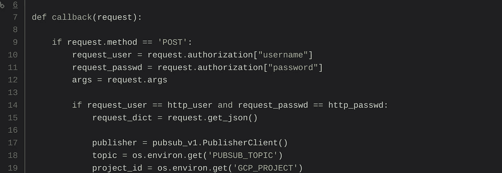
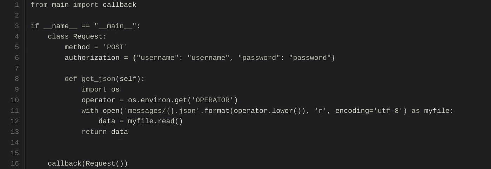
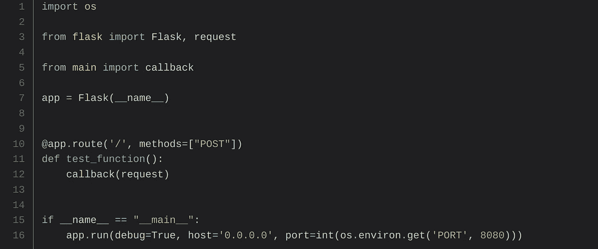

# 云运行和云功能:我用什么？为什么呢？

> 原文：<https://medium.com/google-cloud/cloud-run-and-cloud-function-what-i-use-and-why-12bb5d3798e1?source=collection_archive---------0----------------------->

2019 年 4 月，在 Google Next event 上，Google 公布了新的无服务器产品: **Cloud Run** 。我是一名云运行 alpha 测试人员，我在许多用例上测试了这个非常棒的产品。我也很荣幸在旧金山和巴黎的舞台上(谷歌云峰会)展示我对这款产品的体验。

**Cloud Run** 是谷歌其他无服务器产品的补充，尤其是云功能。即使每个产品都有一个典型的用例及建议，一些用例也可以用几种产品以几种方式实现。那么，我在目前的开发中使用的是什么？我为什么要做这个选择？

在继续之前，这里有一个每个产品的快速概述

# 云函数

[云功能](https://cloud.google.com/functions/docs/)是无服务器、单一用途和事件驱动的解决方案。它们也可以由 HTTP 请求触发。每个请求/事件都由该函数的一个新实例处理，并在每次调用之间提供一个强隔离。

目前已正式上市。像 NodeJS8、Python3.7、Go 1.11 等几种语言处理；测试版中的 NodeJS10 在 Alpha 中，Go 1.12 和 Java

只提供代码和依赖项列表，平台完成所有剩下的工作:打包、部署和运行代码。

**典型用例**

单一用途工作负载，尤其是事件驱动的工作负载(PubSub、存储、Firestore/Firebase 等)，但也有 HTTP 触发的工作负载。可能的语言仅限于 NodeJS 8/10、Go 1.11/1.12 和 Python3.7，并且只有依赖关系是公共可达的(Java 没有*)。图像转换、微批处理(持续时间不到 9 分钟)、流处理……是常见的使用案例*

# 云运行

[云运行](https://cloud.google.com/run/docs/)建立在 Knative 之上，它允许以无服务器的方式为无状态容器提供服务，并且它本身是可移植的。只需要运行带有 HTTP 端点的无状态容器。没有语言、二进制和依赖关系的限制。

通过这种方式，容器必须集成一个 web 服务器，并且可以同时处理几个请求，因此可以是多用途的。

容器包装必须在部署之前完成。为此可以使用云构建，或者在本地使用 Docker 或其他工具(如 Kaniko 或 Jib)

**典型用例**

所有工作负载都在无状态模式下工作，处理时间少于 15 分钟，可以由一个或多个 HTTP 端点触发，如 CRUD REST API。语言、库和二进制文件都不重要，只需要一个容器。网站后端、微批处理、ML 推理……都是可能的用例

> 然而，当我想在 Python、Go 或 NodeJS 中实现由 HTTP 请求触发的工作负载时，比如由云调度器或单用途 HTTP webhook 触发的批处理，**我应该使用什么**？

可以使用云函数来解决这个问题。单一目的，http 触发和 GA 语言。但是也可以构建一个 HTTP 容器，并使用 Cloud Run 部署它。

当我不得不应对这个问题时，**我总是使用云运行**。为什么？事实上，对于单一用途来说，这种选择似乎有些过了。然而，我有两个主要原因

# 轻便

当你为云运行开发时，你必须构建一个容器。该容器能够部署在任何地方:本地、库伯内特/GKE、云运行(无服务器和 GKE)、虚拟机……任何地方。

另一方面，部署在 Cloud Function 上的代码隐含地假设在某个地方有一个 web 服务器，能够将请求路由到代码。为了改变执行环境，你必须重新打包代码，也许在一个容器中，但是至少在它前面有一个 web 服务器。

当你想改变环境时，云运行在减少重复工作和重构方面有很强的优势。而且，你不那么局限于谷歌云。

# 易测性

在关键任务开发中，可测试性和可靠性至关重要。我在这里不是在讨论单元测试，而是在讨论端到端测试，也称为“集成”测试。在实时物联网应用的生产环境中，我们不能接近或接受由于错误版本而丢失消息。

通过云函数，代码处理执行环境的 web 服务器转发的请求。

具有基本授权的 Python 回调云函数

因此，为了测试您的功能，您必须模拟 webserver 请求，并正确填充代码参数中传递的请求对象。*不确定那是最好的方式，但是，* [*即使在 GCP doc*](https://cloud.google.com/functions/docs/bestpractices/testing#functions-testing-http-example-python) *中，也没有 Python 中的例子；我用我的(低)Python 水平做了我能做的- >我乐于接受建议！*

使用回调云函数的自定义请求测试代码

**问题来了**:你怎么确定模拟的对象是正确的？您知道这个对象中传递的所有头吗？如何设置基本身份验证、不记名或 API 密钥？知道云函数环境下使用的请求对象的版本吗？

***就我个人而言，我无法回答这些问题。****加入你团队的新开发人员，他有能力吗？而且，我对自己的测试代码不自信，**对测试不自信是个问题**！*

*我解决这个问题的方法是创建一个测试文件，用一个 web 服务器导入函数代码。*

**

*测试 web 服务器的云功能*

*要启动测试，只需用 CURL 命令调用 web 服务器。这样，web 服务器将使用所有规则和参数正确格式化您的请求对象，并将其转发到您的代码。额外的好处是你可以改变你的 web 服务器，甚至你的开发语言，而不需要改变你的 CURL 测试请求。*

*而且，正是在这个时候，**云运行才有意义**。在这种背景下，云运行无非是云功能代码+简单的转发请求的 webserver。只需为您的语言添加一个[标准 docker 文件](https://cloud.google.com/run/docs/quickstarts/build-and-deploy#containerizing)。而且结束了——你没有一个带测试服务器的云功能，而是一个打包好的容器，随时可以部署在 Cloud Run 上。*

# *云每次运行！*

*因此，云运行是云功能的简单性、端到端可测试性和可移植性的良好结合。许多痛点被解决，许多优势被获得，这就是为什么**为所有无状态 HTTP 容器使用并推荐云运行，**甚至为像 **PubSub** (为调用云运行创建推送订阅)或 **Storage** (在 GCS 上创建 PubSub 通知)这样的事件。到目前为止，对于其他事件，云功能是不可避免的。*

*此外，您可以考虑云运行的其他几个优势，比如在一个部署中**处理多个入口点**的能力。或者，能够运行长达 15 分钟的**工作负载**(使用云功能只需 9 分钟)。此外，在并发处理多个请求(最多 80 个)时，只对**充电一次**和受冷启动影响一次**的能力，但代价是所有请求之间的隔离/内存共享损失(如果将 concurrency 参数设置为 1，云运行也是可能的)。***

*最后，对我来说，**云运行是大多数用例的最佳解决方案**。开发团队非常活跃，新功能不断增加:指标、云 SQL 连接、服务帐户身份……我强烈推荐您继续关注这款产品，它将成为所有用途的必需品！*

*[Google 云博客上的云运行](https://cloud.google.com/blog/products/serverless/3-cool-cloud-run-features-that-developers-love-and-that-you-will-too)
[云运行产品页面](https://cloud.google.com/run/)
[云功能产品页面](https://cloud.google.com/functions)*