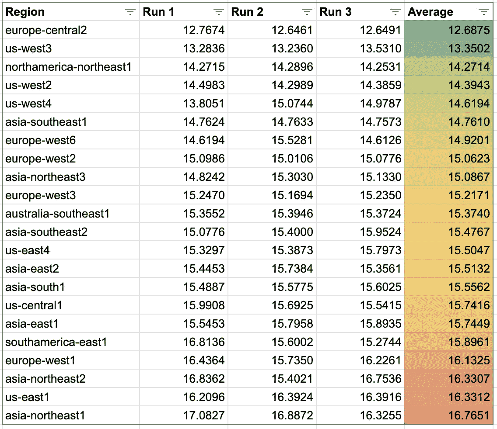
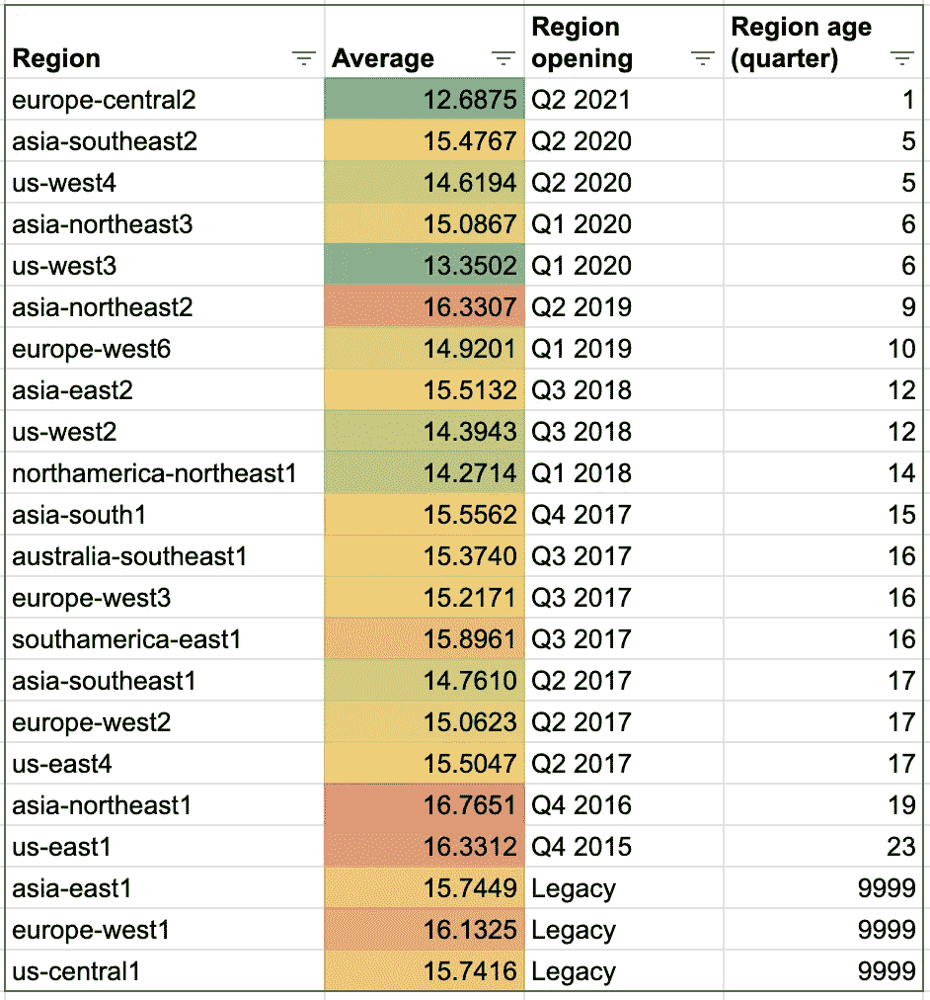
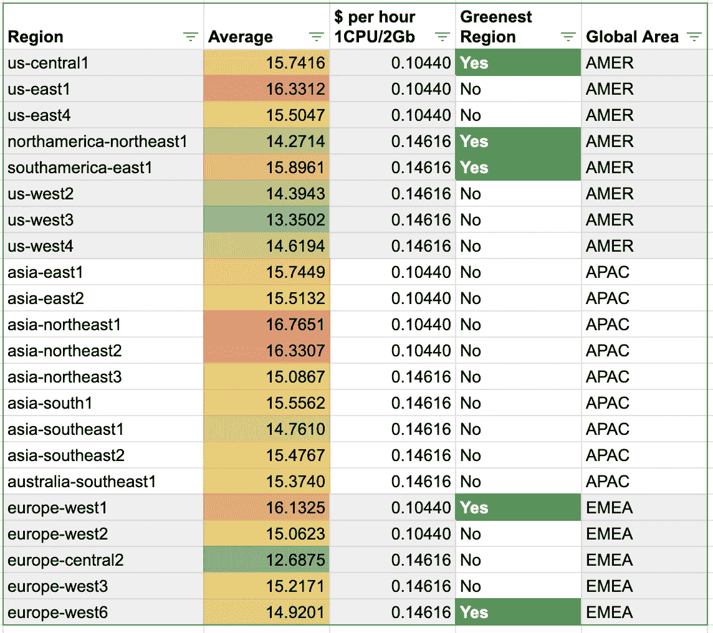
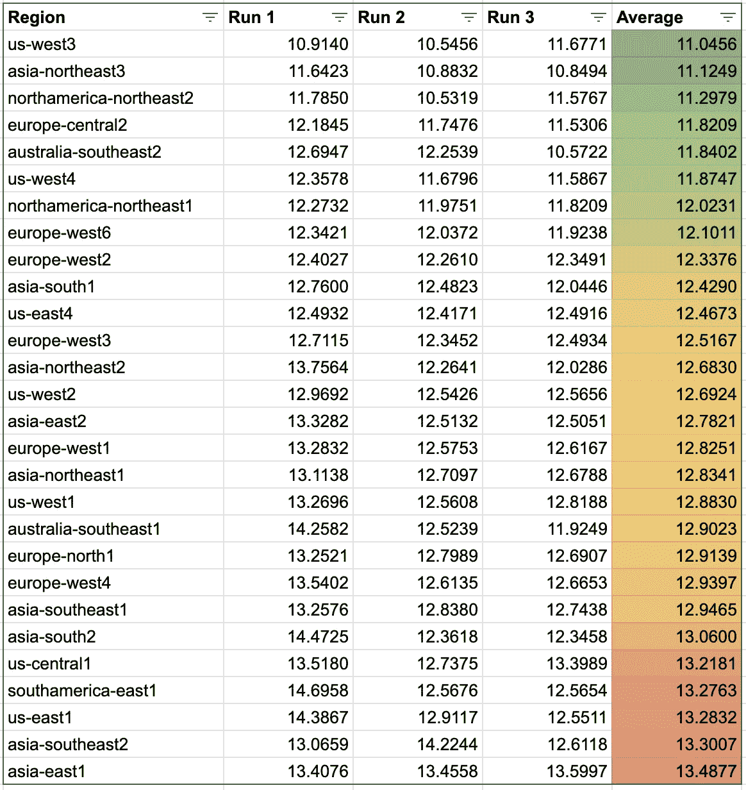
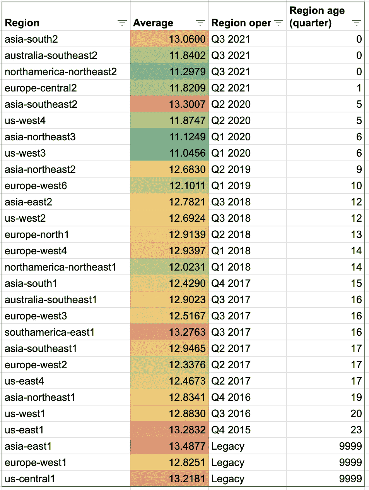
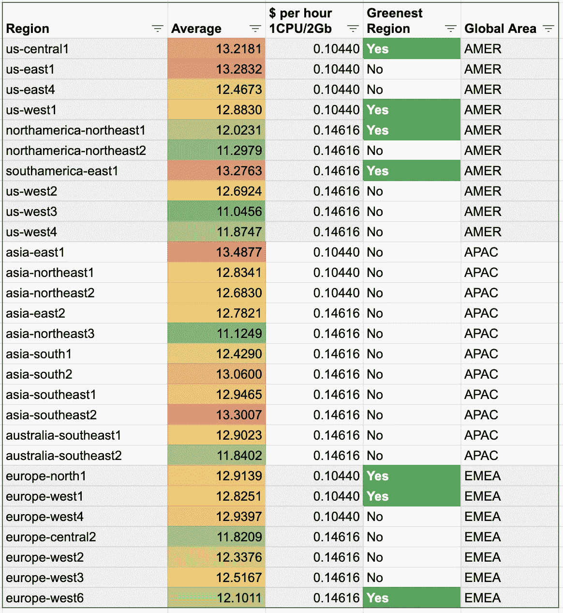
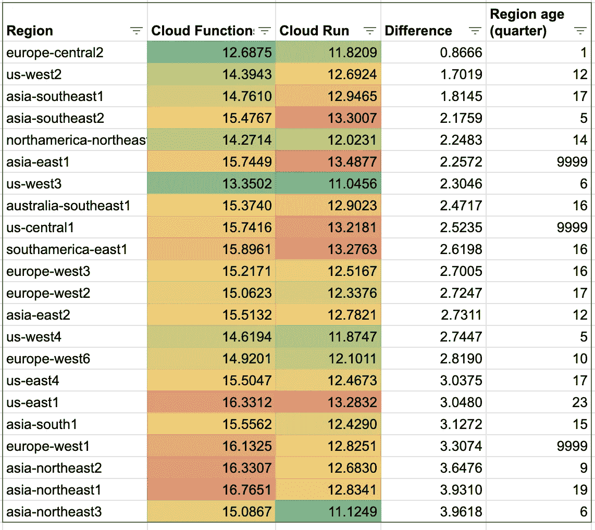

# 云运行和云功能:区域是否改变性能？

> 原文：<https://medium.com/google-cloud/cloud-run-and-cloud-functions-does-the-region-change-the-performances-b967e5cee0cc?source=collection_archive---------1----------------------->

**无服务器是云和应用架构的游戏规则改变者**。我是这项技术的忠实粉丝，**抽象了服务器层，以及它所隐含的所有辛劳**:监控、冗余、修补、扩展……

但是，您对底层基础设施的控制**较少**。在[之前的一篇文章](/google-cloud/bigquery-tell-me-your-region-i-will-tell-you-your-speed-41dcf42b8cc)中，我展示了另一个无服务器产品 BigQuery，它根据地区的不同有不同的处理性能；主要与地区年龄有关。**云运行和云功能也是无服务器**产品，

> 云运行和云功能在不同地区之间是否也存在性能差异？

# **测试协议**

这里，我再次将我的测试集中在**处理性能**上。为此，我使用了斐波那契算法(在递归模式下)来测试 CPU 的处理速度。**云运行和云函数使用完全相同的算法。**

*你可以在 GitHub* 上找到 [*云运行代码*](https://github.com/guillaumeblaquiere/serverless-perf-test/blob/main/cloudrun/main.go) *和* [*云功能代码*](https://github.com/guillaumeblaquiere/serverless-perf-test/blob/main/cloudfunctions/main.go)

## *部署测试环境*

*你可以**在你这边**重现测试。为此，您可以通过运行`deploy.sh`文件来部署您的环境。它**在产品的所有可用区域**上部署代码(在云上运行比在云函数上稍微多一点)。*

**云功能和云运行都部署了 1vCPU 和 2Gb 内存，以便能够在最后进行比较。**

*另外，还有**在云运行**封装上没有特别优化。我在 Cloud Run 上使用了 [Buildpack 打包 alpha 特性](https://cloud.google.com/blog/products/containers-kubernetes/google-cloud-now-supports-buildpacks)。它也是 Buildpack，用于在幕后构建云功能。*

## *运行测试*

*`test-fibo.sh`对每个部署区域执行**相同的请求。我选择计算 Fibonacci(47)，因为它**需要 10 到 15 秒**来计算，**最小化/隐藏冷启动** *(对于 Golang 应用程序非常低)*和**请求传输延迟** *(你可以通过查看结果来说服自己。本人位于法国，部分亚美地区表现非常好，部分欧洲地区表现不太好)*。***

*我**运行了 3 次相同的测试**以获得每个区域的平均处理值。*

## *打扫*

*您可以使用脚本`destroy.sh`运行清理。这将删除服务部署。即使让未使用的服务出现在你的项目中不需要任何成本，它也会在你的项目中制造噪音！*

# *每个地区的云功能性能*

*第一次测试:**云函数。**这里是 3 次运行后的性能结果。*

**

*哇，我**没想到会是这样的结果**！我们可以观察到最慢和最快区域之间的 **4 秒，30%！***

*我对 BigQuery 的假设是，该地区的年龄与表现相关。让我们来看看云函数。*

**

*这次，**就没那么明显了**。当然，对某些地区来说确实如此，尤其是最古老的地区似乎最慢，而`**us-west3**` **和** `**europe-central2**` **证实了越年轻越快。***

*但是`**asia-northeast2**` **和** `**asia-southeast2**` **是反例。***

*最后比较，为了做出正确的选择，我们必须**了解区域成本和区域的 CO2 影响**，以便有能力选择最快、[最便宜和/或最环保的区域。](https://cloud.google.com/functions/docs/locations#tier_1_pricing)*

**

*这里，**结果与 BigQuery** 一致。**最高价格比最低价格提供更好的全球性能**。*

# *每个地区的云运行性能*

*然后，云跑了。这是 3 次运行后的性能结果*

**

*这里，最慢和最快的区域之间的**差异也高达 2.5 秒，即 20%。***

*现在，让我们把它和这个地区的年龄联系起来。*

**

*在全球范围内**这一次，越年轻越快**，但也有例外:`asiasouth2`和`asia-southeast2`是最近的地区，在这次测试中是最慢的。*

*在最快、[最便宜和/或最环保的](https://cloud.google.com/run/docs/locations#services)地区中做出正确选择的最后一张表。*

**

*希望**“越慢越便宜”**的规则再次得到执行。*

# *云运行与云功能性能*

*因为我在完全相同的条件下运行**测试，即:***

*   *两个平台上都有 1 个 vCPU 和 2Gb 内存*
*   *完全相同的 Fibonnaci 代码*
*   *相同的容器打包引擎(buildpack)*

*我发现比较两种无服务器产品的性能很有趣。*

**我只保留了公共区域，并根据云运行中云函数之间的性能差异进行了排序。**

**

*令人惊讶的是，**一种产品的区域表现*颜色*排名并不预先假定同一区域中另一种产品的表现**。*

**除了*`*europe-central2*`*`*northamerica-northeast1*`*`*us-east1*`*。****

**另外，**云功能和云运行之间有长达 4 秒的执行时间差**。**

**令人惊讶的是，据我所知，这两款产品共享相同的底层基础设施，这是我没有预料到的结果。**

*   **是云功能的自动打包拖慢了执行速度？仅仅因为包装的原因，10%到 30%的损失就太高了。**
*   **是产品时代？
    *这是我的最佳假设，但是“共享底层基础设施”并不完全准确，或者至少对于“计算”(CPU/内存)部分来说是不准确的；但是对于网络、安全、可伸缩性管理(…)部分来说可能是真的。***

# **区域和绩效影响**

**无服务器实际上就是他的意思:你**不管理底层基础设施、**服务器类型、CPU 生成、网络性能……因此，**你依赖于数据中心升级和版本**。**

**与 BigQuery 相比，即使处理时间更慢，成本也是一样的，在这里，**我更担心这些结果**。事实上，在一个慢行区域，你的罚分是双倍的:**

*   ****处理时间更长**，因为您为使用的 CPU/内存时间付费，**您将支付更多的费用****
*   ****用户体验受到更高延迟的影响** ( *实际上，对于非计算密集型请求，终端用户看不到差异)***

**此外，云函数和云运行之间的**性能差异是在任何情况下都只能使用云运行**；[云函数在云运行上有优势的案例](/google-cloud/cloud-run-vs-cloud-functions-whats-the-lowest-cost-728d59345a2e)现在已经非常少了。**

**但是，请记住，谷歌云可以在任何时候**更新其数据中心硬件**，而不会发出通知和警告，并且当前结果**可能在 3、6 或 12 个月内出错**！**

> **不要依赖基础设施，它是无服务器的！**

***你可以在我的* [*GitHub 库中找到自己运行测试的代码。*](https://github.com/guillaumeblaquiere/serverless-perf-test)**