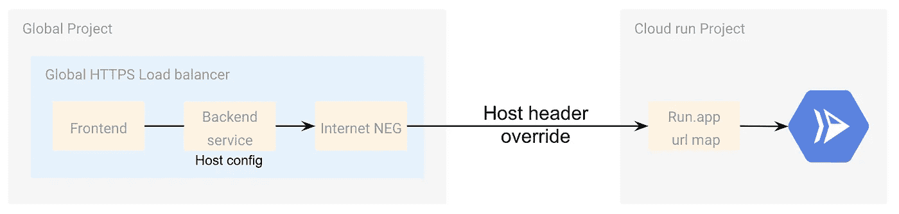
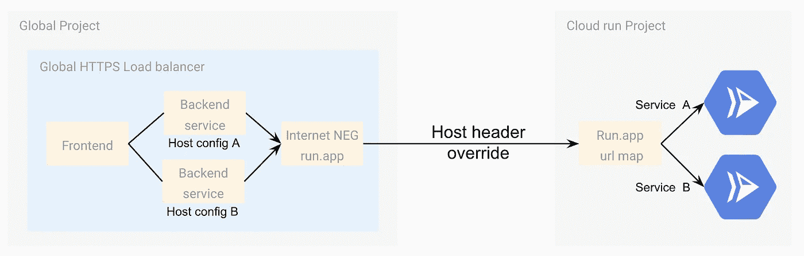

# 云运行和负载平衡:超越您自己的项目！

> 原文：<https://medium.com/google-cloud/cloud-run-and-load-balancing-go-beyond-your-own-project-adfa1c8b001d?source=collection_archive---------0----------------------->


路由和负载平衡是互联网及其可扩展性的**支柱。在谷歌云上，由于部署在全球 HTTPS 负载平衡器上的**全球网络和选播 IP** ，这些方面都很棒。
像其他云服务一样，**无服务器计算产品**(应用引擎、云功能和云运行)在几个月前已经获得了**负载平衡能力**。**

最有趣的负载均衡特性之一是**将流量**从负载均衡器路由到离用户位置最近的部署服务**的能力。从而无论用户在哪里，都具有最佳的等待时间。**

# 用于无服务器负载平衡的无服务器 NEG

为此，如[文档](https://cloud.google.com/load-balancing/docs/https/setting-up-https-serverless)、[博客](https://cloud.google.com/blog/products/networking/better-load-balancing-for-app-engine-cloud-run-and-functions)和[文章](https://ahmet.im/blog/cloud-run-multi-region/)中所述，您必须使用**无服务器 NEG** (网络端点组)并将部署在不同地区的服务添加到其中。

使用无服务器 NEG 作为负载平衡器后端，享受！

当所有的服务和**负载均衡器被部署在同一个项目**中时，这种情况是完美的。并且[无服务器负仅符合这种情况](https://cloud.google.com/load-balancing/docs/negs/serverless-neg-concepts#limitations)

> 使用无服务器 NEG 后端的负载平衡器必须在与 NEG 指向的云运行(完全受管)、App Engine 或云功能服务相同的项目中创建。

然而，**现实往往不同**。有时，出于不同的原因，您需要**重用其他项目的服务**:

*   **账单约束**:每个项目都需要有自己的账单，因为在某些用例中标签是不够的。
*   **团队组织和部署速度**:通常是一个数据科学家团队，为一个或几个 web 团队可用的模型服务
*   **安全隔离:**具有 IAM 策略的最小特权原则

云运行尤其如此，因为我们开发的越来越多的服务都托管在云上。

> 如何将负载平衡器与部署在其他项目中的云运行服务结合使用？

# 互联网负面解决方案

最近又推出了一种新型 NEG:[**互联网 NEG**](https://cloud.google.com/load-balancing/docs/negs/internet-neg-concepts) 。它的目的是将来自全局 HTTPs 负载平衡器的请求**路由到一个互联网端点**，该端点由它的 IP 或完全限定的域名定义。

因此，这符合我的使用案例！我们可以使用互联网 NEG 对外调用它，而不是用无服务器 NEG 在内部调用云运行服务。


我们走吧！

## 创建 hello world 云运行

*   在菜单中，转到云运行
*   点击`CREATE SERVICE`
*   说出它的名字，选择你的地区。在步骤 2 中，使用示例容器


*   最后，允许未经验证的连接，以便于测试

所以，现在，**获取服务 URL** ，如果你想测试的话。请保留这个网址，我们以后会用到它。

## 创建一个互联网负

*   在菜单中，进入`Compute Engine` - > `Network endpoint groups`


*   点击`CREATE NETWORK ENDPOINT GROUP`
*   说出它的名字，并选择一个`Network Endpoint Group (Internet)`类型


*   然后，默认设置端口 443，并在`Add through`部分选择`Fully qualified domain name`。


*   填写您的云运行服务 URL(不带`[https://](https://))` [)](https://)) ，然后点击 create

完美，现在最新，也是最大的一块，**让我们配置一个 HTTPs 负载均衡器**。

## 创建全局 HTTPS 负载平衡器

*   在菜单中，点击`Network services`
*   点击`Create a load balancer`
*   点击`Start configuration`进行 HTTPS 负载平衡


*   从互联网上曝光，点击以下屏幕中的`continue`
*   在`Backend configuration`中，选择一个`Backend service`和`Create a backend service`


*   在新的屏幕上，命名你的后端，选择`Internet network endpoint group`


*   选择 HTTPS 协议来调用您的云运行服务以及您之前创建的互联网网络端点组的名称


*   点击底部的`Create`

**后端到此结束！**让我们继续配置
*让主机和路径规则保持原样，转到前端配置*

*   命名并选择您的协议。*您可以选择 HTTPS，但是 HTTP 也可以工作，而且配置更容易(无需管理证书和 DNS)。*


*   使用最简单的配置，然后单击 create。

现在负载平衡器正在创建；等待几分钟以完成并**在全球范围内分发配置**。

考验的时候到了！回到您的负载平衡器并复制 IPv4。


将其粘贴到您的浏览器中..**失败！！！是失败，这个解决方案行不通！** 你应该有一个 404，这个不会变。

# 云运行路由

问题来自**云运行路由模式**。云运行服务提供的 URL 没有绑定到 IP 或 CNAME，**路由基于请求头**的 `**host**` **值。**

令人惊讶的是，**让我们验证一下这个**，并直接在云运行的根域`run.app`上用`curl`试试。我们将只在`host`头中添加云运行服务完全限定名(URL 不带`[https://](https://))` [)](https://))

```
curl -H "host: <Cloud Run fully qualified name>" https://run.app
```

**管用！！**是的，通过该解决方案，您可以访问任何云运行服务，您只需知道服务的确切 URL 名称。事实上，这并不奇怪，因为 Kubernetes 和 Knative 的工作原理是一样的。

现在**我们知道了路由模式**，我们可以回到之前的配置，重新审视这个问题:

> 请求头中的`host`是负载平衡器的 IP 地址(或者您自己的域名，如果您设置了它的话)。

因此，为了解决这个问题，我们必须用后端自定义头文件覆盖[负载平衡器的后端配置中的**头文件** `**host**` **。**](https://cloud.google.com/load-balancing/docs/custom-headers)



## 后端自定义标题

*   回到负载均衡器，编辑它，然后回到你的后端。
*   在底部，点击`Advanced configuration`
*   然后点击`Add header`
*   并添加`host`作为键，以及云运行服务的全限定名作为值


*   并点击`Update`
*   在负载平衡器编辑页面的`Update`上再次点击

这里，再次等待几分钟，等待配置广告。并再次测试您的 IP。

**嘣！这下有用了。！**

> 这对于 1 个服务来说很好，但对于几个云运行服务来说怎么办呢？

# 多云运行服务路由

当您有几个云运行服务需要调用负载均衡器时，在相同的其他项目或不同的项目中，**直接的想法是为每个服务重复相同的模式**

*   创建一个互联网负
*   创建后端
*   自定义主机和路径规则

实际上，你不需要为每项服务创建一个网络负数，你可以作弊！

事实上，因为**所有的云运行服务请求都位于** `**https://run.app**` **URL** 上，所以您可以只创建**一个互联网 NEG** ，并在多个后端定义中使用它，其中您只**定制** `**host**` **请求的头部，以将流量路由到正确的云运行服务**。



让我们部署这个！

## 创建新服务

像前面一样，首先创建一个新的云运行服务。您可以使用相同的示例容器图像。

获取 URL，我们稍后会用到它

## 更新您的" *generic"* Internet NEG

*   回去你的网络否定
*   您不能更新当前端点。所以，选中它，点击`Remove endpoint`；确认删除
*   并点击`Add network endpoint`。
*   简单地添加值:`run.app`


*   并点击`Create`

*什么也没有出现。等待几秒钟，创建结束，您的端点出现！这是一个用户界面故障。*

## 添加第二个后端

*   回到你的负载平衡器，点击`Edit`并转到后端部分。
*   `Create a backend service`和前面一样，选择 Internet NEG 类型、`HTTPS`协议，选择您的*通用* Internet NEG，然后转到`Advanced option`用您的第二个服务的云运行服务全限定名称覆盖`host`标头。


*   并点击`Create`

## 自定义主机和路径规则

这种定制可能很复杂。但是我的要求是:

*   我想到达路径`/hello2`上的第二个云运行服务
*   第二个云运行服务没有路径`/hello2`。所以我需要重写`/`的路径

我们来配置这个吧！

*   选择`Advanced host and path rule`单选按钮并点击`Add host and path rule`


*   首先，定义主机名过滤。就我而言，我不在乎。我设定`*`
*   然后，点击默认路径的铅笔，默认选择后端。*这一条哪答上* `*/*` *路径上的负载均衡器*


*   还有`Save`
*   然后，点击`Add path rule`配置第二个服务
*   添加路径，在我的例子中是`/hello2`，并选择我的第二个后端。
*   但是，我需要重写路径。为此，点击`Add-on action`，并在`Path prefix rewrite`上设置`/`


*   并点击`Save`
*   点击`Update`保存负载均衡器的新配置

再次等待几分钟，并在`/`路径和`/hello2`路径上测试您的 IP。

**恭喜恭喜！！！**您有一个负载均衡器，在不同的项目中部署了几个云运行服务！！

# 路由到最近的位置

这种配置很好，但是您失去了全局 HTTPS 负载平衡器的一个主要优势:将请求路由到最近位置的能力。

在这种情况下，你必须结合

*   **无服务器 NEG** :用于多区域服务，作为 HTTPS 负载均衡器的后端，全部在同一个项目中
*   **Internet NEG**:外部访问多区域云运行服务的负载均衡器。

由于无服务器 NEG 的限制，该解决方案只有在多区域云运行服务部署在同一项目上时才有效。
*换句话说，* ***你不能按区域*** *配置一个项目。*

为此，有两个主要步骤:

1.  首先，在多区域项目中创建一个 HTTPS 负载平衡器。使用标准无服务器 NEG。这里，使用 HTTPS 协议进行前端配置很重要。
    *它的* [*记载了配置*](https://cloud.google.com/load-balancing/docs/https/setting-up-https-serverless#console_1) *。*
2.  然后，在另一个项目中创建另一个 HTTPS 负载均衡器，使用多区域 HTTPS 负载均衡器的 IP 或域名的 **Internet NEG。
    *这一次，不需要覆盖* `*host*` *请求的头值，因为您不直接访问云运行服务，而只是另一个负载平衡器，它将通过无服务器 NEG 自动执行此操作。***


因为因特网 NEG 和多区域 HTTPS 负载平衡器之间的通信是通过因特网进行的，所以在文档中强烈建议使用[**【HTTPS】**](https://cloud.google.com/load-balancing/docs/negs/internet-neg-concepts#backend_service)

> **我们强烈建议您在使用互联网 NEG 配置后端服务时使用 **HTTPS** 或 **HTTP/2** 作为协议，以便在通过公共互联网时，外部 HTTP(S)负载平衡器和您的后端之间的通信得到加密和认证。**

# **超越极限！**

**即使这些解决方案看起来很容易实现和使用，重要的是要记住每一跳(通过负载均衡器)意味着:**

*   ****潜伏期**，甚至几毫秒。**
*   **您的架构中新的可能的**故障点****
*   ****负载平衡器的额外成本****

**最终，由于互联网 NEG 的能力，无服务器 NEG 的仅限于项目的限制不再是限制。通过负载平衡器、请求头和 URL 映射的组合，**有可能解决所有用例**！**