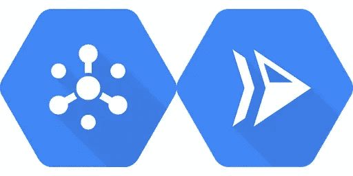
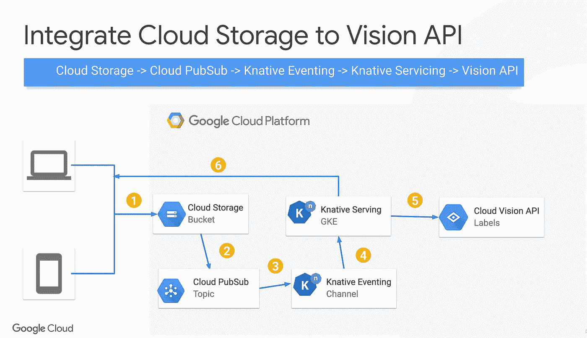
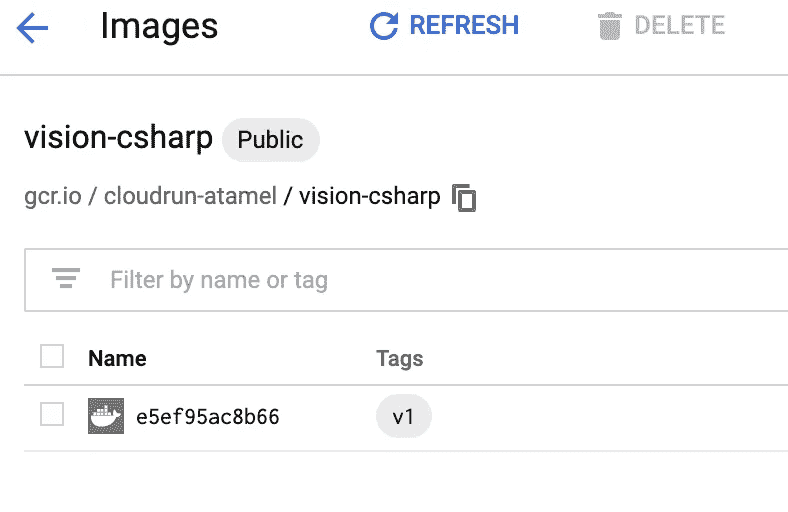
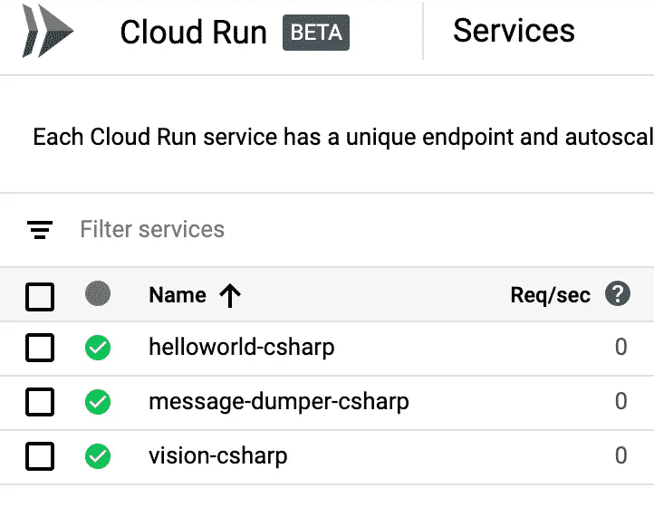
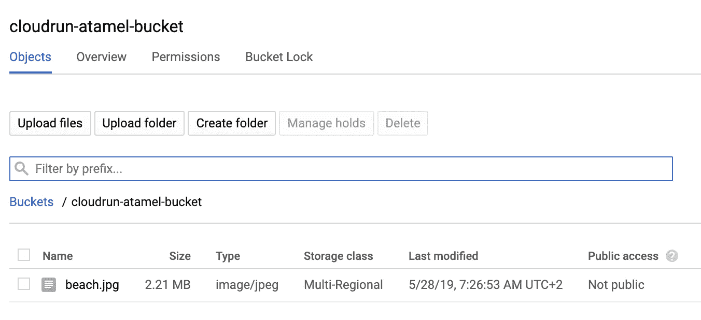
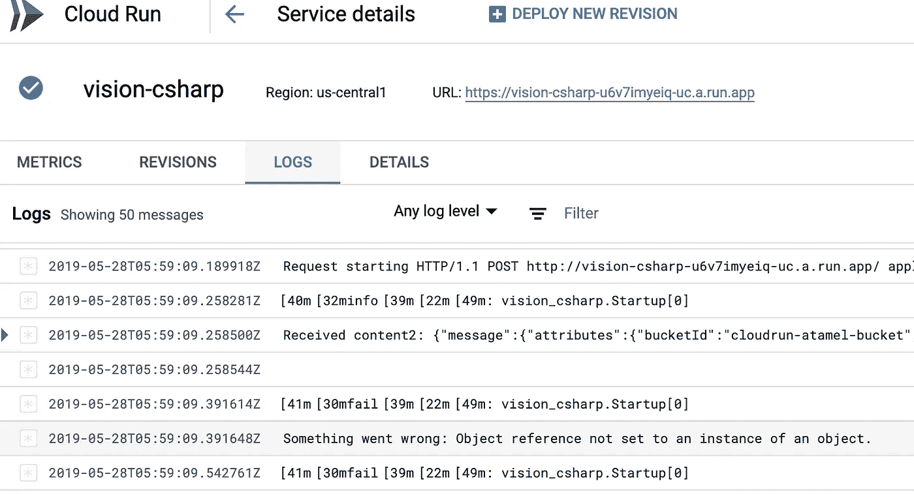

# 云作为内部异步工作器运行

> 原文：<https://medium.com/google-cloud/cloud-run-as-an-internal-async-worker-480a772686e?source=collection_archive---------0----------------------->



云发布/订阅+云运行

## 介绍

如果您听说过 [Cloud Run](https://cloud.google.com/run/) ，那么您已经知道在无状态容器中旋转公共端点来处理 HTTP 请求/回复类型的工作负载是非常棒的。最棒的是，您只需为请求的持续时间付费！

然而，HTTP 请求/回复处理并不是云运行的唯一用例。与云发布/订阅相结合，云运行非常适合内部异步工作者类型的用例，因为:

1.  在云运行中，您可以拥有一个只能从具有*云运行调用* IAM 角色的服务访问的内部/私有端点。
2.  在云发布/订阅中，您可以进行推送订阅，即发布/订阅可以将消息推送至预定义的端点。
3.  您可以给发布/订阅推送订阅一个身份，并授予该身份*云运行调用者* IAM 角色。

所有这些意味着您可以将发布/订阅消息推送到内部云运行端点。这对内部异步工作者来说是完美的！你可以在云运行教程 中使用云发布/订阅来详细了解如何设置。

在这篇博客文章中，我们将遵循该教程，但我也想看看如何让我现有的 Knative 事件示例之一部署为云运行中的内部异步工作器。

## 云运行的失败事件

在我的 [Knative 教程](https://github.com/meteatamel/knative-tutorial)中，我[展示了](https://github.com/meteatamel/knative-tutorial/blob/master/docs/08-visioneventing.md)如何使用 Knative Eventing 将云存储连接到 Cloud Vision API:



总的来说，当用户将图像放入云存储桶中时，它会触发一条到发布/订阅主题的消息，该消息又会被 Knative Eventing 读取。一旦 Knative Eventing 读取了该事件，它就被转换成 CloudEvent 并传递给 Knative 服务，以进行 Vision API 调用并从图像中提取标签。

获取此样本并在 Cloud Run 上运行它需要什么？Cloud Run 实现了 Knative Serving，因此将服务从 Knative Serving 迁移到 Cloud Run 非常容易。然而，它并不直接实现 Knative Eventing，所以从 Knative Eventing 到 Cloud Run 需要做更多的工作。

让我们通过所需的步骤来了解需要什么。我假设您已经为云运行准备好了一个项目。

## 创建云发布/订阅主题

首先，我们需要为云存储通知创建一个发布/订阅主题:

```
gcloud pubsub topics create **cloudrun-atamel-topic**
```

## 创建存储桶并启用通知

接下来，创建一个云存储桶来存储图像。您可以从 Google Cloud 控制台或使用如下的`gsutil`命令行工具来完成此操作:

```
gsutil mb gs://**cloudrun-atamel-bucket**/
```

在存储桶上启用发布/订阅通知，并链接到之前创建的主题:

```
gsutil notification create -t **cloudrun-atamel-topic** -f json gs://**cloudrun-atamel-bucket**/
```

## 部署云运行服务

我们现在准备部署我们的云运行服务。我们需要推动我们的图像到谷歌容器注册(GCR)。在`vision-csharp` [文件夹](https://github.com/meteatamel/knative-tutorial/blob/master/eventing/vision-csharp)里面，已经有一个`Dockerfile`。运行以下命令将其提交到云构建:

```
gcloud builds submit --tag gcr.io/**cloudrun-atamel**/vision-csharp:v1
```

这将使用云构建并存储到 GCR 来构建映像:



运行以下命令以部署到云运行为`vision-csharp`服务:

```
gcloud beta run deploy vision-csharp --image gcr.io/**cloudrun-atamel**/vision-csharp:v1
```

在部署过程中，对“允许未经身份验证”提示响应“否”,以保持服务私有。大约一分钟后，您应该会在 Google Cloud Console 的 Cloud Run 部分看到该服务:



## 与云发布/订阅集成

此时，我们已经准备好了桶和服务，但是我们需要中间的 Pub/Sub 来转发消息。我们需要配置发布/订阅来将消息推送到我们内部的云运行服务。我是跟着 [*用云 Pub/Sub 用云运行教程*](https://cloud.google.com/run/docs/tutorials/pubsub) *。*

1.  使您的项目能够创建云发布/订阅身份验证令牌(用您的 id 和编号替换项目 id 和编号):

```
gcloud projects add-iam-policy-binding **cloudrun-atamel** --member=serviceAccount:service-**165810103461**@gcp-sa-pubsub.iam.gserviceaccount.com --role=roles/iam.serviceAccountTokenCreator
```

2.创建一个服务帐户来代表云发布/订阅身份:

```
gcloud iam service-accounts create **cloud-run-pubsub-invoker** --display-name "**Cloud Run Pub/Sub Invoker**"
```

3.授予此服务帐户调用 CloudRun 服务的权限:

```
gcloud beta run services add-iam-policy-binding vision-csharp--member=serviceAccount:cloud-run-pubsub-invoker@**cloudrun-atamel**.iam.gserviceaccount.com --role=roles/run.invoker
```

4.使用服务帐户创建云发布/订阅订阅:

```
gcloud beta pubsub subscriptions create **cloudrun-atamel-subscription** --topic **cloudrun-atamel-topic** --push-endpoint=[**https://vision-csharp-u6v7imyeip-uc.a.run.app**](https://vision-csharp-u6v7imyeiq-uc.a.run.app/)**/** --push-auth-service-account=cloud-run-pubsub-invoker@**cloudrun-atamel**.iam.gserviceaccount.com
```

不可否认，这是许多手动步骤来设置发布/订阅，我希望它会变得更容易，但一旦你经历了一次，它有点意义。

## 关键时刻到了。

我们终于准备好测试我们的内部云运行服务了！我走到云存储桶，放下一张图片:



我转到云运行控制台，查看 vision-csharp 服务的日志:



我的发球扔出一个`NullPointerException`！原来这是因为 Knative Eventing 和 Cloud Run 中的事件类型不同。在 Knative Eventing 中，您最终会收到 CloudEvents，这就是我的代码试图解析的内容。在 Cloud Run 中，您会收到一条格式略有不同的发布/订阅推送消息。一旦我调整了代码来解析 Pub/Sub push 消息，我就能够调用 Vision API 了。

## 摘要

在这篇博文中，我们看了一下 Cloud Run，以及它如何被用作内部异步工作器。手动步骤比我预期的要多，但是一旦设置好了，它就工作得很好。将 Cloud Run 与 Cloud Pub/Sub 结合起来，为 Cloud Run 提供了很多机会，让它像后台工作人员一样处理几乎所有的服务。