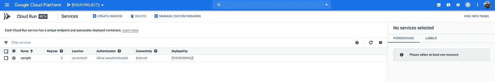

# 云运行和云 SQL

> 原文：<https://medium.com/google-cloud/cloud-run-cloud-sql-6c8879ef96da?source=collection_archive---------0----------------------->

大约两年前，我写过一篇名为“[Google Cloud SQL—6 ways(Golang)](/@DazWilkin/google-cloud-sql-6-ways-golang-a4aa497f3c67)的热门文章。今天回答一个堆栈溢出问题，问如何连接 Cloud Run w/ Cloud SQL，我重用了我之前的帖子的内容来测试 w/ Cloud Run。这就是结果。

谷歌的[文档](https://cloud.google.com/run/docs/configuring/connect-cloudsql)是“基本的”,但是准确。

我用的是 PostgreSQL，但这也适用于 MySQL。

我使用 Golang 作为我的例子，但是这个代码使用了一个标准的 PostgreSQL(纯 Golang)驱动程序( [link](https://github.com/lib/pq) )，所以，这种方法适用于任何有好的 PostgreSQL 客户端库的语言。有一个替代方案，Google 提供的库在进程内运行云 SQL 代理。这也可以，但我将使用外部代理方法，因为这更通用。

云运行服务帐户有足够的角色来访问云 SQL 数据库，因此不需要任何 IAM 更改。如果您希望进行本地测试，您应该创建一个具有“云 SQL 客户端”角色的服务帐户(`[roles/cloudsql.client](https://cloud.google.com/iam/docs/understanding-roles#cloud-sql-roles)`)。

## 设置

环境:

```
WORKDIR=[[PATH-TO-YOUR-WORKING-DIRECTORY]]
PROJECT=[[YOUR-PROJECT]]
BILLING=[[YOUR-BILLING]]
REGION=[[YOUR-REGION]]                # Perhaps "us-central1"
ROOT=[[YOUR-INSTANCE-ROOT]]           # Perhaps "instance-01"
DBHOST=${PROJECT}:${REGION}:${ROOT}
DBNAME=[[YOUR-DATABASE-NAME]]         # Perhaps "test"
DBUSER=postgres
DBPASS=[[YOUR-DATABASE-PASSWORD]
```

创建项目，分配帐单，创建 SQL 实例，数据库等。：

```
gcloud projects create ${PROJECT}
gcloud alpha billing projects link $PROJECT \
--billing-account=$BILLINGfor SERVICE in containerregistry cloudrun sqladmin
do
  gcloud service enable ${SERVICE}.googleapis.com \
  --project=${PROJECT}
done

mkdir -p ${WORKDIR}/go && cd ${WORKDIR}
export GOPATH=${WORKDIR}/go
export PATH=$GOPATH/bin:$PATH

gcloud sql instances create ${ROOT} \
--cpu=1 --memory=4096MiB \
--database-version=POSTGRES_9_6 \
--project=${PROJECT}gcloud sql users set-password ${DBUSER} \
--host="%" \
--instance=${ROOT} \
--password=${DBPASS} \
--project=${PROJECT}gcloud sql databases create ${DBNAME} \
--instance=${ROOT} \
--project=${PROJECT} 
```

如果您想在本地测试:

```
wget [https://dl.google.com/cloudsql/cloud_sql_proxy.linux.amd64](https://dl.google.com/cloudsql/cloud_sql_proxy.linux.amd64) -O cloud_sql_proxy
chmox +x ./cloud_sql_proxy
./cloud_sql_proxy -instances=${INSTANCE} -dir=/cloudsql
```

> 你可能需要`sudo`来创建`/cloudsql`。如果你这样做了，那么`sudo chown -R $(whoami) /cloudsql`来避免你的代码访问由它下面的代理创建的套接字的复杂性。

## 戈朗

重新利用我之前的 Golang SQL 示例，该示例简单地重新创建了一个名为`customers`的表(如果有必要的话删除掉)，在`${DBNAME}`中向该表添加了 4 条记录，然后对它们进行了枚举:

> **NB** 这段代码的主要区别是将 SQL 调用封装在一个 HTTP 服务器中，这样我们就可以将应用程序部署到 Cloud Run。云运行需要一个 HTTP 端点。Cloud Run 对端口也很挑剔，端点必须在`:8080`上。

如果您愿意，可以在本地测试代码。确保(a)云 SQL 代理正在运行；(b)您已经创建了一个角色为`roles/cloudsql.client`的服务帐户，其键的路径是`${ROBOT}`的值。

```
GOOGLE_APPLICATION_CREDENTIALS=${ROBOT} \
go run main.go
```

然后，您应该能够浏览将返回的`[http://localhost:8080](http://localhost:8080)`:

```
Name: John Woo
Name: Jeff Dean
Name: Josh Bloch
Name: Josh Long
1: John Woo
2: Jeff Dean
3: Josh Bloch
4: Josh Long
```

然后，您应该为 Golang 示例构建并推送容器图像:

> **NB** 因为 Cloud Run 期望容器发布`:8080`docker file 引用这个作为它的`CMD`的一部分。该值可能会被覆盖。

并且:

```
IMAGE=[[YOUR-IMAGE]] # Perhaps "sample"
TAG=[[YOUR-TAG]]docker build \
--tag=us.gcr.io/${PROJECT}/${IMAGE}:${TAG} \
--file=./Dockerfile \
.docker push us.gcr.io/${PROJECT}/${IMAGE}:${TAG}
```

> **NB** 不用谷歌容器注册表【GCR】(`*.gcr.io`)；任何容器注册表都可以。但是，GCR 让您的容器映像接近云运行，从而减少时间(部署)和成本。

如果您愿意，还可以在本地测试容器:

```
docker run \
--interactive --tty \
--publish=8080:8080 \
--env=DBHOST=${DBHOST} \
--env=DBNAME=${DBNAME} \
--env=DBUSER=${DBUSER} \
--env=DBPASS=${DBPASS} \
--env=GOOGLE_APPLICATION_CREDENTIALS=/secrets/cloudsql.json \
--volume=$PWD/cloudsql.json:/secrets/cloudsql.json \
--volume=/cloudsql:/cloudsql \
us.gcr.io/${PROJECT}/${IMAGE}:${TAG}
```

> **NB** 我们必须将服务帐户密钥和 unix 套接字根目录挂载到容器中，以便它可以访问它们。云运行为我们完成了这两项任务。

云运行

我们现在准备将容器映像部署到云运行:

```
SERVICE=samplegcloud beta run deploy ${SERVICE} \
--image=us.gcr.io/${PROJECT}/${IMAGE}:${TAG} \
--set-env-vars=\
DBHOST=${DBHOST},\
DBNAME=${DBNAME},\
DBUSER=${DBUSER},\
DBPASS=${DBPASS} \
--add-cloudsql-instances=${DBHOST} \
--region=${REGION} \
--project=${PROJECT}
```

> **注意**该命令中出现了两次`${DBHOST}`。我们必须配置 Golang 应用程序，以使用将由云 SQL 代理创建的正确的 unix 套接字。这将是`/cloudsql/${DBHOST}`。我们用`--set-env-vars=DBHOST=${DBHOST}...`来做这件事。我们必须配置云运行来**创建**合适的 unix 套接字。它假设路径是`\cloudsql`，我们用`--add-cloudsql-instances=${DBHOST}`告诉它哪个套接字。

部署后，您可以通过控制台确认:



或者卷曲它的端点:

```
curl $(\
  gcloud beta run services describe ${SERVICE} \
  --region=${REGION} \
  --project=${PROJECT} \
  --format="value(status.address.hostname)")Name: John Woo
Name: Sam Dean
Name: Anne Bloch
Name: Chris Long
1: John Woo
2: Sam Dean
3: Anne Bloch
4: Chris Long
```

## 结论

Cloud Run 确实和 Cloud SQL 集成了。PostgreSQL 和 MySQL 都可以。使用 Golang，您可以使用 Postgres 的通用客户端库，也可以使用 Google 的进程内代理。以上表明，任何具有合适的客户端库的语言都可以工作。

云运行受到“约束”。您的应用程序将需要公开一个 HTTP 端点，这必须在`:8080`。但是 Cloud Run 提供了合适的服务帐户凭证，用于针对云 SQL 进行身份验证，并且直接配置了正确的 unix 套接字来访问云 SQL 实例。

仅此而已！