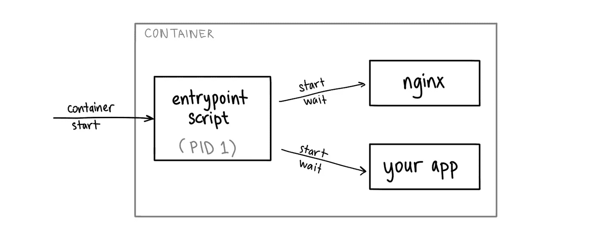
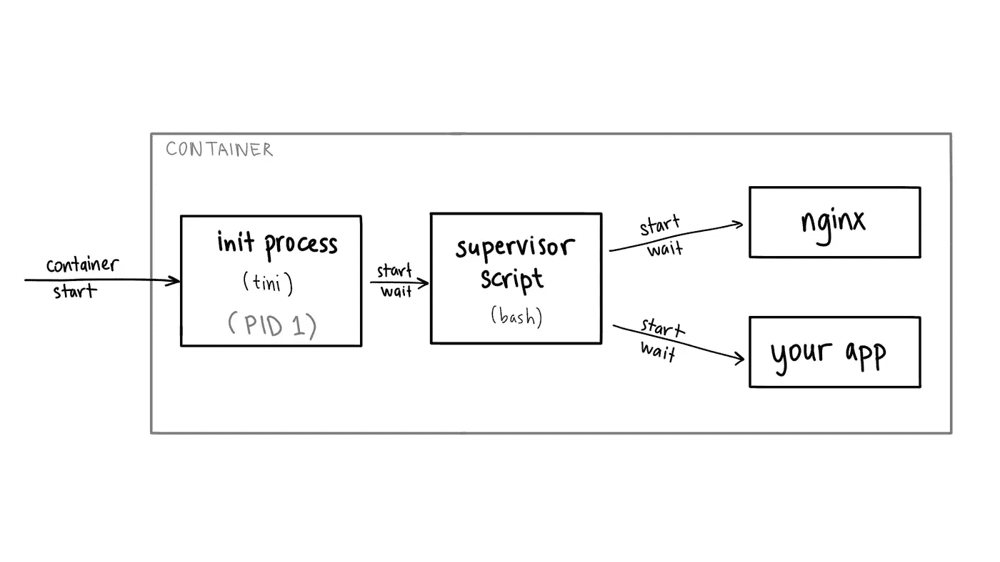

# 云运行:容器中的多个进程(懒惰方式)

> 原文：<https://medium.com/google-cloud/cloud-run-multiple-processes-4b6f1b3827e?source=collection_archive---------0----------------------->

许多 [Google Cloud Run](https://cloud.google.com/run) 用户第一次开始开发容器，但他们通常会迁移他们现有的应用程序。有时，这些应用程序并没有被设计为适合每个容器一个进程模型的微服务，而是需要多个服务器进程在一个容器中一起运行。

你经常会听到“在一个容器中运行多个进程是不好的”，尽管这样做并没有什么错，正如我在我的[上一篇文章](https://ahmet.im/blog/minimal-init-process-for-containers/)比较针对容器优化的 init 系统中解释的那样。

在本文中，我将展示一个不是超级生产就绪的(因此称为“懒惰方式”)但是在 Cloud Run 上运行多进程容器的工作解决方案，并将提供[示例代码](https://github.com/ahmetb/multi-process-container-lazy-solution)。

# 示例使用案例

来到[云运行](https://cloud.google.com/run)作为一个新用户，**出于各种原因，您可能需要在一个容器**中运行多个流程，例如:

*   在你的应用程序前进行反向代理(比如 nginx/Envoy 或云端点)
*   通过主 HTTP 服务器公开的非 HTTP 服务器(如 grpc-web)
*   出站流量的本地代理服务器
*   实例本地缓存(例如 memcached)
*   合作过程的其他例子

# 设计容器

在本文中，我将使用 nginx 示例。我们希望开发一个运行`nginx`服务器以及您的服务器应用程序的容器映像。

我们将在主云运行端口(8080)上运行`nginx`，您在 8081 上的服务器作为`nginx`将流量路由到您的应用程序，如下所示:

*   `/static/*`路径由 nginx 从本地文件系统提供服务
*   `/*`其他任何东西都被转发到你的主服务器进程

每个容器必须有一个单独的*入口点*进程。当入口点退出时，容器就死了。因此，您仍然需要一个“入口点脚本”来启动两个服务器(`nginx`和您的应用程序)。

如果其中一个服务器终止(表明有问题)，您的 entrypoint 脚本也应该很快终止，而不是试图恢复服务器进程(因为无论如何容器都很容易重启)。



这个入口点脚本并不像“保姆进程”那样监督子进程并重新启动它们。它宁愿等待其中一个终止，所以我们可以通过退出容器来快速失败。

在这个例子中，您编写了一个`bash`脚本作为您的容器的入口点，它启动并等待您想要运行的实际服务器:

启动并等待要运行的实际服务器的容器的输入点:

```
#!/usr/bin/env bash
set -e**nginx &**
env PORT=8081 **/path/to/your-app &**wait -n
```

*   `&`使进程在后台运行(但它仍然作为这个脚本的子进程)
*   `wait -n`(bash 4.3 中引入)在后台进程退出时立即返回(表明服务器进程有问题)，这样我们就可以终止容器。
*   `env PORT=...`命令会覆盖实际应用的`$PORT`入口点，因为`nginx`将使用云运行端口=8080。

# bash:一个合适的初始化进程？

Linux 容器的 Entrypoint 进程用 PID(进程 id) `1`运行，它有[特殊职责](https://vagga.readthedocs.io/en/latest/pid1mode.html)，例如(但不限于):

*   将信号转发给子进程
*   处理如何处理一个死亡的间接子进程是它的父进程(又名[僵尸子进程收割](https://blog.phusion.nl/2015/01/20/docker-and-the-pid-1-zombie-reaping-problem/)问题)

当我们让入口点成为一个`bash`脚本时，它不能做这些事情。由于云运行的应用程序应该是无状态的(并且在任何时候都会被不体面地终止)，所以我们不太关心信号转发行为。

然而，僵尸子进程收割可能是一个问题，尤其是当您运行的程序(如 nginx)启动了许多短命的子进程，因为它们的子进程将成为入口点的父进程。

为了处理这些情况，您可以插入一个小的 [init 进程](https://en.wikipedia.org/wiki/Init)，如 [**tini**](https://github.com/krallin/tini) 作为您的容器的新入口点，并从那里启动脚本(因为`tini`仍然不能管理我们需要的多个子进程):



在这种情况下，`tini`帮助您收获子流程。参考[库](https://github.com/ahmetb/multi-process-container-lazy-solution)中的`Dockerfile`来查看`tini`如何集成为新的入口点。

# 尝试一下

正如前面所承诺的， [**这里有一个示例应用程序**](https://github.com/ahmetb/multi-process-container-lazy-solution) ，它包含了`Dockerfile`和 NGINX 容器的源代码，NGINX 服务于`/static/*`上的静态资产，并将其他所有东西代理给 Python 服务器。

一旦您将这个容器映像部署到 Cloud Run，您就获得了一个容器，该容器为在单个容器中运行的多个流程的流量提供服务。

您可以阅读我以前的文章[containers 的 init 系统比较](/google-cloud/init-process-for-containers-d03a471fa0cc)，了解更多关于在容器中运行多个进程的其他选项。

如果这有助于您将现有的或遗留的应用程序迁移到云运行，并利用无服务器容器，请在 Twitter 上告诉我！

在下一篇博文中，我将探索使用一个*实际的* `init`流程(而不是`bash`)来监督容器环境中的子流程。

*原载于 2019 年 7 月 23 日*[*Ahmet . im*](https://ahmet.im/blog/cloud-run-multiple-processes-easy-way/)*。*