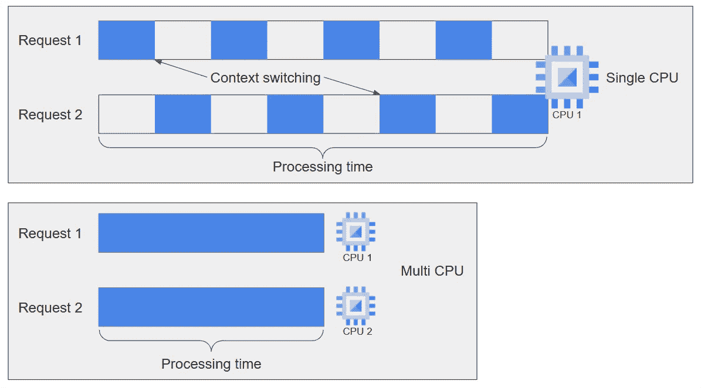
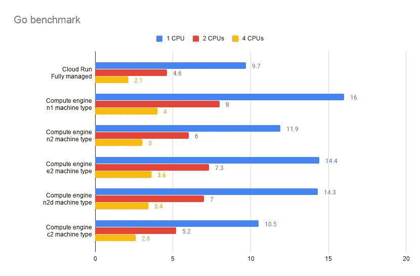
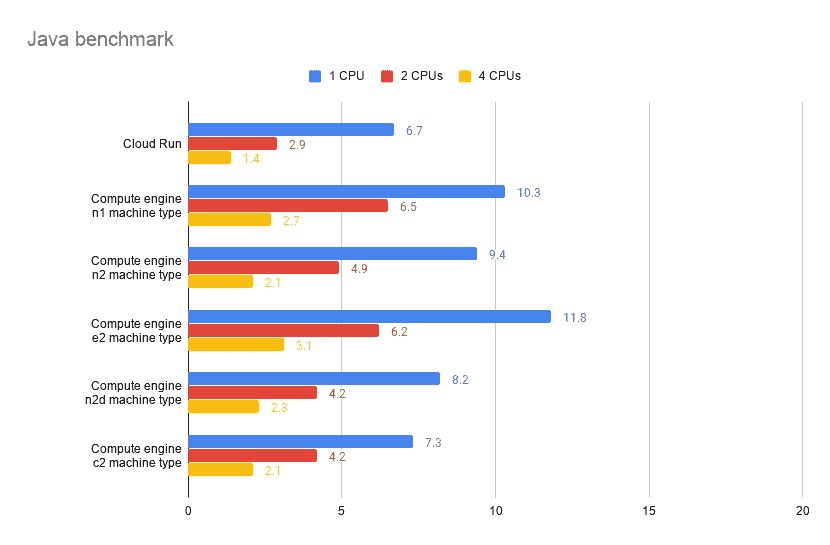
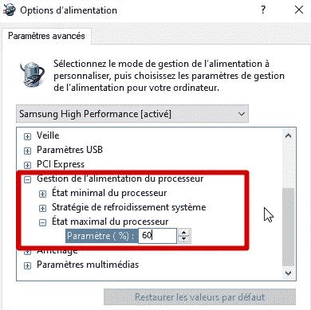

# 具有多个 CPU 的云运行性能

> 原文：<https://medium.com/google-cloud/cloud-run-performances-with-multiple-cpus-a4c2fccb5192?source=collection_archive---------0----------------------->


Cloud Run 是一款**无服务器产品**，允许**提供大规模**的集装箱服务。**团队非常活跃**，自 Beta 版发布(2019 年 4 月)以来**新功能的数量令人印象深刻**！其中，可配置的 CPU 数量。

一个或两个 CPU 的配置现已推出， **4 也即将推出。**

> 但是，更多的 CPU 意味着更好的性能吗？

# 如何测试多 CPU 处理性能？

要评估 CPU 效率，我们不能使用毫秒或微秒端点，这太难比较，指标不够清晰，标准偏差太重要。
为了进行直观的比较，我们需要一个几秒钟就能完成的过程。

*当然，快速请求的行为是相同的，结论也是相似的。*

因此，第一步是建立一个**计算密集型流程**。对于这个测试，我选择在递归模式下使用**斐波那契算法**。*在这里进去*

```
func fibo(n int64) int64 {
   if n <= 2 {
      return n - 1
   } else {
      return fibo(n-1) + fibo(n-2)
   }
}
```

第二步是拥有一个**多线程进程**。

> 为此，我会作弊！

事实上，云运行能够处理多达 80 个并发请求[](https://cloud.google.com/run/docs/about-concurrency)**。因此，如果您有一个单线程进程(如斐波那契算法),并且您同时向云运行发送 2 个请求**

*   **有了**和**、**两个 CPU，每个请求应该在一个单独的 CPU** 上并行处理，并且花费大致相同的时间**
*   **有了 **1 个 CPU，这 2 个请求被同时处理并共享**同一个 CPU。处理时间应该比 2 个 CPU 配置的**长 2 倍。****

****

**让我们来验证这些假设！**

## **基准原则**

**为了得到斐波那契算法的处理持续时间，我简单地用**得到函数调用前后的时间，并计算差值。****

```
before := time.Now()
result := fibo(n)
after := time.Now()

diff := after.Sub(before)
```

**为了拥有相似的环境，当部署容器时，我总是在每个平台上使用 2gb 的内存(不受内存限制，只受 CPU 限制)**

# **TL；灾难恢复:完整的基准总结**

**为了总结性能，这里有一张我用 Fibonacci(43)测试过的所有不同配置的图表。
*结果以秒为单位，越小越好。***

****

***用 Go 容器处理时间以秒为单位。越小越好***

****

***用 Java 容器处理时间以秒为单位。越小越好***

***我已经包含了使用 4 个 CPU 对云运行进行早期访问的测试！***

# **云运行基准**

**我用两种语言写了这个基准:Go 和 Java (springboot framework)。*关于脚本配置的详细信息，请参考* `[*readme.md*](https://github.com/guillaumeblaquiere/multi-proc-bench/blob/master/readme.md)` *文件。***

*   **从检查 [Github 项目](https://github.com/guillaumeblaquiere/multi-proc-bench)开始**

```
git clone [https://github.com/guillaumeblaquiere/multi-proc-bench.git](https://github.com/guillaumeblaquiere/multi-proc-bench.git)
```

*   **然后，进入您喜欢的目录语言(`[springboot](https://github.com/guillaumeblaquiere/multi-proc-bench/tree/master/springboot)`用于 Java，`[go115](https://github.com/guillaumeblaquiere/multi-proc-bench/tree/master/go115)`用于 go)并构建容器**

```
#Build locally (with docker)
bash build-local.sh#Build on Cloud Build
bash build-cloud.sh
```

*   **最后，运行工作台 *(4 个请求同时发送给服务)***

```
#With 1 CPU
bash bench-cloud-run.sh#With 2 CPU
NB_CPU=2 bash bench-cloud-run.sh
```

**并比较结果:**

*   **1 个 CPU:平均处理时间约为**Go 中 9.7s(Java 中 6.7s)****
*   **2 CPU:平均处理时间约为**Go 中 4.6s(Java 中 2.9s)****

## **结果比较**

**你可以观察到的第一件事是，在这个算法上，Java 比 Go 快 30%。**

**第二件事是，使用 2 个 CPU 时，结果并不完全是使用 1 个 CPU 时的两倍(T20)，而是略高(Go 中 4.6s * 2 = 9.2s)。如果你了解 CPU 调度和线程管理，你就知道这是正常的。**

**实际上，由于 4 个请求同时出现在一个 CPU 上，**处理时间在线程之间共享，CPU 必须在它们之间切换上下文***(线程的备份状态，并恢复下一个线程的状态)*。这种操作在密集的 CPU 处理中是不自由的，并且您在每个交换机上损失了一些宝贵的 CPU 周期。
2 个 CPU 也是一样的事情，但是上下文切换发生的次数少了两次！**

***另外，可以看到****CPU 时间分配比较公平*** *。请求处理持续时间相等，这意味着* ***CPU 调度程序为每个线程分配相同的 CPU 插槽。*****

**所以，是的，**一个服务上更多的 CPU 允许你更快地处理请求**，尤其是当你需要 CPU 计算能力的时候！**

> **计算引擎上的性能有多相似？**

# **计算引擎基准**

**有了现有的容器，现在**很容易在计算引擎**上执行类似的基准测试。计算引擎基准测试有两个脚本:**

*   **`bench-compute-engine.sh`使用[启动脚本](https://cloud.google.com/compute/docs/startupscript)和 [COS](https://cloud.google.com/container-optimized-os/docs) (容器优化操作系统)创建标准计算引擎**
*   **`bench-compute-engine-with-container.sh`即使用了`[create-with-container](https://cloud.google.com/compute/docs/containers/deploying-containers)`的[特性](https://cloud.google.com/compute/docs/containers/deploying-containers)，也在 [COS](https://cloud.google.com/container-optimized-os/docs) 上。**

**在`[readme.md](https://github.com/guillaumeblaquiere/multi-proc-bench/blob/master/readme.md)`文件中，您可以看到您可以**定制机器类型、要使用的 CPU 数量以及测试的位置**。**

*   **对于`n1`和`e2`机型，**位置可以改变基准结果**。比如 [](https://cloud.google.com/compute/docs/cpu-platforms) `[n1](https://cloud.google.com/compute/docs/cpu-platforms)` [可以是 Intel Haswell 或者 Intel Skylake CPU 架构](https://cloud.google.com/compute/docs/cpu-platforms)，**这几代效率不同**。**
*   **有些机种**至少需要 2 个(** `**n2**` **、** `**e2**` **、** `**n2d**` **)或 4 个(**`**c2**`**)CPU**。小心，如果你改变机器类型，使用正确的 CPU 数量。*您可以使用* `*LIMIT_CPU*` *参数限制 docker run 命令使用的 CPU 数量。***

## **结果比较**

**我只展示了在 `**us-central1-a**` **区域中使用 2 个 CPU 和使用 Go** 容器*进行的**测试(使用 2 个 CPU 在云上运行的处理时间为 4.6 秒)*****

*   **`n1`机器类型(Haswell):平均响应时间 **8s****

```
MACHINE_TYPE=n1 NB_CPU=2 LIMIT_CPU=2 bash bench-compute-engine.sh
```

*   **`n2`机器类型:平均响应时间 **6s****

```
MACHINE_TYPE=n2 NB_CPU=2 LIMIT_CPU=2 bash bench-compute-engine.sh
```

*   **`e2`机器类型:平均响应时间 **7.3s****

```
MACHINE_TYPE=e2 NB_CPU=2 LIMIT_CPU=2 bash bench-compute-engine.sh
```

*   **`n2d`机器类型:平均响应时间 7 **秒****

```
MACHINE_TYPE=n2d NB_CPU=2 LIMIT_CPU=2 bash bench-compute-engine.sh
```

*   **`c2`机器类型(4 个 CPU，最多 2 个):平均响应时间 **5.2s****

```
MACHINE_TYPE=c2 NB_CPU=4 LIMIT_CPU=2 bash bench-compute-engine.sh
```

**很明显，你可以看到云运行的**性能与计算引擎**相当。它们类似于`c2`(计算密集型)机器类型。
*这些* ***的观察结果与 Java 版本*** *中的相同。你们可以自测一下！***

> **我可以将云运行性能与本地环境进行比较吗？**

# **当地环境基准**

***对于这个测试，你需要* ***在你的电脑上安装 Docker****。* 用最新的剧本就地替补。**

```
LIMIT_CPU=2 bash bench-local.sh
```

**在我的电脑上，限 2 个 CPU，处理时间是 **4s。****

## **局部基准陷阱**

**在我的例子中，**我限制了 CPU 的数量，以在我的计算机上拥有类似于**的云，并且**仍然更快！！**
所以，是的，我限制了 CPU 的数量，但是**没有**的 CPU 的威力，而影响，在 CPU 密集型处理中，是非常重要的！**

**我电脑上有一个英特尔酷睿 i5 6600 (4 核/4 线程，@3.3Ghz- **3.9Ghz** (turbo)，Skylake 架构)，处理时间是 **4s。**
`[n1](https://cloud.google.com/compute/docs/cpu-platforms)`[has well 机种有 **2.3Ghz** CPU](https://cloud.google.com/compute/docs/cpu-platforms) ，处理时间为 **8s** ，但架构较老。
我在`europe-north1-a`用`n1`机种测试。这次的 CPU 架构是 [Skylake 在**2 GHz**。而且台架成绩是 **8s 也是**。](https://cloud.google.com/compute/docs/cpu-platforms)**

**如果我限制我的 CPU 的速度(2 / 3.3Ghz - > 60%)，我得到了相同的结果。**

****

**Windows 10 上的电源管理可限制 CPU 速度**

****整组结果与**每秒的周期数和 CPU 架构生成一致。
因此，**在本地环境中运行性能测试时要小心**！**

# **CPU 越多是否意味着能力越强？**

**第一个结果**展示了并行性的前景**。有了几个 CPU，您可以并行处理几个请求并改善响应时间。
对于所有服务、计算引擎和云运行来说都是**真。****

****除了 CPU 的数量，CPU 的功率和代数也很重要**。对我来说，最令人惊讶的结果是，**云运行的性能比一个** `**c2**` 机器类型(计算密集型[级联湖架构，3.1Ghz](https://cloud.google.com/compute/docs/cpu-platforms) )比一个常规计算引擎(`n1`或`n2`机器类型)更接近**

**总之，如果您有由请求触发的**计算密集型处理**(例如 ML 处理)，**云运行是很好的解决方案**，具有高效的处理和多 CPU 能力。
现在每个实例有 1 或 2 个 CPU 可用，不久**将有 4 个 CPU 可用于所有**(目前仅用于 Alpha 测试人员)。**

**请告诉我您在这些平台上尝试的基准测试结果或其他处理类型！**