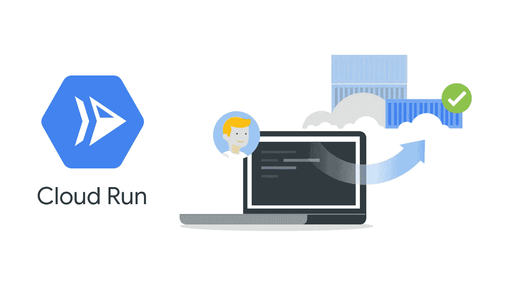
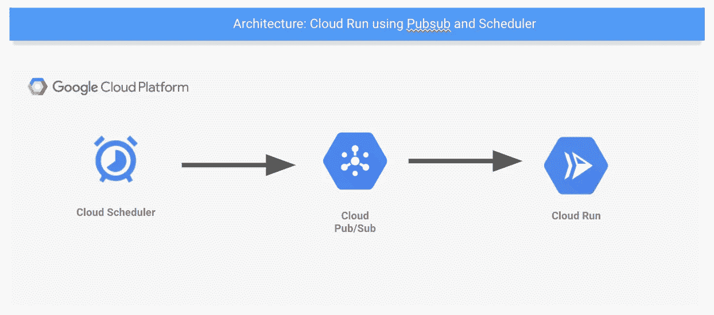
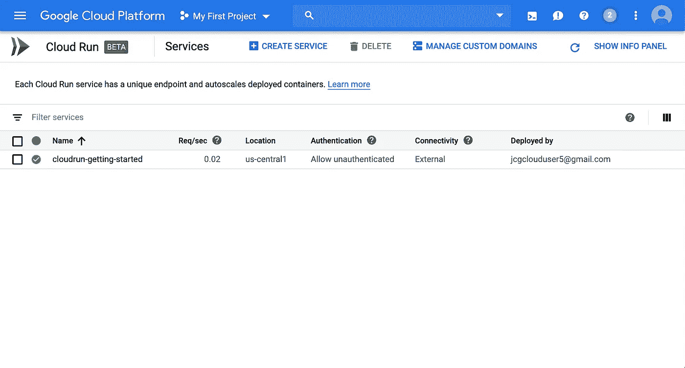
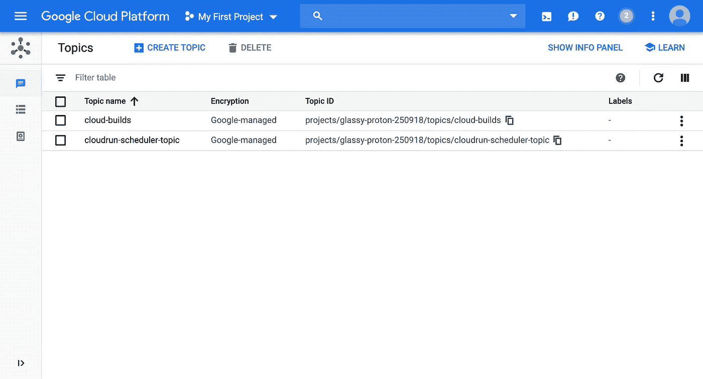
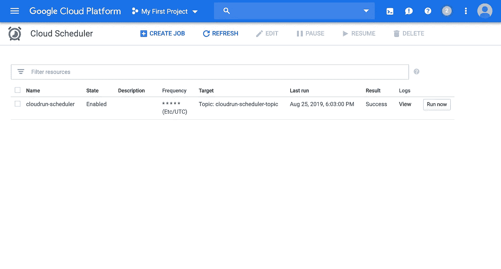
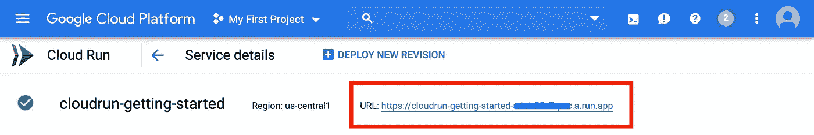
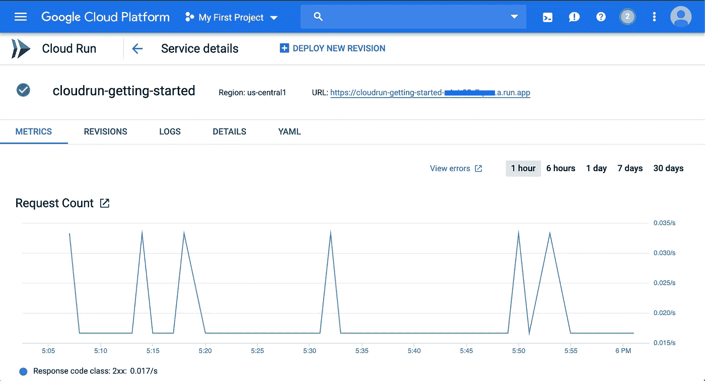
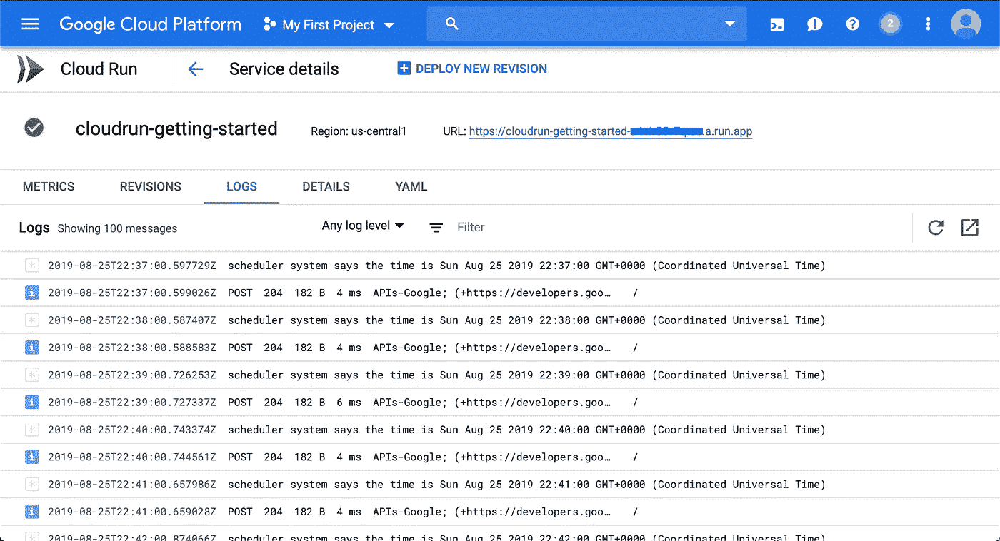

# 使用 Pubsub 触发器的云运行

> 原文：<https://medium.com/google-cloud/cloud-run-using-pubsub-triggers-2db74fc4ac6d?source=collection_archive---------0----------------------->

Google 云平台上的云运行

几个月前，谷歌宣布了一个非常酷的东西，一个鲜为人知的项目，叫做 Cloud Run——从最初的宣布开始，Cloud Run 就引起了一些严重的噪音。《云跑》在一个非常有趣的时间问世。就像开发人员大批涌入 Kubernetes 一样，谷歌推出了一种新工具，无论你是否知道在 T2 部署和在 T4 进入的区别，你仍然可以创建基于 Kubernetes 和谷歌的 GKE 的强大功能运行的令人惊叹的工具。

> 如果你想进一步深入兔子洞，你会了解到在幕后谷歌正在使用另一个新项目，名为 [KNative](https://knative.dev/) 。Knative 利用 Kubernetes 的力量，通过一些魔法，将 Kubernetes 变成一个无服务器平台，允许您根据使用情况增加工作负载，如果没有流量，则一直将工作负载降至零。

使用云运行的最大好处是，只需点击几下鼠标，您就可以让您的应用在 Kubernetes 上运行，并在一个您可以信赖的环境中随着您的使用规模进行扩展。

现在，在本文中，我将快速向您展示，您可以立即让一切正常运行。事不宜迟，我们开始吧。

# 使用 Pubsub 和调度程序的云运行示例项目

作为一个快速的小项目，我们将制作一个使用 Pubsub 来触发您的云运行工作负载的系统。我觉得触发这些 Pubsub 消息的最简单的方法是使用 Cloud Scheduler 以我们可以设置的时间间隔(本例中为每分钟)触发 Pubsub。这会是什么样子？像这样。

通过 Pubsub 运行云调度程序

我们的云运行工作负载是用 NodeJS 编写的，但是如果你看一下最终的代码，你会发现这种语言对于这个例子并不重要，因为它非常简单。

所有代码都可以在[我的 Github Repo](https://github.com/jonbcampos/cloudrun-series/tree/master/getting-started) 中查看。

 [## jonbcampos/cloudrun 系列

### 此时您不能执行该操作。您已使用另一个标签页或窗口登录。您已在另一个选项卡中注销，或者…

github.com](https://github.com/jonbcampos/cloudrun-series/tree/master/getting-started) 

# 设置基本节点项目

NodeJS 项目相当简单。一个小的 Express 应用程序和一个 POST 端点，用于我们的 PubSub 订阅将数据推入其中。

使用 Pubsub 消息的 Index.js 文件

你可以在 Github 中深入查看[入门项目中的每一行代码。](https://github.com/jonbcampos/cloudrun-series/tree/master/getting-started)

# 构建和部署项目

要将项目构建成可部署的 Dockerized 应用程序，我们只需要运行一个快速命令来[在 GCP](https://github.com/jonbcampos/cloudrun-series/blob/master/getting-started/scripts/build.sh) 中构建和存储应用程序。

文档化应用

就是这个！就是这一刻。这是我们[向云运行](https://github.com/jonbcampos/cloudrun-series/blob/master/getting-started/scripts/deploy.sh)发布应用的重要时刻。你准备好了吗？

部署到云运行

就是这样！这就是困难所在。好的，这非常简单，现在完全可以扩展。说真的，这基本上是生产就绪。

云运行项目运行

从现在开始，支持我们的应用程序的一切都在走下坡路。

# 添加发布订阅

我们的应用程序正在运行，但是此时什么也没有发生，因为我们没有连接 Pubsub。我们将[现在将 Pubsub 添加到我们的 GCP 项目](https://github.com/jonbcampos/cloudrun-series/blob/master/getting-started/scripts/add-pubsub.sh)中。

启用发布订阅

这个脚本启用 Pubsub 并创建一个 Pubsub 主题。

已创建发布订阅消息

舞台已经准备好了。我们只需要设置云调度程序来调度 Pubsub 主题。

# 添加计划程序

Cloud Scheduler 是一个非常灵活的工具，它允许你设置一个 Cron 时间表，这个时间表将定期触发 HTTP 消息或 Pubsub 消息。对于我们的项目，我们让 Cloud Scheduler 每分钟发送一条 Pubsub 消息，以模拟应用程序调度 Pubsub 消息。同样，[一行 bash 脚本之后，我们就可以开始了](https://github.com/jonbcampos/cloudrun-series/blob/master/getting-started/scripts/add-scheduler.sh)。

创建调度程序作业

云调度程序现在每分钟都在调度主题。

已创建云调度程序

我们需要做的最后一件事是设置一个订阅，将这个主题推到我们的云运行工作负载中。

# 添加订阅

这是这个过程的最后/最复杂的部分。我们需要创建一个服务帐户，获取我们的云运行端点的 URL，然后创建订阅以将 Pubsub 消息路由到云运行。

第一，网址。这可以很容易地在云运行仪表板中找到。

云运行 URL

接下来，我们需要创建订阅。[这是通过几行 bash 脚本完成的。](https://github.com/jonbcampos/cloudrun-series/blob/master/getting-started/scripts/add-subscription.sh)

创建订阅

一旦完成，Pubsub 消息将被路由到 Cloud Run。我们去看看我们的杰作吧。

# 看着圆木滚滚而来

当我们回到云运行时，我们可以很快看到一些东西已经在运行。

来自云运行指标的结果

如果我们查看该服务的日志，我们可以看到数据的传输情况。

显示结果的日志

我们正式结束了。一切都通过云调度程序使用 Pubsub 运行到我们的服务中。这是非常光滑的，看看是否所有运行。

# 结论

云运行是一项了不起的服务。如果你有一个谷歌 Kubernetes 引擎(GKE)实例运行，你可以包括云运行作为一个插件，或者你可以使用托管云运行实例，我们已经在这里使用。无论哪种方式，你都将拥有一个惊人的平台来构建最大的应用程序。

Jonathan Campos 是一个狂热的开发者，也是学习新事物的爱好者。我相信我们应该不断学习、成长和失败。我总是开发社区的支持者，并且总是愿意提供帮助。因此，如果您对这个故事有任何问题或评论，请在下面添加。在 [LinkedIn](https://www.linkedin.com/in/jonbcampos/) 或 [Twitter](https://twitter.com/jonbcampos) 上与我联系，并提及这个故事。