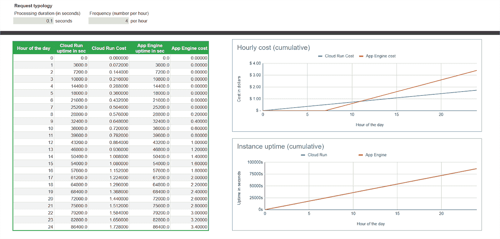

# 云运行 VS App Engine:成本最低是多少？

> 原文：<https://medium.com/google-cloud/cloud-run-vs-app-engine-whats-the-lowest-cost-6c82b874ed61?source=collection_archive---------0----------------------->

*在本文中，“App Engine”一词仅代表* [***App Engine 标准***](https://cloud.google.com/appengine/docs/standard)**版本。**

**

*所有的云提供商**都提供无服务器服务**。无服务器太棒了！您不需要设置、安装、管理或供应服务器。你只需简单地使用服务，并按使用量付费。*

*在谷歌云上，有许多服务器服务。在无服务器计算领域，云运行和应用引擎有**相似之处。这显然会导致询问**选择哪个**作为我的用例。***

***【探索云跑是否适合你？阅读** [**云函数 vs .云运行:何时使用一个胜过另一个**](http://bit.ly/CloudRunvCloudFunctions) **。】***

*我之前**对比过** [**云运行和云功能**](/google-cloud/cloud-run-vs-cloud-functions-whats-the-lowest-cost-728d59345a2e) ，在成本和功能上，**问云运行和 App 引擎**同样的问题完全有道理。*

> *所以，我们来对比一下云运行和 App Engine。*

# *产品的相似性*

*正如我在简介中已经说过的， **2 产品在许多领域与**相似(并非详尽):*

*   *可扩展性至 0*
*   *最小和最大实例*
*   *版本控制和流量分割*
*   *IAM 和访问控制*
*   *客户管理的运行时服务帐户*

> *成本和一些附加功能是**的主要优势**。让我们开始吧。*

# *应用引擎:遗产的重量*

*App Engine 是 Google Cloud 最古老的服务，发布于 2008 年，可能是其他许多服务的根源，如云功能、计算引擎或云运行。*

**我* [*采访了谷歌云的开发者倡导者 Wesley Chun*](https://community.c2cglobal.com/france-106/app-engine-drive-conversation-at-c2c-connect-france-session-on-june-28-3664) *，他很好地解释了这个故事。**

*[定价模式](https://cloud.google.com/appengine/pricing)，在**自动缩放模式**(最类似于云运行行为)中，如下所示*

*   *实例类型 F1(**0.25 vCPU，256Mb** 内存): **$0.05 每小时***
*   *实例**在最近处理的请求**后 15 分钟计费*
*   *有**28 小时空闲**的 F1 实例相当于**每天(和每个项目)***

**为了与云运行相媲美，我们将使用* [*F4 实例类型*](https://cloud.google.com/appengine/docs/standard) *，因此* ***内存为 1Gb*** *。对于 F4 实例类型，4 倍多的 CPU 导致空闲层缩短 4 倍，因此 7 小时。**

# *云运行:定价模式的新时代*

*云跑要现代得多。**发布于 2019 年**它的定价更加细化。主要的区别是基于请求管理的 CPU 分配:你只在请求被处理的时候支付资源，之后没有，即使 Google Cloud 继续保持你的实例温暖。*

*“按请求”[定价模式](https://cloud.google.com/run/pricing)如下*

*   ***1 vCPU 成本:每小时 0.0864 美元***
*   ***1Gb 内存成本:每小时 0.009 美元***
*   *该实例在最近处理的请求之后的 100 毫秒上一轮**计费***
*   *免费等级适用于账单账户。*在最坏的情况下，* ***我会在比较中忽略它。****

## *总是在 CPU 分配上*

*云运行提供了不同的 [**CPU 分配选项**](https://cloud.google.com/run/docs/configuring/cpu-allocation) 。其中一个就是“**一直开着**”。*

*通常，当 Cloud Run 处理完一个请求时， **CPU 会被节流(低于 5%)** ，无法在实例上处理任何事情。*

*“始终开启”选项**在没有处理请求时移除 CPU 节流**，因此**可以继续在实例上执行处理**(后台进程、异步操作等)。
当然，因为 **CPU 还是分配**给你服务的，**你就要为它买单**。并且，直到实例关闭(在最近处理的请求之后 15 分钟)*

*此**行为与 App Engine CPU 分配**相同，比较此选项的成本也很有趣。*

*“始终在线”定价模式如下所示*

*   ***1 个 vCPU 成本:每小时 0.0648 美元***
*   ***1Gb 内存成本:每小时 0.007 美元***
*   *该实例在最近处理的请求 15 分钟后**计费***
*   *免费等级适用于账单账户。*最坏的情况，* ***我会在比较中忽略。****

# *定价模式比较*

*比较定价模型并不十分明显。有两个主要区别*

*   *实例上最新流程请求后的**计费时间***
*   ***自由层** *(云运行时忽略)**

**我忽略了两种产品的“请求量”和“出口”成本**

*然而，两种产品之间的第一次原始比较可以**揭示第一个差异**:*

*   *“按请求”选项*

**

***同样的资源量，云运行比**便宜 2 倍！*

*   *“永远在线”选项*

**

***对于同样数量的资源，云运行的成本大约是 App Engine 的三分之一**！*

## *理论情景*

*成本基于使用的资源(CPU 和内存的大小)，但**也基于使用持续时间**。这就是为什么**“行动中”场景对于**陈述使用中的两种产品的主要成本差异非常重要。*

*我建议**将仅一个实例**的成本与**定义的请求处理持续时间**进行比较，其中**接收周期性请求**(频率可以改变，但**平均分配在 1 小时**内)。*

*我**在** [**这个 Google sheet**](https://docs.google.com/spreadsheets/d/16BogxOgGxjvBoUA5dhxWlcMv-bE9gX_86YbjnRzi30A/edit?usp=sharing) 中建模，用一天中每小时的成本和一个月中每天的成本(两者都是累积的)。
你可以找到 **2 张纸，每个选项一张**:*

*   *“按请求”选项；默认云运行行为*
*   *“永远在线”选项；设置了无 CPU 限制选项后*

**在您的帐户中复制它以更新值并执行您自己的模拟。**

## *自由层优势*

*无论选择什么，App Engine 的**明显优势是免费层**。**每天的前 7 个小时总是空闲的**(在 1 个实例的情况下)。*见日初平线**

**

*[*在云运行*](https://cloud.google.com/free/docs/free-cloud-features#cloud-run) *上也存在免费层，但我选择忽略它，因为它是按计费账户(并在几个项目中共同化)而不是按项目。**

## *“每次请求”期权定价模型*

*然而，**遗留模式**的重量，尤其是继续支付一个未使用实例**的 15 分钟完全改变了游戏**。当存在稀疏请求时，App Engine 有一个严重的缺点 ***最坏的情况是每 15 分钟 1 个 100ms 的请求(每小时 4 个)****

******

***随着请求数量的增加和/或请求处理时间的延长，成本差异不太明显。其实，**所有减少“不劳而获”App 引擎实例的案例**。***

***在 App Engine 的最佳情况下，我们可以拥有 1s 的请求处理持续时间和每小时 3600 个请求，**因此实例得到了充分利用，没有浪费**。***

***但即使在这种情况下，在免费层的帮助下， **App Engine 仍然比 Cloud Run 贵了近 50%。*****

******

***App Engine 的真正优势是当**流量非常稀少并且使用停留在免费层**时。云运行，因为**我选择忽略计费账户所有项目之间共享的自由层**，你**从第一个请求开始支付一点。*****

*****拐点大约是每小时 1 个请求，处理持续时间为 287 秒**(大约 5 分钟)***

******

> ***这完全符合一个小时流程用例！！***

## ***“永远在线”期权定价模型***

***为了更接近 App Engine 的行为,“Always ON”CPU 分配选项是继续在请求上下文之外执行处理的解决方案。
顺便说一下， **CPU 仍然被分配给实例，并在最后一次请求后 15 分钟作为应用程序引擎计费。*****

***这一次，两个服务的**正常运行时间是相同的**(因为相同的行为)。因此，**只有直接成本和自由层产生差异。*****

***这里是一个 100%正常运行时间的例子。**原生成本仍处于云运行的优势*****

******

***关于免费层，优势还是在 App Engine。这一次，**拐点大约是每小时 1 个请求，处理持续时间为 740 秒**(大约 12 分 20 秒)***

******

****完全是理论上的，因为 App 引擎的* ***最大超时是 HTTP 请求 10 分钟*** *(云运行 60 分钟)****

## ***传统优势***

***然而，快速得出 **App Engine 退出游戏的结论是错误的！！**的确我没有提到一个 Cloud Run 没有的 App Engine 真正酷的功能。***

***用 App Engine 可以 [**免费提供静态文件。使用 Cloud Run，您必须使用 NGINX(或类似工具)构建一个容器来服务静态源，因此会消耗 CPU 和内存。**](https://cloud.google.com/appengine/docs/standard/serving-static-files)***

***除了静态文件服务之外，App Engine 还提供了更加精细的 [**配置来控制和定制自动缩放器**](https://cloud.google.com/appengine/docs/legacy/standard/python/config/appref#scaling_elements) (延迟、CPU、吞吐量、空闲实例)***

***不知道你是否需要那个级别的配置。**我个人很喜欢“空闲实例”配置，也很怀念 Cloud Run 上的这个特性。*****

# ***超越成本***

***我说过，产品**在很多核心特性**上是相似的。然而，Cloud Run 更加现代，不会受到传统的影响。因此，**在许多有趣的领域进化得更快更容易。*****

*****App Engine 中最近新增了**，比如[出口控制](https://cloud.google.com/appengine/docs/standard/connecting-vpc#egress)和[用户管理服务账户](https://cloud.google.com/appengine/docs/standard/user-managed-service-accounts)的使用。他们**帮助 App Engine 留在比赛中**，但在他们被添加到 Cloud Run 几个月后***

## *****多区域能力*****

***app Engine**粘在一个区域**。更糟糕的是，如果你在**错误的地区设置了应用引擎，你就不能修改它。
*唯一解决方案:删除你的项目，新建一个！！******

***另一方面，**云运行是多区域兼容的**，并且耦合到一个 [HTTPS 负载均衡器](https://cloud.google.com/load-balancing/docs/https/setting-up-https-serverless)，离客户端最近的云运行服务为请求服务。
*只需在不同地区使用相同的服务名，* ***路由是自动的！******

## *****CUD 和成本优化*****

***另一个有趣的选择是，如果你是一个密集使用云运行服务的用户，你可以在你所有的云运行服务中为每个地区提交一个使用量。***

***你甚至有**一个** [**推荐器**](https://cloud.google.com/docs/cuds-recommender) **帮助你做出正确的云运行 CUD 选择**来优化你的计费！***

## ***资源分配***

***因为一个尺寸不能适合所有人，所以定制是最重要的。 [App Engine 根据选择的缩放选项提供 4-5 个实例类](https://cloud.google.com/appengine/docs/standard#instance_classes)。而**CPU 的能力决定了内存大小**(反之亦然)***

***云运行更方便，可以**独立扩展 vCPU(0.25 - > 8)和内存(128Mb - > 32Gb)** 。您可以根据自己的需求精确调整实例大小，减少资源浪费。***

## *****入口控制*****

***入口控制允许我们**将服务从互联网中移除**。当然 URL 仍然是公开的，但是**流量来源是受控的**。将入口参数设置为内部，仅允许来自项目和 VPC SC 的请求，否则会被拒绝。***

***[云运行](https://cloud.google.com/run/docs/securing/ingress)，还有云功能，实现这个功能， **App 引擎还没有。*****

## *****还有更多……*****

***我不会描述所有的差异，但如果你想深入了解云运行的其他酷功能，这里是我最感兴趣的:***

*   ***[HTTP 请求超时](https://cloud.google.com/run/docs/configuring/request-timeout)***
*   ***挂载本地存储( [GCS](https://cloud.google.com/run/docs/tutorials/network-filesystems-fuse) 或[文件存储](https://cloud.google.com/run/docs/tutorials/network-filesystems-filestore)***
*   ***[秘密经理人整合](https://cloud.google.com/run/docs/configuring/secrets)***
*   ***[HTTP/2 支持](https://cloud.google.com/run/docs/configuring/http2)***
*   ***[便携性和功能兼容性](/google-cloud/knative-and-cloud-run-portability-in-action-1a655c914318)***
*   ***[Eventarc 集成](https://cloud.google.com/run/docs/tutorials/eventarc)(支持 125+服务作为事件源)***

## *****开发者自由*****

***无服务器产品，如云功能、App Engine 和其他竞争对手的解决方案**总是限制的同义词**:环境运行时、支持的语言、嵌入式库……
例如， **App Engine** [**支持 6 种语言版本的子集**](https://cloud.google.com/appengine/docs/standard#standard_environment_languages_and_runtimes) **。*****

***另一方面， **Cloud Run 部署容器**，开发者**花一点力气(配置和构建容器)就接管了执行运行时的控制权**，安装的库和二进制，甚至使用的语言，**只要强制执行** [**容器运行时契约**](https://cloud.google.com/run/docs/container-contract) **。*****

# ***通向未来之路***

***尽管有这些巨大的优势(和我的爱)，**云运行并不是所有用例的解决方案。*****

*****小时/日流程用例完美契合 App Engine 服务**。此外，我推荐的网站托管模式之一是:***

*   *****在 App Engine 上托管静态文件，免费*****
*   ***在云运行上托管动态代码(API、批处理)***
*   ***在无服务器服务前设置一个[负载均衡器，将流量路由到相应的后端。*添加 CDN，云跑多区域部署，云甲让你的网站更上一层楼。*](https://cloud.google.com/load-balancing/docs/negs/serverless-neg-concepts)***

***对于**所有其他用例**、**我只能推荐云运行**。对于开发者来说，现代的**架构**、**特性**和**自由**意味着更多的**创新、更快的开发**、**更少的约束**、高度可定制的环境和**因此，最终会有更多的价值。*****

****…甚至超出了原始成本！****

***我要感谢 Steren 的评论和那篇文章的想法。***

*****【你在探索如何用容器保存吗？查看** [**云智慧周刊:用容器降低成本的 5 种方法**](http://bit.ly/ContainerCosts) **。】*****