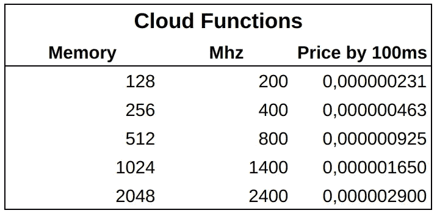
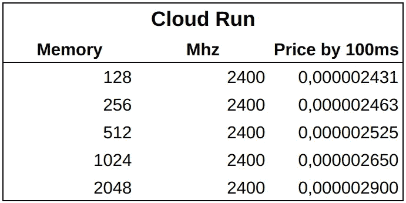
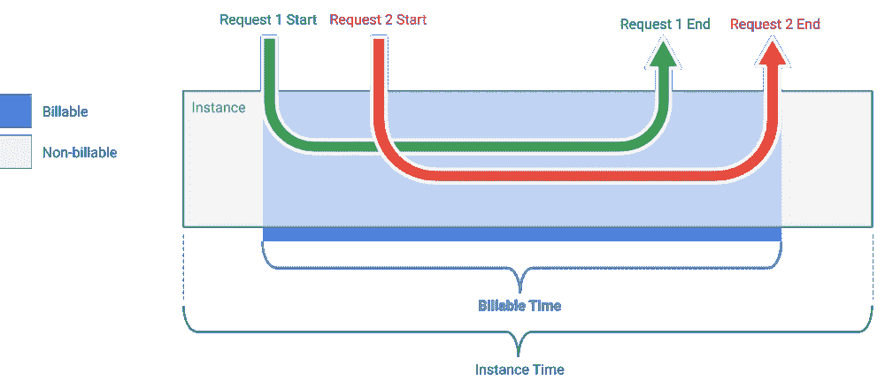
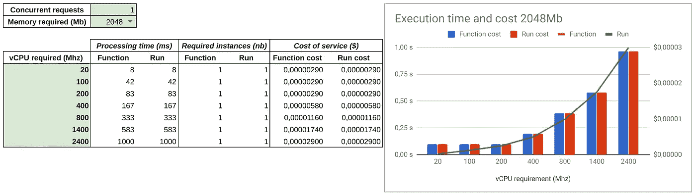
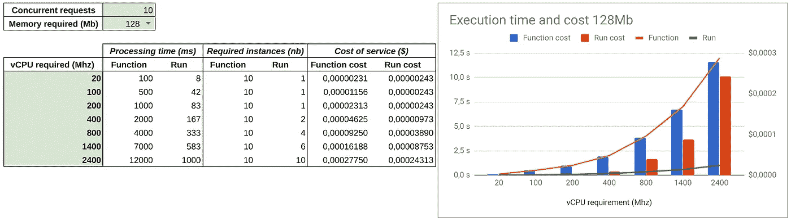
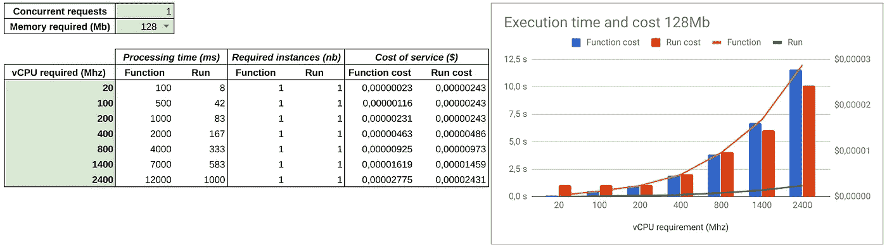

# 云运行 VS 云功能:最低成本是多少？

> 原文：<https://medium.com/google-cloud/cloud-run-vs-cloud-functions-whats-the-lowest-cost-728d59345a2e?source=collection_archive---------0----------------------->

在我之前的[故事](/google-cloud/cloud-run-and-cloud-function-what-i-use-and-why-12bb5d3798e1)中， [Gabriel Flores](https://medium.com/u/d9ccaaf9ad87?source=post_page-----728d59345a2e--------------------------------) 问我关于成本比较的问题。事实上，从技术角度选择解决方案很重要，但服务的成本不容忽视，因为在自动扩展环境中，**它可能会毫无征兆地爆发**。

*仅根据每种产品的定价和配额&限制进行比较。在这两种解决方案中，处理性能被认为是相等的。*

# 云函数

云功能的价格表

[云功能](https://cloud.google.com/functions/pricing)的定价基于以 GHz/s 为单位的 vCPU 和以 Gb/s 为单位的内存，四舍五入到最接近的 100 毫秒。功能的特殊性在于**您可以调整内存和 CPU 速度**，但不能单独调整。两者是联系在一起的，如果你想要更多的主频就增加内存，反之亦然

网络出口价格是 0.12 美元/Gb 的统一费率

最后，在 200 万个免费配额之后，请求按 0.40 美元计费

# 云运行(托管)

彩色打印清单

[云运行](https://cloud.google.com/run/pricing)定价基于 vCPU/s 和以 Gb/s 为单位的内存，四舍五入到最接近的 100 毫秒。不可能对每个实例使用部分 vCPU。**您的实例始终分配有 1 个 vCPU。内存可以从 128Mb 调整到 2Gb**

一个实例最多可以处理 80 个并发请求。因此，对于一个给定的实例，只有当实例处理至少一个请求时，才需要支付费用。

网络出口基于 1Gb 免费层后的[网络高级层](https://cloud.google.com/network-tiers/pricing#premium-pricing)定价。

最后，在 200 万个自由配额请求之后，请求按每百万个请求 0.40 美元计费

# 摘要

网络成本略有不同，云功能的出口免费层为 5Gb，云运行的出口免费层仅为 5Gb，大约相差 0.50 美元。但是，基于网络高级层，出口 Gb 价格不一样，而且在云上更复杂。**在欧洲和北美，使用 Cloud Run 很快就变得更便宜，与亚洲不相上下。**

云功能允许根据使用的内存相应地调整 vCPU 速度。但是每个实例只能处理一个请求。

云运行始终使用 1 个 vCPU 你只能调整内存。但是 Cloud Run 可以在同一个实例上处理并发请求。

最后，请求数量的成本严格相同。

顺便说一下，我们**可以考虑两种主要的比较情况:只有一个并发请求，和有几个并发请求。**

*我建了一个* [*GSheet*](https://docs.google.com/spreadsheets/d/1LiN8dNG5jB93KR-Km6UyNvvqXlBRjV9Brs1xIFoHI_Y/edit?usp=sharing) *玩内存，并发，进程需求值。*

## 一个并发请求案例

在这种情况下，只比较 1 个请求的处理。在这种情况下，Cloud Run 和 Cloud Functions 正好有一个实例用于处理这个唯一的请求，因此只有这个实例需要付费。

如果您在云运行中将 currency 设置为 1，或者您对服务有稀疏的顺序请求，就会发生这种情况。

因此，在相同的条件下，在 1 个 vCPU (2.4Ghz)和 2Gb 内存的情况下，**云运行和云功能之间的价格和性能完全相同**。

1 个请求和 2Gb 内存的价格比较

## 多个并发请求的情况

大多数情况下，一个服务同时处理几个请求。 **Cloud Run 能够对同一个实例处理多达 80 个并发请求**。

相反，**云函数创建与并发请求一样多的实例。**

因此，**云运行并发处理的请求越多，服务就越便宜**

10 个并发请求和 128Mb 内存的价格比较

# 考虑什么？

最佳选择取决于您想要优化的内容、您的用例以及您的特定需求。

## 最低延迟

如果您的目标是**最低延迟，请选择云运行**。

的确，**云运行始终使用 1 个 vCPU** (至少 2.4Ghz)，内存大小可以从 128Mb 到 2Gb 选择。

有了**云功能**，想要最好的处理性能(2.4Ghz 的 CPU)，**就得付出 2Gb 的内存**。如果您的内存占用量很低，那么 2Gb 内存的云功能就太过了，而且成本昂贵。

## 最低成本

削减成本并不总是让客户满意的最佳策略，但商业现实可能需要这样做。无论如何，这很大程度上取决于您的用例

云运行和云函数都四舍五入到最接近的 100 毫秒。正如您可以使用 [GSheet](https://docs.google.com/spreadsheets/d/1LiN8dNG5jB93KR-Km6UyNvvqXlBRjV9Brs1xIFoHI_Y/edit?usp=sharing) 一样，当一个请求的处理时间低于前 100 毫秒时，**云函数会更便宜。**事实上，您可以降低云功能 vCPU 的速度，结果会增加处理的持续时间，但如果调整得当，会保持在 100 毫秒以下。因此，使用的 Ghz/s 更少，因此您支付的费用也更少。

例如，对于只需要 128Mb 内存的低处理要求(需要 20Mhz ),您有:

*   云功能:100 毫秒的处理成本为 0.23-6 美元
*   云运行:8 毫秒的处理，成本为 2.4e-6 美元

1 个并发请求和 128Mb 内存的价格比较

当然，云功能比 T4 便宜 10 倍，但是你的客户需要多等 10 倍。并且只有当您有顺序请求时，这个定价比较才是**真** **。**

在这个例子中，超过 **10 个并发请求，云运行更便宜！**事实上，Cloud Run 在创建(和计费)一个新实例之前，可以在同一个实例上处理多达 80 个并发请求。

相反，**云函数处理不同实例上的并发请求**，因此，除了**为每个创建的实例支付冷启动过度成本**之外，您还必须为每个运行的实例支付费用。

10 个并发请求和 128Mb 内存的价格比较

还有一种情况是**云功能更便宜**并且降低 vCPU 速度是个好主意:当一个应用**调用 API 并等待响应**时。拥有 200Mhz 的功能就足够了，云运行的完整 vCPU 是多余的(没有或很少处理),因此非常昂贵。

## 实例限制

在每个产品的限制和配额页面中，并行实例的数量限制为 1000。

然而，**可以设置一个自定义上限**来限制并行实例的数量。最初发布是为了[限制资源使用](https://cloud.google.com/functions/docs/max-instances)(例如，数据库连接)，它也是一个很棒的功能，可以限制费用，并设置服务成本的上限。但是在饱和的情况下总是对用户满意度有负面影响。

## 事件处理

云功能可以由 HTTP 请求触发(称为 [HTTP 功能](https://cloud.google.com/functions/docs/writing/http))，也可以由谷歌云环境上触发的事件触发(称为[后台功能](https://cloud.google.com/functions/docs/writing/background))

相反，云运行容器只能被 HTTP 请求调用。然而，可以使用 [PubSub 推送订阅](https://cloud.google.com/pubsub/docs/push)来将 PubSub 事件推送到云运行进行处理。此外，还可以[将存储事件发布到 PubSub 主题](https://cloud.google.com/storage/docs/reporting-changes)，从而**通过 PubSub 推送订阅再次使用云运行**处理存储事件。但是，没有了。

因此，除了 PubSub 和 Storage 事件，**云功能对于所有其他类型的事件**都是不可避免的。没有选择的可能。

## VPC 连接要求

您的无服务器应用可能需要一些仅在您的 VPC 中可用的私有资源。例如，[内存存储](https://cloud.google.com/memorystore/docs/redis/)用于低延迟键值存储，或者 VPN/直接连接访问用于访问外部资源(在 prime 或其他云上)。

**云功能允许设置一个 VPC 连接器，用于将您的无服务器功能连接到您的 VPC** ，从而根据需要路由流量。

到目前为止，托管云还不可能运行，但这将在 2020 年改变。

# 选什么？

在结束之前，我想补充一些额外的注意事项，这些注意事项不直接与平台定价相关，但也涉及开发、服务和监控的整个过程。

## 关于成本的其他想法

公共云带来了一项新功能:真正了解成本。在我的公司，云成本引发了担忧:*哇，太贵了！不，它不是，但它是已知的，可见的。在前提环境下，很难知道每项服务的真实成本，尤其是人力成本或共有资源(网络、存储、托管等)。*

当你选择一个技术解决方案时，重要的是要考虑项目的所有方面，首先是你的人力资源。云函数看起来更便宜，因为你的用例很适合它们。但是，**你的团队能够用现有的语言开发功能吗？**

在我的公司，我们的传统堆栈(和专业知识)是 PHP 和 C++，这不适合云功能。这就是为什么，容器是我们的选择，甚至在云运行产品存在之前。

你真的知道你团队的成本吗？

*   因为员工对新堆栈不满意而有辞职的风险
*   培训成本以及培训期间的无生产力
*   由于新的堆栈，缺乏代码质量、可靠性、性能和生产力

**所有这些原因在大多数情况下都远远高于云提供商的成本**。

除了人的方面，在可移植性的情况下，重构的**成本**会是多少？由于测试困难或缺乏新语言的经验，多出了 X%的 bug 的成本**会是多少？**

## 应用关键度

2019 年 11 月，Cloud Run 经过 6 个月的测试后转向 GA。

Python 3、Node 8 和 Go 1.11 的云功能已正式发布

显然，这两款产品在谷歌承诺方面没有区别。但是，如果你的应用运行在 Python 3.8、Node 10/12 或 Go 1.12/1.13 上，那么就没有关于云函数的 GA 版本(甚至根本不支持！).使用 Cloud Run，GA 承诺应用于所有容器，与容器中的语言版本无关。

## 限额和配额

这两种服务之间几乎没有区别，但它们可能意味着组织变革或技术解决方案设计的重新设计。这是间接成本，但是如果您计划以较高的部署速度部署数百个云功能，就要考虑到这一点。

事实上，云函数被限制为每个项目 1000 个函数，每天每个项目编译 120 分钟。

在 Cloud Run 中，编译没有限制，因为它是在平台之外执行的，每个项目有 1000 个服务的限制。**但是一个服务可以服务几个端点。**

其他限制很难比较，或者与大多数项目无关。

# 结论

如您所见，云功能和云运行之间的成本比较不仅仅是简单地比较价目表。此外，在您的项目中，您经常需要使用这两种解决方案来利用它们的优势和能力。

我的开发首选是**云跑。它的可移植性、可测试性、对库、语言和二进制代码的开放性**赋予了它太多的优势，至少对于相似的价格来说是如此，而且通常在成本和性能上具有真正的优势，尤其是对于并发请求。即使您需要相同级别的云功能隔离(每个请求 1 个实例)，只需将并发参数设置为 1！

此外，云运行的 **GA 适用于所有容器，无论使用何种语言和二进制文件**。

然而，一些原因，VPC 能力或事件，可以迫使你选择云功能，但大多数情况下，这不是出于价格原因。

最后，用例的多样性、组织中的差异和人力资源的复杂性(技能、愿望、动机)产生了太多的组合，我只能**提供在你的决策过程中不要忘记的提示**和**事情**。**不可能** **提供唯一的答案**。

在任何情况下，请务必选择合适的合作伙伴，从外部的角度出发，在这个过程中为您提供帮助，与您的团队交流，并自己尝试找到您的使用案例的最佳答案！