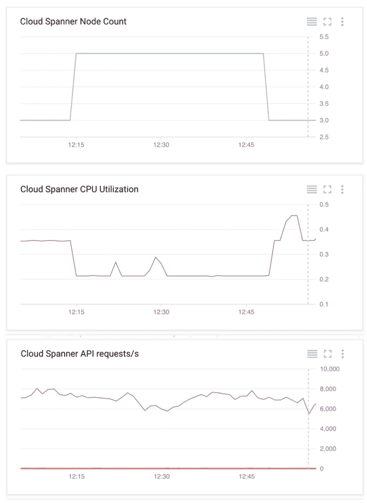
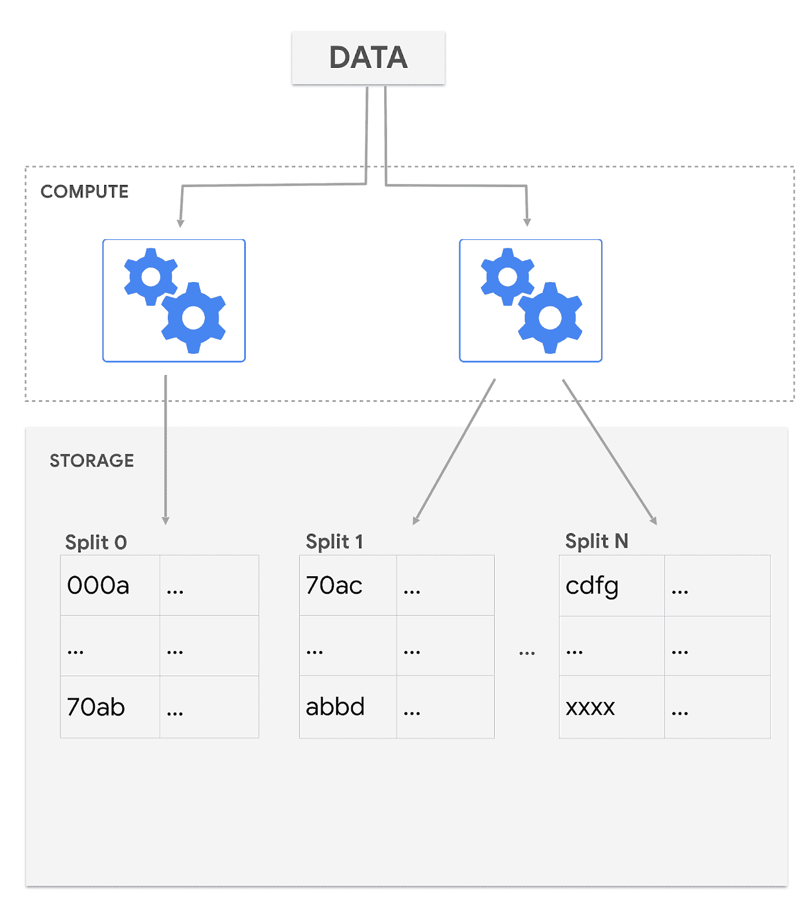
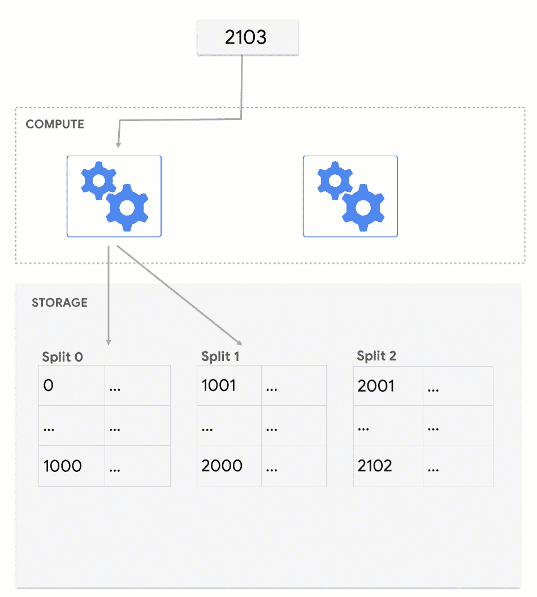
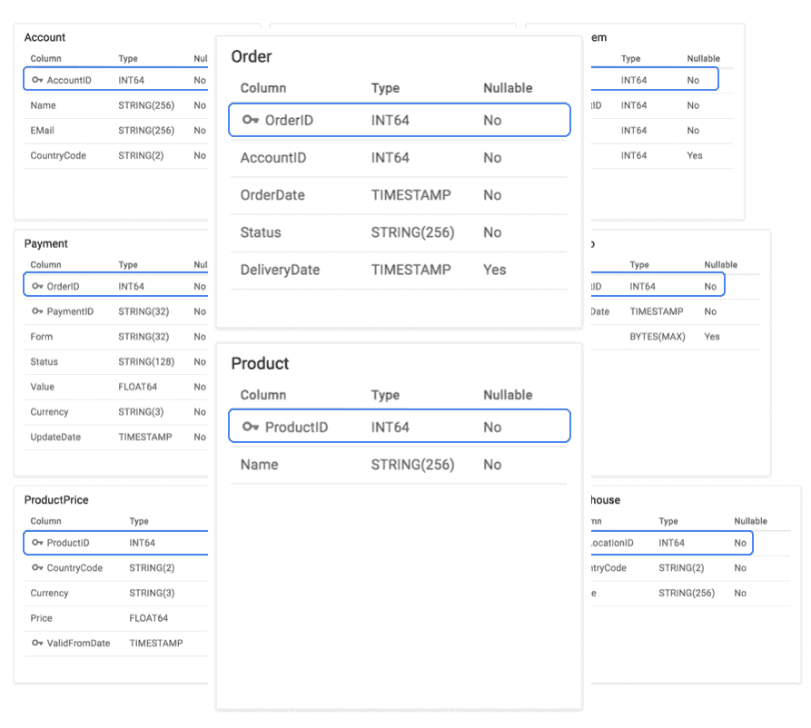
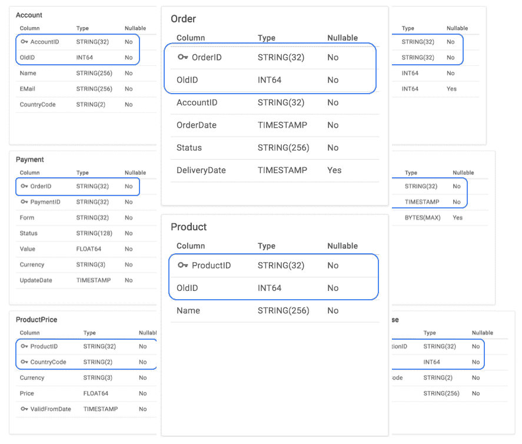
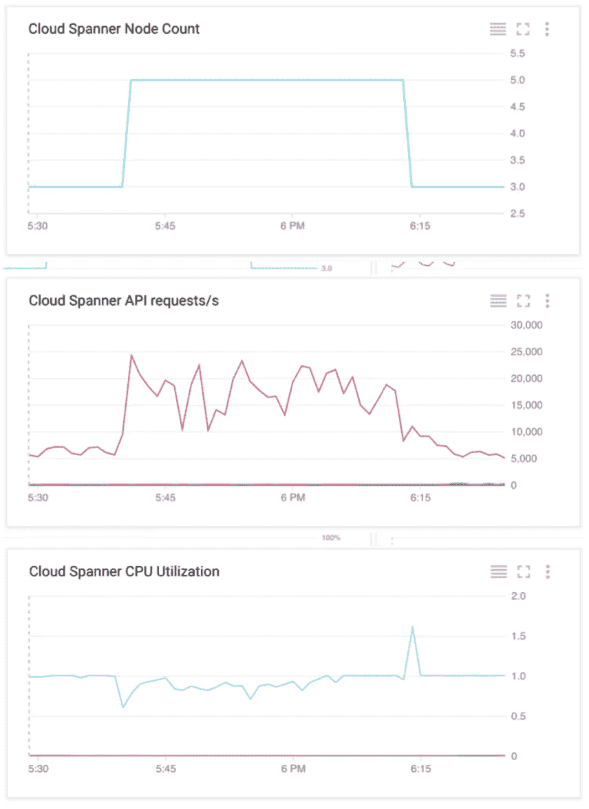

# 云扳手—选择正确的主键

> 原文：<https://medium.com/google-cloud/cloud-spanner-choosing-the-right-primary-keys-cd2a47c7b52d?source=collection_archive---------0----------------------->

这篇文章讲述了如何选择正确的主键来在 Cloud Spanner 中实现可伸缩的数据写入。

忙到没时间看书？查看上面的视频以了解总结。

# 场景

想象一下，一个在线商店建立在传统数据库的基础上，我们需要将其迁移到 Cloud Spanner。我们从虚拟数据库的备份开始，所有数据都导出为 CSV 文件，并上传到[谷歌云存储](https://cloud.google.com/storage) (GCS)。然后，一个加载程序从 GCS 中读取所有文件，处理它们并将数据写入 Cloud Spanner。到目前为止还不错；将文件存储在 Google 云存储中，并从靠近我们的 Cloud Spanner 实例的计算引擎实例中处理它们，这非常棒。这样，我们就不必担心网络容量或额外的延迟会成为数据加载期间的问题。

# **hot spot 和云扳手如何组织数据**

然而，在区域实例上运行第一次数据负载测试后，我们对利用率有点失望。我们在一个三节点实例上只看到 35%的利用率。试图通过横向扩展加载器来提高利用率于事无补。根据数学计算，三个节点，35%，看起来负载只在一个节点上热点。为了验证这一假设，我们将实例扩展到五个节点，看到利用率下降到 20%左右，而每秒的事务数和吞吐量基本保持不变。这表明只有一个节点在工作。

热启动加载期间的云扳手监控图(来自 Stackdriver)

此时，我们需要更深入地挖掘，了解 Cloud Spanner 如何组织数据来扩展工作负载。[文档](https://cloud.google.com/spanner/docs/whitepapers/optimizing-schema-design#table_layout)告诉我们 Cloud Spanner 按照主键的字典顺序(字母顺序)组织表中的行。然后，在表的大小和负载模式的驱动下，数据被分成称为“拆分”的块。这些拆分是基于主键的不同范围的行。

云扳手根据大小和负载模式拆分表

为了高效地横向扩展所有读取和写入，每个单独的剥离可以在可用的计算节点之间自由移动，同时确保始终只有一个节点控制对剥离的写入。

—要了解 Cloud Spanner 如何通过仅由一个节点控制对拆分的写入来确保强一致性，请阅读 [Spanner 白皮书](https://research.google.com/archive/spanner.html)。—

这就是棘手的地方。如果写入一个主键值单调递增或递减的表，比如“1 2 3”或“c b a ”,那么所有请求都会被发送到一个 split，即键空间中的第一个或最后一个。( *Key space* 指主键的所有可能值。)如果一次加载许多这样的行，最终会耗尽负责计算节点的资源，从而导致热点。

# **选择分布良好的主键启用缩放**

有了这些新获得的知识，我们可以更仔细地查看我们正在加载的模式和导出数据。原来应用程序对一些主键使用了自动递增的整数。因为数据是按这个顺序导出的，所以当它被加载时，所有新行都被添加到最后一个分割中，从而创建一个热点。

要解决这个问题，有多种选择:

1.  我们可以以不同于数据导出的顺序加载数据，最好是随机顺序，或者
2.  我们可以修改模式，例如，通过引入一个分布键，我们用它作为主键的前缀，通过使用一个良好分布的散列函数来散列我们现有的键，或者通过引入一个全新的良好分布的主键。

第一个选项的缺点是它只解决数据加载期间的热点问题。如果我们的应用程序在正常操作过程中创建了主键单调递增或递减的新记录，它将再次成为热点。
考虑到未来的可伸缩性需求，我们选择生成一个新的[基于 UUID v4](https://en.wikipedia.org/wiki/Universally_unique_identifier#Version_4_(random)) 的主键，并保留旧的 ID 以备将来使用。

在这些修改之后，我们再次运行数据加载。现在，随着时间的推移，我们看到了 Cloud Spanner 实例的充分利用，并且吞吐量随着实例节点的数量而扩展。

这里有一点需要注意:当您开始加载一个空数据库时，第一次拆分和基于负载的重新平衡需要一些时间。这意味着需要一段时间才能看到实例的充分利用

# 后续步骤

点击查看代码示例[。要了解关于 Google Cloud Spanner 的更多信息，请关注下一篇文章，它将讨论如何在数据加载期间最大化吞吐量。同时，查看](https://goo.gl/Jcq63p)[文档](https://cloud.google.com/spanner/docs/)和[入门指南](https://cloud.google.com/spanner/docs/tutorials)。