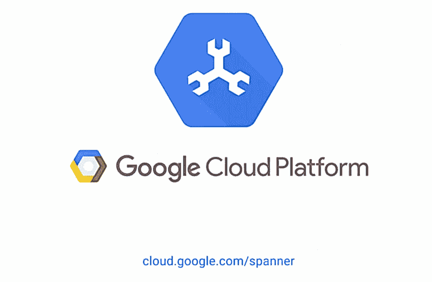

# 云扳手仿真器

> 原文：<https://medium.com/google-cloud/cloud-spanner-emulator-bf12d141c12?source=collection_archive---------1----------------------->



Cloud Spanner 在 2017 年推出后，在几个不同的行业和垂直领域都有大量的客户采用。随着这种增长，我们已经使用 Cloud Spanner 建立了一个大型的应用程序开发人员社区。为了让这项服务对更广泛的开发者社区更加开放，我们引入了一个 Cloud Spanner 服务的离线模拟器。Cloud Spanner 模拟器旨在为客户降低应用程序开发成本，提高开发人员的工作效率。

Cloud Spanner emulator 为应用程序开发人员提供了全套 API，包括广泛的 SQL 和 DDL 特性，可以在本地运行以进行原型开发、开发和测试。这个开源仿真器将为应用程序开发人员提供透明性和灵活性，以便为他们的应用程序定制工具。

这篇博客介绍了 Cloud Spanner 模拟器，并将指导您使用现有的 Cloud Spanner CLI 和客户端库安装和使用模拟器。

# 什么是云扳手模拟器？

云扳手仿真器提供了云扳手服务的本地、内存中的高保真仿真器。您可以使用仿真器在本地和集成测试环境中原型化、开发和密封测试您的应用程序。

因为仿真程序将数据存储在内存中，所以它不会在运行期间保存数据。该模拟器旨在帮助您使用 Cloud Spanner 进行本地开发和测试，而不是用于生产部署。但是，一旦您的应用程序与模拟器一起工作，您就可以通过简单地更改 Cloud Spanner 端点配置来继续对您的应用程序进行端到端测试。

# 支持的功能

Cloud Spanner 模拟器公开了一整套 Cloud Spanner APIs，包括实例、数据库、SQL、DML、DDL、会话和事务语义。通过[信息模式](https://cloud.google.com/spanner/docs/information-schema)可以支持查询数据库的模式元数据。 [gRPC](https://cloud.google.com/spanner/docs/reference/rpc) 和[REST](https://cloud.google.com/spanner/docs/reference/rest)API 都得到支持，可以与现有的[客户端库](https://cloud.google.com/spanner/docs/reference/libraries)、 [OSS JDBC 驱动](https://cloud.google.com/spanner/docs/use-oss-jdbc)以及 [Cloud SDK](https://cloud.google.com/sdk/gcloud/reference/spanner) 一起使用。该仿真器在 Linux 上被本地支持，并且在 MacOS 和 Windows 平台上需要 [Docker](https://www.docker.com/products/docker-desktop) 。为了简化应用程序的开发和测试，IntelliJ 和 Eclipse 等 ide 可以配置为直接与 Cloud Spanner 仿真器端点通信。

模拟器不是为生产规模和性能而构建的，因此不应用于负载测试或生产流量。应用程序开发人员可以使用模拟器进行迭代开发，并实现和运行单元测试和集成测试。

Cloud Spanner emulator [自述文件](https://github.com/GoogleCloudPlatform/cloud-spanner-emulator/blob/master/README.md#technical-details)中提供了详细的特性和限制列表。该模拟器目前(截至 2020 年 4 月)处于测试版，并将继续增强功能和 API 与云扳手服务的对等性。

# 使用云扳手模拟器

本节描述使用现有的 Cloud Spanner CLI 和客户端库与仿真器进行交互。

# 开始之前

*   安装[云 SDK](https://cloud.google.com/sdk/docs/)
*   配置 [gcloud 凭证](https://cloud.google.com/sdk/gcloud/reference/auth/application-default/login)
*   如果使用 MacOS 或 Windows，安装 [Docker](https://www.docker.com/products/docker-desktop)

# 本地启动模拟器

模拟器可以在 Linux、MacOS 和 Windows 上使用 Docker 或使用 Cloud SDK CLI 启动。无论哪种情况，MacOS 和 Windows 都需要安装 docker 。

# 码头工人

```
$ docker pull gcr.io/cloud-spanner-emulator/emulator
$ docker run -p 9010:9010 -p 9020:9020 gcr.io/cloud-spanner-emulator/emulator
```

注意:第一个端口是 gRPC 端口，第二个端口是 REST 端口。

# 云 SDK CLI

```
$ gcloud components update
$ gcloud emulators spanner start
```

启动模拟器的其他选择，包括预建的 linux 二进制文件，在这里[列出](https://github.com/GoogleCloudPlatform/cloud-spanner-emulator/blob/master/README.md#quickstart)。

# 设置云扳手项目和实例

配置云扳手端点、项目和禁用身份验证:

```
$ gcloud config configurations create emulator
$ gcloud config set auth/disable_credentials true
$ gcloud config set project test-project
$ gcloud config set api_endpoint_overrides/spanner [http://localhost:9020/](http://localhost:9020/) # Verify gCloud is working with the Cloud Spanner Emulator.
$ gcloud spanner instance-configs listNAME            DISPLAY_NAME
emulator-config Emulator Instance Config # Create a Cloud Spanner Instance
$ gcloud spanner instances create test-instance --config=emulator-config --description=”Test Instance” --nodes=1
```

*注*:

```
# To switch back to the default config:
$ gcloud config configurations activate default# To switch back to the emulator config:
$ gcloud config configurations activate emulator
```

# 使用云扳手客户端库

有了 beta 午餐，支持 Java、Go 和 C++ Cloud Spanner 客户端库的最新版本与仿真器交互。使用[入门指南](https://cloud.google.com/spanner/docs/tutorials)试用模拟器。

这是一个使用模拟器运行 Java 客户端库的示例:

***先决条件*** :从上一步开始设置云扳手项目和实例。

```
# Configure emulator endpoint
$ export SPANNER_EMULATOR_HOST=”localhost:9010"# Cloning java sample of client library.
$ git clone [https://github.com/GoogleCloudPlatform/java-docs-samples](https://github.com/GoogleCloudPlatform/java-docs-samples) && cd java-docs-samples/spanner/cloud-client
$ mvn package# Create database
$ java -jar target/spanner-google-cloud-samples-jar-with-dependencies.jar createdatabase test-instance example-db# Write into database
$ java -jar target/spanner-google-cloud-samples-jar-with-dependencies.jar write test-instance example-db# Query from database
$ java -jar target/spanner-google-cloud-samples-jar-with-dependencies.jar query test-instance example-db
```

使用[入门指南](https://cloud.google.com/spanner/docs/getting-started/java#create_a_database)遵循 Java 客户端库示例的其余部分。

# 使用云 SDK CLI

***先决条件*** :从上一步开始设置云扳手项目和实例。

```
# Configure emulator endpoint
$ gcloud config configurations activate emulator# Create a database
$ gcloud spanner databases create test-database --instance test-instance --ddl “CREATE TABLE TestTable (Key INT64, Value STRING(MAX)) PRIMARY KEY (Key)”# Write into database
$ gcloud spanner rows insert --table=TestTable --database=test-database --instance=test-instance --data=Key=1,Value=TestValue1# Read from database
$ gcloud spanner databases execute-sql test-database --instance test-instance --sql “select * from TestTable”
```

# 使用开源命令行工具 spanner-cli

使用 [spanner-cli](https://github.com/cloudspannerecosystem/spanner-cli#example) 对云 Spanner 数据库进行交互式提示。

***先决条件*** :从上一步开始设置云扳手项目、实例和数据库。

```
# Configure emulator endpoint
$ export SPANNER_EMULATOR_HOST=”localhost:9010"# Start the spanner-cli
$ go get github.com/cloudspannerecosystem/spanner-cli
$ go run github.com/cloudspannerecosystem/spanner-cli -p test-project -i test-instance -d test-databasespanner> INSERT INTO TestTable (Key, Value) VALUES (2, “TestValue2”), (3, “TestValue3”);
Query OK, 2 rows affectedspanner> SELECT * FROM TestTable ORDER BY Key ASC;
+ — — -+ — — — — — — — — +
| Key  | Value           |
+ — — -+ — — — — — — — — +
| 2    | TestValue2      |
| 3    | TestValue3      |
+ — — -+ — — — — — — — — +
2 rows in setspanner> exit;
```

# 结论

Cloud Spanner emulator 降低了应用开发成本，提高了 Cloud Spanner 客户的开发效率。我们计划继续构建和支持客户要求的功能，您可以通过 GitHub 上的 [Cloud Spanner emulator](https://github.com/GoogleCloudPlatform/cloud-spanner-emulator) 了解更多更新。