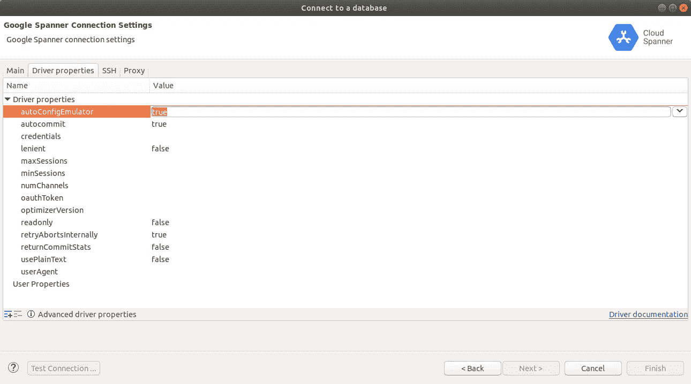

# 数据仓库中的云扳手

> 原文：<https://medium.com/google-cloud/cloud-spanner-in-dbeaver-853998faa0ba?source=collection_archive---------0----------------------->

[Google Cloud Spanner](https://cloud.google.com/spanner) 是一个全面管理、可扩展的关系数据库服务，用于区域和全球应用数据。它是第一个可扩展的、企业级的、全球分布的、高度一致的数据库服务，专为云构建，将关系数据库结构的优势与非关系水平扩展相结合。

使用关系数据库的优势之一是有大量的标准工具可用。Cloud Spanner 包括一个 [JDBC 驱动](https://cloud.google.com/spanner/docs/use-oss-jdbc)，它已经被添加为 [DBeaver](https://dbeaver.io/) 的扩展。这意味着您可以使用 DBeaver 查询和更新 Cloud Spanner 数据库中的数据，而无需手动安装任何驱动程序。JDBC 驱动程序还包括许多[非常有用的附加 SQL 语句](https://cloud.google.com/spanner/docs/use-oss-jdbc#session_management_statements)，您可以使用它们来高效地使用 Cloud Spanner。

本文提供了使用 Cloud Spanner 通过通用 SQL 接口(如 DBeaver)时的技巧和最佳实践列表。本文中的大多数技巧也适用于使用 JDBC 驱动程序连接到 Cloud Spanner 的其他应用程序。

# 在 DBeaver 中创建连接

DBeaver 7.1.3 及更高版本附带了云扳手 JDBC 驱动程序。按照以下步骤创建连接:

1.  点击`New Database Connection`
2.  选择`Google Spanner`驱动(不是`Google Spanner (Community)`驱动)
3.  输入项目 ID、实例 ID、数据库 ID，并选择有效的凭据密钥文件。

# 批处理 DDL 语句

Cloud Spanner 支持[标准 DDL 语句](https://cloud.google.com/spanner/docs/data-definition-language)来创建和更改表和索引。当您需要在一行中执行多个语句时，强烈建议将多个 DDL 语句批处理在一起。当您创建或更改测试数据库时，通常会出现这种情况。一批 DDL 语句的总执行速度比每个语句单独执行时要低得多。使用`START BATCH DDL`和`RUN BATCH`语句执行一批 DDL。

# 批处理 DML 语句

Cloud Spanner 允许在一个远程过程调用中批量处理多个 DML 语句。使用此功能可以减少一组语句的总执行时间。这个特性非常类似于上面显示的 DDL 批处理特性。

# 执行分区的 DML 语句

Cloud Spanner 允许在单个读/写事务中最多有 20，000 个[突变。有时有必要执行较大的事务。为此，Cloud Spanner 支持](https://cloud.google.com/spanner/quotas#limits_for_creating_reading_updating_and_deleting_data)[分区 DML s](https://cloud.google.com/spanner/docs/dml-partitioned) 语句。JDBC 驱动程序也支持分区的 DML 语句。JDBC 驱动程序必须处于**自动提交模式**才能执行分区 DML。

# 只读事务

Cloud Spanner 支持[只读事务](https://cloud.google.com/spanner/docs/transactions#read-only_transactions)，它提供一致的读取而不需要任何锁。执行只读事务时的默认过时模式是强。这意味着只读事务启动时提交的所有数据对该事务都是可见的。如果您想读取过时数据，您可以[选择不同的过时](https://cloud.google.com/spanner/docs/use-oss-jdbc#set_read_only_staleness)模式。

# 连接到模拟器

Cloud Spanner 还提供了一个[本地仿真器](https://cloud.google.com/spanner/docs/emulator)，可以用于测试和开发目的。在[扳手 JDBC 驱动](https://github.com/googleapis/java-spanner-jdbc)版本 2.0.0 和更高版本中，通过添加`autoConfigEmulator`连接属性，使用 JDBC(或 DBeaver)连接到仿真器变得尽可能容易。将此属性设置为将指示 JDBC 驱动程序执行以下操作:

1.  使用默认的模拟器主机和端口(`localhost:9010`)，除非在连接字符串中指定了特定的主机和端口。该连接还会自动禁用 SSL，因为模拟器不支持。
2.  如果连接字符串中引用的`instance`和`database`还不存在，它们将在模拟器上自动创建。

以上意味着连接字符串`jdbc:cloudspanner:/projects/test-project/instances/test-instance/databases/test-database?autoConfigEmulator=true`将自动:

1.  连接到`localhost:9010`
2.  禁用 SSL
3.  创建`test-instance`和`test-database`，如果这些都不存在的话

## 在 DBeaver 中连接到仿真器的步骤

按照以下步骤连接到 DBeaver 中的 Cloud Spanner 模拟器:

1.  使用默认配置，使用 [gcloud CLI](https://cloud.google.com/spanner/docs/emulator#gcloud_cli) 或 [docker image](https://cloud.google.com/spanner/docs/emulator#docker) 启动 Google Cloud Spanner 模拟器。
2.  确保在 DBeaver 中安装了 2.0.0 或更高版本的 Google Cloud Spanner JDBC 驱动程序。你可以通过点击菜单项`Database | Driver Manager`，然后双击谷歌扳手(或谷歌**云**扳手，名称取决于 DBeaver 版本)驱动名称。单击下载/更新按钮，将驱动程序更新到最新版本。
3.  点击 DBeaver 中的新数据库连接，并选择 Google (Cloud)扳手驱动程序。
4.  输入项目、实例和数据库的值(例如`test-project, test-instance, test-database`)。将私钥路径字段留空。
5.  单击驱动程序属性选项卡，并将连接属性的值`autoConfigEmulator`更改为`true`。
6.  单击完成。DBeaver 现在将连接到您在步骤 1 中启动的模拟器，如果实例和数据库还不存在，它们将自动在模拟器上创建。

将自动配置器设置为 true

请注意，当您使用`autoConfigEmulator`时，您**不需要**来设置以下任何属性:

1.  您**不需要**在连接字符串中设置主机名或端口号(只要仿真器使用默认的主机和端口号`localhost:9010)`
2.  你**不需要**来设置环境变量 SPANNER_EMULATOR_HOST。
3.  您**不需要**来设置连接属性 usePlainText。
4.  您**不需要**配置任何凭证。