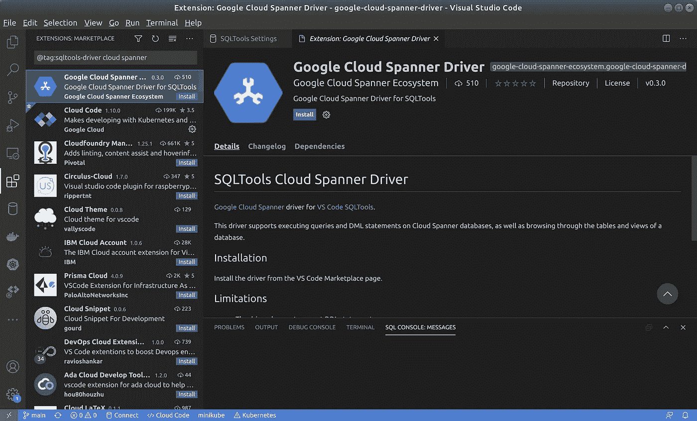
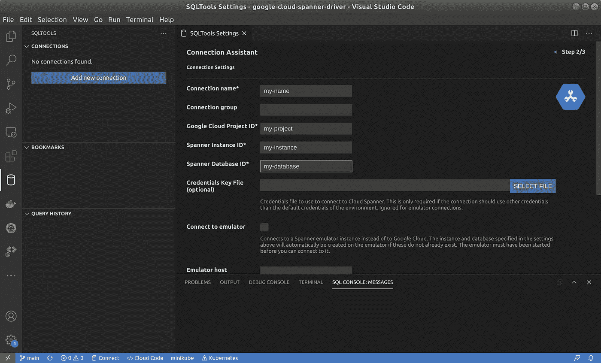

# Visual Studio 代码中的云扳手

> 原文：<https://medium.com/google-cloud/cloud-spanner-in-visual-studio-code-d7e7fe7cc6f6?source=collection_archive---------1----------------------->

[Google Cloud Spanner](https://cloud.google.com/spanner) 是一个全面管理、可扩展的关系数据库服务，用于区域和全球应用数据。它是第一个可扩展的、企业级的、全球分布的、高度一致的数据库服务，专为云构建，将关系数据库结构的优势与非关系水平扩展相结合。

使用关系数据库的优势之一是有大量的标准工具可用。Cloud Spanner 现在还提供了与流行的 [Visual Studio 代码扩展 SQL 工具](https://vscode-sqltools.mteixeira.dev/)的集成。这种集成使您能够直接从 Visual Studio 代码中执行查询、DML 语句和 DDL 语句。

# 安装

在安装云扳手驱动之前，你需要从 Visual Studio 代码中的扩展插件添加 [SQL 工具](https://vscode-sqltools.mteixeira.dev/)。然后按照以下步骤操作:

1.  打开 SQL 工具并点击**添加新连接**。
2.  根据您是否已经安装了驱动程序，SQL Tools 将显示带有“获取更多驱动程序”选项的当前驱动程序，或者显示带有“搜索 VSCode Marketplace”选项的空屏幕以获取驱动程序。点击其中一个。
3.  VS 代码市场将用所有已知的 SQL 工具驱动程序打开。将“云扳手”添加到搜索字符串中，并选择谷歌云扳手驱动程序。然后点击安装。

安装谷歌云扳手驱动程序

# 连接到云扳手

点击**添加新连接**连接到现有的云扳手数据库。选择 Google Cloud 扳手驱动程序，并输入以下信息:

*   连接名称:您要为此连接指定的任何名称。
*   Google Cloud Project ID:创建 Spanner 实例的 Google Cloud 项目的 ID。
*   Spanner 实例 ID:数据库所在的云 Spanner 实例的 ID。
*   扳手数据库 ID:云扳手数据库的名称。
*   凭据密钥文件:用于连接数据库的凭据文件。只有在您的环境中尚未设置任何默认 Google Cloud 凭据，或者您想要使用其他凭据时，才需要这样做。

然后点击**保存连接**。

# 执行语句

Cloud Spanner SQL Tools 驱动程序支持查询、DML 和 DDL 语句。不支持返回超过 100，000 行的查询，因为 SQL Tools 将所有查询结果加载到内存中。向查询中添加 LIMIT 子句以减少总行数。

DML 语句将返回插入/更新/删除的行数。每个 DML 语句都作为一个单独的事务执行。当前版本的驱动程序(0.3.0)不支持在一个事务中有多个 DML 语句，也不支持[分区的 DML](https://cloud.google.com/spanner/docs/dml-partitioned) 语句。

DDL 语句不返回任何结果，除了在 DDL 语句完成执行后显示一条简短的“成功”消息。请注意，Cloud Spanner 上的 DDL 语句可能需要很长时间。这尤其适用于需要填充索引的操作。

# 连接到扳手模拟器

云扳手的 SQL Tools 驱动也支持连接到[扳手模拟器](https://cloud.google.com/spanner/docs/emulator)。按照以下步骤连接到模拟器:

1.  [启动扳手模拟器](https://cloud.google.com/spanner/docs/emulator#installing_and_running_the_emulator)。
2.  在 SQL Tools 中点击 Add New Connection，选择 Google Cloud Spanner 驱动。
3.  为连接命名，并在连接的项目、实例和数据库字段中输入“测试项目”、“测试实例”和“测试数据库”。也可以使用任何其他 id，包括模拟器上的任何现有实例和/或数据库。如果模拟器上不存在项目、实例或数据库，驱动程序将自动创建它们。
4.  选中“连接到仿真器”复选框。
5.  您**不需要**设置 **SPANNER_EMULATOR_HOST** 环境变量来从 Visual Studio 代码连接到它。
6.  您**不需要**在 Visual Studio 代码的连接设置中设置模拟器的主机和端口号，除非您已经在不同于默认的主机/端口上启动了模拟器。
7.  保存连接。

现在，您可以连接到模拟器并创建几个测试表，测试不同的查询/插入/更新/删除等。

请记住，您总是需要在连接到模拟器之前启动模拟器，但是您不需要在模拟器上创建实例和/或数据库。另外，当通过 Visual Studio 代码连接时，您**不需要**来设置 **SPANNER_EMULATOR_HOST** 环境变量。

# 问题/功能请求

请在此库中报告您对 Visual Studio 代码[中的 Cloud Spanner 的任何问题和/或功能请求。](https://github.com/cloudspannerecosystem/sqltools-cloud-spanner-driver/issues)