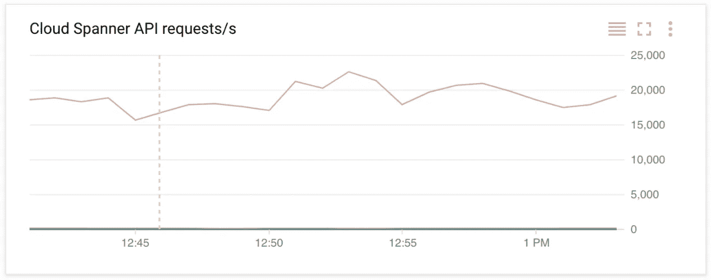
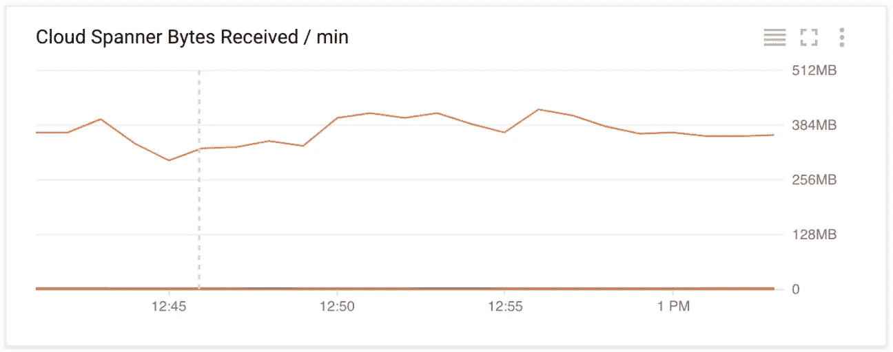
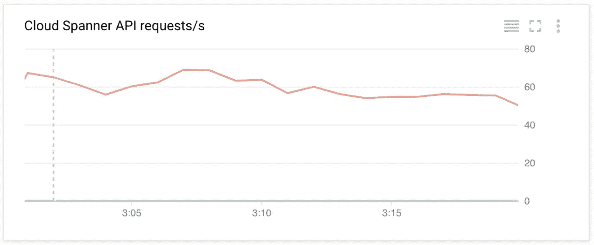
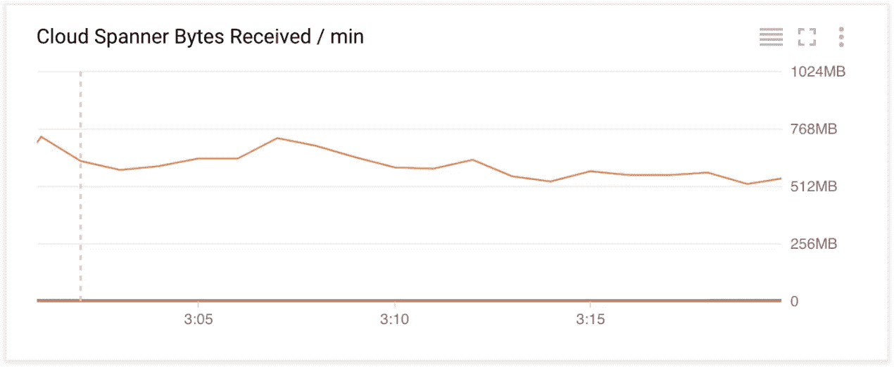
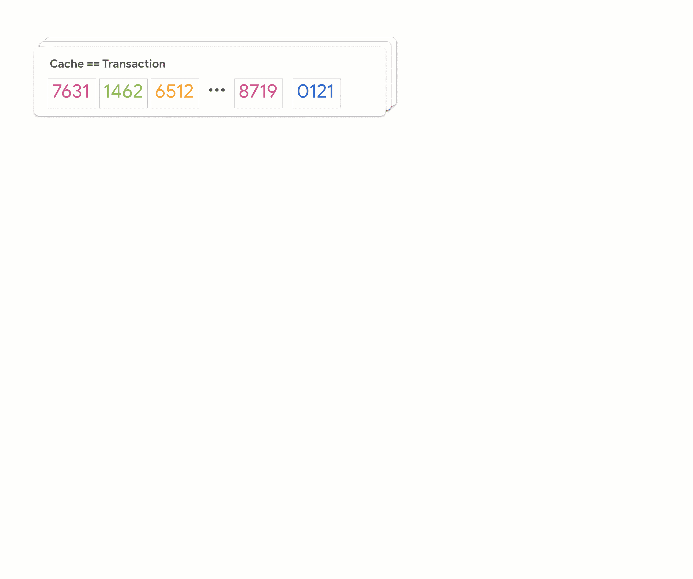
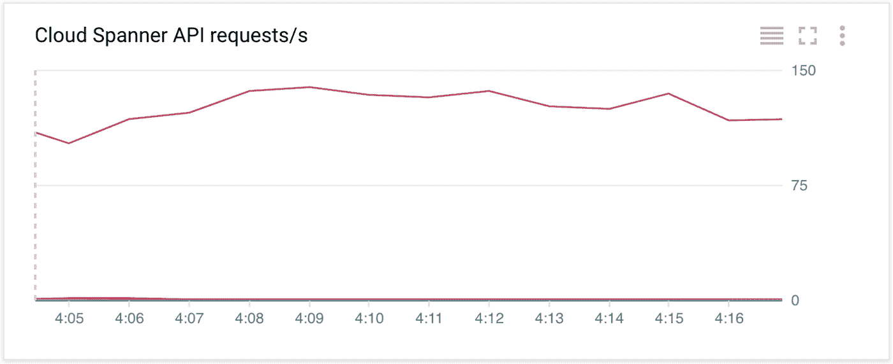
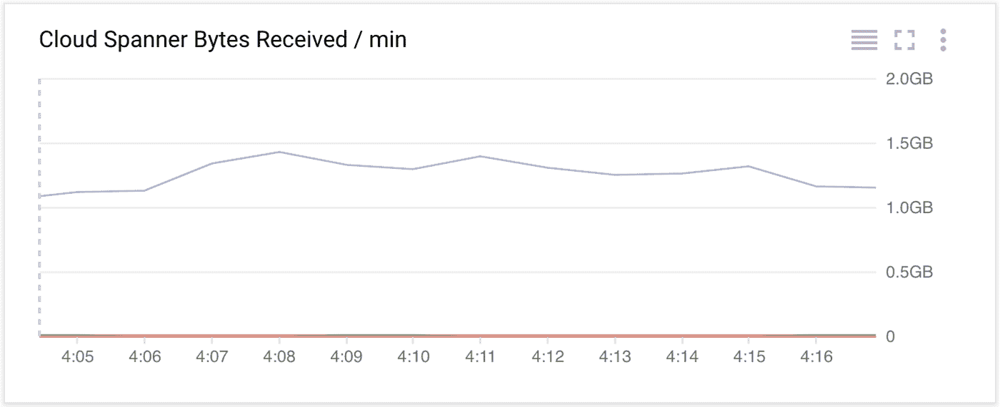

# 云扳手—最大化数据加载吞吐量

> 原文：<https://medium.com/google-cloud/cloud-spanner-maximizing-data-load-throughput-23a0fc064b6d?source=collection_archive---------0----------------------->

这篇文章涵盖了最大化云扳手写吞吐量的策略。

忙到没时间看书？查看上面的视频以了解总结。

# **场景**

作为对我们在这一系列博客文章中工作的场景的提醒，想象一个建立在传统数据库基础上的在线商店，我们希望将其迁移到 Cloud Spanner。
我们从虚拟数据库的备份开始，所有数据导出为 CSV 文件并上传到[谷歌云存储](https://cloud.google.com/storage) (GCS)。然后，一个加载程序从 GCS 中读取所有文件，处理它们并将数据写入 Cloud Spanner。

前一篇[博客文章](/@hostirosti/cloud-spanner-choosing-the-right-primary-keys-cd2a47c7b52d)讨论了如何为场景选择正确的主键来实现可伸缩的读写。我们采用的方法没有利用 Cloud Spanner 的全部数据加载潜力，因为我们每个事务只写一行。现在，我们希望通过在一个事务中批处理多行来增加负载吞吐量。

# **编写批处理和云扳手事务如何工作**

很明显，我们应该将尽可能多的写操作批处理在一起，以获得可观的吞吐量提升，同时保持低于事务限制。

我们正在加载的记录相当小，所以我们将批处理大小增加到每个事务 1000 行，由于减少了客户端服务器通信和事务开销，预计吞吐量会高得多。

令人惊讶的是，我们只看到了大约 2.5 倍的性能提升，超过 50k 行/秒，低于 20k 行/秒。

## 无批处理:

API requests/s 图显示了提交给数据库的每一行的一个 API 调用。

每分钟接收的字节数图表显示了 0 到 512 MB /分钟范围内的 API 流量

## **带配料:**

api 请求/秒图显示了提交到数据库的每 1000 行的 API 调用。

每分钟接收的字节数图表显示了 0 到 1024 MB /分钟范围内的 API 流量

不要误解我的意思，吞吐量增加一倍以上是很好的，但是我们想看看是否可以进一步提高。

# **下令分批前往救援，等等什么，我们刚才不是……？**

事实证明，我们仍然缺少一个步骤来获得批处理的真正好处。我们一起批处理的行具有分布良好的主键，这些主键是我们在之前的[博客文章](/@hostirosti/cloud-spanner-choosing-the-right-primary-keys-cd2a47c7b52d)中介绍的，用于修复数据加载期间的热点问题。因此，在一个事务中写入 1000 个这样的行(具有分布良好的主键)会导致很多很多的拆分。正如您现在所知道的，一个表是根据大小和负载，在按主键的字母顺序排序的行范围内进行分割的。然后，在可用的计算节点之间分配这些拆分的责任，其中每个拆分由一个节点控制。

现在，当我们在单个事务中写入多个拆分时，Cloud Spanner 需要在所有相关节点之间进行协调。为此，它需要获得锁，并使用两阶段提交协议序列化写入任何拆分的所有未完成事务的访问。这意味着在一个事务中拥有多行的好处会因为跨越多个表拆分而产生的协调开销而减少。

具有无序行的批处理事务会访问大量的表拆分，并可能导致争用

了解了 Cloud Spanner 的内部工作原理后，我们需要一种方法来减少一个事务中涉及的拆分数量，以便从批处理中获得最大的好处。

回到我们的 loader 程序，我们修改它，将大量的行加载到缓存中。然后，我们按照主键的字母顺序对这些行进行排序，与我们数据库中的表分割排序方式相同，并按照我们选择的批处理大小对它们进行分区。在那里，我们为每个分区创建一个事务。

具有在范围内不同的有序行(按主键列)的批处理事务只访问少量的表拆分，从而最大限度地减少争用

现在有些人可能会问，在之前的[博客文章](/@hostirosti/cloud-spanner-choosing-the-right-primary-keys-cd2a47c7b52d)中，我们不是刚刚引入了分布良好的主键以避免热点，现在我们正在排序吗？没错，这里的技巧是，有序分区在它们写入的主键范围中是不同的，跨越更少的表分割，从而在写入期间导致更少的争用。从图中可以看出，这显著提高了我们的负载性能，大约为 120，000 行/秒。

api 请求/秒图显示了提交到数据库的每 1000 行的 API 调用。

每分钟接收的字节数图表显示了 0 到 2.0 GB /分钟范围内的 API 流量

为了找到最佳负载性能，我们必须记住几个限制。除了 1MB 到 10MB 之间的事务的最佳大小之外，每个事务还有 20k 突变的严格限制。突变？那是什么？
突变在这里有特殊的含义，对表或索引中单个单元格的任何修改都是一个突变，除非您删除了某个范围的行。例如，如果您有一个包含五列的表，其中三列定义了一个索引，那么一整行的每次插入都有八个突变。

现在，如果您不想自己将所有这些逻辑写入您的数据加载器，您可以使用云扳手的云数据流连接器。连接器自动为您对 Cloud Spanner 进行排序、分区和扩展。查看[示例源代码](https://goo.gl/Jcq63p)以了解更多信息。

—这里有一点需要注意:当您开始加载一个空数据库时，第一次拆分和基于负载的重新平衡需要一些时间。这意味着需要一段时间才能看到多节点实例的全部利用率。—

# 后续步骤

点击查看代码示例[。要了解关于 Google Cloud Spanner 的更多信息，请关注下一篇文章，它将讨论如何在数据加载期间最大化吞吐量。同时，查看](https://goo.gl/Jcq63p)[文档](https://cloud.google.com/spanner/docs/)和[入门指南](https://cloud.google.com/spanner/docs/tutorials)。