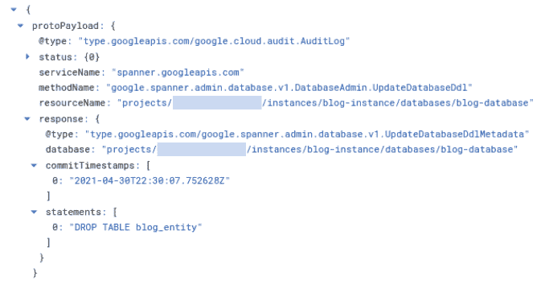

# 云扳手时间点恢复:恢复删除的表

> 原文：<https://medium.com/google-cloud/cloud-spanner-point-in-time-recovery-restoring-a-dropped-table-cf3ee24b39ec?source=collection_archive---------0----------------------->

**TL；博士** [云扳手](https://cloud.google.com/spanner)引入了[时间点恢复](https://cloud.google.com/spanner/docs/pitr) (PITR)作为受支持的数据库特性。这篇博客展示了如何使用 PITR 使用 [gcloud](https://cloud.google.com/sdk/gcloud/reference/spanner) 命令恢复一个被丢弃的表。

# 时间点恢复

PITR 允许您恢复过去某个时间点的数据。Cloud Spanner 使您能够配置数据(和模式)保留期—最多 7 天。

如果启用 7 天保留，您可以使用[过时读取](https://cloud.google.com/spanner/docs/reads#perform-stale-read)查询过去 7 天的数据。这使您能够恢复数据库的一部分或整个数据库长达 7 天。为了执行陈旧的查询，您需要知道查询数据的时间戳，以便检索正确的状态。

下面提供了一个完整的示例，允许您恢复被删除的表。它以示例的形式向您展示了所有步骤。然后讨论最佳实践和后续步骤。

# 用例:意外掉落的桌子

## 概观

删除一个表并使用 PITR 恢复它是支持 PITR 的数据库的一个标准例子。在生产环境中，这可能会意外发生，并且必须恢复表的最后一致状态。这包括确定删除表的时间，以及确定表的最新状态的时间。一旦确定了时间，就可以恢复该表并将其添加到数据库的当前状态中。

## 创建模式和插入数据

下面的 gcloud 命令建立了一个云扳手实例、一个数据库和一个表。如果您已经有了一个实验表，可以跳过这一部分。

1.设置环境变量

```
export instance_name=blog-instance
export database_name=blog-database
export instance_region=regional-us-west1
```

2.创建实例和数据库

```
gcloud spanner instances create $instance_name \
  --description=$instance_name \
  --config=$instance_region \
  --nodes=1gcloud spanner databases create $database_name \
  --instance=$instance_name
```

3.创建一个表，插入三行并查询该表

```
gcloud spanner databases ddl update $database_name \
  --instance=$instance_name \
  --ddl='CREATE TABLE blog_entity (k INT64, v STRING(1024))
          PRIMARY KEY(k)'gcloud spanner databases execute-sql $database_name \
  --instance=$instance_name \
  --sql="INSERT blog_entity (k, v) VALUES (1, 'first entity')"gcloud spanner databases execute-sql $database_name \
  --instance=$instance_name \
  --sql="INSERT blog_entity (k, v) VALUES (2, 'second entity')"gcloud spanner databases execute-sql $database_name \
  --instance=$instance_name \
  --sql="INSERT blog_entity (k, v) VALUES (3, 'third entity')"gcloud spanner databases execute-sql $database_name 
  --instance=$instance_name \
  --sql='SELECT * FROM blog_entity'
```

该查询的结果是

```
k v
1 first entity
2 second entity
3 third entity
```

## 放下一张桌子

现在我们来实施不小心掉桌子的灾难。这是通过以下命令完成的:

```
gcloud spanner databases ddl update $database_name 
  --instance=$instance_name \
  --ddl='DROP TABLE blog_entity'
```

此时，该表不再存在于数据库中。通过尝试选择已删除表中的行进行验证:

```
gcloud spanner databases execute-sql $database_name \
  --instance=$instance_name \
  --sql='SELECT * FROM blog_entity'
```

此查询返回一个错误:

```
**ERROR:** (gcloud.spanner.databases.execute-sql) INVALID_ARGUMENT: Table not found: blog_entity [at 1:15]\nSELECT * FROM blog_entity\n ^
- '@type': type.googleapis.com/google.rpc.LocalizedMessage
locale: en-US
message: |-
Table not found: blog_entity [at 1:15]
SELECT * FROM blog_entity
```

# 使用过时读取恢复被删除的表

在 Cloud Spanner 中，可以通过在表的最后一致状态的时间戳处执行陈旧读取来恢复表。以下 gcloud 命令演示了这一点:

## 在删除表时确定提交时间戳

确定从日志浏览器中删除表的命令的提交时间戳，例如`2021–04–30T22:30:07.752628Z`:



DROP TABLE 语句的日志条目

如果您没有执行记录的任何其他命令，则该日志条目是最后一个。如果执行了其他命令，您可能需要搜索。因此，如果知道桌子掉落的大致时间，将会很有帮助。

Cloud Spanner 中的时间戳具有[微秒粒度](https://cloud.google.com/spanner/docs/commit-timestamp#overview)，因此确定查询时间点的方法如下。

基于提交时间戳减去 1 微秒来创建读取时间戳。

例如，如果提交时间戳是

```
2021–04–30T22:30:07.752628Z
```

减去 1 微秒，使时间戳看起来像

```
2021–04–30T22:30:07.752627Z
```

这是过时查询的时间戳，该查询恢复表在被删除之前的最后一致状态。这是因为这是插入、删除或修改行的最后一个时间戳。

请注意，提交时间戳本身并不包含该表:

```
gcloud spanner databases execute-sql $database_name \
  --instance=$instance_name \
  --sql='SELECT * FROM blog_entity' \
  --read-timestamp=2021–04–30T22:30:07.752628Z \
  --format=json
```

结果是

```
ERROR: (gcloud.spanner.databases.execute-sql) INVALID_ARGUMENT: Table not found: blog_entity [at 1:15]\nSELECT * FROM blog_entity\n ^
- '@type': type.googleapis.com/google.rpc.LocalizedMessage
locale: en-US
message: |-
Table not found: blog_entity [at 1:15]
SELECT * FROM blog_entity
```

## 重新创建被删除的表

从代码控制系统(例如 git)的模式定义中使用 create table 语句:

```
gcloud spanner databases ddl update $database_name \
  --instance=$instance_name \
  --ddl='CREATE TABLE blog_entity (k INT64, v STRING(1024)) 
         PRIMARY KEY(k)'
```

如果在代码控制中没有模式定义，我们强烈建议将数据库模式作为代码控制的工件。

在此之前，您可以使用信息表来导出表定义。例如，要在过时读取中检索表的列，请执行:

```
gcloud spanner databases execute-sql $database_name \
  --instance=$instance_name \
  --sql="SELECT t.column_name, t.spanner_type, t.is_nullable
         FROM information_schema.columns AS t
         WHERE t.table_catalog = ''
         AND t.table_schema = ''
         AND t.table_name = 'blog_entity'" \
  --read-timestamp=2021–04–30T22:30:07.752627Z
```

要确定表的完整模式，您必须从信息模式中查询附加数据，例如，包括约束。

## 检索和插入已删除表的数据

1.执行陈旧查询，选择被删除表的所有行

```
gcloud spanner databases execute-sql $database_name \
  --instance=$instance_name \
  --sql='SELECT * FROM blog_entity' \
  --read-timestamp=2021–04–30T22:30:07.752627Z \
  --format=json
```

它会导致

```
{
"metadata": {
  "rowType": {
    "fields": [
      {
        "name": "k",
        "type": {
          "code": "INT64"
          }
      },
      {
        "name": "v",
        "type": {
          "code": "STRING"
          }
      }
    ]
  },
  "transaction": {}
},
"rows": [
  [
    "1",
    "first entity"
  ],
  [
    "2",
    "second entity"
  ],
  [
    "3",
    "third entity"
  ]
]
}
```

除了 JSON，其他格式也是可用的。

2.将行插入新创建的表中

```
gcloud spanner rows insert \
  --table=blog_entity \
  --database=$database_name \
  --instance=$instance_name \
  --data=k=1,v='first entity'gcloud spanner rows insert \
  --table=blog_entity \
  --database=$database_name \
  --instance=$instance_name \
  --data=k=2,v='second entity'gcloud spanner rows insert \
  --table=blog_entity \
  --database=$database_name \
  --instance=$instance_name \
  --data=k=3,v='third entity'
```

3.验证该表存在，并且包含这三行

```
gcloud spanner databases execute-sql $database_name \
  --instance=$instance_name \
  --sql='SELECT * FROM blog_entity'
```

结果是

```
k v
1 first entity
2 second entity
3 third entity
```

# 最佳实践

上面的例子演示了恢复意外删除的表的基本方法。各个步骤显示为手动执行的 gcloud 命令，以便能够向您演示详细的步骤。

在生产环境中，我们建议您为这种情况开发一个脚本来自动化这种行为，尤其是当表包含多行时。在开发这样的脚本时，要注意 [20K 变异限制](https://cloud.google.com/spanner/quotas)以及[批量加载最佳实践](https://cloud.google.com/spanner/docs/bulk-loading)。

您还可以考虑准备其他场景，例如，将整个数据库恢复到过去的某个时间点，或者跨表恢复一些事务。在任何情况下，为您计划支持的场景准备脚本和培训都是最佳实践。

# 下一步是什么

*   作为第一个练习，在您的项目中执行上面的示例
*   探索其他用例，并为生产场景编写脚本或程序
*   查看云扳手 [PITR](https://cloud.google.com/spanner/docs/pitr) 产品文档，并对整个数据库执行 PITR

# 承认

我要感谢 John Corwin 和 Gideon Glass 的全面审查和一些意见，以提高这些内容的准确性。

# 放弃

Christoph Bussler 是谷歌公司(Google Cloud)的解决方案架构师。这里陈述的观点是我自己的，而不是谷歌公司的。