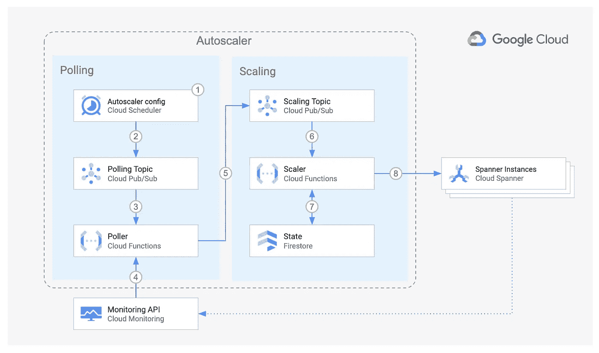
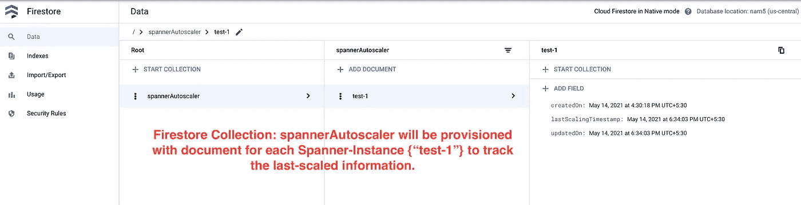
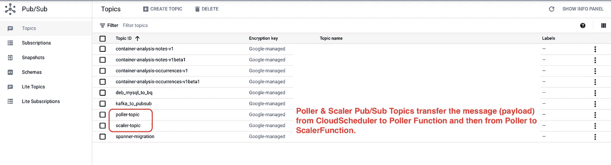
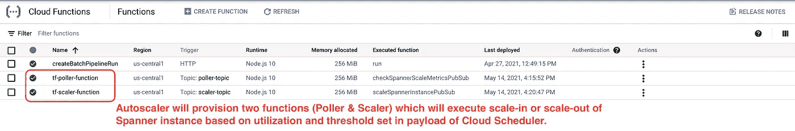
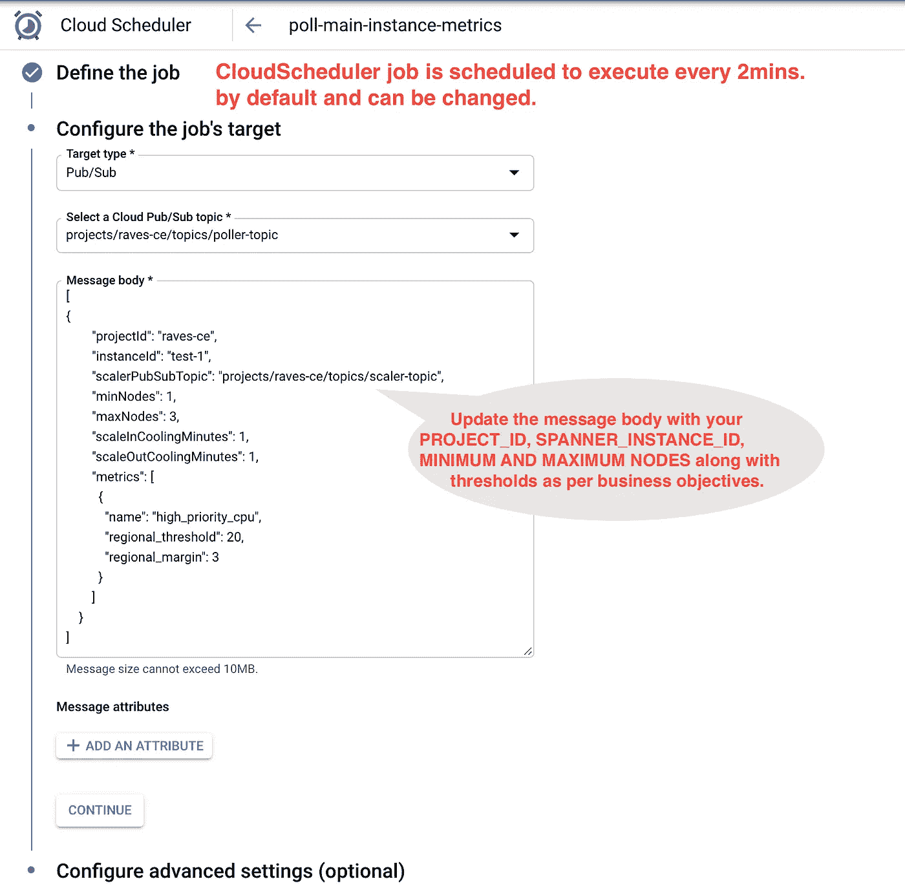
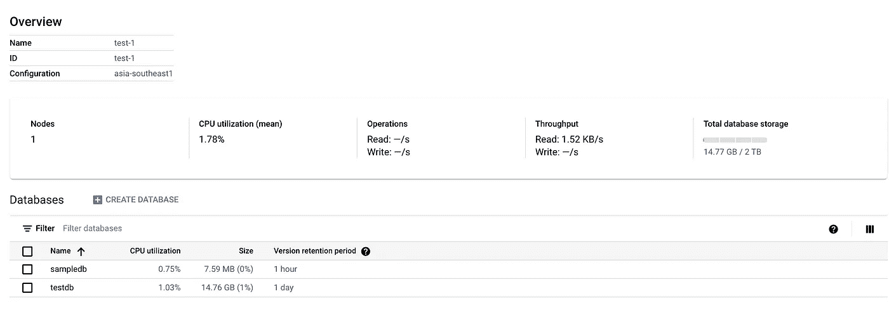
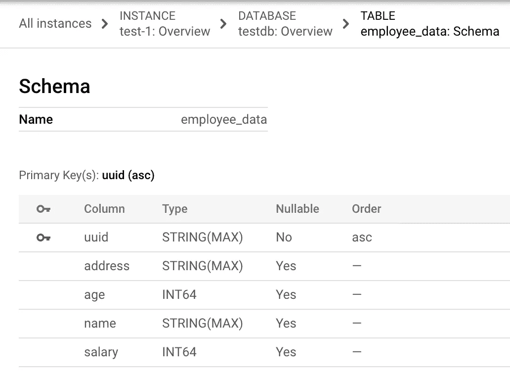
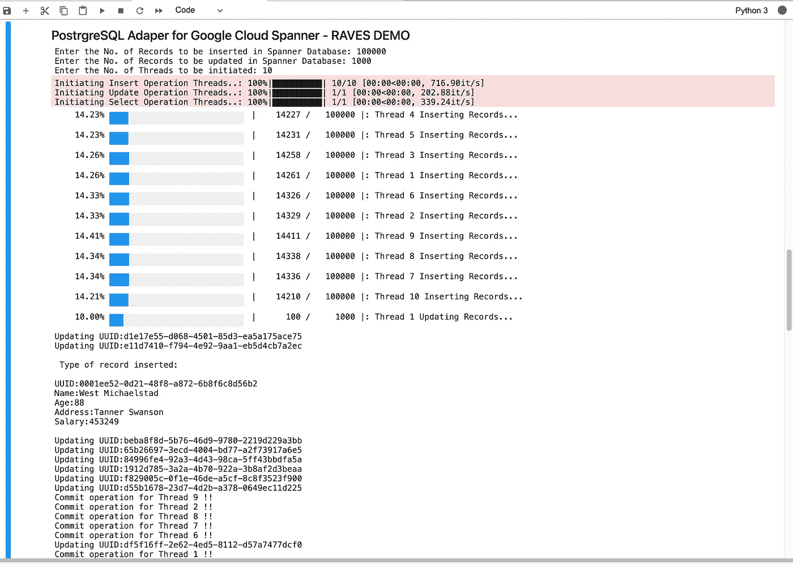
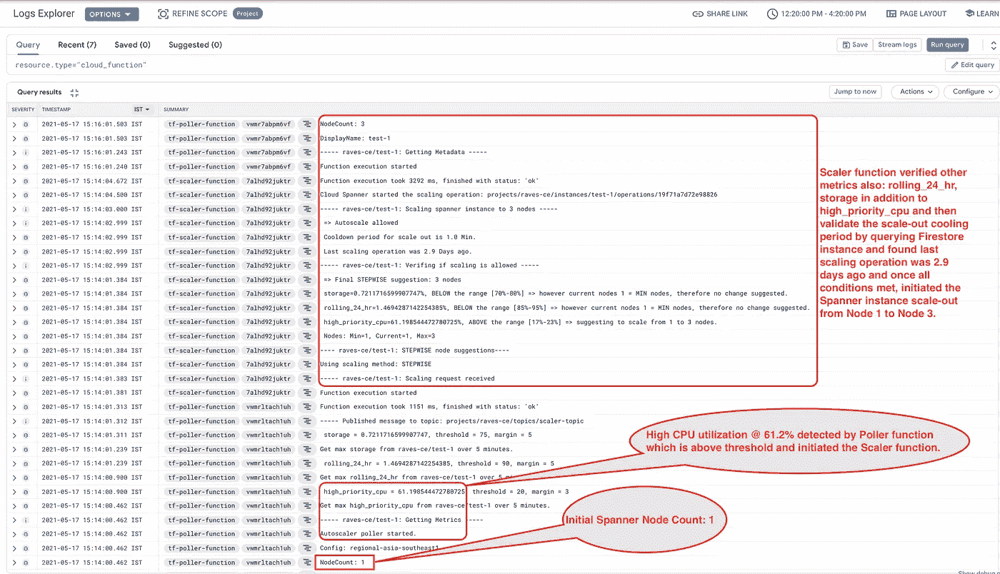
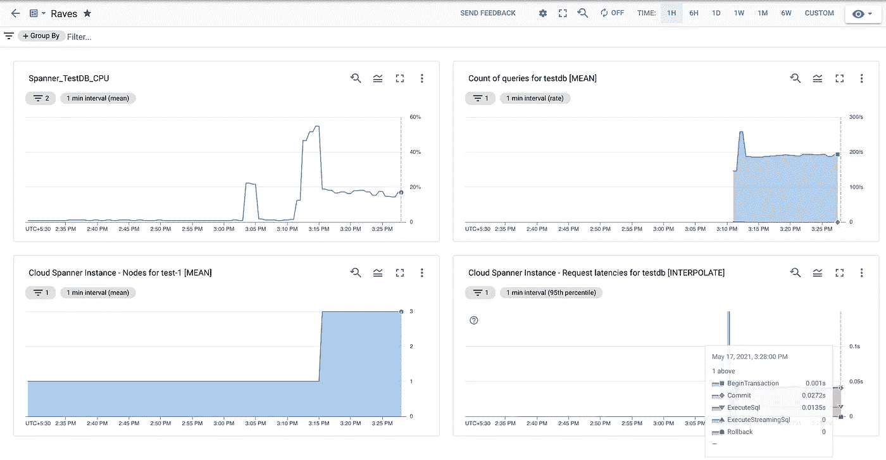

# 带有 Autoscaler 的 Cloud Spanner:一个零妥协和零停机的数据库平台。

> 原文：<https://medium.com/google-cloud/cloud-spanner-w-autoscaler-a-zero-compromise-zero-downtime-database-platform-a83339bbf315?source=collection_archive---------4----------------------->

如果你不知道 Google Cloud Spanner 数据库，或者没有查看我在[上的上一篇文章《为什么是 Google Cloud Spanner](/google-cloud/why-google-cloud-spanner-and-ways-you-can-access-it-with-zero-to-minimal-app-code-change-aef72c700013) 》,我强烈建议你在继续之前先查看一下。只需要 5 分钟。但将对 Google Cloud Spanner 数据库做一个很好的概述，并帮助您理解我为什么向我的客户强烈推荐它，其业务目标如下:

*   从小规模开始，然后根据需要快速扩展的灵活性，零宕机。
*   需要高度一致并符合 ACID 属性的关系结构。
*   带有同步复制的区域和多区域分布式数据库。
*   没有维护开销的数据库平台。

话虽如此，但让我向您介绍另一个来自 Google stable 的开源工具: [**【自动缩放器】**](https://github.com/cloudspannerecosystem/autoscaler) ，它是云扳手的真正伴侣，让您可以根据针对数据库指标设置的阈值自动扩展或缩小节点数量。

> 此外，这是一个关于如何利用不同的 GCP 技术进行创新的无聊例子，这是一种真正的多语言方法，在实施之前，让我们快速浏览一下它的实施流程。



[自动缩放架构](https://github.com/cloudspannerecosystem/autoscaler/blob/master/README.md#configuration)

**Cloud Spanner Autoscaler 利用 5 项谷歌云服务，即:**

*   **云调度器:**定期启动作业，检查扳手使用情况。
*   **Cloud Pub/Sub:**Cloud Scheduler 将定义的 Cloud Spanner Autoscaler 配置作为 JSON 有效负载推送到轮询 Pub/Sub 主题中。
*   **云函数(Poller):** 读取有效负载，查询云监控 API 检索 Spanner 数据库利用率度量，并将其推送到 scaler 发布/订阅主题。
*   **云函数(Scaler):** 从 Scaler 发布/订阅主题中读取有效负载，并根据针对利用率指标设置的阈值执行扳手数据库的新配置参数。
*   **Cloud Firestore:** 一旦 Scaler 函数执行了 Spanner 实例的伸缩，它将检索实例伸缩时的时间戳，并将其存储在 Cloud Firestore 中，以确定再次启动任何伸缩之前的冷却期，还可用于分析伸缩业务需求。

**现在让我们开始实施:**

*   从 GitHub 中克隆[**【自动缩放】**](https://github.com/cloudspannerecosystem/autoscaler) 工具。

```
git clone [https://github.com/cloudspannerecosystem/autoscaler.git](https://github.com/cloudspannerecosystem/autoscaler.git)
```

*   它支持 3 种部署模式:**按项目** (Autoscaler &云扳手托管在同一项目中)**集中式** (Autoscaler &云扳手托管在不同项目中)**分布式** (Autoscaler &云扳手托管在不同项目中，但不包括云调度程序)，以便云扳手团队可以管理向内扩展或向外扩展的配置参数。)
*   设置环境变量:

```
export PROJECT_ID=<INSERT_YOUR_PROJECT_ID>
gcloud config set project "${PROJECT_ID}"
export REGION=us-central1
export ZONE=us-central1-c
export APP_ENGINE_LOCATION=us-central*# Set corresponding Terraform environment variables.*
export TF_VAR_project_id="${PROJECT_ID}"
export TF_VAR_region="${REGION}"
export TF_VAR_zone="${ZONE}"*# Provide your Spanner Instance Name.*
export TF_VAR_spanner_name=<INSERT_YOUR_SPANNER_INSTANCE_NAME>
```

*   用您现有的扳手实例详细信息更新 Terraform 配置文件。(如果要为 1 个以上的云扳手实例配置 Autoscaler，请重复以下代码。)

```
gcloud spanner instances listSPANNER_INSTANCE_NAME=<YOUR_SPANNER_INSTANCE_NAME>echo "resource \"google_spanner_instance\" \"${SPANNER_INSTANCE_NAME}\" {}" > "${SPANNER_INSTANCE_NAME}.tf"terraform import "google_spanner_instance.${SPANNER_INSTANCE_NAME}" "${SPANNER_INSTANCE_NAME}"terraform state show -no-color "google_spanner_instance.${SPANNER_INSTANCE_NAME}" \
  | grep -vE "(id|num_nodes|state|timeouts).*(=|\{)" \
  > "${SPANNER_INSTANCE_NAME}.tf"
```

*   启用所需的云 API，并创建应用引擎和 firestore 实例。

```
gcloud app create --region="${APP_ENGINE_LOCATION}"gcloud alpha firestore databases create --region="${APP_ENGINE_LOCATION}"
```

*   初始化 Terraform 每个项目的目录(您可以根据需要选择其他部署模型)并创建 Autoscaler 基础架构。

```
cd "${AUTOSCALER_DIR}"terraform initterraform import module.scheduler.google_app_engine_application.app "${PROJECT_ID}"terraform apply -parallelism=2
```

**一旦 Autoscaler 部署成功，将产生以下 Google 云资源:**



**Firestore 实例**



**谷歌云发布/订阅消息队列**

P



然后，scaler 函数接收来自 Scaler-Pub/Sub 主题的消息，并将指标与提供的阈值进行比较，如果发现超出范围，Scaler 函数将相应地调整扳手实例节点。



**谷歌云调度作业**

Autoscaler 将为 CloudScheduler 作业**“poll-main-instance-metrics”**提供定义的负载作为 JSON 数组。您也可以根据需要[定义自定义指标](https://github.com/cloudspannerecosystem/autoscaler/blob/master/poller/README.md)。

## 现在，既然所有必需的服务都已提供，让我们测试一下:

作为我上一篇博客的延续，我已经编写了一个小 Python 程序来使用 [PGAdapter](https://github.com/cloudspannerecosystem/pgadapter) 在我的 CloudSpanner 实例上生成负载，或者你也可以配置用于 YCSB 的 [CloudSpanner 驱动程序来进行快速负载测试，这是一个简单的实用程序，但是如果你想要指导，请在评论部分留下注释，我将写一篇关于如何设置和执行它的快速博客。](https://github.com/brianfrankcooper/YCSB/tree/master/cloudspanner)



**云扳手实例“test-1”带有“testdb”数据库**

为了展示 Cloud Spanner 的优势，我刚刚创建了一个具有以下模式的单个表“employee_data ”,并将使用多个线程(会话)加载单个表，每个线程插入 100，000 条记录。



**表:员工数据**

现在，让我们初始化 10 个线程，每个线程插入 100，000 条记录，少数线程更新表 employee_data 中现有的 1000 条记录。



**对扳手实例进行负载测试的 Python 作业**

当负载开始在“testdb”上构建并达到大约。61%的 CPU，下一个 autoscaler 作业将启动轮询器功能来捕获利用率指标，该指标由 scaler 功能进一步验证，当它发现 Spanner 实例的 CPU 利用率高于阈值时，它会将 Spanner 实例扩展到配置的 max_nodes (3)。

autoscaler 流量和利用率指标也可以通过 Google Cloud 日志记录和监控工具进行验证。



**谷歌云日志**



**谷歌云监控**

在上面的测试运行中，我强调了单个表“employee_data ”,它具有 10 万次插入和多达 10k 次更新，以及多会话模型中的 select 语句和 3 个 spanner 节点，能够处理这个负载@ approx。19%的利用率，请求延迟大约为。第 95 百分位时为 13 毫秒。以此类推，这些节点可以处理超过 3 倍的负载，但利用率仍低于 80%。

在传统模式中，如果您遇到如此巨大的负载，它要么会影响您的业务并削弱您的市场竞争力，要么会带来更高的总拥有成本，因为您别无选择，只能停机并纵向扩展您的关系数据库平台，或者不得不预先过度配置来管理这种情况。然而，有了 Cloud Spanner，您甚至不需要担心这一点，这意味着更低的总拥有成本和更多的创新时间。

因此，这是一个示例，说明了 Cloud Spanner 如何在大规模下提供最高级别的可用性和一致性，即使对于峰值工作负载也是如此，而且没有任何手动分片或故障切换或维护停机的开销。