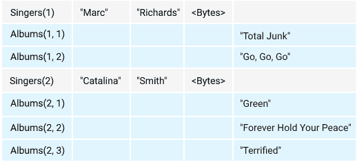

# 云扳手的表交错:一个查询优化特性

> 原文：<https://medium.com/google-cloud/cloud-spanners-table-interleaving-a-query-optimization-feature-b8a87059da16?source=collection_archive---------0----------------------->

## 克里斯托弗·巴斯勒和阿南德·贾恩

这篇博客从开发人员的角度讨论了[云扳手表交叉](https://cloud.google.com/spanner/docs/schema-and-data-model#creating-interleaved-tables):什么是交叉表，何时使用这种模式设计概念，一些边缘案例和陷阱。

TL；dr:交叉表是针对特定连接查询模式的查询性能优化工具。交叉表不是一个数据建模概念，尽管在模式设计过程中初看起来是这样。[交叉索引](https://cloud.google.com/spanner/docs/secondary-indexes)也属于性能优化的范畴。

# 云扳手在分布式持久数据管理中的应用

[Cloud Spanner](https://cloud.google.com/spanner) 是 Google Cloud 的“完全托管的关系数据库，规模不限，一致性强，可用性高达 99.999%。”

作为关系数据库实现无限规模的一个基本设计决策是 Cloud Spanner 对分布式持久数据存储和分布式查询处理的依赖:查询在访问分布式持久存储的分布式处理节点上执行。

基于 Cloud Spanner 的存储可以“永远”扩展，因为它允许增加容量，而不受架构或实施的限制。可以添加(或删除)的容量单位是 2 TB，这是通过向[云扳手实例](https://cloud.google.com/spanner/docs/instances)添加(或删除)[云扳手节点](https://cloud.google.com/spanner/docs/instances#node_count)来实现的。为了说明可能的规模，这个[演示](https://www.youtube.com/watch?v=zy-rcR4MoN4)描述了一个具有 PBs 关系数据的云扳手实例。数据存储在数据库中，一个 Cloud Spanner 实例可以管理多个数据库(目前多达 [100 个数据库](https://cloud.google.com/spanner/quotas#database_limits))。

存储的分布式特性以及表的大小和可能的热点导致按主键对表进行自动水平分区。一个表必须有一个主键，并且表中的行在存储时按主键顺序排序。水平分区称为拆分，拆分是表中行的子集。[基于负载的拆分](https://cloud.google.com/spanner/docs/schema-and-data-model#load-based_splitting)是 Cloud Spanner 在后台执行的进程之一。

一个表的拆分可能存储在同一个存储区域，也可能存储在不同的存储区域。当表增长时，拆分将位于不同的存储位置，如果增加容量，数据库将有更多的存储位置来存储拆分。安全的假设是，在一般情况下，表的拆分存储在不同的位置。

如果从位于不同拆分中的单个表中查询数据，查询执行将必须找到并访问存储相关拆分的存储位置并返回数据。数据可能在同一拆分中，也可能在不同的拆分中，还可能在相同或不同的存储位置。如果数据位于不同的存储位置，则进行分布式存储访问。

对于两个表之间的连接也是如此:可能涉及到每个表的多个拆分和多个存储位置。由于它们的分布，访问不同的存储位置比访问单个存储位置引起更多的等待时间。

当不同表的某些行总是基于应用程序的查询模式一起被查询时，有一种方法强制数据搭配不是很好吗？例如，在父子 1:n 关系中，父行可能总是或大部分时间与其子行相联接。在这种情况下，将两者都放在相同的拆分和相同的存储位置将是最佳的存储布局，因为结果数据集不必从分布式存储位置收集。

这种优化，配置父子表的行，在 Cloud Spanner 中可用，称为[表交错](https://cloud.google.com/spanner/docs/schema-and-data-model#parent-child_table_relationships)。

这篇博客的其余部分讨论了这个运行时优化特性、它与模式设计的关系、一些最佳实践、警告和反模式。

# 模式功能:表交错

当指定表时，表交错的概念被表示为语法终端`[INTERLEAVE IN PARENT](https://cloud.google.com/spanner/docs/schema-and-data-model#creating-interleaved-tables)`。举个例子，

```
CREATE TABLE Singers (
  SingerId INT64 NOT NULL,
  FirstName STRING(1024),
  LastName STRING(1024),
  SingerInfo BYTES(MAX),
  ) PRIMARY KEY (SingerId);CREATE TABLE Albums (
  SingerId INT64 NOT NULL,
  AlbumId INT64 NOT NULL,
  AlbumTitle STRING(MAX),
  ) PRIMARY KEY (SingerId, AlbumId),
    INTERLEAVE IN PARENT Singers ON DELETE CASCADE;
```

在上面的例子中，表`Albums`在表`Singers`中交错。

这是什么意思？在详细说明之前，请注意`Singers`的主键是`Albums`主键的前导部分。这在父表(这里是`Singers)`)与子表(这里是`Albums`)之间建立了 1:n 的关系。

基于该规范和主键的值的云扳手知道哪些子行(可能是零个、一个或多个)属于 1:n 关系中的哪个父行。这现在指示存储管理子系统将父行的子行并置到相同的拆分中，并因此到相同的存储位置中。父行及其子行存储在同一位置，没有任何分布。两个不同的父行及其各自的子行可能位于不同的拆分和不同的存储位置；但是父节点和它的子节点将在同一个分割中。

这里有一张[图](https://cloud.google.com/spanner/docs/schema-and-data-model#creating-interleaved-tables)展示了这种布局:



在上面的示例中，检索每个父代的子行的查询如下所示

```
SELECT s.FirstName,
       s.LastName,
       a.AlbumTitle
FROM Singers s JOIN Albums a ON s.SingerId = a.SingerId;
```

该查询为父行的每个子行返回一行。

如您所见，表是交错的这一事实在查询本身中是不可见的。如果这两个表没有在模式级别上声明为交错的，而是独立的表，那么查询看起来会完全一样。这个观察在以后会很重要。

当上面的查询执行时，它查找与父项并置的父项的所有子行，并且查询执行将不必访问不同的分布式存储位置。这就是性能优势:在一个存储位置上并置数据的连接。

这种好处不仅适用于一个级别的关系，还适用于多达 7 个级别的关系，也就是说，每个子行都可以是另一个表中的下一个子行(孙-子)的父行。

检索父行的子行的另一个查询涉及数据类型`ARRAY`,如下所示

```
SELECT s.FirstName,
       s.LastName,
       ARRAY(SELECT AS STRUCT a1.AlbumTitle 
             FROM Singers s1 
                  JOIN Albums a1 ON s1.SingerId = a1.SingerId 
             WHERE s.SingerId = s1.SingerId) Albums
FROM Singers s
WHERE EXISTS(SELECT a2.AlbumTitle
             FROM Albums a2
             WHERE a2.SingerId = s.SingerId);
```

该查询为数组中的每个歌手和该歌手的所有专辑返回一行。exists 子句确保只返回那些有专辑的歌手。它演示了可以查询 1:n 关系，并且如果这对客户端应用程序有利的话，可以将子表条目表示为数组。

## 表格交错的替代方案

表交错强制将父行及其子行并置到同一存储位置。另一种设计是使用数组。子代存储在父行内的列中，而不是表交错。举个例子，

```
CREATE TABLE SingersAndAlbums (
  SingerId INT64 NOT NULL,
  FirstName STRING(1024),
  LastName STRING(1024),
  SingerInfo BYTES(MAX),
  Albums ARRAY<STRING(MAX)>,
  ) PRIMARY KEY (SingerId);
```

从存储角度来看，这种设计实现了几乎相同的目标，但是，不仅有优点，也有缺点:

一些优点是

*   **收纳搭配**。由于专辑以数组的形式存储在一个列中，所以它们会自动与歌手的数据一起存储。
*   **方便查询**。选择歌手的专辑是一个非连接 select 语句。

一些缺点是

*   **数组元素是标量。**数组元素只能是标量类型。对于上面的用例，相册的 id 和标题必须存储在一个字符串中(用一些分隔符或作为一个 JSON 对象)。
*   **阵列操纵**。数组操作有特定的函数和 SQL 语法，如这里[所解释的](https://cloud.google.com/spanner/docs/arrays)。
*   **列值大小限制 10 MB** 。列值大小的限制是 10 MB。如果数组中的数据超过这个数，就会出现错误，必须寻找替代设计。
*   **读访问的完整数组单元**。与可以单独选择的交错行相比，阵列总是被完整地读取。

虽然使用 array 作为列数据类型通常不是一个缺点，但是对于上面的用例，它会使管理歌手专辑的应用程序逻辑变得复杂。

## 表交错的其他好处

表交错还有下面没有进一步讨论的其他好处。一个好处是在删除父行的上下文中。可以指定父行的子行随父行一起自动删除。此处描述了`ON CASCADE DELETE`构造[。](https://cloud.google.com/spanner/docs/data-definition-language#create_table)

当在同一个事务中插入父母和他们的孩子时，实现了一个隐含的好处。如果父节点及其子节点都被插入到同一个事务中，那么在大多数情况下，插入发生在同一个拆分中。与父行和子行作为单独的表管理的情况相比，这需要较少的协调。在这种情况下，如果行存储在不同的拆分中，则可能需要跨存储区域的分布式协调。

# 性能优化

上一节已经展示了 1:n 关系可以建模为单独的表以及交叉表，在这两种情况下，通过连接选择父子关系的查询是完全相同的。表交错强制父行和子行并置，与非交错表相比，父表和子表之间的连接性能更好，因为数据是在交错表的情况下并置的。

那么，为什么不在开始表设计时，从一开始就尽可能简单地使用交错呢？

设计模式的表及其外键关系是一项基于数据语义的概念性活动。在模式设计过程中需要回答的问题有:表(实体)是否适合我感兴趣的领域？列是否恰当地表示了实体的属性？主键唯一标识实体吗？外键关系是否正确地表示了依赖关系？

虽然某些查询模式在模式设计期间是已知的，但是查询的规范并不是最重要的。然而，在某种程度上，查询规范在设计中占据了中心位置，在这一点上，优化步骤正在发生，例如:定义索引、非规范化表或者用基于整数的枚举替换字符串数据类型。

后来，考虑查询执行频率，因为某些性能优化对所有查询的子集有意义，而不是对其中的每一个都有意义。在这一点上，表交错变成了一种性能改进工具:表交错是否有助于通过引起数据的搭配来改进性能？

如果在模式设计期间解决了表交错问题，那么它将扮演概念模式建模概念的角色(1:n，可能是关系的一部分)。配置数据的结果可能会转移到后台，并且在测试时可能会导致性能障碍。

因此，建议不要基于预期过早优化，而是基于概念验证和测量。因此，使用表交错作为性能改进工具，而不是作为模式设计技术。

# 最佳实践设计流程

以下过程是表交错的一般最佳实践(警告和边缘情况随后介绍):

1.  在初始模式设计阶段设计没有交叉表的数据库模式
2.  在模式设计阶段，请记住，出于性能原因，以后可能必须将表示 1:n 关系的表更改为交叉表。如果可能，适当地设计主键，使潜在父表的主键成为潜在子表的复合主键的主要部分
3.  设计将在模式上操作的所有查询(尽可能)
4.  检查所有连接并评估其性质。出于表交叉的目的，调用查询 1:n 关系的连接。测量它们的执行性能，并观察那些查询 1:n 关系的连接的执行频率
5.  如果两个表之间有 80%以上的时间存在 1:n 连接，请考虑将这两个表放入交错关系中。测量两种模式中的查询执行性能(有交叉表和没有交叉表),并确定表交叉是否提供了性能优势

这个最佳实践设计过程适用于那些对应用程序的核心业务逻辑至关重要并且经常执行的查询。对于每天、每周或每月执行一次的查询，考虑这样的优化过程可能并不重要。

# 警告和边缘案例

在 Cloud Spanner 中使用表交错时，需要记住一些警告和边缘情况:

*   交叉存取表时，所有子行的大小总和有一个大约 8GB 的软限制。至此，所有子行都与父行在同一个拆分中并置在一起。任何额外的子行被单独存储[用于另一个分割中的下一个 8GB。](https://cloud.google.com/spanner/docs/schema-design#limit_row_size)
*   将父行的历史数据保存为子行是很诱人的。例如，父级的每次更改都作为单独的子行添加。这种设计确保子行的数量不断增长，并且在某个时间点会达到 8GB 的软限制，这可能会降低查询性能。历史数据通常最好存储在单独的表中。
*   在不访问父表的情况下访问交叉表不会获得存储并置的好处。相反，只访问子行的查询可能会导致性能下降，因为该查询可能必须访问保存子行的许多不同拆分，否则这些子行可能会被连续存储。
*   如果只访问父行而不同时连接子表，并且查询的谓词不是主键，那么交错的好处可能也不会实现，因为查询将不得不访问“跳过”子行的许多拆分。
*   如果在模式设计阶段之后使用了交叉表，并且在最坏的情况下，所有的表都以某种形式相互交叉，那么后退一步，重新评估这是否真的是最好的设计，因为此时查询是未知的或者可能是完全未知的。

# 数据大小很重要

数据量也很重要，下面的使用案例展示了这种情况。假设一个父表有许多列，每列存储大量数据。为了强调用例，我们假设有 100 列，每列存储 1 MB 的数据。因此，一行存储大约 100 MB。

对于子行，让我们假设在正常情况下每个父代大约有 25 个子代，每个子代有几列，总共有 1 MB。

检索所有列(select *)的父行及其所有子行之间的联接将导致结果集大小为 101 MB * 25，也就是大约 2.5 GB。除了结果集中有大量数据之外，大部分数据都是冗余的。在这种情况下，分别检索父项及其子项将导致两次查询，结果集总大小约为 125 MB。当使用两个查询时，返回的数据量比执行一个连接少得多，并且没有冗余数据。

这只是一个特殊情况的例子，在这种情况下，表交叉是一种完美的设计，但是从性能的角度来看，通过连接查询数据可能不是最佳策略。

# 摘要

总之，将表交错作为一种性能改进工具，根据应用程序设计中最关键查询的测量和实际性能数字来使用。避免使用表交错作为模式设计概念的诱惑，因为如果不基于性能度量来使用它，它可能会干扰查询性能。

# 后续步骤

作为后续步骤，在下一个机会遵循最佳实践设计流程。同时，查看产品文档[这里](https://cloud.google.com/spanner/docs/schema-and-data-model#creating-interleaved-tables)和[这里](https://cloud.google.com/spanner/docs/whitepapers/optimizing-schema-design#tradeoffs_of_locality)。

# 承认

我要感谢 Neha Deodhar，Vlad Lifliand 和 Yuki Furuyama 的全面审查和许多评论，以提高这一内容的准确性。

# 放弃

Christoph Bussler 是谷歌公司(Google Cloud)的解决方案架构师，Anand Jain 是数据和分析云工程师。这里陈述的观点是我们自己的，而不是谷歌公司的。