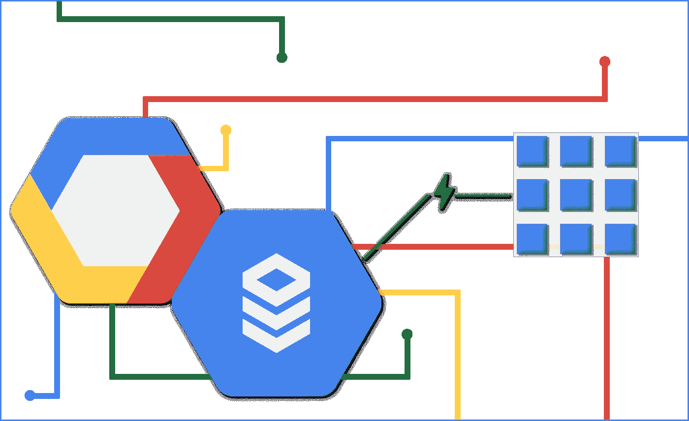
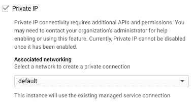
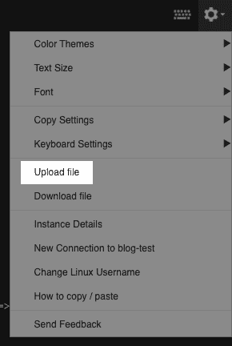

# 连接云 SQL - GCE +私有 IP 和代理

> 原文：<https://medium.com/google-cloud/cloud-sql-private-ip-proxy-83e85456571f?source=collection_archive---------0----------------------->

嗨，朋友们！

这篇博客将带您创建一个 GCE (Google Compute Engine)虚拟机来运行一个样例应用程序，该应用程序将尽可能安全地连接到一个云 SQL 实例。通过私有 IP(云 SQL 实例没有可用于减少攻击面的公共 IP ),并使用代理来确保为我们处理所有 SSL 连接。不要把这当成“你应该这样做”的福音，因为现实世界是有要求的。有时这些需求意味着你不能做所有的事情，或者甚至不应该做所有的事情。如果你正在运行一个个人项目的快速数据库，比如研究你的[后院的](https://www.instructables.com/id/Complete-DIY-Raspberry-Pi-Weather-Station-with-Sof/) [小气候](https://www.wired.com/2016/04/diy-weather-station/)，你可能不需要经历所有这些步骤来超级保护你的数据库到这个级别。但是存储客户的 PII 呢？绝对的。

如果你想了解更多关于云 SQL 连接的背景知识，请查看我的[连接介绍](/@GabeWeiss/connecting-google-cloud-sql-94025ba27071)博文。这篇文章还链接到更多关于不同用例和方法的分步文章，以及为什么您可能想要选择一种方法而不是另一种方法。所有这些帖子都假设你已经有了自己的谷歌云平台(GCP)项目，并设置了计费。如果没有，点击此处的[按钮](https://console.cloud.google.com/freetrial)开始项目，或点击此处的[按钮](https://console.cloud.google.com/billing)为项目设置账单。

# 创建虚拟机

所以第一件事是创建一个虚拟机。有很多方法可以做到这一点，我将在一个微型 f1 实例上一步一步地介绍。如果您已经这样做了，请随意跳到下一部分。

前往[谷歌计算引擎](http://console.cloud.google.com/compute)

如果您已经有虚拟机，那么点击顶部的`CREATE INSTANCE`按钮。

如果没有，那么点击对话框中的蓝色`Create`按钮。

这里有无数的选择。目前，只要确保给它一个唯一的名称，将`Machine type`改为 f1-micro(最便宜的一个)，然后单击页面底部的`CREATE`按钮。

一旦它上线(不需要很长时间)，最简单的连接方法就是在实例列表中，在`Connect`列中，点击下拉菜单并选择`Open in browser window`。

这将通过一些初始设置，如将 SSL 密钥传输到虚拟机进行连接等。通常不到一分钟。

为了测试连接性，我使用了`psql`或`mysql` CLI，这取决于所创建的数据库的类型，所以您需要安装其中的一个，这取决于您想要创建的数据库的类型。

*   PostgreSQL: `sudo apt-get install postgresql-client`
*   MySQL: `sudo apt-get install mysql-client`
*   SQL Server:在我写这篇博客的时候，我们刚刚对 SQL Server 进行了测试，所以如果你熟悉并想使用它，请在这里查看 SQL Server 的文档。它给出了安装它的信息，我的同事专门写了一篇关于 SQL Server 的博客[这里](/google-cloud/managing-sql-server-instances-in-cloud-sql-ecee1e48aa4e)。

# 创建云 SQL 实例

我会在控制台上演示一下，但是如果你知道如何使用`gcloud`，那也很酷。

到这里[去](https://console.cloud.google.com/sql/instances)。如果您已经有了实例，那么点击顶部导航栏中的`CREATE INSTANCE`按钮:

如果您还没有，那么点击对话框中的`Create instance`蓝色按钮。

选择您的数据库风格，对于本教程来说，选择哪种类型并不重要。

设置一个实例 ID，一个 root 密码，然后展开`Show configuration options`

展开`Connectivity`部分

*   **取消**公有 IP 选项，勾选**私有 IP 选项**
*   点击`ENABLE`按钮，启用私有连接所需的 API。单击后，可能需要一分钟时间才能完成更多操作，因为这将启用更多权限来使用内部网络

我不会在这里深入探讨 VPCs(虚拟私有云),但是我会在这篇博客文章中稍微讨论一下，并且官方文件会详细介绍。现在，我们将 GCE 实例留在了默认的 VPC 中(我甚至没有遍历 GCE 的所有可能选项，它们很复杂，超出了这篇博文的范围)。

这是相关的，因为即使你已经创建了其他网络，在`Associated networking`下拉列表中，把它留在`default`选项上。

点击`Create`按钮，你将返回到实例列表，应该会看到你的实例

*   您可以点击进入实例，并看到横幅说它还没有准备好。

*   这可能需要几分钟的时间，因此在此过程中，我们将继续让代理一切就绪

# 设置 Google SQL 代理

转到[这里](https://console.cloud.google.com/apis/library/sqladmin.googleapis.com)启用云 SQL 管理 API(代理连接到您的项目时需要)

*   如果你已经启用了它，你会看到一个`MANAGE`按钮，如果你没有，你会看到`ENABLE`按钮

回到 GCE 实例上的 SSH 窗口，下载代理

*   64 位 Linux:`wget [https://dl.google.com/cloudsql/cloud_sql_proxy.linux.amd64](https://dl.google.com/cloudsql/cloud_sql_proxy.linux.amd64) -O cloud_sql_proxy`
*   运行`chmod +x cloud_sql_proxy`

现在我们需要创建一个**服务帐户**来授予对云 SQL 的代理访问权

转到[这里](https://console.cloud.google.com/iam-admin/serviceaccounts)，点击页面顶部的`CREATE SERVICE ACCOUNT`按钮

为您的服务帐户提供一个唯一的名称和 ID，然后单击`CREATE`

在下一页，点击`Select a role`的下拉菜单

*   过滤“云 SQL”并选择`Cloud SQL Client`角色

点击`CONTINUE`

在下一页，点击`CREATE KEY`按钮

*   保持在`JSON`上，点击`CREATE`。这将把密钥下载到您的本地机器上。
*   点击`DONE`完成服务账户的创建

JSON 密钥需要放在运行代理的地方。最简单的方法是，如果你已经用`Open in browser window`连接到你的 GCE 实例，在那个窗口的右上角的设置菜单有一个`Upload file`选项，使得你的服务账户密钥到虚拟机上变得容易

导航到您刚刚创建的服务帐户文件，并将其上传到虚拟机。它将被上传到您的主目录，所以如果您已经创建了一个 tmp 文件夹，您将需要将服务帐户文件移动到该目录中，或者只需要记住您将它放在哪里。

**运行代理**

回到[这里](https://console.cloud.google.com/sql/instances)。一旦您的实例完成了配置(可能还没有完成)，单击它。

在`Connect to this instance`部分，复制`Instance connection name`，它看起来会像`myproject:us-central1:myinstance`

使用以下命令启动代理:

*   `./cloud_sql_proxy -instances=<INSTANCE_CONNECTION_NAME>=tcp:5432 -credential_file=<PATH_TO_SERVICE_ACCOUNT_FILE> &`
*   注意这个端口是专门为 Postgres 准备的，如果你使用的是 MySQL，那么它应该是`tcp:3306`
*   更改这些端口是没问题的，特别是如果您已经在端口上运行了某些东西(比如您正在本地运行 PostgreSQL)。如果您这样做了，请记住，在下一节中，您需要用您指定的任何内容来指定`--port`标志，以便验证连通性。

**验证连通性**

验证连通性最简单的方法是使用 psql:

*   `psql “host=127.0.0.1 port=5432 sslmode=disable user=postgres”`然后输入您在创建数据库时指定的密码
*   注意，即使设置了`sslmode=disable`，Google SQL 代理也提供了加密的连接

**总结**

为了清理这个问题，您需要删除云 SQL 实例[这里的](https://console.cloud.google.com/sql/instances)，并关闭计算引擎实例[这里的](https://console.cloud.google.com/compute)。

遇到什么问题了吗？请让我知道！请在下面的评论中回复，或者在推特上联系我。我的 DMs 打开了！