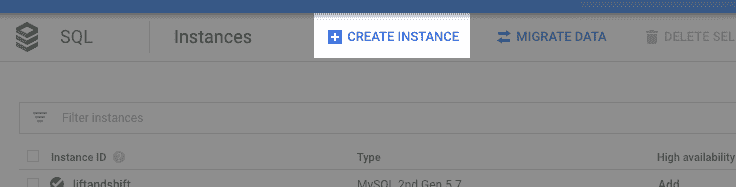

# 连接云 SQL -公共 IP + IP 允许列表

> 原文：<https://medium.com/google-cloud/cloud-sql-public-ip-allowlist-e2e375b4432d?source=collection_archive---------2----------------------->

嗨，朋友们！

这篇博客将带您一步步了解如何使用公共 IP 选项连接到您的云 SQL 实例，并且只允许*特定的*IP 地址连接。这可能是创建和使用云 SQL 实例最不安全的方式。每个人都有自己的容忍度，他们可能会发现做什么是安全的，对我来说，我永远不会在生产中这样做。测试、概念验证、原型制作，所有这些，当然，绝对…只要数据库中没有敏感数据。对于生产，您肯定希望使用 Google SQL 代理来转移到更安全的选项，比如[。](/@GabeWeiss/cloud-sql-public-ip-proxy-5513f59e5a9e)

如果你想了解更多关于云 SQL 连接的背景知识，请查看我的[连接介绍](/@GabeWeiss/connecting-google-cloud-sql-94025ba27071)博客文章。这篇文章还链接到更多关于不同用例和方法的分步文章，以及为什么您可能想要选择一种方法而不是另一种方法。所有这些帖子都假设你已经有了自己的谷歌云平台(GCP)项目，并设置了计费。如果没有，点击此处的[按钮](https://console.cloud.google.com/freetrial)开始项目，或点击此处的[按钮](https://console.cloud.google.com/billing)为项目设置账单。

# 指南:

创建云 SQL 实例。我会在控制台上演示一下，但是如果你知道如何使用`gcloud`那也很酷。

到这里[去](https://console.cloud.google.com/sql/instances)。如果您已经有了实例，那么点击顶部导航栏中的`CREATE INSTANCE`按钮:

如果你还没有，那么点击对话框中蓝色的`Create instance`按钮。

选择您的数据库风格，对于本教程来说，选择哪种类型并不重要。

设置一个实例 ID，一个 root 密码，然后展开`Show configuration options`

展开`Connectivity`部分

*   确认`Public IP`已勾选
*   点击公共 IP 部分的`Add network`按钮

你需要找到你要连接的 IP 地址。对于本教程，可能是你所在机器的 IP 地址(除非你雄心勃勃，想从云机器上做这件事)。

*   最简单的方法是从机器上打开浏览器，进入[whatsmyip.org](https://www.whatsmyip.org/)
*   如果你不能，因为它是一个无头机器，或者你被 SSH-d 进入，使用类似于`dig`的 DNS 查找也是一个好方法
*   `dig @resolver1.opendns.com ANY myip.opendns.com +short -4`

一旦您有了 IP 地址，就把它放入网络框中，将该特定连接列入白名单

关于 CIDR 符号的快速克里夫笔记(这里有一个[链接](http://en.wikipedia.org/wiki/Classless_Inter-Domain_Routing#CIDR_notation)，但是我发现这个链接对你需要放入什么来让事情运转起来的细节帮助不大，因为你不想了解很多关于网络的细节):

*   要只允许一个 IP 地址，只需输入地址，或者使用以下格式:`<ip address>/32`
*   例如`104.132.11.92`或`104.132.11.92/32`都是等效的，并且只允许特定的 IP 地址
*   要允许一定范围的 IP 地址:
*   `104.132.11.0/24`表示允许`104.132.11.0`到`104.132.11.255`
*   斜线后面的数字表示 IP 地址中有多少用作过滤器。IP 地址的每个数字都是二进制数的八位字节，因此 24 意味着使用前三个数字，第四个数字可以是任何值。8 表示仅使用第一个数字作为过滤器，允许 IP 中带有第一个数字的任何内容通过。例如，`104.132.0.0/16`表示允许任何以`104.132.xxx.xxx`开头的 IP 地址，`104.0.0.0/8`表示允许任何以`104.xxx.xxx.xxx`开头的 IP 地址。大开`0.0.0.0/0`意味着允许来自任何地方的任何东西(请不要这样做)。注意这一点，因为您可能会无意中允许比预期更多的访问。

添加任何您想要允许的 IP 地址后，单击`Done`

点击`Create`按钮，您将返回到实例列表，并应看到您的实例

*   您可以点击进入实例，并看到横幅说它还没有准备好。

*   这可能需要几分钟时间

**验证连通性**

从实例详细信息概览页面获取连接 IP 地址

*   它在公共 IP 地址的`Connect to this instance`部分

验证连通性最简单的方法是使用 psql:

*   `psql “host=<connection IP from above step> port=5432 sslmode=disable user=postgres”`然后输入您在数据库创建时指定的密码
*   请注意，即使设置了`sslmode=disable`，谷歌 SQL 代理也提供了加密连接

**总结**

为了解决这个问题，您需要做的就是删除云 SQL 实例。遇到什么问题了吗？请让我知道！回复下面的评论，或者在[推特](https://twitter.com/GabeWeiss_)上联系我。我的 DMs 打开了！