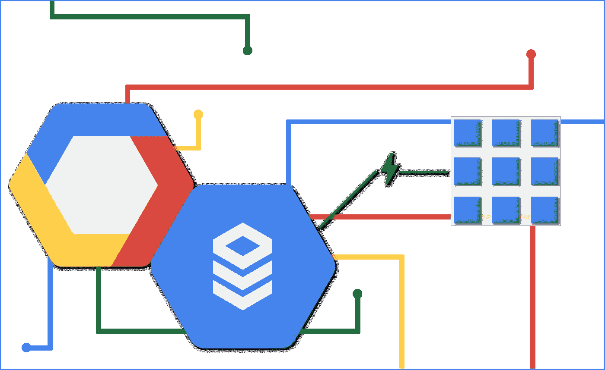
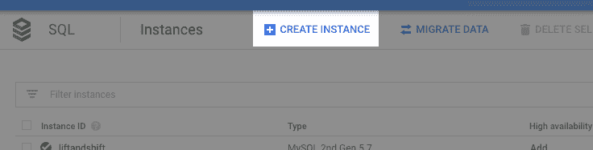
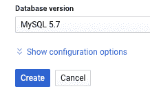

# 连接云 SQL -公共 IP + SQL 代理

> 原文：<https://medium.com/google-cloud/cloud-sql-public-ip-proxy-5513f59e5a9e?source=collection_archive---------3----------------------->

嗨，朋友们！

这篇博客将带您一步步了解如何使用公共 IP 选项连接到您的云 SQL 实例，以及如何通过 Google SQL 代理进行连接。一个常见的用例是，如果您有一个本地应用程序或设备想要连接到由云管理的 SQL 数据库。这通常是将情况从所有内部部署转移到所有云中的第一步。

如果你想了解更多关于云 SQL 连接的背景知识，请查看我的[连接介绍](/@GabeWeiss/connecting-google-cloud-sql-94025ba27071)博客文章。这篇文章还链接到更多关于不同用例和方法的分步文章，以及为什么您可能想要选择一种方法而不是另一种方法。所有这些帖子都假设你已经有了自己的谷歌云平台(GCP)项目，并设置了计费。如果没有，请点击此处的[按钮](https://console.cloud.google.com/freetrial)开始项目，或点击此处的[按钮](https://console.cloud.google.com/billing)为项目设置账单。

# 指南:

**创建云 SQL 实例**。我将在云控制台中完成它，但是如果你知道如何在命令行中使用`gcloud`,那也很酷。

到这里[去](https://console.cloud.google.com/sql/instances)。如果您已经有了实例，那么点击顶部导航栏中的`CREATE INSTANCE`按钮:

如果你还没有，那么点击对话框中蓝色的`Create instance`按钮。

选择您的数据库风格，对于本教程来说，选择哪种类型并不重要。

设置一个实例 ID，一个 root 密码，然后展开`Show configuration options`

确认在`Connectivity`标签下写着`Public IP enabled`

*   如果没有，请展开该部分，并选中公共 IP 复选框
*   不要担心网络方面的东西，我们使用代理，所以在本教程中我们不需要担心它

点击`Create`按钮，你将返回到实例列表，并会看到你的实例

*   您可以点击进入实例，并看到横幅说它还没有准备好。

*   这可能需要几分钟的时间，因此在此过程中，我们将继续让代理一切就绪

## **设置 Google SQL 代理**

转到此处的[以启用云 SQL 管理 API(代理连接到您的项目时需要)](https://console.cloud.google.com/apis/library/sqladmin.googleapis.com)

*   如果你已经启用了它，你会看到一个`MANAGE`按钮，如果你没有启用，你会看到`ENABLE`按钮

下载适用于您平台的代理:

**Linux 64 位**:`wget [https://dl.google.com/cloudsql/cloud_sql_proxy.linux.amd64](https://dl.google.com/cloudsql/cloud_sql_proxy.linux.amd64) -O cloud_sql_proxy` Linux 32 位 : `wget [https://dl.google.com/cloudsql/cloud_sql_proxy.linux.386](https://dl.google.com/cloudsql/cloud_sql_proxy.linux.386) -O cloud_sql_proxy`

**Macos 64 位**:`curl -o cloud_sql_proxy [https://dl.google.com/cloudsql/cloud_sql_proxy.darwin.amd64](https://dl.google.com/cloudsql/cloud_sql_proxy.darwin.amd64)` MAC OS 32 位 : `curl -o cloud_sql_proxy [https://dl.google.com/cloudsql/cloud_sql_proxy.darwin.386](https://dl.google.com/cloudsql/cloud_sql_proxy.darwin.386)`

在 Windows 上，只需点击链接应该下载它，或者您可以右键单击链接并选择“另存为”并下载 exe。

*   **Win-32**:`[https://dl.google.com/cloudsql/cloud_sql_proxy_x86.exe](https://dl.google.com/cloudsql/cloud_sql_proxy_x86.exe)` **Win-64**:`[https://dl.google.com/cloudsql/cloud_sql_proxy_x64.exe](https://dl.google.com/cloudsql/cloud_sql_proxy_x64.exe)`

对于 Linux 和 Macos，运行`chmod +x cloud_sql_proxy`

对于 Windows，将可执行文件重命名为 cloud_sql_proxy.exe，如果不这样做也没关系，但是请记住，本教程后面链接的任何命令都需要更改可执行文件的名称以与之匹配

现在我们需要创建一个**服务帐户**来授予对云 SQL 的代理访问权

转到[这里](https://console.cloud.google.com/iam-admin/serviceaccounts)，点击页面顶部的`CREATE SERVICE ACCOUNT`按钮

为您的服务帐户提供一个唯一的名称和 ID，然后单击`CREATE`

在下一页上，单击`Select a role`的下拉菜单

*   过滤“云 SQL”并选择`Cloud SQL Client`角色
*   这个角色授予`get`和`list`对项目中云 SQL 实例的访问权限。注意，这不是用户对数据库本身的访问。这通常使用`GRANT`查询来处理。

点击`CONTINUE`

在下一页，点击`CREATE KEY`按钮

*   保持在`JSON`上，点击`CREATE`
*   这将把密钥下载到您的本地机器上。JSON 密钥需要放在运行代理的地方

点击`DONE`完成服务账户的创建

启动代理的时间到了

回到[这里](https://console.cloud.google.com/sql/instances)。单击新创建的实例(现在应该已经完成了实例化)

在`Connect to this instance`部分，复制`Instance connection name`，它看起来会像`myproject:us-central1:myinstance`

使用以下命令启动代理:

*   `./cloud_sql_proxy -instances=<INSTANCE_CONNECTION_NAME>=tcp:5432 -credential_file=<PATH_TO_SERVICE_ACCOUNT_FILE>`
*   注意这个端口是用于 Postgres 的，如果你使用 MySQL，那么它应该是`tcp:3306`，如果你使用 SQL Server，那么默认情况下它应该是`tcp:1433`。
*   更改这些端口是没问题的，特别是如果您已经在端口上运行了某些东西(比如您正在本地运行 PostgreSQL)。如果您这样做了，请记住，在下一节中，您需要用您指定的任何内容来指定`--port`标志，以便验证连通性。

**验证连通性**

验证连通性最简单的方法是使用类似 [psql](http://postgresguide.com/utilities/psql.html) 的东西:

*   `psql “host=127.0.0.1 port=5432 sslmode=disable user=postgres”`然后输入您在创建数据库时指定的密码
*   注意，即使设置了`sslmode=disable`，Google SQL 代理也提供了加密的连接

**总结**

要清理这些，您需要做的就是删除云 SQL 实例。遇到什么问题了吗？请让我知道！请在下面的评论中回复，或者在 [Twitter](https://twitter.com/GabeWeiss_) 上联系我。我的 DMs 打开了！