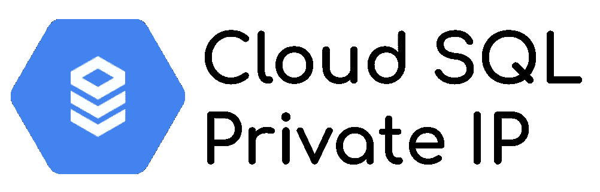
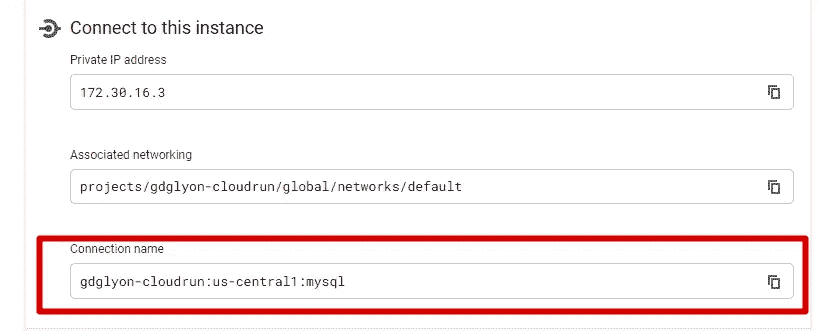
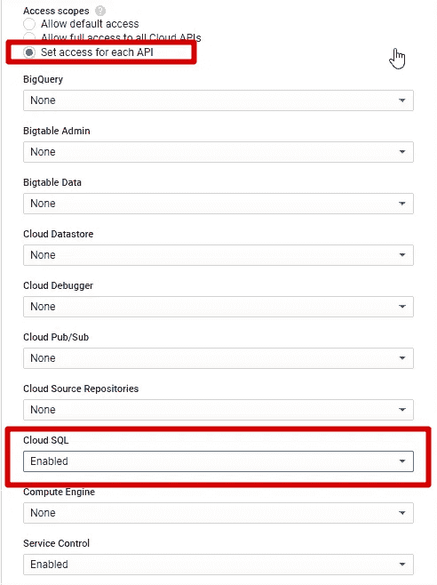
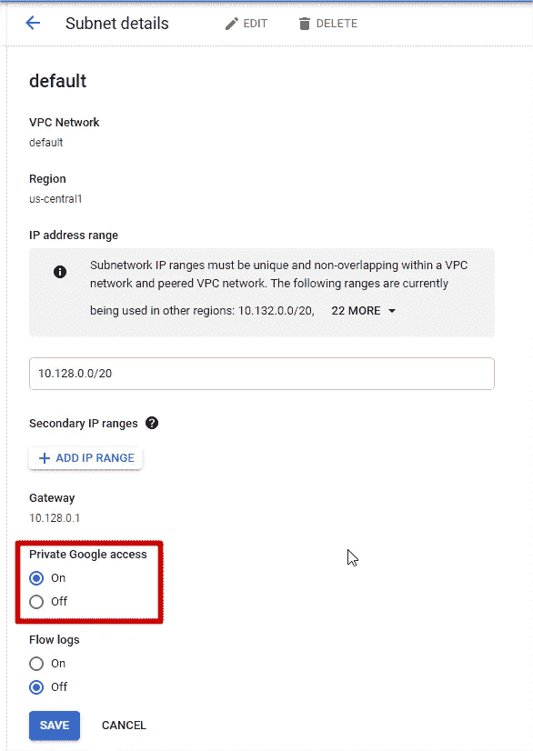
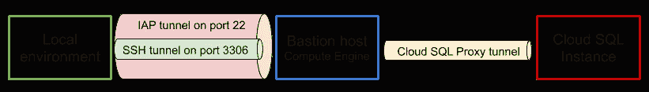

# 只有私有 IP 的云 SQL:好的、坏的和丑陋的

> 原文：<https://medium.com/google-cloud/cloud-sql-with-private-ip-only-the-good-the-bad-and-the-ugly-de4ac23ce98a?source=collection_archive---------0----------------------->



**数据是所有公司的新金矿**，这个**宝藏必须得到安全保护**。这就是为什么多年来，任何数据库管理员的一个常见的良好做法是**删除所有对数据库的公共访问**，尤其是公共 IP，并且**只授予来自私有 IP 的访问。**
这一“黄金”规则由所有安全团队强制执行，他们要求**任何云部署都采用相同的模式。**

[云 SQL 服务](https://cloud.google.com/sql)，Google Cloud 上的托管数据库服务，允许您:

*   在您的实例上设置一个[私有 IP，并将其直接连接到您选择的 VPC](https://cloud.google.com/sql/docs/mysql/private-ip)
*   从您的实例中删除[公共 IP](https://cloud.google.com/sql/docs/mysql/configure-ip#disable-public)

得益于这些特性，**您可以强制执行安全团队需求**。

> 但是，在我们的日常工作中，云 SQL 实例上没有公共 IP 会是一个问题吗？

让我们通过 3 个用例来验证这一点:

1.  **计算引擎**连接性
2.  **无服务器服务**连接性
3.  **本地环境**连通性

## 云 SQL 代理二进制文件

在深入讨论用例之前，我想快速聚焦一下 [**云 SQL 代理**](https://cloud.google.com/sql/docs/mysql/sql-proxy) 的主要特性

*   这个二进制打开一个**安全的端到端加密隧道**。总之，即使你的数据库没有 SSL 证书，数据在传输过程中也会被加密。
*   在打开隧道之前，二进制代码**会对照 IAM 服务 API 检查当前凭证是否被授权访问云 SQL 实例**。除了通过用户/密码进行的标准数据库认证之外，这是一个额外的安全层。
*   该隧道可以在本地端口(TCP 连接模式)或 Unix 套接字上开放(在 Windows 环境下不可能)

# 好处:计算引擎连接

因为这种“私有 IP 安全模式”是为传统架构(即本地虚拟机和私有网络)构建的**，所以约束**完全符合 IaaS 世界**(即计算引擎+ VPC)。
*我提到了计算引擎，但它也适用于所有使用计算引擎实例的服务:数据流、数据块、GKE……***

*   将您的虚拟机部署在与云 SQL 实例私有 IP 相同的 VPC 中。
*   使用云 SQL 实例私有 IP 从部署在计算引擎上的应用程序访问它。
*   如果需要，打开所需的防火墙规则。

那是 ***【好】*** ！！

*注:云 SQL 代理在这种情况下的用法可以讨论。它通过检查 IAM 服务和加密通信的授权来增加额外的安全层，但也增加了额外的延迟和潜在的故障点。这是权衡的问题。*

# 坏处:无服务器服务连接

当我们使用云的**“新世界”**，无服务器模式[，云运行](https://cloud.google.com/run)、[云功能](https://cloud.google.com/functions)和[应用引擎](https://cloud.google.com/appengine)时，情况就不那么好了。

事实上，根据定义，当您在无服务器平台上部署时，您**不必管理服务器**，因此**服务器不在您的 VPC** 中。因此，**不可能开箱即用地访问连接到项目 VPC 的云 SQL 私有 IP** 。

如果你深入研究[云运行](https://cloud.google.com/sql/docs/mysql/connect-run)、[云功能](https://cloud.google.com/sql/docs/mysql/connect-functions#public-ip-default)和[应用引擎](https://cloud.google.com/sql/docs/mysql/connect-app-engine-standard#public-ip-default)，你会发现**如何将你的云 SQL 实例连接到你的无服务器服务**，这得益于一个内置特性:

> 将云 SQL 实例连接名称添加到您的配置中，实例启动时会自动创建一个隧道。

实际上是[云 SQL 代理](https://cloud.google.com/sql/docs/mysql/sql-proxy)二进制在 [Unix socket 模式](https://cloud.google.com/sql/docs/mysql/sql-proxy#unix_sockets)下打开的连接。但是**这个解决方案只有在云 SQL 实例有一个公共 IP** 的情况下才有效。
在**私有 IP only** 的情况下，即使[私有 IP 连接模式与云 SQL 代理](https://cloud.google.com/sql/docs/mysql/sql-proxy#private-ip)存在，它**也不起作用！**

## 将无服务器服务连接到云 SQL 私有 IP

希望有一个解决方案。你可以**点击云 SQL 连接教程**中的 `**private IP**` **标签来做这个(云函数的[例子)。](https://cloud.google.com/sql/docs/mysql/connect-functions#configuring)**

总之，您需要:

*   **创建一个** [**无服务器 VPC 连接器**](https://cloud.google.com/vpc/docs/configure-serverless-vpc-access) ，与您的无服务器服务在同一区域。当然，连接到与云 SQL 实例相同的 VPC。
    *请注意，今天，所有地区都支持无服务器 VPC 连接器，但有一段时间并非如此。*
*   **使用这个 VPC 连接器**部署您的无服务器服务，由[云运行](https://cloud.google.com/run/docs/configuring/connecting-vpc)、[云功能](https://cloud.google.com/functions/docs/networking/connecting-vpc)和[应用引擎](https://cloud.google.com/appengine/docs/standard/go/connecting-vpc)支持
*   在您的应用中，**使用云 SQL 私有 IP** (而不是 Unix 套接字连接)

这个解决方案是可行的，但是在连接链中引入了一个**新的网络元件**、一个**附加成本**和一个**可能的新故障点**。

那就是*！！*

# *丑陋的:当地环境的连通性*

*当您**想要通过安装在您计算机**上的首选数据库 IDE**查询您的数据库**时，您需要将您的本地环境连接到云 SQL 实例，从而通过私有 IP。*

*因为云 SQL 实例没有公共 IP，你**无法从互联网**(你的电脑)直接到达，**云 SQL 代理也无法**。这里的解决方案是**创建一个** [**堡垒主机**](https://en.wikipedia.org/wiki/Bastion_host) :一个连接外部世界(公有 IP)和内部世界(私有 IP)的桥梁 VM。*

*为此，[创建了一个小型计算引擎实例](https://cloud.google.com/compute/docs/instances/create-start-instance)，例如一个[f1-micro](https://cloud.google.com/compute/docs/machine-types#machine_types)(非常便宜，每月不到 5 美元)，来实现这一点。*

> ***安全团队要求**:所有虚拟机不能有公共 IP。当然，0.0.0.0/0 防火墙规则是不允许的，尤其是在端口 22 (ssh)上*

## *没有公共 IP 的堡垒主机*

*新的约束要处理！但这是一致的:*如果你关上门，那是为了让窗户开着！！*
所以没问题，Google Cloud 为此提供了一个很棒很简单的解决方案: [**身份感知代理(IAP)**](https://cloud.google.com/iap)*

*使用 IAP，您只需授予 [Google Cloud IAP IP 范围](https://cloud.google.com/iap/docs/using-tcp-forwarding#create-firewall-rule) `[35.235.240.0](https://cloud.google.com/iap/docs/using-tcp-forwarding#create-firewall-rule)/20` [即可在防火墙规则](https://cloud.google.com/iap/docs/using-tcp-forwarding#create-firewall-rule)中的端口 22 上访问您的计算引擎。因此，**不需要打开** `**0.0.0.0/0**`(整个互联网)就可以到达计算引擎`ssh`端口！*

*然后，使用 [gcloud SDK 连接到您的 bastion 主机计算引擎实例](https://cloud.google.com/sdk/gcloud/reference/compute/ssh)
`gcloud compute ssh <Instance Name> --zone=<Your Zone>`
和**神奇的事情发生了！**g cloud SDK**自动检测到缺少计算引擎实例的公共 IP** 并且**自动打开 IAP 隧道以 SSH 连接实例**。对用户来说是隐形的！*

**凭证(这里是用户帐户，但也可能是服务帐户)* ***需要有足够的权限来创建 IAP 隧道*** *。角色有*[*roles/IAP . tunnelresourceactor 创建隧道*](https://cloud.google.com/iap/docs/using-tcp-forwarding#grant-permission) *和*[*roles/compute . instance admin . v1 访问虚拟机*](https://cloud.google.com/compute/docs/access/iam#connectinginstanceadmin)*

*现在，您已经**连接到 bastion 主机，但是您还没有连接到云 SQL 实例** …*

## *IAP 隧道、SSL 端口转发和云 SQL 代理*

*而在那里，*的“丑陋”部分开始了。我们有两件事要完成**

1.  **通过私有 IP 将堡垒主机连接到云 SQL 实例**
2.  ****将本地环境数据库连接请求**转发给堡垒主机**通过云 SQL 代理隧道到达云 SQL 实例****

****1。来自堡垒主机** 的云 SQL 实例连接为此，我们需要云 SQL 代理在堡垒主机和云 SQL 实例之间打开一个隧道。**

*****第一期:*** 因为你**还没有公共 IP，所以无法上网！**
您可以选择 [**创建一个云 NAT**](https://cloud.google.com/nat/docs/using-nat) 在您的 bastion 主机上计算实例 IP 范围。但是，最简单的方法是**将它下载到您的本地环境**中，然后**将它复制到 bastion 主机**上。为此，您可以使用以下命令。
`gcloud compute scp /local/path/to/cloud_sql_proxy <instanceName>:/tmp`
*因为可以通过 IAP 打开 SSH 连接，所以也可以通过 IAP 使用* `*scp*` *协议(ssh copy)来* ***复制文件！神奇！！*****

**很好，现在您已经有了 bastion 主机计算引擎实例上的二进制文件，您**想要测试连接是否工作**。您可以运行这些命令**

```
**#Connect to bastion host
gcloud compute ssh <instance Name> --zone=<Your zone>
#Change the permission of the Cloud SQL proxy binary (do it only once)
chmod +x /tmp/cloud_sql_proxy
#Connect to your Cloud SQL instance
/tmp/cloud_sql_proxy --instances=<connection_name>=tcp:3306**
```

***你可以在你的云 SQL 实例*的页面中找到 `*connection_name*`**

******

******第二期:*** 不管用！而且原因很多！***

*   **如果您使用默认参数创建了 bastion 主机**计算引擎，尤其是 API 作用域部分，那么您没有足够的作用域来访问云 SQL APIs。
    要解决这个问题，你需要**停止你的计算引擎**，编辑它并**定制作用域******

****

*   **创建云 SQL 隧道时，检查当前凭证(这里是[计算引擎凭证](https://cloud.google.com/compute/docs/access/create-enable-service-accounts-for-instances) ) **的 **IAM 权限**。计算引擎服务帐户没有足够的权限。
    要解决这个问题，请确保在服务帐户上授予最少的[角色:`Cloud SQL client`、`Cloud SQL editor`或`Cloud SQL admin`
    、*计算引擎默认服务帐户具有角色/编辑角色。对我们的用例来说太宽泛了，但是足够了。*](https://cloud.google.com/sql/docs/mysql/sql-proxy#permissions)****
*   **最后，默认情况下，当**您请求 Google Cloud API 时，会请求公共 DNS**。当云 SQL 代理在创建隧道时请求云 SQL API 或 IAM 服务时，就会出现这种情况。并且，因为 bastion 主机计算引擎**没有公共 IP，它可以到达互联网和** `**googleapis.com**` **公共 DNS。**
    要解决这个，你有 2 个方案。要么**像之前提议的那样设置一个云 NAT** ，要么使用 Google Cloud VPC 的一个狡猾的功能:**允许 bastion 主机计算引擎当前的** [**子网调用私有的**](https://cloud.google.com/vpc/docs/configure-private-google-access#config-pga)`[**googleapis.com**](https://cloud.google.com/vpc/docs/configure-private-google-access#config-pga)`[**DNS**](https://cloud.google.com/vpc/docs/configure-private-google-access#config-pga)。为此，请转到您的 VPC，选择正确的子网并进行编辑。然后选择私有 Google Access 单选按钮的`On`，并保存。**

****

**太好了！！现在 **bastion 主机计算引擎可以使用云 SQL 代理**打开从本地端口 3306 到云 SQL 实例的隧道，通过私有 IP。**

****2。将本地环境流量转发到云 SQL 实例** 为了实现这一点，**我们不会使用** `**gcloud ssh**` **内置特性，而是使用另一种解决方案**。除了与`ssh`直接连接计算实例之外， **gcloud SDK 还允许在任何端口上创建隧道**。**

**因此，让我们**在 bastion 主机**计算引擎实例的端口 22 上创建一个隧道，并定义一个任意的本地端口(这里是`4226`**

```
**gcloud compute start-iap-tunnel <instance Name> 22 \
  --zone=<Your zone> --local-host-port=localhost:4226**
```

**太好了，隧道打开了，我们可以用它来连接`ssh`中的 bastion 主机计算引擎实例。**

> **让隧道打开，在一个终端运行，并打开一个新的。**

**现在，**让我们把** `**ssh**` **连接到它的**。在一个命令中，您将**实现几个强制性的事情来建立连接**:**

*   ****创建一个从您的本地环境转发到堡垒主机的端口**计算引擎
    `-L 3306:localhost:3306`
    *“我的本地端口* `*3306*` *在目标虚拟机(此处为堡垒主机)上转发到* `*3306*` *在* `*localhost*` *(即目标虚拟机)上打开的端口***
*   ****重用在第一次`ssh`连接到 bastion 主机计算引擎(或`scp`)时由 Google 自动创建的 ssh 密钥**。该私钥存储在当前用户`~/.ssh`
    `-i ~/.ssh/google_compute_engine`的`home`目录中**
*   ****在`localhost`环境下，通过现有的 IAP 隧道**打开一个 `**ssh**` **连接，从本地端口`4226
    -p 4226 localhost`转发`ssh`流量****
*   **当连接到 bastion 主机计算引擎时，**您希望运行云 SQL 代理，在端口`3306`上创建到云 SQL 实例**的隧道。为此，在一个`--`
    `-- /tmp/cloud_sql_proxy instances=<connection_name>=tcp:3306`之后，在远程(堡垒主机)上运行您想要的命令**

**把所有这些放在一起**

```
**ssh -L 3306:localhost:3306 \
  -i ~/.ssh/google_compute_engine \
  -p 4226 localhost \
  -- /tmp/cloud_sql_proxy instances=<connection_name>=tcp:3306**
```

****现在，你拥有它了！**使用您最喜欢的数据库 IDE，在`localhost:3306`上连接并使用用户名/密码登录您的数据库。**

**哇！！**这一切都能够符合一个安全模式**！这是我们已经建立的架构**

****

**那就是**【丑】**！！**

# **附加副作用**

**使用带有私有 IP 的**云 SQL 只会增加警告**。事实上，在项目的 VPC 和云 SQL 网络(由 Google Cloud 管理)之间创建了一个**对等关系。
和**对等有两个限制:******

*   **你被限制在每个 VPC25 个对等点**
*   **对等之间的[传递是不可能的](https://cloud.google.com/vpc/docs/vpc-peering#restrictions)**

**这一点非常重要，如果你想从另一个项目访问数据库实例的话，**可能会成为一个障碍。实际上，从另一个项目的 VPC，您希望通过私有 IP 创建一个与该项目的对等关系，该项目具有要访问的云 SQL 实例。****

**但是，由于传递性的限制，你不能:**从另一个项目的 VPC 看不到云 SQL 私有 IP。**
这里的解决方法是**创建一个 VPN 来对等 2 个 VPC**。
那是 euh… **“最丑”？？****

***另一个副作用是，如果没有定义公共 IP，应用程序脚本应用程序将无法使用云 SQL 实例。***

# **“智能”安全模式至关重要**

**在传统世界中，安全问题和数据库的现有模式非常有效。
现在，有了云 SQL 和云 SQL 代理，**额外的安全层存在，使旧模式无效。****

> **如果不允许任何 IP 范围连接到公共 IP，那么**有什么问题？****

**这是传统世界中防火墙规则的**定义，不是吗？*拒绝所有 IP 访问我的数据库所在的范围/IP*****

> ****安全团队关注点**:如何确定不允许 IP 范围？**

**这个问题是合理的，这就是为什么你可以**强制执行一个组织政策** ( [*限制*](https://cloud.google.com/sql/docs/mysql/connection-org-policy#connection-constraints) [*云 SQL 实例上的授权网络*](https://cloud.google.com/sql/docs/mysql/connection-org-policy) )到**阻止在云 SQL 实例上添加公共 IP 范围**，这是公司范围内的。**

**最终，**在云 SQL 实例上允许一个公共 IP 避免了许多需要处理的变通方法和奇怪的设计**，并且**没有降低安全级别。**
此外，创建的隧道是加密的，保证了高度的安全性和保密性。**

**云改变了范例(参见 [Beyond Corp](https://cloud.google.com/beyondcorp) )，安全模式需要更新以符合这些范例。
***智能安全模式优于传统安全模式！*****