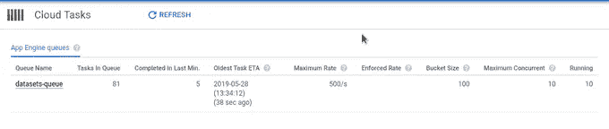
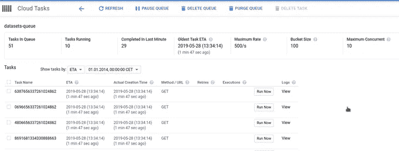

# 每个 HTTP 目标的云任务

> 原文：<https://medium.com/google-cloud/cloud-tasks-for-every-http-target-7f057c122957?source=collection_archive---------0----------------------->

2017 年 5 月 21 日,(在某种程度上)悄悄地宣布，对于云任务，有对 HTTP 目标的测试支持。我想在这篇文章中解释它的意思，因为我认为它值得更多的关注，但首先让我们回顾历史，了解整个背景。

云任务是 Google 云平台上的一个产品，管理异步任务的调度。这意味着您将数据发布到具体的云任务队列，然后它将数据转发给执行任务处理的目标工作者。当您有长时间运行任务且不想延长响应时间时，这尤其方便。相反，您将长处理任务分派给任务队列，它将它转发给一个工人。

云任务历史在 App Engine 中开始。由于(标准)App Engine(GCP 最老的产品)有 60 秒的响应限制，因此需要提供能够处理更长请求的服务。这是通过任务队列完成的，任务队列是 App Engine 中的一个集成服务。近年来，在将最初的应用引擎服务分离为独立产品的努力中，云任务是在最初支持应用引擎目标的情况下引入的，这仍然限制了对应用引擎使用的服务。

然而从现在开始，云任务终于提供了对任何 HTTP 目标的支持，而不仅仅是 App Engine(也不仅仅是 Google Cloud)。这当然扩展了可用性，因为现在基本上任何 URL 都可以作为工作器使用。

## 性能

云任务有很好的特性，这应该让你开始考虑使用它们，以防你到目前为止还没有使用它们:

-使用指数补偿重试。如果任务工作器没有返回 2xx 响应，它将重复该任务预定的尝试次数。

-暂停/恢复任务执行。例如，您部署了新的工作代码版本，但它没有按预期工作，您可以暂停任务执行

-您可以设置每秒从队列中调度的最大任务数或可以调度的最大并发任务数。当您需要限制任务处理时，这很方便。例如，您有一个第三方 API，它限制您每秒可以发出多少个请求，通过这些参数，您可以轻松地控制执行速度。

-推迟任务分派。当您创建一个任务时，它会被尽快分派进行处理。但是，您可以设置将来应该执行任务的执行日期。我承认我没有发现如果有约束的话，将来你可以推迟多长时间发货。

-支持推送任务。在 App Engine 中，支持推和拉，但现在只支持推。

-可以使用具体语言的客户端库以及 REST API 创建任务。

-价格。每月 100 万次免费手术。此后每 500 万美元收取 0.4 美元。

-为 web UI 提供有关队列和已处理任务的信息。

Google Cloud 上的另一个分布式消息平台是 PubSub。当然，有相似之处也有不同之处，我就不赘述了，因为在你需要决定使用哪一个的情况下，有一个非常详细的云任务和云发布[https://cloud.google.com/tasks/docs/comp-pub-sub](https://cloud.google.com/tasks/docs/comp-pub-sub)的对比。可以说云任务有 PubSub 功能的子集。PubSub 更受事件驱动，而云任务更关注 web/后端。再次检查网址，以便更好地比较。

由于云任务是托管服务，它可以很好地与其他托管/无服务器产品配合，如云功能、云运行、应用引擎等。

## 从云任务开始

要启动云任务，您需要使用 Google Cloud SDK (gcloud)创建至少一个队列。重要的是要知道，当首次创建队列时，它还会提示您创建 App Engine 应用程序，因为此时云任务与为您的项目设置 App Engine 的区域相关联。这对于项目来说是不可更改的。因此，在您的应用引擎所在的区域(尽管您不必部署任何应用引擎应用程序，也不打算部署)，云任务也同样存在。

这是第一个队列创建过程的样子，使用这个命令，我创建了队列“datasets-queue ”,它有 10 个最大并发调度，只有一个执行尝试。最大尝试次数的默认值是 100，对于开发/测试来说，将它设置为 1 或类似的值是很有用的，因为如果一个任务由于某种原因失败了，它会一直重复 100 次(这可能会持续一整天)。当通过 g Cloud 使用云任务时，需要启用云任务 API(这可以在队列创建期间完成)。

```
gcloud tasks queues create datasets-queue --max-concurrent-dispatches 10 --max-attempts 1
API [cloudtasks.googleapis.com] not enabled on project [301020687502].
 Would you like to enable and retry (this will take a few minutes)? 
(y/N)?  y

Enabling service [cloudtasks.googleapis.com] on project [301020687502]...
Waiting for async operation operations/acf.12adf55c-d1e1-40c2-ab93-00e534eaff57 to complete...
Operation finished successfully. The following command can describe the Operation details:
 gcloud services operations describe operations/tmo-acf.12adf55c-d1e1-40c2-ab93-00e534eaff57
There is no App Engine app in project [cz-open-data].

Would you like to create one (Y/n)?  

You are creating an app for project [cz-open-data].
WARNING: Creating an App Engine application for a project is irreversible and the region
cannot be changed. More information about regions is at
<https://cloud.google.com/appengine/docs/locations>.

Please choose the region where you want your App Engine application 
located:

 [1] asia-east2    (supports standard and flexible)
 [2] asia-northeast1 (supports standard and flexible)
 [3] asia-northeast2 (supports standard and flexible)
 [4] asia-south1   (supports standard and flexible)
 [5] australia-southeast1 (supports standard and flexible)
 [6] europe-west   (supports standard and flexible)
 [7] europe-west2  (supports standard and flexible)
 [8] europe-west3  (supports standard and flexible)
 [9] europe-west6  (supports standard and flexible)
 [10] northamerica-northeast1 (supports standard and flexible)
 [11] southamerica-east1 (supports standard and flexible)
 [12] us-central    (supports standard and flexible)
 [13] us-east1      (supports standard and flexible)
 [14] us-east4      (supports standard and flexible)
 [15] us-west2      (supports standard and flexible)
 [16] cancel
Please enter your numeric choice:  8

Creating App Engine application in project [cz-open-data] and region [europe-west3]....done.                                                                      
WARNING: You are managing queues with gcloud, do not use queue.yaml or queue.xml in the future. More details at: [https://cloud.google.com/cloud-tasks/docs/queue-yaml.](https://cloud.google.com/cloud-tasks/docs/queue-yaml.)
Created queue [datasets-queue].
```

## 示例使用案例

对于我的一个个人项目，我正在收集捷克开放数据并上传到 BigQuery，云任务是一个完美的工具，我可以向其分派任务，然后并行执行。

实际上，这意味着作为一个输入，我有一个 URL 列表和一些其他元数据，它们被编码并发送到云任务。在用作 HTTP 目标的云函数中，完成了关于下载/上传的主要工作。

我决定使用云函数，因为它们的并发度为 1，这意味着对于每个请求，云函数实例都是单独启动的，因此它提供了更多的工作内存(最大 2GB ),这是我在将文件下载到内存中时尽可能需要的。

云函数执行以下操作:

1.  从网站下载 CSV 文件
2.  如有必要，解压缩/解码
3.  清除列名
4.  将文件保存到云存储中
5.  运行 BigQuery 上载作业

我将不包括云函数的代码，因为它有点长，但这里有一个我用来创建任务的代码。

```
from google.cloud import tasks_v2beta3

tasks = tasks_v2beta3.CloudTasksClient()
tasks_parent = tasks.queue_path(GCP_PROJECT, 'europe-west3', 'datasets-queue')

def create_task(data: Dict[str, str]):
    task_data = {
        'http_request': {
            'http_method': 'POST',
            'url': CF_URL,
            'body': json.dumps(data).encode(),
            'oidc_token': {'service_account_email': SERVICE_ACCOUNT_EMAIL}
        }
    }
    return tasks.create_task(tasks_parent, task_data)
```

## 安全性

创建任务工人的一个重要部分是保护他们，即只对想要的用户进行身份验证，以防止不必要的访问。云运行，应用引擎从一开始就支持这一点，而云功能通过 IAM 帐户控制访问仍处于 alpha 阶段。我在阅读这篇文章时发现了这种可能性。保护云功能的流程如下:

创建服务帐户

```
gcloud iam service-accounts create tasks-creator --display-name="Creates tasks for upload"
Created service account [tasks-creator].
```

为创建的服务帐户设置角色，并将其绑定到将用作任务工作者的云功能。

```
~> gcloud alpha functions add-iam-policy-binding  upload-dataset --member serviceAccount:tasks-creator@cz-open-data.iam.gserviceaccount.com --role roles/cloudfunctions.invoker --region europe-west1 --project cz-open-data
bindings:
- members:
  - serviceAccount:tasks-creator@cz-open-data.iam.gserviceaccount.com
  - allUsers
  role: roles/cloudfunctions.invoker
etag: BwWKA8atmFg=
version: 1
```

从响应中可以看出，该函数还有角色“allUsers ”,这意味着任何人都可以调用它，所以我需要删除它。

```
~>gcloud alpha functions remove-iam-policy-binding upload-dataset --member allUsers --role roles/cloudfunctions.invoker --region europe-west1 --project cz-open-data
bindings:
- members:
  - serviceAccount:tasks-creator@cz-open-data.iam.gserviceaccount.com
  role: roles/cloudfunctions.invoker
```

现在只有任务创建者可以执行这个功能。

在上面创建任务的代码中，我作为“oidc_token”服务帐户电子邮件传递，在本例中是“[tasks-creator @ cz-open-data . iam . gserviceaccount . com”](mailto:tasks-creator@cz-open-data.iam.gserviceaccount.com")。有了这个，云任务将创建适当的 JWT 令牌，云功能(或其他一些谷歌云服务)将自动解码和认证这是真棒。请注意，您不必下载密钥文件，并在初始化客户端或类似的使用，你只需要通过适当的电子邮件地址。

## Web 用户界面

Web UI 提供了一个很好的界面，提供了有用的信息，比如队列设置或者任务执行的细节。



希望这篇文章能启发你开始使用云任务(如果你还没有的话)。

每周一我都会发布关于 GCP 的每周简讯，如果你想收到与谷歌云相关的新闻、文章和材料，请在 https://www.gcpweekly.com/[订阅](https://www.gcpweekly.com/)