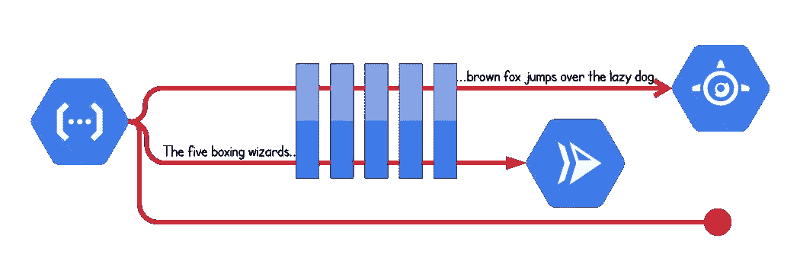
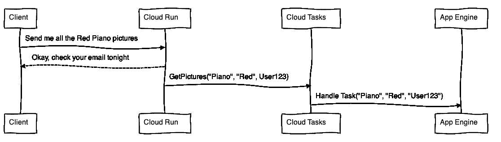
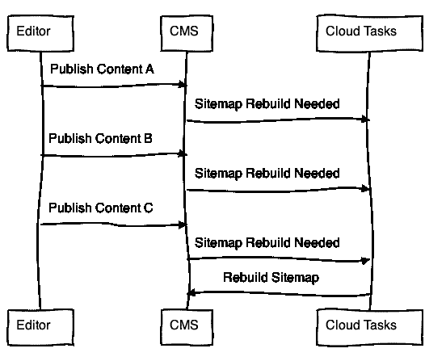

# 云任务有点有状态

> 原文：<https://medium.com/google-cloud/cloud-tasks-is-a-little-stateful-7ef39aad7d00?source=collection_archive---------0----------------------->



像 [Cloud Run](https://cloud.run) 这样的无服务器产品旨在托管无状态服务，允许惊人的水平扩展。像 [Firestore](https://cloud.google.com/firestore/docs) 和[云存储](https://cloud.google.com/storage/docs)这样的外部服务经常被用来将“状态”带回到画面中。在这篇文章中，我将探索云任务如何为您的应用程序架构带来一些有状态的东西，这些用例中有一个排队系统可以提供帮助。

在这篇文章中，我使用了新增加的[云任务 HTTP Targets](https://cloud.google.com/tasks/docs/creating-http-target-tasks) ，它允许你创建的每一个任务被配置为交付给一个 web 服务。对于云任务的更一般的介绍，去阅读[与谷歌云任务的异步代码执行](/google-cloud/asynchronous-code-execution-with-google-cloud-tasks-9b73ceaf48c3)，然后回来。

## 对队列应用“有状态”吗？

排队系统的前提是信息进去了，工作完成后最终消失。在详细解释这在云任务中的应用之前，我们先来讨论一下定义:

**来自** [**维基百科**](https://en.wikipedia.org/wiki/State_(computer_science)) **和**[**TechTarget**](https://whatis.techtarget.com/definition/stateless)**:**

> 如果一个系统被设计成能记住之前的事件或用户交互，那么它就被描述为有状态的；记忆的信息称为系统的**状态**。

虽然云任务不会无限期地记住之前的事件，但在这些事件被系统的无状态组件(如云功能或云运行服务)丢弃后，它会记住这些事件中的数据。让我们探索云任务如何使用这些被遗忘的信息。

## 云任务支持特定于任务的属性

在云任务中，您创建一个**任务**，它代表稍后要按照特定**队列**的配置确定的速度完成的一点工作。每个任务可以携带唯一的属性，将当前请求的详细信息传播到队列中。这允许您跳过在数据库中存储这个工作项的数据。



唯一请求属性在云运行流程的生命周期之外传递，并传播到 App Engine 中的云任务处理程序。在 https://bramp.github.io/js-sequence-diagrams/[上创建的图表](https://bramp.github.io/js-sequence-diagrams/)

当您创建一个任务时，您正在定义一个 HTTPS 请求，该请求将被分派给一个处理该请求的**处理器**。该处理程序可以从 HTTP 请求中提取任何内容，并使用它在其他系统中查找数据。

至少，每个 HTTP 目标任务都需要一个 URL 来分派任务。当然，URL 可以包含任意路径和查询字符串组件，作为一种传送某些数据的机制。除此之外，可以覆盖 HTTP 方法和主体，并在请求中添加任意的 HTTP 头。这里有一个使用 **gcloud** 创建一个任务的例子，这个任务带有一个定制的查询字符串“搜索参数”和一个稍微微妙的头来携带一个用户 ID。

```
gcloud tasks create-http-task --queue my-queue \
  --url "[https://search.example123-uc.a.run.app?s=piano&color=red](https://search.example123-uc.a.run.app/?object=piano&color=red)" \
  --header "Request-User-Id: user123"
Created task [projects/my-project/locations/us-central1/queues/my-queue/tasks/1234567890].
```

不是将请求对象存储到数据库中，而是将该请求的关键细节存储在任务中。另一方面，`user123`的关键账户详细信息是保密的，并根据需要通过 ID 进行查找。

## 云任务让您可以检查任务状态

一旦创建了任务，分派将取决于如何配置[队列](https://cloud.google.com/tasks/docs/creating-queues#rate)，URL 另一端的处理程序的性能，以及通常处理的成功程度。在任务完成之前，您可以检查它的细节以确认它具有您期望的 HTTP 属性，并检查交付情况。

您可以使用`gcloud`或 API 检查任务的交付细节。gcloud 有一个方便的命令，它利用云任务 API 来获取任务对象:

```
gcloud tasks describe projects/my-project/locations/us-central1/queues/my-queue/tasks/1234567890createTime: '2019–09–16T19:01:09Z'
dispatchCount: 9
dispatchDeadline: 600s
firstAttempt:
 dispatchTime: '2019–09–16T19:01:09.525182Z'
lastAttempt:
 dispatchTime: '2019–09–16T19:01:37.984184Z'
 responseStatus:
 code: 9
 message: 'FAILED_PRECONDITION(9): HTTP status code 405'
 responseTime: '2019–09–16T19:01:38.007307Z'
 scheduleTime: '2019–09–16T19:01:37.982882Z'
name: projects/my-project/locations/us-central1/queues/my-queue/tasks/1234567890
scheduleTime: '2019–09–16T19:02:03.607307Z'
view: BASIC
```

在这些详细信息中，我们看到云任务已经尝试交付 9 次，并获得 HTTP 状态代码 405。它将继续尝试(取决于您的配置，最多 30 天)，直到它获得 2xx 响应代码。

在这种情况下，看起来任务处理程序并不期望云任务默认使用`HTTP POST`请求。没有任务更新选项，所以选项是更改处理程序服务以支持 POST 或删除并重新创建任务。

让我们尝试使用`GET`方法重新创建任务:

```
gcloud tasks delete projects/my-project/locations/us-central1/queues/my-queue/tasks/1234567890
Deleted task [1234567890]gcloud tasks create-http-task --queue my-queue \
  --url "[https://search.example123-uc.a.run.app?s=piano&color=red](https://search.example123-uc.a.run.app/?object=piano&color=red)" \
  --header "Request-User-Id: user123" \
  --method GET
Created task [projects/my-project/locations/us-central1/queues/my-queue/tasks/2468101214161820].
```

再次尝试相同的 describe 命令，我们看到该任务不再存在，并且来自 API 的错误显示它已经不存在:

```
{
  "error": {
    "code": 404,
    "message": "Requested entity was not found.",
    "status": "NOT_FOUND"
  }
}
```

如果我们尝试描述我们的新任务，我们可能会看到它已经被处理了:

```
{
  "error": {
    "code": 404,
    "message": "The task no longer exists, though a task with this name existed recently. The task either successfully completed or was deleted.",
    "status": "NOT_FOUND"
  }
}
```

这意味着我们可以[请求任务细节](https://cloud.google.com/tasks/docs/reference/rest/v2/projects.locations.queues.tasks/get)，并使用响应来回答许多问题，包括:

*   处理程序服务是否中断？它发送的是哪个状态码？
*   任务是否具有我们期望的所有属性？
*   任务完成了吗？

您可能不希望使用云任务来代替数据库中的状态字段，因为“完成”消息会消失。

## 云任务处理计时

当您创建一个任务时，您可以设置一个`schedule-time`属性，让您的任务在未来 30 天内交付。这意味着即使在后端系统的维护期间，您的一线服务也可以不断增加工作。

## **云任务让你独一无二地命名一个任务**

在上面的一些命令中，任务 ID 是非常数字的，但是作为开发人员，您可以为您的队列指定一个唯一的 ID。如果它是唯一的，它将是您需要处理的唯一 ID。

如果不是，云任务会有帮助地发回一个错误。你可能会想，这又是一个需要处理的错误；然而，这是一个奇妙的特性。这意味着您可以围绕异步工作负载的创建实现一个断路器。

例如，假设您有一个内容管理系统，它需要在任何有内容更新的 24 小时内更新一个站点地图。如果没有变化，你就不想构建站点地图，也不想构建不止一次。

使用云任务重复数据删除和计划功能，您可以轻松构建一个“trip-line”机制，如果至少进行了一次内容更新，该机制将在凌晨 2 点运行您的作业:



无论给定事件被触发多少次，都只会创建一个命名任务的实例，并且只需要一个。在[https://bramp.github.io/js-sequence-diagrams/](https://bramp.github.io/js-sequence-diagrams/)上创建的图表

```
gcloud tasks create-http-task sitemap-rebuild --queue my-queue\
  --url "[https://cms.example123-uc.a.run.app/sitemap-rebuild](https://cms.example123-uc.a.run.app/sitemap-rebuild)" \
  --schedule-time 2019-09-17T05:30:00Z# First Time
Created task [projects/my-project/locations/us-central1/queues/my-queue/tasks/sitemap-rebuild].# Second Time, get an HTTP 409 error
ERROR: (gcloud.tasks.create-http-task) ALREADY_EXISTS: Requested entity already exists
```

在这篇文章中，我们看到了云任务可以提供无服务器应用程序成功所需的应用程序状态的许多方式:

*   保存特定于请求的详细信息，供以后处理
*   分享任务处理进度的详细信息
*   根据您的时间要求安排交付
*   建立“trip-lines ”,这样*你就不需要做额外的工作*来阻止你的*任务处理程序做额外的工作*

要浏览使用云任务向异步工作负载传输状态的示例，请查看云任务文档中的[明信片教程。](https://cloud.google.com/tasks/docs/tutorial-gcf)