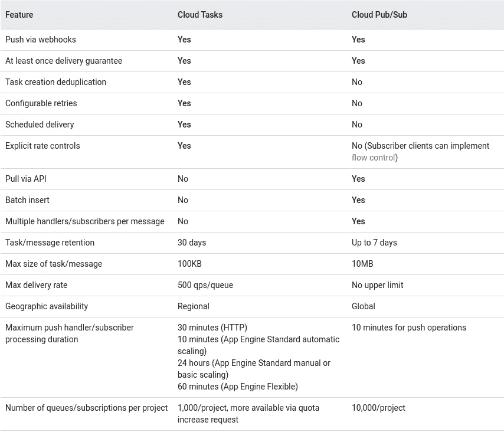
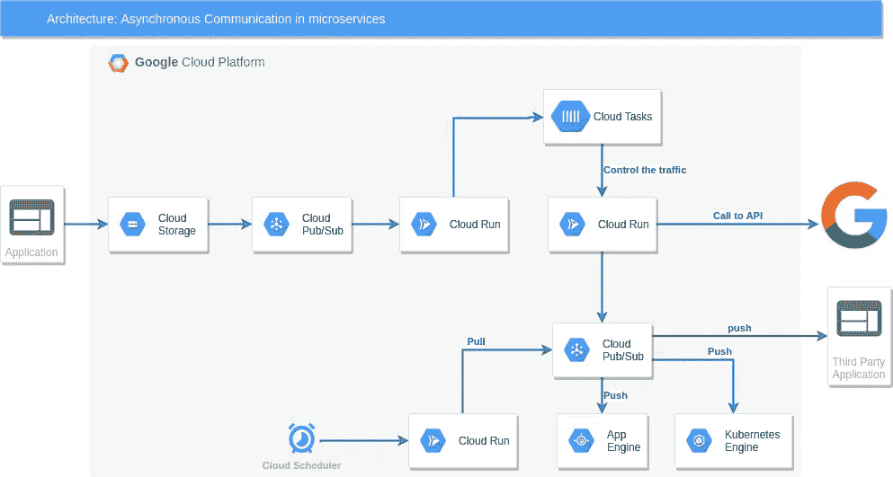

# 云任务还是发布/订阅？

> 原文：<https://medium.com/google-cloud/cloud-tasks-or-pub-sub-8dcca67e2f7a?source=collection_archive---------0----------------------->

## 微服务中的异步通信


阿德里安·德尔福吉在 [Unsplash](https://unsplash.com?utm_source=medium&utm_medium=referral) 上的照片

# 介绍

在微服务的世界里，大的应用程序分裂成松散耦合的服务，这些服务可以独立开发、部署和维护。微服务通常不通过直接的请求/响应相互对话，而是异步的，允许服务独立扩展。

异步执行是减少请求延迟并提高应用程序响应速度的一种成熟方法。云任务和云发布/订阅都可以用来实现异步执行。

在这篇博客中，我们将看到哪种产品适合您的使用案例。

# 什么是云任务？

云任务是一项完全托管的服务，允许您管理大量分布式任务的执行、调度和交付。

以下是云任务的功能

*   可扩展和全面管理
*   HTTP 目标:添加针对在云运行、应用引擎、云功能或计算引擎上运行的任何 HTTP 服务的任务。
*   安全:它可以通过 OAuth/OIDC 认证调用安全端点。
*   速率和重试控制:您可以通过设置任务调度的速率、最大尝试次数和两次尝试之间的最短等待时间来控制执行。
*   未来计划:您可以控制任务运行的时间。
*   任务重复数据删除:任务可以多次添加，但只能调度一次。
*   保证交付:任务至少保证一次。

# 什么是 Pub/Sub？

Pub/Sub 是一个完全托管的实时消息服务，允许您在独立的应用程序之间发送和接收消息。

云发布/订阅将来自某个主题的消息分别转发给它的所有订阅。每个订阅要么通过云发布/订阅将消息推送到订阅者选择的端点，要么通过订阅者从服务中获取消息。
订阅者接收来自其订阅的未决消息，并向云发布/订阅服务确认每个消息。
当消息被订阅者确认后，它将从订阅的消息队列中删除。

以下是发布/订阅的主要功能。

*   可扩展和全面管理
*   全球信息传递
*   拉和推模式。
*   有序交付(测试版)。
*   至少一次交货
*   死信主题:订阅者应用程序无法处理的消息将被搁置起来进行脱机调试。
*   过滤:发布/订阅可以根据属性过滤消息，以减少发送给订阅者的数量。

# 发布/订阅与云任务

云任务和发布/订阅都可以作为传统服务集成的消息中间件，或者作为现代微服务的简单通信媒介。

> “云发布/订阅和云任务之间的核心区别是**隐式和显式**调用的概念”

**隐含**:发布者无法控制消息的传递。发布/订阅旨在分离事件的发布者和订阅者。发布者不需要知道关于他们的订阅者的任何事情。

**显式**:相比之下，云任务旨在**显式**调用，发布者保留对执行的完全控制。

云任务的额外好处是能够控制任务执行的速率，以及重试任务的频率和可以同时执行多少个并发任务。因为您可以控制从队列中发送任务的速率，所以您可以控制工作人员的伸缩行为，从而控制您的成本。

例如，我们已经使用[Google Admin SDK](https://developers.google.com/admin-sdk)Directory API 来创建和提供 Google 帐户。这个 API 有 1500/100 秒的配额。
因此，我们通过设置字段 **max-dispatches-per-second 来控制使用云任务队列对 API 的调用。**

**速率限制**允许您定义一个队列可以调度的最大速率和最大并发任务数

```
gcloud tasks queues update [QUEUE_ID] \
  --max-dispatches-per-second=[MAX_DISPATCHES_PER_SECOND] \
  --max-concurrent-dispatches=[MAX_CONCURRENT_DISPATCHES]
```

**重试参数**允许您指定重试失败任务的最大次数，设置重试尝试的时间限制，并控制尝试之间的间隔。

```
gcloud tasks queues update [QUEUE_ID] \
  --max-attempts=[MAX_ATTEMPTS] \
  --min-backoff=[MIN_BACKOFF] \
  --max-backoff=[MAX_BACKOFF] \
  --max-doublings=[MAX_DOUBLINGS] \
  --max-retry-duration=[MAX_RETRY_DURATION]
```

云任务的另一个好处是，您可以使用云控制台和 CLI 命令暂停/恢复队列，以停止/启动任务的处理。

Pull 方法在 App Engine (Python2)任务队列中可用，但在云任务中不可用。发布/订阅有可用的请求订阅。

云任务和发布/订阅的详细比较



[https://cloud . Google . com/pubsub/docs/choosing-pubsub-or-cloud-tasks](https://cloud.google.com/pubsub/docs/choosing-pubsub-or-cloud-tasks)

## 云任务的用例

*   **点-2 点通信**:2 个微服务之间的异步调用。
*   c:需要控制速率，以便工人的可伸缩性得到控制。例如推送异步图像处理作业。
*   **调度**:需要调度作业。例如，在注册试用期后 1 个月发送电子邮件。
*   在一定次数的重试后停止重试。

## 发布/订阅的用例

*   **一对多**:发布消息给多个订阅者。例如，一旦下了订单，向有多个订阅者的主题发布消息，如包装、运输、电子邮件通知、短信提醒。
*   **拉订阅**:没有 HTTP 端点的订阅者可以按时间间隔或流拉来拉消息。

# 示例使用案例

源应用程序发送加入组织的新员工列表。云运行验证数据，并将单个消息分派到云任务中进行并行处理。



体系结构

在上面的用例中，我们需要控制 API 调用，因为有一个与 Google Admin SDK API 相关的配额。例如每 100 秒 1500 次呼叫。
所以我们引入了**云任务**，其中**每秒最大分派数**字段设置为 15 **。**

此外，一旦数据得到处理，我们需要更新所有的供应商。所以我们引入了 **Pub/Sub** ，这样用户就可以拉或者推消息。

# 结论

我们讨论了两个服务之间的异步通信，以及云任务和发布/订阅如何适合它。还研究了对消息分发的隐式控制和显式控制。

发布/订阅也主要用于流处理，如物联网消息流，然后可以由云数据流处理并存储在 BigQuery 中以供进一步分析。

# 参考

[](https://cloud.google.com/tasks/docs/reference/rest/) [## 云任务 API |云任务文档|谷歌云

### 管理大量分布式请求的执行。我们建议您使用以下方式调用此服务…

cloud.google.com](https://cloud.google.com/tasks/docs/reference/rest/) [](https://cloud.google.com/pubsub/docs/overview) [## 什么是 Pub/Sub？|云发布/订阅文档|谷歌云

### 发布/订阅是一种异步消息服务，它将产生事件的服务与处理事件的服务分离开来

cloud.google.com](https://cloud.google.com/pubsub/docs/overview)