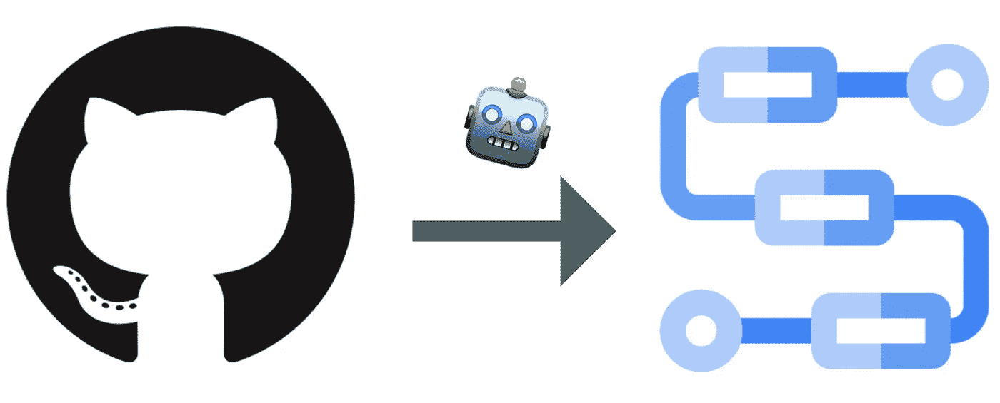
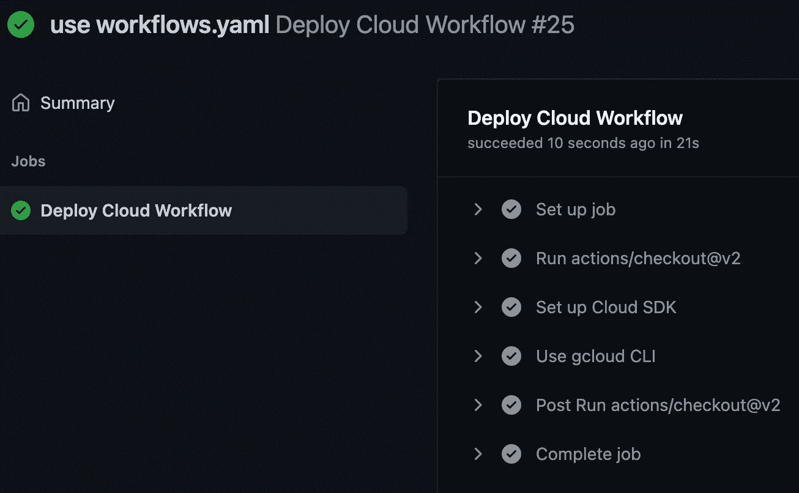
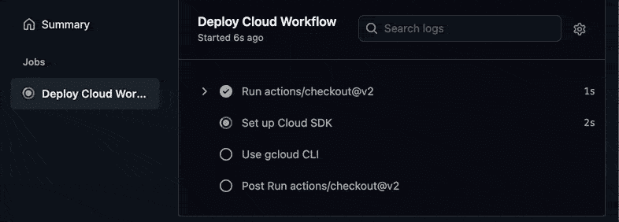

# 通过 GitHub 操作持续部署云工作流！

> 原文：<https://medium.com/google-cloud/cloud-workflows-continuous-deployment-with-github-actions-514866c9250?source=collection_archive---------2----------------------->

GitHub →云工作流

作为一名工程师，我发现大多数有趣的问题都以*“如果”*开头。

我喜欢在 GitHub 上为我的云工作流保存 YAML 文件。但是，我必须记住每次修改工作流时都要将它部署到 Google Cloud。

那是一种痛苦。

如果 …

*   每当我们**在 **GitHub repo** 中更新**一个工作流文件时
*   然后我们的**云工作流程**会自动**更新**到 Google Cloud

> (即无需使用`gcloud`手动更新工作流程)

借助一些方便的工具，我们可以做到这一点！让我告诉你怎么做:

# 目标

为了自动部署到云工作流，我们需要创建一个 GitHub 动作来监听主分支的推送并运行`gcloud workflows deploy`。GitHub 上的操作如下所示:

GitHub 工作流成功运行的图像。

# 设置

## 1.创建云工作流

首先，我们需要在 GitHub repo 中创建一个云工作流文件。让我们用经典的`*myFirstWorkflow.workflows.yaml*`:

一个简单的云工作流，通过搜索星期几获得维基百科的结果。

## 2.创建 GitHub 操作来部署云工作流

接下来，我们将通过两个步骤为我们的回购创建 GitHub 操作:

`.github/workflows/deploy-cloud-workflow.yaml`

该操作包含以下步骤:

*   *步骤 1:* 设置方便的`[setup-gcloud](https://github.com/google-github-actions/setup-gcloud)` [动作](https://github.com/google-github-actions/setup-gcloud)以在我们的 GitHub 工作流中启用`gcloud`。
*   *第 2 步:*运行`gcloud workflows deploy`命令，将源代码、项目和服务帐户等配置存储为 GitHub 机密。

> 如果您想要在云工作流中部署不同的工作流名称，或者使用不同的 YAML 文件，请确保在此文件中更改您的设置。

## 3.使用服务帐户授权 GitHub 操作

现在，棘手的部分是允许 GitHub 在没有您的干预或凭证的情况下代表您部署云工作流。

在上一步中，我们告诉 GitHub 动作使用一个服务帐户🤖储存在 GitHub 的秘密。我们需要实际设置:

这里有一个方便的脚本，用于创建一个具有更新云工作流所需的 IAM 角色的服务帐户。我们将使用 [GitHub CLI](https://cli.github.com/) ，`gh`，将这些属性添加到我们的 GitHub repo 中。

setup_iam.sh

在这个脚本中，我们将向 GitHub 添加一个角色为`workflows.editor`和`iam.serviceAccountUser`的服务帐户密钥，这样 GitHub Actions 就可以拥有部署我们工作流的权限。

# 工作流程

现在，有了这个设置，我们可以简单地推进到我们的主分支，看到我们的 GitHub 动作在后台工作。我们甚至可以查看日志，查看所有执行的历史记录。太棒了。

这里有一张 gif 图片，展示了 GitHub 上的动作:

部署云工作流操作

感谢阅读！有点 meta 吧？如果你喜欢这篇文章，请鼓掌(或两下)👏。

或许你也可以看看其他相关的帖子:

*   [🚀从函数中调用工作流！](/google-cloud/call-a-workflow-from-a-function-51fc7fc8e1ff)