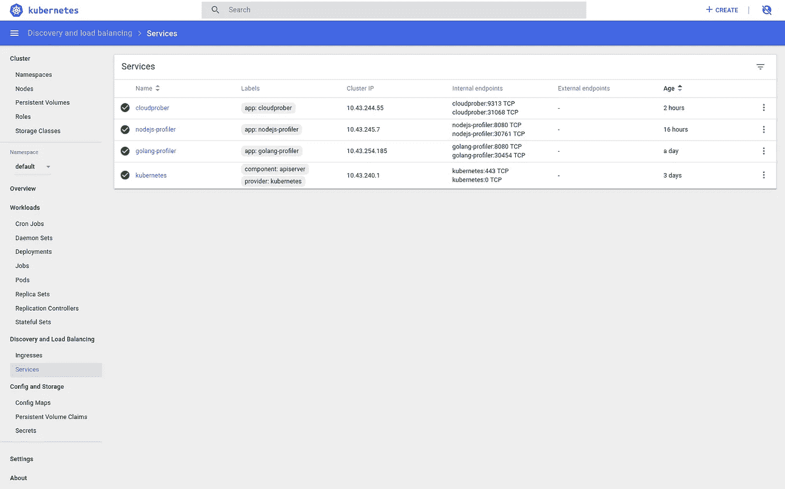
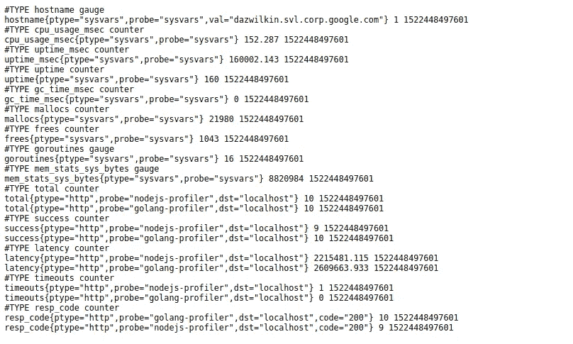
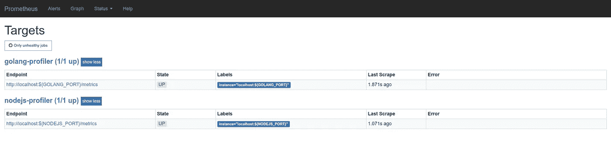
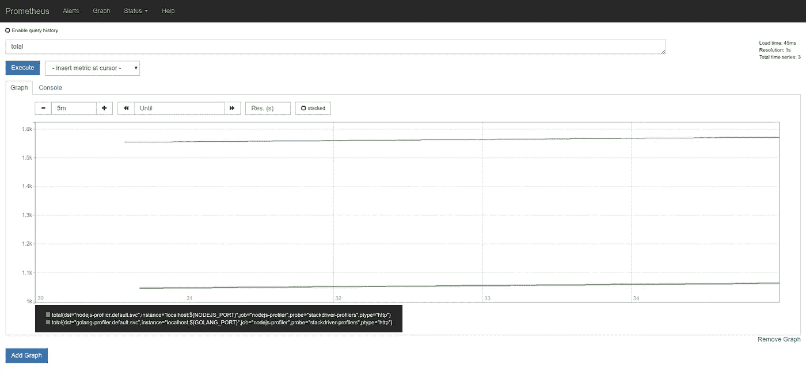

# 云探测器

> 原文：<https://medium.com/google-cloud/cloudprober-1c16b2d05835?source=collection_archive---------1----------------------->

一个客户的架构师需要工具来帮助他诊断 Kubernetes 引擎集群中服务之间的尾部延迟的来源。我的同事给我指了指[云探测器](https://cloudprober.github.io/)。在我试图领先客户一步的徒劳尝试中，我想我应该用今天的深度学习时间来探索它。是谷歌 OSS。这是用戈兰语写的。它浮出水面[普罗米修斯](https://prometheus.io)端点。有什么不喜欢的！？很整洁！

## 码头工人

Cloudprober 可以作为一个容器映像*使用，但是*我认为这个映像需要一个小的调整，以便能够提供定制配置和更好地支持 Kubernetes。如果您对`cloudprober/cloudprober`图像有疑问，您可以使用`dazwilkin/cloudprober:0.9.3-32-g21f071e`。我将在此使用我的图像。

调整只是使用`ENTRYPOINT`来运行`cloudprober`而不是`CMD`，因为这允许我们自由地使用不同的标志来运行`cloudprober`。

## 库伯内特斯

我[昨天写了](/@DazWilkin/stackdriver-profiler-671fb481236d)关于 [Stackdriver Profiler](https://cloud.google.com/profiler/) 并提供了 2 个样本(Golang，Node。JS ),我将其作为服务部署到 Kubernetes。从这里开始(但希望您可以适应您的 Kubernetes 服务)，我将为这些表面的 HTTP 端点(在端口`8080`上)配置探测器。主要是为了测试 Cloudprober。

我的服务都部署到了`default`(我很懒)名称空间。Golang 分析器被公开为一个名为`golang-profiler`的服务(这个服务有一个集群内 DNS 名称`golang-profiler.default.svc`)。节点。JS profiler 被公开为一个名为`nodejs-profiler`的服务(该服务的集群内 DNS 名称为`nodejs-profiler.default.svc`)。



Kubernetes 仪表板:“默认”名称空间服务

## 旁白:左舷向前

您可能希望跳过这一步，但是为了在本地测试 cloud probe，一个简单但很好的技巧是通过 ssh 将 cloud probe 移植到服务的节点端口，检查配置，如果满意，将 cloud probe 部署到 Kubernetes，并对它的工作更有信心。

下面的 bash 命令获取集群中第一个节点的实例名、两个服务的节点端口，然后使用`gcloud`设置 SSH 端口转发，以便这些服务在`localhost`上的这些端口上可用:

```
NODE_HOST=$(\
  kubectl get nodes \
  --output=jsonpath="{.items[0].metadata.name}")GOLANG_PORT=$(\
  kubectl get services/golang-profiler \
  --output=jsonpath="{.spec.ports[0].nodePort}")NODEJS_PORT=$(\
  kubectl get services/nodejs-profiler \
  --output=jsonpath="{.spec.ports[0].nodePort}")gcloud compute ssh ${NODE_HOST} \
--project=${GOOGLE_PROJECT_ID} \
--ssh-flag="-L ${GOLANG_PORT}:localhost:${GOLANG_PORT}" \
--ssh-flag="-L ${NODEJS_PORT}:localhost:${NODEJS_PORT}" 
```

所以我们现在可以编写一个 Cloudprober 配置文件(暂时使用这些端口)来测试 Cloudprober:

cloudprober.profilers.cfg:

> **注意**您需要用系统中的值替换第 9 行的`${GOLANG_PORT}`和第 23 行的`${NODEJS_PORT}`。
> 
> 第 5 行和第 19 行中的`host_names`值都是`localhost`，因为我们已经在本地对这些 Kubernetes 节点端口进行了端口转发。我已经留下了注释，当我部署到 Kubernetes 时，我们将需要使用(我的服务)这些值。

好的。我认为这不会起作用，除非你使用我的 Cloudprober 容器映像的调整版本。所以:

```
docker run \
--net=host \
--publish=9313:9313 \
--volume=$PWD/cloudprober.profilers.cfg:/cloudprober.cfg \
dazwilkin/cloudprober:0.9.3-32-g21f071e \
  --config_file=/cloudprober.cfg \
  --logtostderr
```

> **NB** 需要`--net=host`标志，因为容器需要访问主机的`${GOLANG_PORT}`和`${NODEJS_PORT`端口。

如果一切正常，您将看到日志输出。更有用的是，您可能希望访问 Cloudprober 的 Prometheus metrics 端点。这将在以下位置提供:

[http://localhost:9313](http://localhost:9313)/公制



Cloudprober 的普罗米修斯指标端点

如果你想通过普罗米修斯查看这些数据:

prometheus.yml:

**NB** 和以前一样，请用你系统上的值替换第 5 行的`${GOLANG_PORT}`和 lin 9 中的`$(NODEJS_PORT}`。

那么你可以在本地运行 Prometheus(！)针对这些本地端点:

```
docker run \
--net=host \
--publish=9090:9090 \
--volume=$PWD/prometheus.yml:/etc/prometheus/prometheus.yml prom/prometheus
```

并访问 Prometheus 目标以确认它们配置正确:

[http://localhost:9090/targets](http://localhost:9090/targets)



普罗米修斯“目标”

我会让你玩图形的神奇之处，但是:



普罗米修斯“图”

好的。一切正常。

如果你在这里完成了，你可以终止普罗米修斯集装箱，终止`gcloud compute ssh`港口-前进，整理，拍拍自己的背，继续前进。

让我们部署到 Kubernetes！

## 库伯内特斯

我们只需要修改 Cloudprober 配置来反映我们服务的集群内名称。

> N **B** 我已经修改了第 5 行和第 19 行的`host_names`值，以反映完整的(！)集群内 DNS 名称。我恢复了第 9 行和第 23 行中的`port`值，以反映服务端口(而不是用于脱离集群访问的节点端口)。

我们需要将 Cloudprober 映像部署到 Kubernetes，但在此之前，我们需要上传配置。我们将使用配置映射来保存配置文件:

```
kubectl create configmap cloudprober-profilers-config \
--from-file=cloudprober.cfg=cloudprober.profilers.cfg
```

现在您只需要一个部署。yaml:

您可以:

```
kubectl apply --filename=deployment.yaml
```

好的……如果你愿意，你可以像我们之前做的那样，将`cloudprober`服务的节点端口进行端口转发。在这种情况下，让我们只看一下它的日志:

```
POD=$(\
  kubectl get pods \
  --selector=app=cloudprober-profilers \
  --namespace=default \
  --output=jsonpath="{.items[0].metadata.name}")kubectl logs pods/$POD cloudprober --follow
```

下面是一个(编辑的)日志示例:

```
cloudprober 1522451121742369580 1522451141 labels=ptype=http
probe=nodejs-profiler
dst=nodejs-profiler.default.svc.cluster.local total=1 success=1
latency=97108.784 timeouts=0
resp-code=map:code,200:1 resp-body=map:respcloudprober 1522451121742369585 1522451141 labels=ptype=http
probe=golang-profiler
dst=golang-profiler.default.svc.cluster.local total=1 success=1 latency=92348.214 timeouts=0
resp-code=map:code,200:1 resp-body=map:respcloudprober 1522451121742369592 1522451161 labels=ptype=http
probe=nodejs-profiler
dst=nodejs-profiler.default.svc.cluster.local total=2 success=2 latency=197668.887 timeouts=0
resp-code=map:code,200:2 resp-body=map:respcloudprober 1522451121742369593 1522451161 labels=ptype=http
probe=golang-profiler
dst=golang-profiler.default.svc.cluster.local total=2 success=2 latency=180111.898 timeouts=0
resp-code=map:code,200:2 resp-body=map:resp
```

伴随服务提供了一个提供 Prometheus 指标的端点。我将让您将 Prometheus 部署到您的集群并进行配置。

## 戈朗

今天没有 Golang 代码:-(嗯，这不完全正确。只是还没准备好。我认为让 Cloudprober 基于特定名称空间中发布的服务进行自动配置会很有用。我有一个代码工作的粗略铸造，并希望下周在这里发表一些东西。我会及时更新这篇文章。

## 结论

Cloudprober 是一个有趣的工具，我打算在接下来的一周里花更多的时间来掌握它。